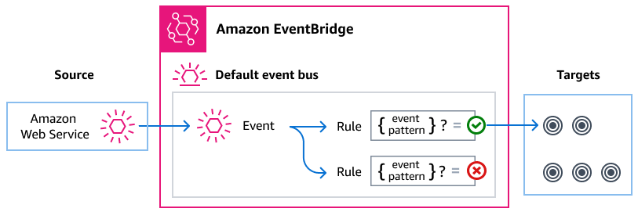

# Monitoring CloudFormation and Git sync events with

EventBridge

Amazon EventBridge is a serverless service that uses events to connect application components
together, making it easier for you to build scalable event-driven applications. Event-driven
architecture is a style of building loosely-coupled software systems that work together by
emitting and responding to events. Events represent a change in a resource or environment.

As with many AWS services, CloudFormation generates and sends events to the EventBridge default
event bus, which is automatically provisioned in every AWS account. An event bus is a
router that receives events and delivers them to zero or more destinations, or
_targets_. Rules you specify for the event bus evaluate events as
they arrive. Each rule checks whether an event matches the rule's _event
pattern_. If the event does match, the event bus sends the event to the
specified target(s).

For more information, see [Getting started with
Amazon EventBridge](../../../eventbridge/latest/userguide/eb-get-started.md "../../../eventbridge/latest/userguide/eb-get-started.md") in the _Amazon EventBridge User Guide_.

###### Topics

- [CloudFormation and Git sync events overview](#supported-events "#supported-events")
- [Amazon EventBridge permissions](#eventbridge-permissions "#eventbridge-permissions")
- [Creating a custom event
  pattern for an EventBridge rule](eventbridge-using-events-rules-patterns.md "eventbridge-using-events-rules-patterns.md")
- [CloudFormation events detail reference](events-detail-reference.md "events-detail-reference.md")

## CloudFormation and Git sync events overview

CloudFormation sends events to EventBridge whenever a create, update, delete, or drift-detection
operation is performed on a stack. CloudFormation also sends events to EventBridge for status
changes to stack sets and stack set instances. You can use EventBridge rules to route events to
your defined targets. These events are guaranteed to be delivered, and they might be
delivered out of order.

Since CloudFormation events represent changes to stacks or stack sets and their resources,
you can use them to initiate workflows associated with respective events. For
example:

- Create stack or stack set specific tags on all resource provisioned through
  CloudFormation.
- Establish an association between a CloudFormation stack or stack set and an
  Amazon WorkSpaces Application Manager (Amazon WAM).
- Specify an association with an AppRegistry for the created stack or stack
  set.

The following events are generated by CloudFormation and sent to the default event bus in
EventBridge. For more information, see [CloudFormation events detail reference](events-detail-reference.md "events-detail-reference.md").

| Event type                                                                                                                                             | Description                                                                                                                                                                                                                                                                                                     | Event source       |
| ------------------------------------------------------------------------------------------------------------------------------------------------------ | --------------------------------------------------------------------------------------------------------------------------------------------------------------------------------------------------------------------------------------------------------------------------------------------------------------- | ------------------ |
| [Resource Status Change](event-detail-resource-status-change.md "event-detail-resource-status-change.md")                                           | Any updates performed on a stack which changes underlying resource properties. For a complete list of supported AWS resource types, see the [AWS resource and property types reference](../TemplateReference/aws-template-resource-type-ref.md "../TemplateReference/aws-template-resource-type-ref.md"). | AWS CloudFormation |
| [Stack Status Change](event-detail-stack-status-change.md "event-detail-stack-status-change.md")                                                    | Represents a status change to a given stack. For code details, see [Stack status codes](view-stack-events.md#cfn-console-view-stack-data-resources-status-codes "view-stack-events.md#cfn-console-view-stack-data-resources-status-codes").                                                               | AWS CloudFormation |
| [Drift Detection Status Change](event-detail-stack-drift-detection-change.md "event-detail-stack-drift-detection-change.md")                        | Represents a user-initiated drift detection update on a given stack. For a complete list of fully mutable and immutable types that support drift detection, see [Resource type support](resource-import-supported-resources.md "resource-import-supported-resources.md")                            | AWS CloudFormation |
| [StackSet Status Change](event-detail-stackset-status-change.md "event-detail-stackset-status-change.md")                                           | Represents a status change to a given stack set.                                                                                                                                                                                                                                                                | AWS CloudFormation |
| [StackSet Stack Instance Status Change](event-detail-stackset-stack-instance-status-change.md "event-detail-stackset-stack-instance-status-change.md") | Represents a status change to a specific StackSet stack instance. For code details, see [Stack instance status codes](stacksets-concepts.md#stack-instance-status-codes "stacksets-concepts.md#stack-instance-status-codes").                                                                             | AWS CloudFormation |
| [StackSet operation status](event-detail-stackset-operation-status-change.md "event-detail-stackset-operation-status-change.md")                       | Represents a status change to a given StackSet operation. For code details, see [StackSets status codes](stacksets-concepts.md#stackset-status-codes "stacksets-concepts.md#stackset-status-codes").                                                                                                         | AWS CloudFormation |

Additionally, AWS CloudFormation Git sync sends events for status changes for repository syncs and
resource syncs to EventBridge.

The following Git sync events are generated by CodeConnections and sent to the default event
bus in EventBridge. For more information, see [CloudFormation events detail reference](events-detail-reference.md "events-detail-reference.md").

| Event type                                                                                                                       | Description                                          | Event source        |
| -------------------------------------------------------------------------------------------------------------------------------- | ---------------------------------------------------- | ------------------- |
| [Repository sync status change](event-detail-respository-sync-status-change.md "event-detail-respository-sync-status-change.md") | Represents a status change to a Git repository sync. | AWS CodeConnections |
| [Resource sync status change](event-detail-resource-sync-status-change.md "event-detail-resource-sync-status-change.md")      | Represents a status change to a Git resource sync.   | AWS CodeConnections |

## Amazon EventBridge permissions

CloudFormation doesn't require any additional permissions to deliver events to EventBridge. The
events contain information that's already available through CloudFormation's API
operations.

The targets you specify may need specific permissions or configuration. For more
details on using specific services for targets, see [Amazon EventBridge targets](../../../eventbridge/latest/userguide/eb-targets.md "../../../eventbridge/latest/userguide/eb-targets.md") in the
_Amazon EventBridge User Guide_.
