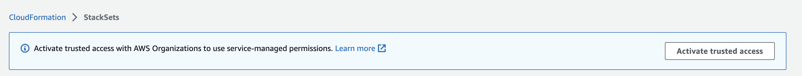

# Activate trusted access for

StackSets with AWS Organizations

This topic provides instructions on how to activate trusted access with AWS Organizations,
which is required by StackSets to deploy across accounts and AWS Regions using
_service-managed_ permissions. To use
_self-managed_ permissions, see [Grant self-managed
permissions](stacksets-prereqs-self-managed.md "stacksets-prereqs-self-managed.md") instead.

Before you create a StackSet with service-managed permissions, you must first complete the
following tasks:

- [Enable all features](../../../organizations/latest/userguide/orgs_manage_org_support-all-features.md "../../../organizations/latest/userguide/orgs_manage_org_support-all-features.md") in AWS Organizations. With only consolidated billing
  features enabled, you can't create a StackSet with service-managed
  permissions.
- Activate trusted access with AWS Organizations. This action allows CloudFormation to create
  a service-linked role in the management account. After trusted access is
  activated, when you create a StackSet with service-managed permissions, CloudFormation
  creates both the necessary service-linked role and a service role named
  `stacksets-exec-*` in the target (member)
  accounts.

With trusted access activated, the management account and delegated
administrator accounts can create and manage service-managed StackSets for
their organization.
To activate trusted access, you must be an administrator user in the
management account. An _administrator user_ is a user with full
permissions to your AWS account. For more information, [Create an administrator
user](../../../accounts/latest/reference/getting-started-step4.md "../../../accounts/latest/reference/getting-started-step4.md") in the _AWS Account Management Reference Guide_. For
recommendations for protecting the security of the management account, see [Best
practices for the management account](../../../organizations/latest/userguide/orgs_best-practices_mgmt-acct.md "../../../organizations/latest/userguide/orgs_best-practices_mgmt-acct.md") in the
_AWS Organizations User Guide_.

###### To activate trusted access

1. Sign in to AWS as an administrator of the management account and open the
   CloudFormation console at [https://console.aws.amazon.com/cloudformation](https://console.aws.amazon.com/cloudformation "https://console.aws.amazon.com/cloudformation").
2. From the navigation pane, choose **StackSets**. If trusted
   access is deactivated, a banner displays that prompts you to activate trusted
   access.

 3. Choose **Activate trusted access**.

Trusted access is successfully activated when the following banner
displays.

###### Note

Activate Organizations Access is the same as Enable Organizations Access, and Deactivate
Organizations Access is the same as Disable Organizations Access. These terms have been
updated based on marketing guidelines.

###### To deactivate trusted access

See [CloudFormation StackSets and AWS Organizations](../../../organizations/latest/userguide/services-that-can-integrate-cloudformation.md "../../../organizations/latest/userguide/services-that-can-integrate-cloudformation.md") in the
_AWS Organizations User Guide_.

Before you can deactivate trusted access with AWS Organizations, you must deregister all
delegated administrators. For more information, see [Register a delegated
administrator](stacksets-orgs-delegated-admin.md "stacksets-orgs-delegated-admin.md").

###### Note

For information about using API operations instead of the console to activate or
deactivate trusted access, see:

- [ActivateOrganizationsAccess](../APIReference/API_ActivateOrganizationsAccess.md "../APIReference/API_ActivateOrganizationsAccess.md")
- [DeactivateOrganizationsAccess](../APIReference/API_DeactivateOrganizationsAccess.md "../APIReference/API_DeactivateOrganizationsAccess.md")
- [DescribeOrganizationsAccess](../APIReference/API_DescribeOrganizationsAccess.md "../APIReference/API_DescribeOrganizationsAccess.md")

## Service-linked roles

The management account uses the
**AWSServiceRoleForCloudFormationStackSetsOrgAdmin**
service-linked role. You can modify or delete this role only if trusted access with
AWS Organizations is deactivated.

Each target account uses a
**AWSServiceRoleForCloudFormationStackSetsOrgMember**
service-linked role. You can modify or delete this role only under two conditions:
if trusted access with AWS Organizations is deactivated, or if the account is removed from
the target organization or organizational unit (OU).

For more information, see [CloudFormation StackSets and AWS Organizations](../../../organizations/latest/userguide/services-that-can-integrate-cloudformation.md "../../../organizations/latest/userguide/services-that-can-integrate-cloudformation.md") in the
_AWS Organizations User Guide_.
