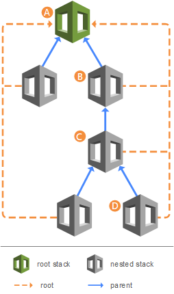

# Split a template into reusable pieces using nested

stacks

As your infrastructure grows, you might find yourself repeatedly creating identical
resource configurations across multiple templates. To avoid this redundancy, you can
separate these common configurations into dedicated templates. Then, you can use the [AWS::CloudFormation::Stack](../TemplateReference/aws-resource-cloudformation-stack.md "../TemplateReference/aws-resource-cloudformation-stack.md") resource in other templates to
reference these dedicated templates, creating nested stacks.

For example, suppose you have a load balancer configuration that you use for most of your
stacks. Instead of copying and pasting the same configurations into your templates, you can
create a dedicated template for the load balancer. Then, you can reference this template
from within other templates that require the same load balancer configuration.

Nested stacks can themselves contain other nested stacks, resulting in a hierarchy of
stacks, as shown in the diagram below. The _root stack_ is the top-level
stack to which all nested stacks ultimately belong. Each nested stack has an immediate
parent stack. For the first level of nested stacks, the root stack is also the parent
stack.

- Stack A is the root stack for all the other, nested, stacks in the
  hierarchy.
- For stack B, stack A is both the parent stack, and the root stack.
- For stack D, stack C is the parent stack; while for stack C, stack B is the parent
  stack.



###### Topics

- [Before and after example of splitting a
  template](#create-nested-stack-template "#create-nested-stack-template")
- [Example of a nested stack architecture](#nested-stack-examples "#nested-stack-examples")
- [Performing stack operations
  on nested stacks](#perform-stack-operations-on-nested-stacks "#perform-stack-operations-on-nested-stacks")
- [Related information](#nested-stacks-related-information "#nested-stacks-related-information")

## Before and after example of splitting a

template

This example demonstrates how you can take a single, large CloudFormation template and
reorganize it into a more structured and reusable design using nested templates.
Initially, the "Before nesting stacks" template shows all the resources defined in one
file. This can become messy and hard to manage as the number of resources grows. The
"After nesting stacks" template splits up the resources into smaller, separate
templates. Each nested stack handles a specific set of related resources, making the
overall structure more organized and easier to maintain.

| Before nesting stacks                                                                                                                                                                                                                                                                                                                                                                                                                               | After nesting stacks                                                                                                                                                                                                                                                                                                                                                                                                                                                                                                                                                                                                      |
| --------------------------------------------------------------------------------------------------------------------------------------------------------------------------------------------------------------------------------------------------------------------------------------------------------------------------------------------------------------------------------------------------------------------------------------------------- | ------------------------------------------------------------------------------------------------------------------------------------------------------------------------------------------------------------------------------------------------------------------------------------------------------------------------------------------------------------------------------------------------------------------------------------------------------------------------------------------------------------------------------------------------------------------------------------------------------------------------- |
| `<br>AWSTemplateFormatVersion: 2010-09-09<br>Parameters:<br>InstanceType:<br>Type: String<br>Default: t2.micro<br>Description: The EC2 instance type<br>Environment:<br>Type: String<br>Default: Production<br>Description: The deployment environment<br>Resources:<br>MyEC2Instance:<br>Type: AWS::EC2::Instance<br>Properties:<br>ImageId: ami-1234567890abcdef0<br>InstanceType: !Ref InstanceType<br>MyS3Bucket:<br>Type: AWS::S3::Bucket<br>` | ``<br>AWSTemplateFormatVersion: 2010-09-09<br>Resources:<br>MyFirstNestedStack:<br>Type: AWS::CloudFormation::Stack<br>Properties:<br>TemplateURL: https://s3.amazonaws.com/`amzn-s3-demo-bucket`/first-nested-stack.yaml<br>Parameters:<br># Pass parameters to the nested stack if needed<br>InstanceType: t3.micro<br>MySecondNestedStack:<br>Type: AWS::CloudFormation::Stack<br>Properties:<br>TemplateURL: https://s3.amazonaws.com/`amzn-s3-demo-bucket`/second-nested-stack.yaml<br>Parameters:<br># Pass parameters to the nested stack if needed<br>Environment: Testing<br>DependsOn: MyFirstNestedStack<br>`` |

## Example of a nested stack architecture

This section demonstrates a nested stack architecture consisting of a top-level stack
that references a nested stack. The nested stack deploys a Node.js Lambda function,
receives a parameter value from the top-level stack, and returns an output that's
exposed through the top-level stack.

###### Topics

- [Step 1: Create a template for the
  nested stack on your local system](#create-a-nested-stack-template "#create-a-nested-stack-template")
- [Step 2: Create a template
  for the top-level stack on your local system](#create-a-nested-stack-parent-template "#create-a-nested-stack-parent-template")
- [Step 3: Package and deploy
  the templates](#create-a-nested-stack-parent-template "#create-a-nested-stack-parent-template")

### Step 1: Create a template for the

nested stack on your local system

The following example shows the format of the nested stack template.

#### YAML

```
AWSTemplateFormatVersion: 2010-09-09
Description: Nested stack template for Lambda function deployment
Parameters:
  MemorySize:
    Type: Number
    Default: 128
    MinValue: 128
    MaxValue: 10240
    Description: Lambda function memory allocation (128-10240 MB)
Resources:
  LambdaFunction:
    Type: AWS::Lambda::Function
    Properties:
      FunctionName: !Sub "${AWS::StackName}-Function"
      Runtime: nodejs18.x
      Handler: index.handler
      Role: !GetAtt LambdaExecutionRole.Arn
      Code:
        ZipFile: |
          exports.handler = async (event) => {
            return {
              statusCode: 200,
              body: JSON.stringify('Hello from Lambda!')
            };
          };
      MemorySize: !Ref MemorySize
  LambdaExecutionRole:
    Type: AWS::IAM::Role
    Properties:
      AssumeRolePolicyDocument:
        Version: '2012-10-17'
        Statement:
          - Effect: Allow
            Principal:
              Service: lambda.amazonaws.com
            Action: sts:AssumeRole
      ManagedPolicyArns:
        - 'arn:aws:iam::aws:policy/service-role/AWSLambdaBasicExecutionRole'
Outputs:
  LambdaArn:
    Description: ARN of the created Lambda function
    Value: !GetAtt LambdaFunction.Arn
```

### Step 2: Create a template

for the top-level stack on your local system

The following example shows the format of the top-level stack template and the
[AWS::CloudFormation::Stack](../TemplateReference/aws-resource-cloudformation-stack.md "../TemplateReference/aws-resource-cloudformation-stack.md") resource that references
the stack you created in the previous step.

#### YAML

```
AWSTemplateFormatVersion: 2010-09-09
Description: Top-level stack template that deploys a nested stack
Resources:
  NestedStack:
    Type: AWS::CloudFormation::Stack
    Properties:
      TemplateURL: /path_to_template/nested-template.yaml
      Parameters:
        MemorySize: 256
Outputs:
  NestedStackLambdaArn:
    Description: ARN of the Lambda function from nested stack
    Value: !GetAtt NestedStack.Outputs.LambdaArn
```

### Step 3: Package and deploy

the templates

###### Note

When working with templates locally, the AWS CLI **package**
command can help you prepare templates for deployment. It automatically handles
the upload of local artifacts to Amazon S3 (including `TemplateURL`) and
generates a new template file with updated references to these S3 locations. For
more information, see [Upload local artifacts to an S3 bucket with the
AWS CLI](using-cfn-cli-package.md "using-cfn-cli-package.md").

Next, you can use the [package](../../../cli/latest/reference/cloudformation/package.md "../../../cli/latest/reference/cloudformation/package.md") command to upload the nested template to an
Amazon S3 bucket.

```
aws cloudformation package \
  --s3-bucket `amzn-s3-demo-bucket` \
  --template `/path_to_template/top-level-template.yaml` \
  --output-template-file `packaged-template.yaml` \
  --output json
```

The command generates a new template at the path specified by
`--output-template-file`. It replaces the `TemplateURL`
reference with the Amazon S3 location, as shown below.

**Resulting template**

```
AWSTemplateFormatVersion: 2010-09-09
Description: Top-level stack template that deploys a nested stack
Resources:
  NestedStack:
    Type: AWS::CloudFormation::Stack
    Properties:
      TemplateURL: https://s3.`us-west-2`.amazonaws.com/`amzn-s3-demo-bucket`/`8b3bb7aa7abfc6e37e2d06b869484bed`.template
      Parameters:
        MemorySize: 256
Outputs:
  NestedStackLambdaArn:
    Description: ARN of the Lambda function from nested stack
    Value:
      Fn::GetAtt:
      - NestedStack
      - Outputs.LambdaArn
```

After you run the **package** command, you can deploy the processed
template using the [deploy](../../../cli/latest/reference/cloudformation/deploy.md "../../../cli/latest/reference/cloudformation/deploy.md") command. For nested stacks that contain IAM
resources, you must acknowledge IAM capabilities by including the
`--capabilities` option.

```
aws cloudformation deploy \
  --template-file `packaged-template.yaml` \
  --stack-name `stack-name` \
  --capabilities CAPABILITY_NAMED_IAM
```

## Performing stack operations

on nested stacks

When working with nested stacks, you must handle them carefully during operations.
Certain stack operations, such as stack updates, should be initiated from the root stack
rather than performed directly on the nested stacks. When you update a root stack, only
nested stacks with template changes will be updated.

Additionally, the presence of the nested stacks can affect operations on the root
stack. For example, if one nested stack becomes stuck in
`UPDATE_ROLLBACK_IN_PROGRESS` state, the root stack will wait until that
nested stack completes its rollback before continuing. Before proceeding with update
operations, make sure that you have IAM permissions to cancel a stack update in case
it rolls back. For more information, see [Control CloudFormation access with AWS Identity and Access Management](control-access-with-iam.md "control-access-with-iam.md").

Use the following procedures to find the root stack and nested stacks.

###### To view the root stack of a

nested stack

1. Sign in to the AWS Management Console and open the AWS CloudFormation console at
   [https://console.aws.amazon.com/cloudformation](https://console.aws.amazon.com/cloudformation/ "https://console.aws.amazon.com/cloudformation/").
2. On the **Stacks** page, choose the name of the nested stack
   you want to view the root stack of.

Nested stacks display **NESTED** above their stack
name. 3. On the **Stack info** tab, in the
**Overview** section, choose the stack name listed as
**Root stack**.

###### To view the nested stacks

that belong to a root stack

1. From the root stack whose nested stacks you want to view, choose the
   **Resources** tab.
2. In the **Type** column, look for resources of type
   **AWS::CloudFormation::Stack**.

## Related information

- [Nesting an existing stack](resource-import-nested-stacks.md "resource-import-nested-stacks.md")
- [Understand update behaviors of stack
  resources](using-cfn-updating-stacks-update-behaviors.md "using-cfn-updating-stacks-update-behaviors.md")
- [Continue rolling back from failed nested stack updates](using-cfn-updating-stacks-continueupdaterollback.md#nested-stacks "using-cfn-updating-stacks-continueupdaterollback.md#nested-stacks")
- [Nested
  stacks rollback failure](troubleshooting.md#troubleshooting-errors-nested-stacks-are-stuck "troubleshooting.md#troubleshooting-errors-nested-stacks-are-stuck")
