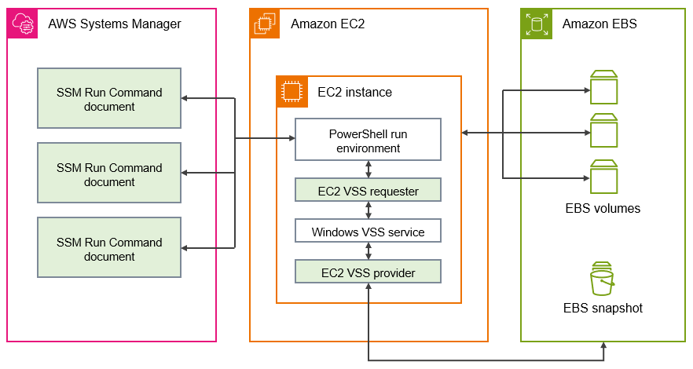

# Application consistent Windows VSS based Amazon EBS snapshots

You can take application-consistent snapshots of all Amazon EBS volumes attached to your
Amazon EC2 Windows instances using [AWS Systems Manager Run Command](../../../systems-manager/latest/userguide/run-command.md "../../../systems-manager/latest/userguide/run-command.md"). The snapshot process uses the Windows [Volume Shadow Copy Service (VSS)](https://learn.microsoft.com/en-us/windows-server/storage/file-server/volume-shadow-copy-service "https://learn.microsoft.com/en-us/windows-server/storage/file-server/volume-shadow-copy-service") to take EBS volume level backups of
VSS-aware applications. The snapshots include data from pending transactions between these
applications and the disk. You don't have to shut down your instances or disconnect them
when you need to back up all attached volumes.

There is no additional cost to use VSS based EBS snapshots. You only pay for EBS
snapshots created by the backup process. For more information, see [How am I billed
for my Amazon EBS snapshots?](https://repost.aws/knowledge-center/ebs-snapshot-billing "https://repost.aws/knowledge-center/ebs-snapshot-billing")

###### Note

Application consistent Windows VSS based snapshots are supported with Windows instances only.

###### Contents

- [What is VSS?](#application-consistent-snapshots-how "#application-consistent-snapshots-how")
- [How the VSS based Amazon EBS snapshot solution works](#how-vss-works "#how-vss-works")
- [VSS prerequisites](application-consistent-snapshots-prereqs.md "application-consistent-snapshots-prereqs.md")
- [Create VSS snapshots](create-vss-snaps.md "create-vss-snaps.md")
- [Troubleshoot
  VSS snapshots](application-consistent-snapshots-troubleshooting.md "application-consistent-snapshots-troubleshooting.md")
- [Restore options for the AWS VSS solution](application-consistent-snapshots-restore.md "application-consistent-snapshots-restore.md")
- [Version history](vss-comps-history.md "vss-comps-history.md")

## What is VSS?

Volume Shadow Copy Service (VSS) is a backup and recovery technology included
in Microsoft Windows. It can create backup copies, or snapshots, of computer files
or volumes while they are in use. For more information, see
[Volume Shadow Copy Service](<https://learn.microsoft.com/en-us/previous-versions/windows/it-pro/windows-server-2008-R2-and-2008/ee923636(v=ws.10)?redirectedfrom=MSDN> "https://learn.microsoft.com/en-us/previous-versions/windows/it-pro/windows-server-2008-R2-and-2008/ee923636(v=ws.10)?redirectedfrom=MSDN").

To create an application-consistent snapshot, the following software components
are involved.

- _VSS service_ — Part of the Windows operating
  system
- _VSS requester_ — The software that requests the
  creation of shadow copies
- _VSS writer_ — Typically provided as part of an
  application, such as SQL Server, to ensure a consistent data set to back up
- _VSS provider_ — The component that creates the
  shadow copies of the underlying volumes

The Windows VSS based Amazon EBS snapshot solution consists of multiple Systems Manager (SSM) Run Command documents that
facilitate backup creation, and a [Systems Manager Distributor package](../../../systems-manager/latest/userguide/distributor.md "../../../systems-manager/latest/userguide/distributor.md"), called `AwsVssComponents`, that includes
an _EC2 VSS requester_ and an _EC2 VSS provider_. The
`AwsVssComponents` package must be installed on EC2 Windows instances to take
application-consistent snapshots of EBS volumes. The following diagram illustrates the
relationship between these software components.

## How the VSS based Amazon EBS snapshot solution works

The process for taking application-consistent, VSS based EBS snapshot scripts consists
of the following steps.

1. Complete the [Prerequisites to create Windows VSS
   based EBS snapshots](application-consistent-snapshots-prereqs.md "application-consistent-snapshots-prereqs.md").
2. Enter parameters for the `AWSEC2-VssInstallAndSnapshot` SSM document
   and run this document by using Run Command. For more information, see
   [Run the
   AWSEC2-VssInstallAndSnapshot command document (recommended)](create-vss-snapshots-ssm.md#create-with-AWSEC2-VssInstallAndSnapshot "create-vss-snapshots-ssm.md#create-with-AWSEC2-VssInstallAndSnapshot").
3. The Windows VSS service on your instance coordinates all ongoing I/O operations
   for running applications.
4. The system flushes all I/O buffers and temporarily pauses all I/O operations.
   The pause lasts, at most, ten seconds.
5. During the pause, the system creates snapshots of all volumes attached to the
   instance.
6. The pause is lifted and I/O resumes operation.
7. The system adds all newly-created snapshots to the list of EBS snapshots. The
   system tags all VSS based EBS snapshots successfully created by this process
   with **AppConsistent:true**.
8. If you need to restore from a snapshot, you can use the standard EBS process
   of creating a volume from a snapshot, or you can restore all volumes to an
   instance by using a sample script, as described in
   [Use the AWS VSS solution to restore
   data for your instance](application-consistent-snapshots-restore.md "application-consistent-snapshots-restore.md").
