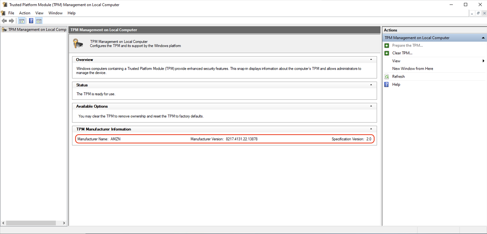

# Verify that an Amazon EC2 instance is enabled for NitroTPM

You can verify whether an Amazon EC2 instance is enabled for NitroTPM. If NitroTPM support is enabled
on the instance, the command returns `"v2.0"`. Otherwise, the `TpmSupport` field
is not present in the output.

The Amazon EC2 console does not display the `TpmSupport` field.

AWS CLI

###### To verify whether an instance is enabled for NitroTPM

Use the [describe-instances](../../../cli/latest/reference/ec2/describe-instances.md "../../../cli/latest/reference/ec2/describe-instances.md")
command.

```
aws ec2 describe-instances \
    --instance-ids `i-1234567890abcdef0` \
    --query Reservations[].Instances[].TpmSupport
```

PowerShell

###### To verify whether an instance is enabled for NitroTPM

Use the [Get-EC2Instance](../../../powershell/latest/reference/items/Get-EC2Instance.md "../../../powershell/latest/reference/items/Get-EC2Instance.md")
cmdlet.

```
(Get-EC2Instance `
    -InstanceId `i-1234567890abcdef0`).Instances.TpmSupport
```

## Verify NitroTPM access on your Windows instance

###### (Windows instances only) To verify whether the NitroTPM is accessible to Windows

1. [Connect to your EC2 Windows instance](connecting_to_windows_instance.md "connecting_to_windows_instance.md").
2. On the instance, run the tpm.msc program.

The **TPM Management on Local Computer** window opens. 3. Check the **TPM Manufacturer Information** field. It contains the
manufacturer's name and the version of the NitroTPM on the instance.


