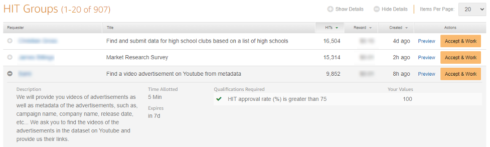
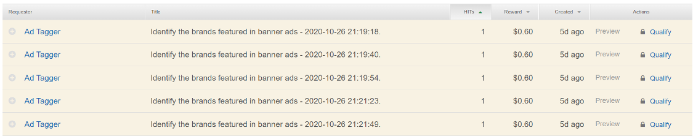

# Amazon Mechanical Turk best practices

Keep the following best practices in mind when you design and create your HITs.

## Allow workers to be as efficient as

possible

When you post tasks to Mechanical Turk, the reward amount you set is primarily for the worker's time
and attention to your task. If your task interface is inefficient and requires
multiple manual steps that require a lot of time, workers typically expect a higher
reward amount to compensate for the time they need to spend performing those steps.
Investing time to make your interface as efficient as possible pays dividends in
higher accuracy and lower costs.

## Build tasks with family and friends in

mind

When building tasks, it’s a common mistake to assume that workers have the same knowledge
you do about your area of expertise. Very few workers have the expertise you do and
will likely be confused if you use highly technical language or make assumptions
about their skills. A great practice is to design your task interface with a member
of your family or a friend in mind. Could they complete your task successfully? If
you're not sure, share the interface with them and see if they can complete it
without any additional instructions from you.

## Include an optional feedback field

Whenever possible, include an optional feedback field at the end of your task interface,
particularly when working with a new interface. Workers appreciate the opportunity
to provide feedback and often share insights on how to improve it.

## Test your HITs

Before posting your tasks to Mechanical Turk, it is always a good idea to take a few minutes to test
your HITs to make sure they work as you expect. It allows you to validate that your
interface does what you expect. Doing the task yourself also lets you get an idea of
how long it takes to complete so that you can set an appropriate reward
amount.

The easiest way to test your task interface is to save it to an HTML file and open it in a
browser. From the browser, you can go through all of the steps that a worker would
follow in completing the task. If your task interface is built around a standard
form element, you won't be able to test submitting it, but can test to ensure it
works as you expect. If you use the crowd-form element from [Crowd HTML
Elements](mturk-hits-defining-questions-html-crowd-html-elements.md "mturk-hits-defining-questions-html-crowd-html-elements.md"), you can test it
by selecting **Submit**. When you submit from outside of Mechanical Turk, the
results are displayed at the top of the window.

To fully test a task interface and the creation and retrieval of HITs, you can use the
sandbox environment.

## Start small

When you create or update a task interface, it's always best to start by posting a small
number of HITs first to confirm that workers complete the task as you expect. It's a
great way to understand how workers respond and gives you a chance to correct any
issues before you post the remaining work. Nothing is worse than posting thousands
of dollars of HITs, only to discover that the results are invalid because you made a
mistake in your task interface.

## Keep HIT type attributes consistent

When you create a HIT, you provide a number of attributes about the task that tell Mechanical Turk how
to display it in the marketplace. These are separate from the content and question
of the task itself, and include the title, description, reward amount, and
attributes describing how long the task remains active. These attributes comprise
the HIT type for your task. Mechanical Turk automatically creates a HIT type when you first
call [CreateHIT](../AWSMturkAPI/ApiReference_CreateHITOperation.md "../AWSMturkAPI/ApiReference_CreateHITOperation.md") with those values. When you create multiple HITs, Mechanical Turk
attempts to find an existing HIT type in your account that has the same attributes
and reuse it. If you change any of these attributes—even if they are small
changes to the title or description—it will force Mechanical Turk to create a new HIT
type with each change.

Maintaining consistent attributes for your HIT type is important because it directly
impacts how your HIT is displayed on the worker website. On the worker website, HITs
are grouped together into HIT groups based on their HIT type values. As shown in the
following image, each HIT group has thousands of HITs on which a worker can work
because they all have the same attributes for title, description, reward, and other
attributes. If workers accept a HIT from one of these HIT groups, they can
automatically move to the next piece of work in the HIT group without needing to
return to the list.



If, however, each HIT has a unique HIT type, then workers see your HITs as a long list of
options in the list and have to return to the list after completing each
task.



## Specify that links open new browser, windows or

tabs

When you add links to your task HTML, you should include a _target_
attribute to let the browser know that it should open a new window or tab when
workers click on it. This keeps the worker interface active in the existing window
and prevents issues that sometimes occur when workers use the
**Back** button to return to the worker interface. Add the
`_blank` target to direct the browser to open a new
window, as shown in the following example.

```
<a href="https://www.amazon.com" target="`_blank`">My link</a>
```

## Limit your use of worker blocks

We recommend that you be judicious in your use of worker blocks and only block those
workers who are clearly not making an attempt to correctly respond to your task
(spamming). If a worker is simply misreading instructions or lacks the requisite
skills to complete your task successfully, we advise you to use a custom
qualification to exclude them from future tasks, rather than a block. Because the
blocks a worker receives are a component of Mechanical Turk worker review policies, and
frequent blocks may result in account suspension, workers are sensitive to being
blocked by requesters. If the worker community believes that you are blocking
workers unfairly, they may choose to avoid accepting your tasks in the
future.

## Include clear reasons for rejections and

blocks

Workers take a lot of pride in the quality of their work and pay close attention to
rejections and blocks they receive. When you decide to reject an assignment or block
a worker, be as clear as possible about the reasons for the action. Simply providing
a value such _incorrect_ as the reason gives the worker no
information they can use to improve in the future. Instead, be clear about what the
worker did incorrectly. This allows workers to correct their mistakes in future
tasks.
