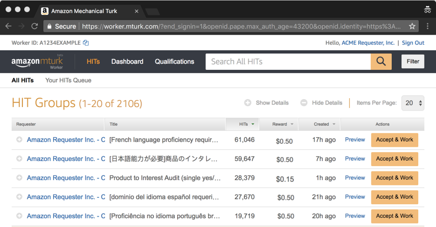

# The Amazon Mechanical Turk marketplace

Mechanical Turk uses the _requester_ and _worker_ terms to
describe the two participants in the marketplace. When you post new tasks to Amazon Mechanical Turk
(Mechanical Turk), you are a _requester_ asking _workers_ to
complete your tasks in exchange for the reward amount you offer. Workers can go to the
[Mechanical Turk marketplace](https://worker.mturk.com "https://worker.mturk.com") to find and accept
tasks.

As shown in the following image of the marketplace website, workers can see a list of
available tasks, along with details about each task. Workers can review the title and
description, reward amount, and time allotted to complete each task before accepting and
working on it. In many cases, workers preview a task prior to accepting it, which allows
them to decide if they want to work on it.

Submitting tasks to the Mechanical Turk marketplace does not guarantee that workers will complete them.
If workers don't believe that the reward amount is reasonable for the effort required,
or the work isn't something on which they want to work, they skip it and move on to
other tasks. For this reason, we recommended that you put thought into how you describe
your task so that workers can make an informed decision.

After workers complete your task, they submit their response and move on to additional tasks
that you've posted or tasks from other requesters. You can review a worker's submission
shortly after they submit the task. You have the option to _approve_
or _reject_ their submission. If you approve the work, the reward
amount is distributed to the worker. Note that if you neither approve nor reject a task
submission, it is automatically approved after a set time.

## Marketplace rules

Prior to submitting tasks to Mechanical Turk, you should review the [Acceptable Use Policy](https://www.mturk.com/acceptable-use-policy "https://www.mturk.com/acceptable-use-policy")
to ensure that your task adheres to the rules of the marketplace. Prohibited uses
cover a range of activities such as violating the privacy or security of workers or
others, abusive behavior, or any illegal activities. Violating these policies
results in removal of your tasks from the Mechanical Turk marketplace and may result in the
suspension of your account.

## The sandbox marketplace

To experiment with Mechanical Turk without spending money on the Mechanical Turk marketplace, you can use the
[_sandbox_
environment for requestors](https://requestersandbox.mturk.com "https://requestersandbox.mturk.com") and [the one for workers](https://workersandbox.mturk.com "https://workersandbox.mturk.com"). This is a
mirror image of the _production_ environment, but no money
changes hands when work is completed. Many requesters create tasks here first and
complete them themselves so that they can validate their task interface and ensure
they get the results they expect back. You can find more information on using the
sandbox in [Using the sandbox](mturk-use-sandbox.md "mturk-use-sandbox.md").

Note that there is no financial incentive to complete work in the sandbox marketplace, so
you shouldn't expect tasks you post in the sandbox to be completed unless you do so
yourself.
