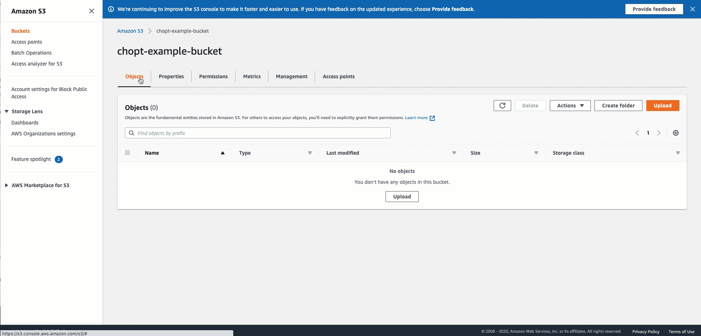

# CORS configuration requirement

Earlier in 2020, widely used browsers like Chrome and Firefox changed their default
behavior for rotating images based on image metadata, referred to as [EXIF data](https://en.wikipedia.org/wiki/Exif "https://en.wikipedia.org/wiki/Exif"). Previously, images would
always display in browsers exactly how they are stored on disk, which is typically
unrotated. After the change, images now rotate according to a piece of image metadata called
_orientation value_. This has important implications
for the entire machine learning (ML) community. For example, if the EXIF orientation is not
considered, applications that are used to annotate images may display images in unexpected
orientations and result in incorrect labels.

Starting with Chrome 89, AWS can no longer automatically prevent the rotation of images
because the web standards group W3C has decided that the ability to control rotation of
images violates the web’s Same Origin Policy. Therefore, to ensure human workers annotate
your input images in a predictable orientation when you submit requests to label an image,
you must add a CORS header policy to the Amazon S3 buckets that contain your input images.

###### Important

If you do not add a CORS configuration to the S3 buckets that contains your input
data, tasks for those input data objects will fail.

You can add a CORS policy to an S3 bucket that contains input data in the S3 console. To
set the required CORS headers on the S3 bucket that contain your input images in the S3
console, follow the directions detailed in [How do I add cross-domain resource sharing with CORS?](../../../AmazonS3/latest/user-guide/add-cors-configuration.md "../../../AmazonS3/latest/user-guide/add-cors-configuration.md"). Use the following CORS
configuration code for the buckets that hosts your images. You must use the JSON format if
you add a CORS configuration using the console.

**JSON**

```
[{
   "AllowedHeaders": [],
   "AllowedMethods": ["GET"],
   "AllowedOrigins": ["*"],
   "ExposeHeaders": []
}]
```

**XML**

```
<CORSConfiguration>
 <CORSRule>
   <AllowedOrigin>*</AllowedOrigin>
   <AllowedMethod>GET</AllowedMethod>
 </CORSRule>
</CORSConfiguration>
```

The following image demonstrates the instructions found in the Amazon S3
documentation to add a CORS header policy using the Amazon S3 console. For procedures on adding a
CORS configuration to an S3 bucket using the S3 console, AWS SDKs, and REST API, see [Configuring cross-origin resource sharing (CORS)](../../../AmazonS3/latest/userguide/enabling-cors-examples.md "../../../AmazonS3/latest/userguide/enabling-cors-examples.md") in the Amazon Simple Storage Service User Guide.


