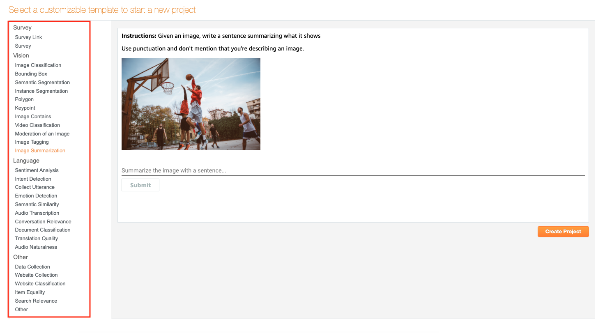
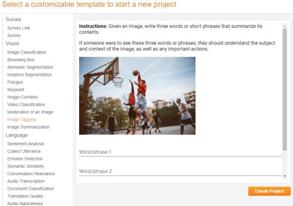
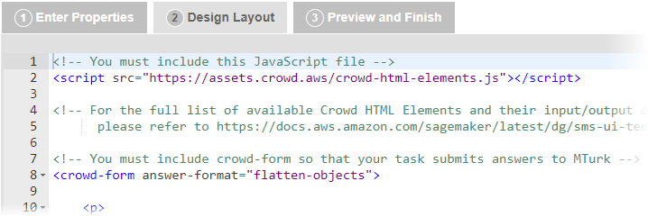
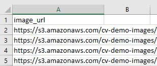
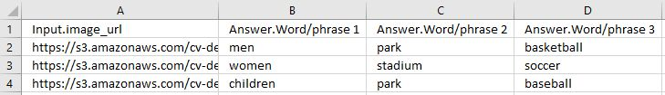

# Create an Amazon Mechanical Turk project

This section describes how to create an Amazon Mechanical Turk project on the Mechanical Turk Requester website at
[https://requester.mturk.com/](https://requester.mturk.com/ "https://requester.mturk.com/").

The Mechanical Turk _project_ contains all of the information associated with a
Human Intelligence Task (HIT) and the data objects that are processed by Workers using that
HIT. A _HIT_ is a single, self-contained task that you create for
Workers. A HIT is made up of an HTML page that provides Workers with a UI, and HIT
properties such as an expiration date and reward amount for succesfully completed
assignments.

A _batch_ is a group of Worker assignments that are created by using
the configurations of a single HIT to process multiple data objects. For example, let's say
you upload 100 images to an image classification project and publish a batch of 100 HITs.
For each Worker assignment, you ask workers to classify a single image. If you choose to
have multiple workers classify individual objects (such as images), it is possible for a
single HIT to have multiple assignments.

Mechanical Turk provides 29 pre-built HTML templates for four categories: Survey, Vision,
Language, and Other. You can modify these templates while creating a HIT to customize the
Worker UI.

You must create a Mechanical Turk project before you can create a batch of Human Intelligence Tasks
(HITs). To create a project, start with one of the provided sample project templates and
customize it.

The following procedure describes how to create a project using the **Image
Tagging** template. This procedure is identical for all other templates.

You need to take the following steps when you create a Mechanical Turk project:

- Define the projects properties.
- Design the project's HTML layout.
- Preview the project.
  For the example project, assume you have a large number of images that you want to tag
  with geographical locations and landmarks. In the procedure, you create a HIT using the
  **Image Tagging** template, customize it to provide your images, and
  then modify the input fields to collect this set of information from the workers.

## Create a project

Follow the steps in this procedure to create a project.

###### To create a project

1. Go to the Mechanical Turk Requester website at [https://requester.mturk.com/](https://requester.mturk.com/ "https://requester.mturk.com/"), choose **Create**,
   and then choose **New Project**. In some cases, the new project
   page might be your landing page when you log in.
2. In the template selector, choose a template on the left and a preview it on
   the right. For this example, choose **Tagging Images** in the
   list, and then choose **Create Project**.

 3. On the **Edit Project** page, choose the **Edit
Properties** tab, and then enter the information for your
HIT.

    1. In the **Describe your HIT to Workers** section of
     the **Edit Properties** tab, do the following:

    | Field | Description |
    | --- | --- |
    | Project Name | The project name field is already created, but you can change it. Make sure the project name is descriptive so that you can easily identify the project when you want to publish a batch with the project. The project name is for your reference and is not displayed to workers. |
    | Title | Enter the name of the task. Be specific. For example, enter `Tag landmark images` instead of `Tag photos`. The title is displayed to workers. |
    | Description | Describe the task. The search mechanism searches using this description, so use words you think will help workers find your HITs. |
    | Keywords | Enter a comma-separated list of words that workers can use to find your HIT. |
    2. In the **Setting up your task** section of the
     **Edit Properties** tab, do the following:

    | Field | Description |
    | --- | --- |
    | Reward per assignment | Specify how much money you'll pay the worker if you approve an assignment. |
    | Number of assignments per task | Specify the number of unique workers you want to work on each task. One assignment per task means that only one worker works on a task. You might want multiple workers to work on a task to see if there is agreement between workers, which can increase your trust in the results. A worker can only accept a task once and can only submit one assignment per task. This guarantees that multiple workers must complete a task that has multiple assignments. |
    | Time Allotted Per Assignment | Specify how long the worker can hold on to individual assignments within your batch to work on them. After this time has passed, the tasks are withdrawn from the worker so others can work on them. |
    | Task expires in | Specify how long workers can accept tasks in the batch. Workers can't accept tasks in the batch after this time expires. Workers can finish working on assignments they previously accepted even though the batch is no longer available for others to work on. |
    | Auto-approve and pay Workers in | Specify when Mechanical Turk will automatically approve your tasks and pay workers. This determines the amount of time you have to reject an assignment submitted by a worker before the assignment is auto-approved and the worker is paid. This limit ensures that workers get paid in a timely manner. |
    3. In the **Worker requirements** section of the
     **Edit Properties** tab, do the following:

    | Option | Description |
    | --- | --- |
    | Require that workers be masters to do your tasks | Select to specify that you require Mechanical Turk master workers to work on your tasks. Masters are an elite group of workers, who have demonstrated superior performance while completing thousands of tasks across the Mechanical Turk marketplace. Masters must maintain this high level of performance or they may lose this distinction. |
    | Specify any additional qualifications workers must meet to work on your tasks | Add up to five requirements, such as a worker's HIT approval rate, a geographic location, or a minimum number of HITs approved. Additionally, you can set **Premium qualifications* • such as language fluency or demographic criteria, which will add to the cost of each completed task. If you have created custom qualifications, they are available at the bottom of the drop-down menu. |
    | Project contains adult content | Select the check box to indicate that the project may contain potentially explicit or offensive content. |

4. Choose the **Design Layout** tab and edit the HTML of the
   template. You can copy the HTML in the editor into another file. To preview HTML
   the page, open the file in a browser. To ensure your form elements work well
   with Amazon Mechanical Turk, we recommend using [our Custom HTML
   Elements](../../../sagemaker/latest/dg/sms-ui-template-reference.md "../../../sagemaker/latest/dg/sms-ui-template-reference.md").

 5. Create a variable by putting the a dollar sign before curly braces around the
name of a column in your HIT data file. This can be text in the body of your
template, the source URL in an image or video tag, and a variety of other
things. The value of the variable comes from a column in your **HIT data
file** with the same value in its header row. For information that
must change from task to task, use **variables**. In the sample
template, the image tag contains a variable for the source of the image:
`${image_url}`. 6. Create your HIT data file. The HIT data file is a comma-separated value
(`.csv`) file that contains the data values used to replace your
variables. Many spreadsheet applications, including Microsoft Excel, can save
files in the .`csv` file format.

###### About HIT data files

    * Each new line in the file represents a new HIT. The number of data
     values in one row should exactly match the number of variables used
     in your project. The first row in the .`csv` HIT
     data file contains the column headings for the data value columns.
     The order in which you use the variables in the project template
     does not need to match the order of columns in the
     .`csv` file.

    
    * The names of the template variables must match the column headings
     for the values in your HIT data file. For example, if you use the
     `${image_url}` variable, the HIT data file must have
     a column that has the **image\_url** heading.
    * Your HIT data file cannot have line breaks between data cells and
     `\r` is not supported as a line break character.
     MacOS computers insert this character when they convert a Microsoft
     Excel table into a .`csv` file.
    * If your HITs contain images or videos, you must include links to
     them in the HIT data file. The images and videos must be publicly
     accessible. The user interface does not provide a tool for uploading
     images or videos. Consider using one of the publicly-available tools
     to upload your images into Amazon S3.

7. Mechanical Turk returns results in a table that is stored in a `.csv` file.
   The number of input and answer fields in one HIT determines the number of
   columns in the **Results** table. One row in the
   **Results** table represents a complete set of answers for
   one HIT as shown in the following example.

 8. Choose **Save** periodically to save the HTML of your project
so you don't lose your work.

Mechanical Turk deletes a project if you don't use the project for 120 consecutive days.
If you need to access your project for a longer period of time, we recommend
that you copy the HTML and save it on your own system. 9. Choose the **Preview and Finish** tab, review the preview of
the template, and then do the following:

    * If you are satisfied with your changes, choose
     **Finish**.
    * If you need to make changes, choose the **Design
     Layout** tab and fix the HTML.

###### Note

Variables are not filled in at this point.

After you choose **Finish**, the **Create** page is
displayed and your project appears in your list of existing projects.

Next, publish a batch with this template to make it available to workers. For
information about publishing a batch, see [Publish a batch of HITs](PublishingYourBatchofHITs.md "PublishingYourBatchofHITs.md").
