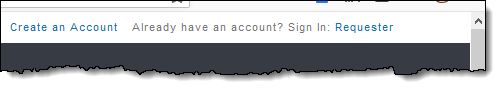
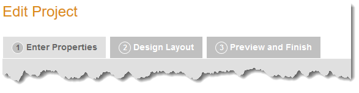
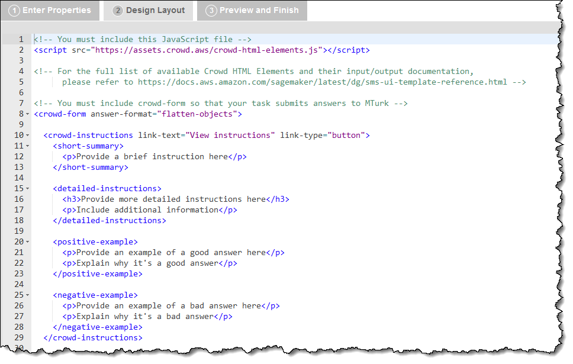
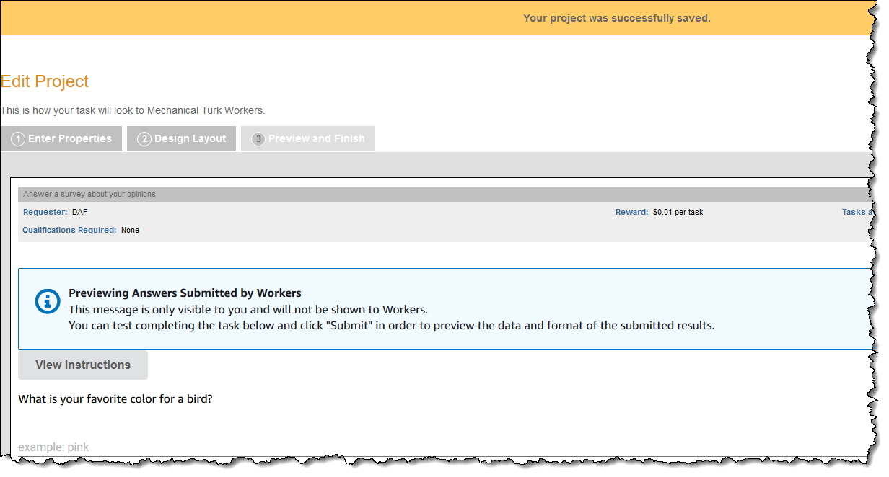

# Getting started with the Amazon Mechanical Turk Requester UI

Follow the steps in this topic to get started with the Amazon Mechanical Turk Requester UI.

## Step 1: Create an account

To create an Amazon Mechanical Turk account, or sign in, go to the [Amazon Mechanical Turk Requester](https://requester.mturk.com/ "https://requester.mturk.com/") website
and do one of the following:

- To create an account, choose **Create an Account** and follow the on-screen
  instructions.
- To sign in, choose **Sign In: Requester** and follow the on-screen
  instructions.

After you have signed in using your Amazon Mechanical Turk account, you are ready to use the RUI.
The RUI makes it easy to create a Human Intelligence Task (HIT) template, publish HITs,
manage batch results, and manage workers.

## Step 2: Create a project

You must create a Mechanical Turk project before you can create a batch of HITs. The Mechanical Turk project
contains the HTML of your HIT page as well as metadata about the HIT, called
**HIT properties**, such as the HIT name, title, reward per
response and expiration date. To create a project, start with one of the provided sample
project templates and customize it. Mechanical Turk offers templates for common tasks, and they are
a quick way to get you started. During the [Step 4: Create the design layout](#rui-edit-layout "#rui-edit-layout") step, you can edit the template to meet your
needs.

###### Templates

Some of the templates you might find include:

- Survey Link
- Survey
- Image Classification
- Bounding Box
- Semantic Segmentation
- Instance Segmentation
- Polygon
- Keypoint
- Image Contains
- Video Classification
- Moderation of an Image
- Image Tagging
- Image Summarization
- Sentiment Analysis
- Collect Utterance
- Emotion Detection
- Semantic Similarity
- Conversation Relevance
- Audio Transcription
- Document Classification
- Translation Quality
- Audio Naturalness
- Data Collection
- Website Collection
- Website Classification
- Item Equality
- Search Relevance

After selecting a template, there are three steps needed to complete creating the project.

## Step 3: Enter properties

1. In **Section 1: Describing Your Project to Your Workers**, enter the following information:
   - **Project Name** – This is for your own reference and will appear in your project list. It will not be shown to workers. It is filled with a default value, but you are encouraged to change it to something more descriptive.
   - **Title** – The title of the HIT that is displayed to workers. Be specific about the task. For example, use "Tag landmark images" instead of "Tag photos."
   - **Description** – Search uses the description you enter here, so use words you think will help Workers find your HITs.
   - **Keywords** – A comma-separated list of words Workers can use to find your HIT.

2. In **Section 2: Rewards and Time Allotments**, enter the following information:
   - **Reward per assignment** – Specify how much money you'll pay the worker if you approve an
     assignment.
   - **Number of assignments per
     task** – Specify how many workers should work on each HIT. One assignment for each HIT
     means that only one worker works on each HIT. You can increase the number to get
     the HIT completed by multiple workers and see if they agree, which can increase
     your trust in the results.

   A worker can only accept a HIT once and only submit one assignment per HIT to
   prevent the same worker from submitting multiple assignments for the same HIT.
   - **Time allotted per assignment** – Specify how long the worker can hold on to individual assignments within your
     batch to work on them. After this time has passed, the HITs are withdrawn from
     the worker so others can work on them.
   - **Task expires in** – Specify how long workers can accept HITs in this batch. workers can't accept
     HITs from the batch once it expires, but workers who accept HITs before it
     expires have the full allotted time to complete them. To estimate when all
     accepted and completed HITs will be ready, add the allotted time to the
     expiration time.
   - **Automatically approve and pay
     workers** – Specify when Mechanical Turk will automatically approve HITs and pay workers. This
     determines the amount of time you have to reject an assignment submitted by a
     Worker before the assignment is auto-approved and the Worker is paid. This limit
     ensures Workers get paid in a timely manner.

3. In **Section 3: Requirements and Qualifications**, enter the following information:
   - **Require that Workers be Masters to
     do your tasks** – Limit your HITs to workers with a history of excellence across a broad range
     of tasks.
   - **Specify additional qualifications
     Workers must meet to work on your tasks** – For more information about managing qualifications, see [Managing qualification types](ManagingQualificationTypes.md "ManagingQualificationTypes.md"). This [Mechanical Turk blog post about understanding requirements and
     qualifications](https://blog.mturk.com/tutorial-understanding-requirements-and-qualifications-99a26069fba2 "https://blog.mturk.com/tutorial-understanding-requirements-and-qualifications-99a26069fba2") provides a good tutorial on the topic.
   - **Specify any additional
     qualifications Workers must meet to work on your tasks** – Select this check the box if your HITs will contain explicit or offensive content,
     such as nudity or extreme violence.

## Step 4: Create the design layout

You can edit any of the templates that are available to you, with the exception of
the Survey Link template. Use the embedded text editor in the **Design
Layout** panel to modify a template. You can use HTML, CSS, and JavaScript
to customize your layout and functionality. You can also use [Crowd HTML Elements](../AWSMturkAPI/ApiReference_HTMLCustomElementsArticle.md "../AWSMturkAPI/ApiReference_HTMLCustomElementsArticle.md") to design your layout with configured widgets for
common Mechanical Turk HIT types.

## Step 5: Preview and finish

The **Preview and Finish** panel displays your HIT as it will
appear to workers. Do one of the following:

- If it's incorrect, you can go back to the **Design Layout**
  panel and edit it.
- If it's ready, choose **Finish** to save your
  project. After it's saved, your project is ready to publish.

After you choose **Finish**, the **Create** page is
displayed and your project appears in your list of existing projects.

Next, publish a batch to make it available to workers. For information
about publishing a batch, see [Publish a batch of HITs](PublishingYourBatchofHITs.md "PublishingYourBatchofHITs.md").

