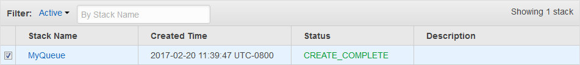

# Creating an Amazon SQS queue using AWS CloudFormation

Use the AWS CloudFormation console along with a JSON or YAML template to create an Amazon SQS queue. For more details, see [Working with AWS CloudFormation
Templates](../../../AWSCloudFormation/latest/UserGuide/template-guide.md "../../../AWSCloudFormation/latest/UserGuide/template-guide.md") and the [`AWS::SQS::Queue` Resource](../../../AWSCloudFormation/latest/UserGuide/aws-resource-sqs-queue.md "../../../AWSCloudFormation/latest/UserGuide/aws-resource-sqs-queue.md") in the
_AWS CloudFormation User Guide_.

###### To use AWS CloudFormation to create an Amazon SQS queue.

1. Copy the following JSON code to a file named `MyQueue.json`. To create
   a standard queue, omit the `FifoQueue` and
   `ContentBasedDeduplication` properties. For more information on
   content-based deduplication, see [Exactly-once processing in
   Amazon SQS](FIFO-queues-exactly-once-processing.md "FIFO-queues-exactly-once-processing.md").

###### Note

The name of a FIFO queue must end with the `.fifo` suffix.

```
{
   "AWSTemplateFormatVersion": "2010-09-09",
   "Resources": {
      "MyQueue": {
         "Properties": {
            "QueueName": "MyQueue.fifo",
            "FifoQueue": true,
            "ContentBasedDeduplication": true
             },
         "Type": "AWS::SQS::Queue"
         }
      },
   "Outputs": {
      "QueueName": {
         "Description": "The name of the queue",
         "Value": {
            "Fn::GetAtt": [
               "MyQueue",
               "QueueName"
            ]
         }
      },
      "QueueURL": {
         "Description": "The URL of the queue",
         "Value": {
            "Ref": "MyQueue"
         }
      },
      "QueueARN": {
         "Description": "The ARN of the queue",
         "Value": {
            "Fn::GetAtt": [
               "MyQueue",
               "Arn"
            ]
         }
      }
   }
}
```

2. Sign in to the [AWS CloudFormation
   console](https://console.aws.amazon.com/cloudformation "https://console.aws.amazon.com/cloudformation"), and then choose **Create Stack**.
3. On the **Specify Template** panel, choose **Upload a
   template file**, choose your `MyQueue.json` file, and then
   choose **Next**.
4. On the **Specify Details** page, type `MyQueue` for
   **Stack Name**, and then choose
   **Next**.
5. On the **Options** page, choose **Next**.
6. On the **Review** page, choose
   **Create**.

AWS CloudFormation begins to create the `MyQueue` stack and displays the
**CREATE_IN_PROGRESS** status. When the process is complete,
AWS CloudFormation displays the **CREATE_COMPLETE** status.

 7. (Optional) To display the name, URL, and ARN of the queue, choose the name of the
stack and then on the next page expand the **Outputs**
section.
