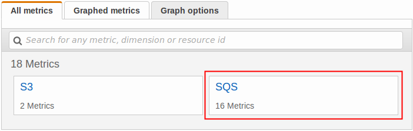
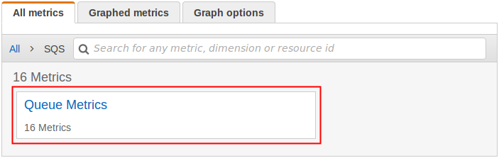
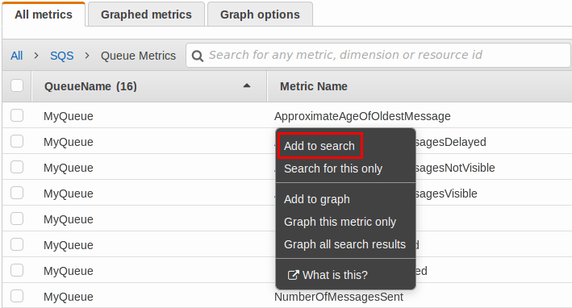

# Accessing CloudWatch metrics for Amazon SQS

Amazon SQS and Amazon CloudWatch are integrated so you can use CloudWatch to view and analyze metrics for
your Amazon SQS queues. You can view and analyze your queues' metrics from the [Amazon SQS console](#access-cloudwatch-metrics-sqs-console "#access-cloudwatch-metrics-sqs-console"), the [CloudWatch console](#access-metrics-cloudwatch-console "#access-metrics-cloudwatch-console"), using the [AWS CLI](#access-cloudwatch-metrics-cli "#access-cloudwatch-metrics-cli"), or using the [CloudWatch API](#access-metrics-cloudwatch-api "#access-metrics-cloudwatch-api"). You can also [set CloudWatch alarms](set-cloudwatch-alarms-for-metrics.md "set-cloudwatch-alarms-for-metrics.md") for Amazon SQS metrics.

## Using the Amazon SQS console

Use the Amazon SQS console to access and analyze metrics for up to 10 Amazon SQS queues.

1. Sign in to the [Amazon SQS console](https://console.aws.amazon.com/sqs/ "https://console.aws.amazon.com/sqs/").
2. In the list of queues, choose (check) the boxes for the queues that you want to
   access metrics for. You can show metrics for up to 10 queues.
3. Choose the **Monitoring** tab.

Various graphs are displayed in the **SQS metrics** section. 4. To understand what a particular graph represents, hover over

next to the desired graph, or see [Available CloudWatch metrics for Amazon SQS](sqs-available-cloudwatch-metrics.md "sqs-available-cloudwatch-metrics.md"). 5. To change the time range for all of the graphs at the same time, for **Time
Range**, choose the desired time range (for example, **Last
Hour**). 6. To view additional statistics for an individual graph, choose the graph. 7. In the **CloudWatch Monitoring Details** dialog box, select a
**Statistic**, (for example, **Sum**). For a list of
supported statistics, see [Available CloudWatch metrics for Amazon SQS](sqs-available-cloudwatch-metrics.md "sqs-available-cloudwatch-metrics.md"). 8. To change the time range and time interval that an individual graph displays (for
example, to show a time range of the last 24 hours instead of the last 5 minutes, or to
show a time period of every hour instead of every 5 minutes), with the graph's dialog
box still displayed, for **Time Range**, choose the desired time range
(for example, **Last 24 Hours**). For **Period**,
choose the desired time period within the specified time range (for example, **1
Hour**). When you're finished looking at the graph, choose
**Close**. 9. (Optional) To work with additional CloudWatch features, on the
**Monitoring** tab, choose **View all CloudWatch
metrics**, and then follow the instructions in the [Using the Amazon CloudWatch console](#access-metrics-cloudwatch-console "#access-metrics-cloudwatch-console") procedure.

## Using the Amazon CloudWatch console

Use the CloudWatch console to access and analyze Amazon SQS metrics.

1. Sign in to the [CloudWatch
   console](https://console.aws.amazon.com/cloudwatch/ "https://console.aws.amazon.com/cloudwatch/").
2. On the navigation panel, choose **Metrics**.
3. Select the **SQS** metric namespace.

 4. Select the **Queue Metrics** metric dimension.

 5. You can now examine your Amazon SQS metrics:

    * To sort the metrics, use the column heading.
    * To graph a metric, select the check box next to the metric.
    * To filter by metric, choose the metric name and then choose **Add to
     search**.

For more information and additional options, see [Graph Metrics](../../../AmazonCloudWatch/latest/monitoring/graph_metrics.md "../../../AmazonCloudWatch/latest/monitoring/graph_metrics.md") and [Using Amazon CloudWatch Dashboards](../../../AmazonCloudWatch/latest/monitoring/CloudWatch_Dashboards.md "../../../AmazonCloudWatch/latest/monitoring/CloudWatch_Dashboards.md") in the
_Amazon CloudWatch User Guide_.

## Using the AWS Command Line Interface

To access Amazon SQS metrics using the AWS CLI, run the `get-metric-statistics` command.

For more information, see [Get
Statistics for a Metric](../../../AmazonCloudWatch/latest/monitoring/getting-metric-statistics.md "../../../AmazonCloudWatch/latest/monitoring/getting-metric-statistics.md") in the _Amazon CloudWatch User Guide_.

## Using the CloudWatch API

To access Amazon SQS metrics using the CloudWatch API, use the `GetMetricStatistics`
action.

For more information, see [Get
Statistics for a Metric](../../../AmazonCloudWatch/latest/monitoring/getting-metric-statistics.md "../../../AmazonCloudWatch/latest/monitoring/getting-metric-statistics.md") in the _Amazon CloudWatch User Guide_.
