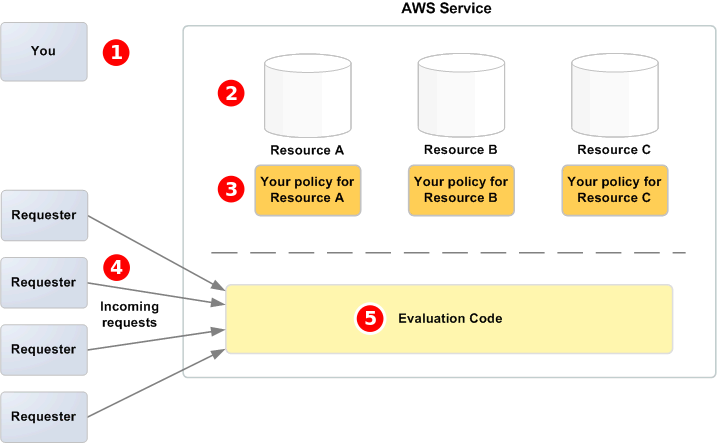

# Amazon SQS access control

architecture

The following diagram describes the access control for your Amazon SQS
resources.

You, the resource owner.

Your resources contained within the AWS service (for
example, Amazon SQS queues).

Your policies. It is a good practice to have one policy per
resource. The AWS service provides an API you use to upload and manage your
policies.

Requesters and their incoming requests to the AWS
service.

The access policy language evaluation code. This is the set of code
within the AWS service that evaluates incoming requests against the applicable
policies and determines whether the requester is allowed access to the
resource.
