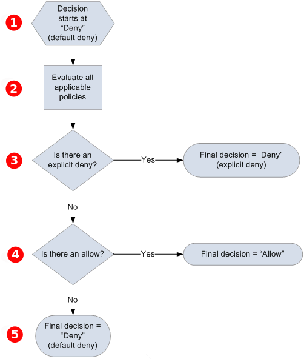

# Amazon SQS

Access Policy Language evaluation logic

At evaluation time, Amazon SQS determines whether a request from someone other than
the resource owner should be allowed or denied. The evaluation logic follows
several basic rules:

- By default, all requests to use your resource coming from anyone but
  you are denied.
- An _[Allow](sqs-creating-custom-policies-key-concepts.md#allow "sqs-creating-custom-policies-key-concepts.md#allow")_ overrides any
  _[Default-deny](sqs-creating-custom-policies-key-concepts.md#default-deny "sqs-creating-custom-policies-key-concepts.md#default-deny")_.
- An _[Explicit-deny](sqs-creating-custom-policies-key-concepts.md#explicit-deny "sqs-creating-custom-policies-key-concepts.md#explicit-deny")_ overrides any
  **allow**.
- The order in which the policies are evaluated isn't important.
  The following diagram describes in detail how Amazon SQS evaluates decisions about
  access permissions.

The decision starts with a **default-deny**.

The enforcement code evaluates all the policies that are
applicable to the request (based on the resource, principal, action, and
conditions). The order in which the enforcement code evaluates the policies
isn't important.

The enforcement code looks for an **explicit-deny** instruction that can apply to the request. If it
finds even one, the enforcement code returns a decision of **deny** and the process finishes.

If no **explicit-deny**
instruction is found, the enforcement code looks for any **allow** instructions that can apply to the request. If it finds
even one, the enforcement code returns a decision of **allow** and the process finishes (the service continues to process
the request).

If no **allow** instruction is
found, then the final decision is **deny** (because
there is no **explicit-deny** or **allow**, this is considered a **default-deny**).
