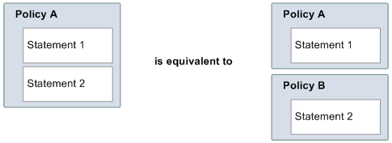

# Amazon SQS

Access Policy Language key concepts

To write your own policies, you must be familiar with [JSON](http://json.org/ "http://json.org/") and a number of key concepts.

**Allow**

The result of a [Statement](#statement "#statement") that has [Effect](#effect "#effect") set to `allow`.

**Action**

The activity that the [Principal](#principal "#principal") has permission
to perform, typically a request to AWS.

**Default-deny**

The result of a [Statement](#statement "#statement") that has no [Allow](#allow "#allow") or [Explicit-deny](#explicit-deny "#explicit-deny")
settings.

**Condition**

Any restriction or detail about a [Permission](#permission "#permission").
Typical conditions are related to date and time and IP
addresses.

**Effect**

The result that you want the [Statement](#statement "#statement") of a
[Policy](#policy "#policy") to return at evaluation time. You
specify the `deny` or `allow` value when you
write the policy statement. There can be three possible results at
policy evaluation time: [Default-deny](#default-deny "#default-deny"), [Allow](#allow "#allow"), and [Explicit-deny](#explicit-deny "#explicit-deny").

**Explicit-deny**

The result of a [Statement](#statement "#statement") that has [Effect](#effect "#effect") set to `deny`.

**Evaluation**

The process that Amazon SQS uses to determine whether an incoming
request should be denied or allowed based on a [Policy](#policy "#policy").

**Issuer**

The user who writes a [Policy](#policy "#policy") to grant
permissions to a resource. The issuer, by definition is always the
resource owner. AWS doesn't permit Amazon SQS users to create policies
for resources they don't own.

**Key**

The specific characteristic that is the basis for access
restriction.

**Permission**

The concept of allowing or disallowing access to a resource using
a [Condition](#condition "#condition") and a [Key](#key "#key").

**Policy**

The document that acts as a container for one or more **[statements](#statement "#statement")**.

Amazon SQS uses the policy to determine whether to grant access to a
user for a resource.

**Principal**

The user who receives [Permission](#permission "#permission") in the [Policy](#policy "#policy").

**Resource**

The object that the [Principal](#principal "#principal") requests access
to.

**Statement**

The formal description of a single permission, written in the
access policy language as part of a broader [Policy](#policy "#policy")
document.

**Requester**

The user who sends a request for access to a [Resource](#resource "#resource").
