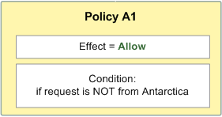
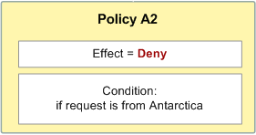
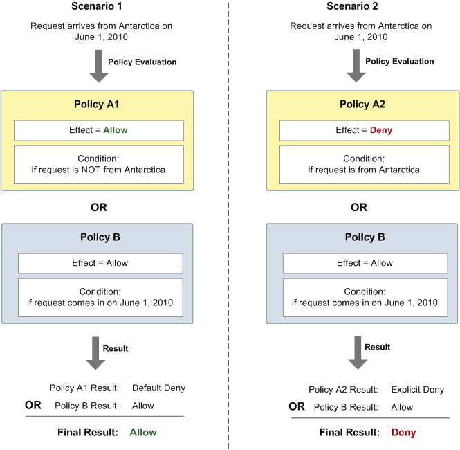

# Relationships between explicit and default denials in the Amazon SQS

Access Policy Language

If an Amazon SQS policy doesn't directly apply to a request, the request results in
a _[Default-deny](sqs-creating-custom-policies-key-concepts.md#default-deny "sqs-creating-custom-policies-key-concepts.md#default-deny")_. For example, if a user
requests permission to use Amazon SQS but the only policy that applies to the user
can use DynamoDB, the requests results in a **default-deny**.

If a condition in a statement isn't met, the request results in a **default-deny**. If all conditions in a statement are
met, the request results in either an _[Allow](sqs-creating-custom-policies-key-concepts.md#allow "sqs-creating-custom-policies-key-concepts.md#allow")_ or an _[Explicit-deny](sqs-creating-custom-policies-key-concepts.md#explicit-deny "sqs-creating-custom-policies-key-concepts.md#explicit-deny")_
based on the value of the _[Effect](sqs-creating-custom-policies-key-concepts.md#effect "sqs-creating-custom-policies-key-concepts.md#effect")_ element
of the policy. Policies don't specify what to do if a condition isn't met, so
the default result in this case is a **default-deny**. For example, you want to prevent requests that
come from Antarctica. You write Policy A1 that allows a request only if it
doesn't come from Antarctica. The following diagram illustrates the Amazon SQS
policy.

If a user sends a request from the U.S., the condition is met (the request
isn't from Antarctica), and the request results in an **allow**. However, if a user sends a request from Antarctica, the
condition isn't met and the request defaults to a **default-deny**. You can change the result to an **explicit-deny** by writing Policy A2 that explicitly
denies a request if it comes from Antarctica. The following diagram illustrates
the policy.

If a user sends a request from Antarctica, the condition is met and the
request results in an **explicit-deny**.

The distinction between a **default-deny** and an
**explicit-deny** is important because an
**allow** can overwrite the former but not the
latter. For example, Policy B allows requests if they arrive on June 1, 2010.
The following diagram compares combining this policy with Policy A1 and Policy
A2.

In Scenario 1, Policy A1 results in a **default-deny** and Policy B results in an **allow** because the policy allows requests that come in on June 1, 2010. The **allow** from Policy B overrides the
**default-deny** from Policy A1, and the
request is allowed.

In Scenario 2, Policy B2 results in an **explicit-deny** and Policy B results in an **allow**. The **explicit-deny** from
Policy A2 overrides the **allow** from Policy B,
and the request is denied.
