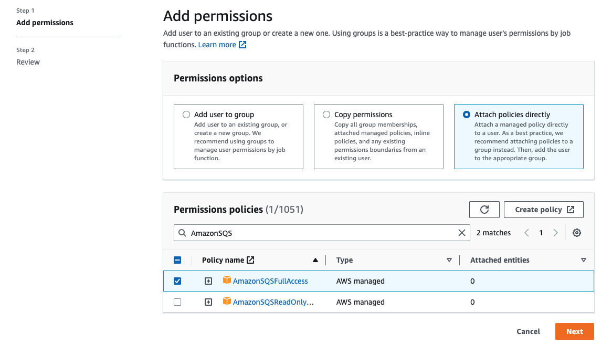

# CloudTrail update and permission requirements

for Amazon SQS dead-letter queue redrive

On June 8, 2023, Amazon SQS introduced dead-letter queue (DLQ) redrive for AWS
SDK and AWS Command Line Interface (CLI). This capability is an addition to the already supported DLQ redrive
for the AWS console. If you've previously used the AWS console
to redrive dead-letter queue messages, you may be affected by the following changes:

## CloudTrail event renaming

On October 15, 2023, the CloudTrail event names for dead-letter queue redrive will change on
the Amazon SQS console. If you've set alarms for these CloudTrail events, you must update them now.
The following are the new CloudTrail event names for DLQ redrive:

| Previous event name | New event name          |
| ------------------- | ----------------------- | ------------------------------------------------------------------------------------------------------------------------------------------------------------------------------------------------------------------------------------------------------------------------------------------------------------------------------------------------------------------------------------------------------------------------------------------------------------------------------------------------------------------------------------------------------------------------------------------------------------------------------------------------------------------------------------------------------------------------------------------------------------------------------------------------------------------------------------------------------------------------------------------------------------------------------------------------------------------------------------------------------------------------------------------------------------------------------------------------------------------------------------------------------------------------------------------------------------------------------------------------------------------------------------------------------------------------------------------------------------------------------------------------------------------------------------------------------------------------------------------------------------------------------------------------------------------------------------------------------------------------------------------------------------------------------------------------------------------------------------------------------------------------------------------------------------------------------------------------------------------------------------------------------------------------------------------------------------------------------------------------------------------------------------------------------------------------------------------------------------------------------------------------------------------------------------------------------------------------------------------------------------------------------------------------------------------------------------------------------------------------------------------------------------------------------------------------------------------------------------------------------------------------------------------------------------------------------------------------------------------------------------------------------------------------------------------------------------------------------------------------------------------------------------------------------------------------------------------------------------------------------------------------------------------------------------------------------------------------------------------------------------------------------------------------------------------------------------------------------------------------------------------------------------------------------------------------------------------------------------------------------------------------------------------------------------------------------------------------------------------------------------------------------------------------------------------------------------------------------------------------------------------------------------------------------------------------------------------------------------------------------------------------------------------------------------------------------------------------------------------------------------------------------------------------------------------------------------------------------------------------------------------------------------------------------------------------------------------------------------------------------------------------------------------------------------------------------------------------------------------------------------------------------------------------------------------------------------------------------------------------------------------------------------------------------------------------------------------------------------------------------------------------------ |
| `CreateMoveTask`    | `StartMessageMoveTask`  |
| `CancelMoveTask`    | `CancelMessageMoveTask` | ## Updated permissions Included with the SDK and CLI release, Amazon SQS has also updated queue permissions for DLQ redrive to adhere to security best practices. Use the following queue permission types to redrive messages from your DLQs. 1. Action-based permissions (update for the DLQ API actions) 2. Managed Amazon SQS policy permissions 3. Permission policy that uses sqs:\* wildcard ###### Important To use the DLQ redrive for SDK or CLI, you are required to have a DLQ redrive permission policy that matches one of the above options. If your queue permissions for DLQ redrive don't match one of the options above, you must update your permissions by August 31, 2023. Between now and August 31, 2023, your account will be able to redrive messages using the permissions you configured using the AWS console only in the regions where you have previously used the DLQ redrive. For example, say you had "Account A" in both us-east-1 and eu-west-1. "Account A" was used to redrive messages on the AWS console in us-east-1 prior to June 8, 2023, but not in eu-west-1. Between June 8, 2023 and August 31, 2023, if "Account A’s" policy permissions don't match one of the options above, it can only be used to redrive messages on the AWS console in us-east-1, and not in eu-west-1. ###### Important If your DLQ redrive permissions do not match one of these options after August 31, 2023, your account will no longer be able to redrive DLQ messages using the AWS console. However, if you used the DLQ redrive feature on the AWS Console during August 2023, you have an extension until October 15, 2023 to adopt the new permissions according to one of these options. For more information, see [Identifying impacted policies](#identifying-impacted-policies "#identifying-impacted-policies"). The following are queue permission examples for each DLQ redrive option. When using [server-side encrypted (SSE) queues](sqs-configure-sse-existing-queue.md "sqs-configure-sse-existing-queue.md"), the corresponding AWS KMS key permission is required. **Action-based** JSON `` `{ "Version":"2012-10-17", "Statement": [ { "Effect": "Allow", "Action": [ "sqs:ReceiveMessage", "sqs:DeleteMessage", "sqs:GetQueueAttributes", "sqs:StartMessageMoveTask", "sqs:ListMessageMoveTasks", "sqs:CancelMessageMoveTask" ], "Resource": "arn:aws:sqs:us-west-1:123456789012:<DLQ_name>" }, { "Effect": "Allow", "Action": "sqs:SendMessage", "Resource": "arn:aws:sqs:us-west-1:123456789012:<DestQueue_name>" } ] }` `` **Managed policy** The following managed policies contain the required updated permissions:  • **AmazonSQSFullAccess** – Includes the following dead-letter queue redrive tasks: start, cancel, and list.  • **AmazonSQSReadOnlyAccess** – Provides read-only access, and includes the list dead-letter queue redrive task.  **Permission Policy that uses sqs\* wildcard** JSON `` `{ "Version":"2012-10-17", "Statement": [ { "Effect": "Allow", "Action": "sqs:*", "Resource": "*" } ] }` `` ## Identifying impacted policies If you are using customer managed policies (CMPs), you can use AWS CloudTrail and IAM to identify the policies impacted by the queue permissions update. ###### Note If you are using `AmazonSQSFullAccess` and `AmazonSQSReadOnlyAccess`, no further action is required. 1. Sign in to the AWS CloudTrail console. 2. On the **Event history** page, under **Look up attributes**, use the drop down menu to select _Event name_. Then, search for `CreateMoveTask`. 3. Choose an event to open the **Details** page. In the **Event records** section, retrieve the `UserName` or `RoleName` from the `userIdentity` ARN. 4. Sign into IAM console.  • For users, choose Users. Select the user with the `UserName` identified in the previous step.  • For roles, choose Roles. Search for the user with the `RoleName` identified in the previous step. 5. On the **Details** page, in the **Permissions** section, review any policies with the `sqs:` prefix in `Action`, or review policies that have Amazon SQS queue defined in `Resource`. |
