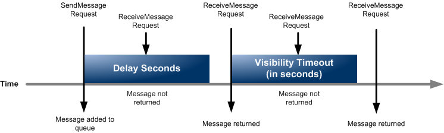

# Amazon SQS delay queues

Delay queues let you postpone the delivery of new messages to consumers for a number of seconds, for example, when your consumer
application needs additional time to process messages. If you create a delay queue, any messages that you send to the queue remain invisible to consumers
for the duration of the delay period. The default (minimum) delay for a queue is 0 seconds. The maximum is 15 minutes. For information about configuring delay queues using the console
see [Configuring queue parameters using the Amazon SQS
console](sqs-configure-queue-parameters.md "sqs-configure-queue-parameters.md").

###### Note

For standard queues, the per-queue delay setting is **not
retroactive**—changing the setting doesn't affect the delay of
messages already in the queue.

For FIFO queues, the per-queue delay setting is **retroactive**—changing the setting affects the delay of messages
already in the queue.

Delay queues are similar to [visibility
timeouts](sqs-visibility-timeout.md "sqs-visibility-timeout.md") because both features make messages unavailable to consumers for a
specific period of time. The difference between the two is that, for delay queues, a message
is hidden when it is first added to queue, whereas for visibility timeouts a message is
hidden only after it is consumed from the queue. The following diagram illustrates the
relationship between delay queues and visibility timeouts.

**Extended scheduling options**

While Amazon SQS delay queues and message timers allow scheduling of message delivery up to 15
minutes in the future, you may require more flexible scheduling capabilities. In such cases,
consider using [EventBridge Scheduler](../../../scheduler/latest/UserGuide/what-is-scheduler.md "../../../scheduler/latest/UserGuide/what-is-scheduler.md"), which enables you
to schedule billions of one-time or recurring API actions without time limitations. EventBridge Scheduler is the recommended solution for advanced message scheduling use cases.

To set delay seconds on individual messages, rather than on an entire queue, use [message timers](sqs-message-timers.md "sqs-message-timers.md") to allow Amazon SQS to use the message
timer's `DelaySeconds` value instead of the delay queue's
`DelaySeconds` value. [EventBridge Scheduler](../../../scheduler/latest/UserGuide/what-is-scheduler.md "../../../scheduler/latest/UserGuide/what-is-scheduler.md") also supports
scheduling individual messages.
