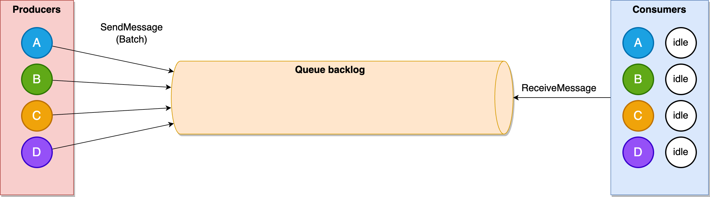
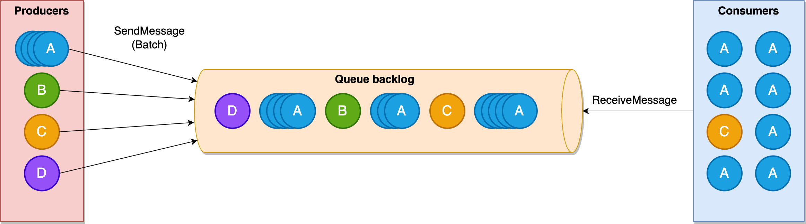
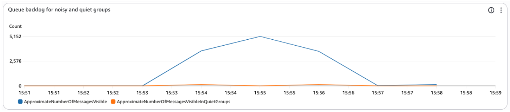

# Amazon SQS fair queues

Amazon SQS fair queues automatically mitigates the noisy-neighbor impact
in multi-tenant queues that contain messages from multiple logical entities,
such as customers, client applications, or message types.
In these shared queue environments, one critical performance metric is dwell time,
which measures the total time messages spend in a queue from arrival to processing.
When one tenant creates a backlog in the queue by publishing more messages than the system can handle,
fair queues minimizes the impact on dwell time for other tenants.

**Steady state**

The following diagram illustrates a multi-tenant queue containing messages from four distinct
tenants (labeled **A**, **B**,
**C**, and **D**). The queue
operates in a steady state, and there is no message backlog as consumers receive messages
as soon as they appear in the queue. All tenants experience low dwell times.
Not all consumer capacity is fully utilized in this steady state.


**Noisy neighbor impact**

Noisy neighbor impact occurs when one tenant in a multi-tenant queue creates a backlog,
increasing message dwell time for all other tenants.
A tenant can become a noisy neighbor by sending a larger volume of messages than other tenants,
or when consumers take longer to process messages from that particular tenant.

This diagram illustrates how increased traffic from **Tenant
A**
creates a backlog in the queue. Consumers are busy processing the
messages from only **Tenant
A**, while messages from other tenants wait in the backlog,
leading to higher dwell times for all tenants.


**Mitigation with fair queues**

Amazon SQS detects noisy neighbors by monitoring message distribution
among tenants during processing (the "in-flight" state).
When a tenant has a disproportionately large number of in-flight messages compared to others,
Amazon SQS identifies that tenant as a noisy neighbor and prioritizes message delivery for other tenants.
This approach reduces the dwell time impact to the other tenants.

This diagram illustrates how Amazon SQS fair queues addresses the noisy neighbor problem.
When one tenant (**Tenant
A**) becomes noisy, Amazon SQS prioritizes returning messages from other tenants
(**B**, **C**, and **D**). This prioritization helps maintain low dwell times for quiet tenants
**Tenants B**, **C**, and
**D**, while the dwell time for
**Tenant A's** messages
is elevated until the queue backlog is consumed without impacting other tenants.


###### Note

Amazon SQS does not limit the consumption rate per tenant.
It allows consumers to receive messages from noisy neighbor tenants
when there is consumer capacity and the queue has no other messages to return.
Like Amazon SQS standard queues, fair queues allow virtually unlimited throughput,
and there are no limits on the number of tenants you could have in your queue.

## Difference with FIFO queues

FIFO queues maintain strict ordering by limiting the number of in-flight messages from each tenant.
While this prevents noisy neighbors, it limits throughput for each tenant.
Fair queues are designed for multi-tenant scenarios where high throughput,
low dwell time, and fair resource allocation are priorities.
Fair queues allow multiple consumers to process messages from the same tenant
concurrently while helping all tenants maintain consistent dwell times.

## Using fair queues

Your message producers can add a tenant identifier
by setting a `MessageGroupId` on an outgoing message:

```
// Send message with tenant identifier
SendMessageRequest request = new SendMessageRequest()
    .withQueueUrl(queueUrl)
    .withMessageBody(messageBody)
    .withMessageGroupId("tenant-123"); // Tenant identifier
sqs.sendMessage(request);

```

The fairness capability will be applied automatically in all Amazon SQS standard queues
for messages with the MessageGroupId property.
It does not require any change in the consumer code, it has no impact on API latency,
and it does not come with any throughput limitations.

## Fair queues CloudWatch metrics

Amazon SQS provides additional CloudWatch metrics to help you monitor the
mitigation of noisy neighbor impact.
As an example, you can compare `Approximate..InQuietGroups` metrics
with standard queue-level metrics.
During traffic surges for a specific tenant,
the general queue-level metrics might reveal increasing backlogs or older message ages.
However, looking at the quiet groups in isolation,
you can identify that most non-noisy message groups or tenants are not impacted.

Below you can find an example where the standard queue backlog metric
(ApproximateNumberOfMessagesVisible) increases due to a noisy tenant
while the backlog for non-noisy tenants (ApproximateNumberOfMessagesVisibleInQuietGroups)
remains low.



For a complete list of Amazon SQS CloudWatch metrics and their descriptions, see [CloudWatch metrics for Amazon SQS](sqs-available-cloudwatch-metrics.md#sqs-metrics "sqs-available-cloudwatch-metrics.md#sqs-metrics").
