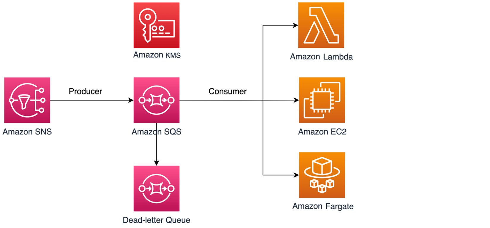

# Access management for encrypted Amazon SQS queues

with least privilege policies

You can use Amazon SQS to exchange sensitive data between applications by using server-side
encryption (SSE) integrated with [AWS Key Management Service (KMS)](../../../kms/latest/developerguide/overview.md "../../../kms/latest/developerguide/overview.md"). With the
integration of Amazon SQS and AWS KMS, you can centrally manage the keys that protect Amazon SQS, as
well as the keys that protect your other AWS resources.

Multiple AWS services can act as event sources that send events to Amazon SQS. To enable an
event source to access the encrypted Amazon SQS queue, you need to configure the queue with a
[customer-managed](../../../kms/latest/developerguide/concepts.md#customer-cmk "../../../kms/latest/developerguide/concepts.md#customer-cmk") AWS KMS key. Then, use the key policy to allow the service to
use the required AWS KMS API methods. The service also requires permissions to authenticate
access to enable the queue to send events. You can achieve this by using an Amazon SQS policy,
which is a resource-based policy that you can use to control access to the Amazon SQS queue and
its data.

The following sections provide information on how to control access to your encrypted
Amazon SQS queue through the Amazon SQS policy and the AWS KMS key policy. The policies in this guide
will help you achieve [least
privilege](../../../IAM/latest/UserGuide/best-practices.md#grant-least-privilege "../../../IAM/latest/UserGuide/best-practices.md#grant-least-privilege").

This guide also describes how resource-based policies address the [confused-deputy
problem](../../../IAM/latest/UserGuide/confused-deputy.md "../../../IAM/latest/UserGuide/confused-deputy.md") by using the [`aws:SourceArn`](../../../IAM/latest/UserGuide/reference_policies_condition-keys.md#condition-keys-sourcearn "../../../IAM/latest/UserGuide/reference_policies_condition-keys.md#condition-keys-sourcearn"), [`aws:SourceAccount`](../../../IAM/latest/UserGuide/reference_policies_condition-keys.md#condition-keys-sourceaccount "../../../IAM/latest/UserGuide/reference_policies_condition-keys.md#condition-keys-sourceaccount"), and [`aws:PrincipalOrgID`](../../../IAM/latest/UserGuide/reference_policies_condition-keys.md#condition-keys-principalorgid "../../../IAM/latest/UserGuide/reference_policies_condition-keys.md#condition-keys-principalorgid") global IAM condition context keys.

###### Topics

- [Overview](#sqs-least-privilege-overview "#sqs-least-privilege-overview")
- [Least privilege key policy for
  Amazon SQS](#sqs-least-privilege-use-case "#sqs-least-privilege-use-case")
- [Amazon SQS policy statements for the dead-letter
  queue](#sqs-policy-dlq "#sqs-policy-dlq")
- [Prevent the cross-service confused
  deputy problem](#sqs-confused-deputy-prevention "#sqs-confused-deputy-prevention")
- [Use IAM Access Analyzer to review cross-account
  access](#sqs-cross-account-findings "#sqs-cross-account-findings")

## Overview

In this topic, we will walk you through a common use case to illustrate how you can
build the key policy and the Amazon SQS queue policy. This use case is shown in the following
image.



In this example, the message producer is an [Amazon Simple Notification Service (SNS)](../../../sns/latest/dg/welcome.md "../../../sns/latest/dg/welcome.md") topic, which is configured
to fanout messages to your encrypted Amazon SQS queue. The message consumer is a compute
service, such as an [AWS Lambda](../../../lambda/latest/dg/welcome.md "../../../lambda/latest/dg/welcome.md") function, an [Amazon Elastic Compute Cloud (EC2)](../../../AWSEC2/latest/UserGuide/concepts.md "../../../AWSEC2/latest/UserGuide/concepts.md") instance, or an
[AWS Fargate](../../../AmazonECS/latest/developerguide/AWS_Fargate.md "../../../AmazonECS/latest/developerguide/AWS_Fargate.md") container. Your Amazon SQS queue is then configured to send failed
messages to a [Dead-letter Queue (DLQ)](sqs-dead-letter-queues.md "sqs-dead-letter-queues.md"). This is useful for debugging your application or
messaging system because DLQs let you isolate unconsumed messages to determine why their
processing didn't succeed. In the solution defined in this topic, a compute service such
as a Lambda function is used to process messages stored in the Amazon SQS queue. If the
message consumer is located in a virtual private cloud (VPC), the [DenyReceivingIfNotThroughVPCE](#sqs-restrict-message-to-endpoint "#sqs-restrict-message-to-endpoint") policy statement included in
this guide lets you restrict message reception to that specific VPC.

###### Note

This guide contains only the required IAM permissions in the form of policy
statements. To construct the policy, you need to add the statements to your Amazon SQS
policy or your AWS KMS key policy. This guide doesn't provide instructions on how to
create the Amazon SQS queue or the AWS KMS key. For instructions on how to create these
resources, see [Creating an Amazon SQS queue](creating-sqs-standard-queues.md#step-create-standard-queue "creating-sqs-standard-queues.md#step-create-standard-queue") and [Creating
keys](../../../kms/latest/developerguide/create-keys.md "../../../kms/latest/developerguide/create-keys.md").

The Amazon SQS policy defined in this guide doesn’t support redriving messages directly
to the same or a different Amazon SQS queue.

## Least privilege key policy for

Amazon SQS

In this section, we describe the required least privilege permissions in AWS KMS for the
customer-managed key that you use to encrypt your Amazon SQS queue. With these permissions,
you can limit access to only the intended entities while implementing least privilege.
The key policy must consist of the following policy statements, which we describe in
detail below:

- [Grant administrator permissions
  to the AWS KMS key](#sqs-use-case-kms-admin-permissions "#sqs-use-case-kms-admin-permissions")
- [Grant read-only access to the
  key metadata](#sqs-use-case-read-only-permissions "#sqs-use-case-read-only-permissions")
- [Grant Amazon SNS KMS
  permissions to Amazon SNS to publish messages to the queue](#sqs-use-case-publish-messages-permissions "#sqs-use-case-publish-messages-permissions")
- [Allow consumers to
  decrypt messages from the queue](#sqs-use-case-decrypt-messages-permissions "#sqs-use-case-decrypt-messages-permissions")

### Grant administrator permissions

to the AWS KMS key

To create an AWS KMS key, you need to provide AWS KMS administrator permissions to the
IAM role that you use to deploy the AWS KMS key. These administrator permissions are
defined in the following `AllowKeyAdminPermissions` policy statement.
When you add this statement to your AWS KMS key policy, make sure to replace
`<admin-role ARN>` with the Amazon Resource Name
(ARN) of the IAM role used to deploy the AWS KMS key, manage the AWS KMS key, or both.
This can be the IAM role of your deployment pipeline, or the [administrator role for your organization](../../../organizations/latest/userguide/orgs_manage_accounts_access.md "../../../organizations/latest/userguide/orgs_manage_accounts_access.md") in your [AWS Organizations.](https://aws.amazon.com/organizations/ "https://aws.amazon.com/organizations/")

```
{
  "Sid": "AllowKeyAdminPermissions",
  "Effect": "Allow",
  "Principal": {
    "AWS": [
      "`<admin-role ARN>`"
    ]
  },
  "Action": [
    "kms:Create*",
    "kms:Describe*",
    "kms:Enable*",
    "kms:List*",
    "kms:Put*",
    "kms:Update*",
    "kms:Revoke*",
    "kms:Disable*",
    "kms:Get*",
    "kms:Delete*",
    "kms:TagResource",
    "kms:UntagResource",
    "kms:ScheduleKeyDeletion",
    "kms:CancelKeyDeletion"
  ],
  "Resource": "*"
}
```

###### Note

In an AWS KMS key policy, the value of the `Resource` element needs
to be `*`, which means "this AWS KMS key". The asterisk
(`*`) identifies the AWS KMS key to which the key policy is
attached.

### Grant read-only access to the

key metadata

To grant other IAM roles read-only access to your key metadata, add the
`AllowReadAccessToKeyMetaData` statement to your key policy. For
example, the following statement lets you list all of the AWS KMS keys in your account
for auditing purposes. This statement grants the AWS root user read-only access to
the key metadata. Therefore, any IAM principal in the account can have access to
the key metadata when their identity-based policies have the permissions listed in
the following statement: `kms:Describe*`, `kms:Get*`, and
`kms:List*`. Make sure to replace
`<account-ID>` with your own information.

```
{
  "Sid": "AllowReadAcesssToKeyMetaData",
  "Effect": "Allow",
  "Principal": {
    "AWS": [
      "arn:aws:iam::`<accountID>`:root"
    ]
  },
  "Action": [
    "kms:Describe*",
    "kms:Get*",
    "kms:List*"
  ],
  "Resource": "*"
}

```

### Grant Amazon SNS KMS

permissions to Amazon SNS to publish messages to the queue

To allow your Amazon SNS topic to publish messages to your encrypted Amazon SQS queue, add
the `AllowSNSToSendToSQS` policy statement to your key policy. This
statement grants Amazon SNS permissions to use the AWS KMS key to publish to your Amazon SQS
queue. Make sure to replace `<account-ID>` with your own
information.

###### Note

The `Condition` in the statement limits access to only the Amazon SNS
service in the same AWS account.

```
{
  "Sid": "AllowSNSToSendToSQS",
  "Effect": "Allow",
  "Principal": {
    "Service": [
      "sns.amazonaws.com"
    ]
  },
  "Action": [
    "kms:Decrypt",
    "kms:GenerateDataKey"
  ],
  "Resource": "*",
  "Condition": {
    "StringEquals": {
      "aws:SourceAccount": "`<account-id>`"
    }
  }
}
```

### Allow consumers to

decrypt messages from the queue

The following `AllowConsumersToReceiveFromTheQueue` statement grants
the Amazon SQS message consumer the required permissions to decrypt messages received
from the encrypted Amazon SQS queue. When you attach the policy statement, replace
`<consumer's runtime role ARN>` with the IAM
runtime role ARN of the message consumer.

```
{
  "Sid": "AllowConsumersToReceiveFromTheQueue",
  "Effect": "Allow",
  "Principal": {
    "AWS": [
      "`<consumer's execution role ARN>`"
    ]
  },
  "Action": [
    "kms:Decrypt"
  ],
  "Resource": "*"
}
```

### Least privilege Amazon SQS policy

This section walks you through the least privilege Amazon SQS queue policies for the
use case covered by this guide (for example, Amazon SNS to Amazon SQS). The defined policy is
designed to prevent unintended access by using a mix of both `Deny` and
`Allow` statements. The `Allow` statements grant access to
the intended entity or entities. The `Deny` statements prevent other
unintended entities from accessing the Amazon SQS queue, while excluding the intended
entity within the policy condition.

The Amazon SQS policy includes the following statements, which we describe in detail
below:

- [Restrict Amazon SQS management
  permissions](#sqs-use-case-restrict-permissions "#sqs-use-case-restrict-permissions")
- [Restrict Amazon SQS queue
  actions from the specified organization](#sqs-use-case-restrict-permissions-from-org "#sqs-use-case-restrict-permissions-from-org")
- [Grant Amazon SQS permissions to
  consumers](#sqs-use-grant-consumer-permissions "#sqs-use-grant-consumer-permissions")
- [Enforce encryption in transit](#sqs-encryption-in-transit "#sqs-encryption-in-transit")
- [Restrict message transmission
  to a specific Amazon SNS topic](#sqs-restrict-transmission-to-topic "#sqs-restrict-transmission-to-topic")
- [(Optional) Restrict message
  reception to a specific VPC endpoint](#sqs-restrict-message-to-endpoint "#sqs-restrict-message-to-endpoint")

### Restrict Amazon SQS management

permissions

The following `RestrictAdminQueueActions` policy statement restricts
the Amazon SQS management permissions to only the IAM role or roles that you use to
deploy the queue, manage the queue, or both. Make sure to replace the
`<placeholder values>` with your own information.
Specify the ARN of the IAM role used to deploy the Amazon SQS queue, as well as the
ARNs of any administrator roles that should have Amazon SQS management permissions.

```
{
  "Sid": "RestrictAdminQueueActions",
  "Effect": "Deny",
  "Principal": {
    "AWS": "*"
  },
  "Action": [
    "sqs:AddPermission",
    "sqs:DeleteQueue",
    "sqs:RemovePermission",
    "sqs:SetQueueAttributes"
  ],
  "Resource": "`<SQS Queue ARN>`",
  "Condition": {
    "StringNotLike": {
      "aws:PrincipalARN": [
        "arn:aws:iam::`<account-id>`:role/`<deployment-role-name>`",
        "`<admin-role ARN>`"
      ]
    }
  }
}
```

### Restrict Amazon SQS queue

actions from the specified organization

To help protect your Amazon SQS resources from external access (access by an entity
outside of your [AWS
organization](../../../organizations/latest/userguide/orgs_introduction.md "../../../organizations/latest/userguide/orgs_introduction.md")), use the following statement. This statement limits Amazon SQS
queue access to the organization that you specify in the `Condition`.
Make sure to replace `<SQS queue ARN>` with the ARN of
the IAM role used to deploy the Amazon SQS queue; and the
`<org-id>`, with your organization ID.

```
{
  "Sid": "DenyQueueActionsOutsideOrg",
  "Effect": "Deny",
  "Principal": {
    "AWS": "*"
  },
  "Action": [
    "sqs:AddPermission",
    "sqs:ChangeMessageVisibility",
    "sqs:DeleteQueue",
    "sqs:RemovePermission",
    "sqs:SetQueueAttributes",
    "sqs:ReceiveMessage"
  ],
  "Resource": "`<SQS queue ARN>`",
  "Condition": {
    "StringNotEquals": {
      "aws:PrincipalOrgID": [
        "`<org-id>`"
      ]
    }
  }
}
```

### Grant Amazon SQS permissions to

consumers

To receive messages from the Amazon SQS queue, you need to provide the message consumer
with the necessary permissions. The following policy statement grants the consumer,
which you specify, the required permissions to consume messages from the Amazon SQS
queue. When adding the statement to your Amazon SQS policy, make sure to replace
`<consumer's IAM runtime role ARN>` with the ARN
of the IAM runtime role used by the consumer; and `<SQS queue
 ARN>`, with the ARN of the IAM role used to deploy the Amazon SQS
queue.

```
{
  "Sid": "AllowConsumersToReceiveFromTheQueue",
  "Effect": "Allow",
  "Principal": {
    "AWS": "`<consumer's IAM execution role ARN>`"
  },
  "Action": [
    "sqs:ChangeMessageVisibility",
    "sqs:DeleteMessage",
    "sqs:GetQueueAttributes",
    "sqs:ReceiveMessage"
  ],
  "Resource": "`<SQS queue ARN>`"
}


```

To prevent other entities from receiving messages from the Amazon SQS queue, add the
`DenyOtherConsumersFromReceiving` statement to the Amazon SQS queue
policy. This statement restricts message consumption to the consumer that you
specify—allowing no other consumers to have access, even when their
identity-permissions would grant them access. Make sure to replace
`<SQS queue ARN>` and `<consumer’s
 runtime role ARN>` with your own information.

```
{
  "Sid": "DenyOtherConsumersFromReceiving",
  "Effect": "Deny",
  "Principal": {
    "AWS": "*"
  },
  "Action": [
    "sqs:ChangeMessageVisibility",
    "sqs:DeleteMessage",
    "sqs:ReceiveMessage"
  ],
  "Resource": "`<SQS queue ARN>`",
  "Condition": {
    "StringNotLike": {
      "aws:PrincipalARN": "`<consumer's execution role ARN>`"
    }
  }
}

```

### Enforce encryption in transit

The following `DenyUnsecureTransport` policy statement enforces the
consumers and producers to use secure channels (TLS connections) to send and receive
messages from the Amazon SQS queue. Make sure to replace `<SQS queue
 ARN>` with the ARN of the IAM role used to deploy the Amazon SQS
queue.

```
{
  "Sid": "DenyUnsecureTransport",
  "Effect": "Deny",
  "Principal": {
    "AWS": "*"
  },
  "Action": [
    "sqs:ReceiveMessage",
    "sqs:SendMessage"
  ],
  "Resource": "`<SQS queue ARN>`",
  "Condition": {
    "Bool": {
      "aws:SecureTransport": "false"
    }
  }
}


```

### Restrict message transmission

to a specific Amazon SNS topic

The following `AllowSNSToSendToTheQueue` policy statement allows the
specified Amazon SNS topic to send messages to the Amazon SQS queue. Make sure to replace
`<SQS queue ARN>` with the ARN of the IAM role
used to deploy the Amazon SQS queue; and `<SNS topic ARN>`,
with the Amazon SNS topic ARN.

```
{
  "Sid": "AllowSNSToSendToTheQueue",
  "Effect": "Allow",
  "Principal": {
    "Service": "sns.amazonaws.com"
  },
  "Action": "sqs:SendMessage",
  "Resource": "`<SQS queue ARN>`",
  "Condition": {
    "ArnLike": {
      "aws:SourceArn": "`<SNS topic ARN>`"
    }
  }
}

```

The following `DenyAllProducersExceptSNSFromSending` policy statement
prevents other producers from sending messages to the queue. Replace
`<SQS queue ARN>` and `<SNS topic
 ARN>` with your own information.

```
{
  "Sid": "DenyAllProducersExceptSNSFromSending",
  "Effect": "Deny",
  "Principal": {
    "AWS": "*"
  },
  "Action": "sqs:SendMessage",
  "Resource": "`<SQS queue ARN>`",
  "Condition": {
    "ArnNotLike": {
      "aws:SourceArn": "`<SNS topic ARN>`"
    }
  }
}


```

### (Optional) Restrict message

reception to a specific VPC endpoint

To restrict the receipt of messages to only a specific [VPC
endpoint](https://aws.amazon.com/about-aws/whats-new/2018/12/amazon-sqs-vpc-endpoints-aws-privatelink/ "https://aws.amazon.com/about-aws/whats-new/2018/12/amazon-sqs-vpc-endpoints-aws-privatelink/"), add the following policy statement to your Amazon SQS queue policy.
This statement prevents a message consumer from receiving messages from the queue
unless the messages are from the desired VPC endpoint. Replace `<SQS
 queue ARN>` with the ARN of the IAM role used to deploy the Amazon SQS
queue; and `<vpce_id>` with the ID of the VPC
endpoint.

```
{
  "Sid": "DenyReceivingIfNotThroughVPCE",
  "Effect": "Deny",
  "Principal": "*",
  "Action": [
    "sqs:ReceiveMessage"
  ],
  "Resource": "`<SQS queue ARN>`",
  "Condition": {
    "StringNotEquals": {
      "aws:sourceVpce": "`<vpce id>`"
    }
  }
}
```

## Amazon SQS policy statements for the dead-letter

queue

Add the following policy statements, identified by their statement ID, to your DLQ
access policy:

- `RestrictAdminQueueActions`
- `DenyQueueActionsOutsideOrg`
- `AllowConsumersToReceiveFromTheQueue`
- `DenyOtherConsumersFromReceiving`
- `DenyUnsecureTransport`

In addition to adding the preceding policy statements to your DLQ access policy, you
should also add a statement to restrict message transmission to Amazon SQS queues, as
described in the following section.

### Restrict message transmission to

Amazon SQS queues

To restrict access to only Amazon SQS queues from the same account, add the following
`DenyAnyProducersExceptSQS` policy statement to the DLQ queue policy.
This statement doesn't limit message transmission to a specific queue because you
need to deploy the DLQ before you create the main queue, so you won't know the Amazon SQS
ARN when you create the DLQ. If you need to limit access to only one Amazon SQS queue,
modify the `aws:SourceArn` in the `Condition` with the ARN of
your Amazon SQS source queue when you know it.

```
{
  "Sid": "DenyAnyProducersExceptSQS",
  "Effect": "Deny",
  "Principal": {
    "AWS": "*"
  },
  "Action": "sqs:SendMessage",
  "Resource": "`<SQS DLQ ARN>`",
  "Condition": {
    "ArnNotLike": {
      "aws:SourceArn": "arn:aws:sqs:`<region>`:`<account-id>`:*"
    }
  }
}

```

###### Important

The Amazon SQS queue policies defined in this guide don't restrict the
`sqs:PurgeQueue` action to a certain IAM role or roles. The
`sqs:PurgeQueue` action enables you to delete all messages in the
Amazon SQS queue. You can also use this action to make changes to the message format
without replacing the Amazon SQS queue. When debugging an application, you can clear
the Amazon SQS queue to remove potentially erroneous messages. When testing the
application, you can drive a high message volume through the Amazon SQS queue and
then purge the queue to start fresh before entering production. The reason for
not restricting this action to a certain role is that this role might not be
known when deploying the Amazon SQS queue. You will need to add this permission to
the role’s identity-based policy to be able to purge the queue.

## Prevent the cross-service confused

deputy problem

The [confused deputy problem](../../../IAM/latest/UserGuide/confused-deputy.md "../../../IAM/latest/UserGuide/confused-deputy.md") is a security issue where an entity that doesn't
have permission to perform an action can coerce a more privileged entity to perform the
action. To prevent this, AWS provides tools that help you protect your account if you
provide third parties (known as cross-account) or other AWS services (known as
cross-service) access to resources in your account. The policy statements in this
section can help you prevent the cross-service confused deputy problem.

Cross-service impersonation can occur when one service (the calling service) calls
another service (the called service). The calling service can be manipulated to use its
permissions to act on another customer's resources in a way it shouldn’t otherwise have
permission to access. To help protect against this issue, the resource-based policies
defined in this post use the [`aws:SourceArn`](../../../IAM/latest/UserGuide/reference_policies_condition-keys.md#condition-keys-sourcearn "../../../IAM/latest/UserGuide/reference_policies_condition-keys.md#condition-keys-sourcearn"), [`aws:SourceAccount`](../../../IAM/latest/UserGuide/reference_policies_condition-keys.md#condition-keys-sourceaccount "../../../IAM/latest/UserGuide/reference_policies_condition-keys.md#condition-keys-sourceaccount"), and [`aws:PrincipalOrgID`](../../../IAM/latest/UserGuide/reference_policies_condition-keys.md#condition-keys-principalorgid "../../../IAM/latest/UserGuide/reference_policies_condition-keys.md#condition-keys-principalorgid") global IAM condition context keys.
This limits the permissions that a service has to a specific resource, a specific
account, or a specific organization in AWS Organizations.

## Use IAM Access Analyzer to review cross-account

access

You can use [AWS IAM Access Analyzer](../../../IAM/latest/UserGuide/what-is-access-analyzer.md "../../../IAM/latest/UserGuide/what-is-access-analyzer.md")
to review your Amazon SQS queue policies and AWS KMS key policies and alert you when an Amazon SQS
queue or a AWS KMS key grants access to an external entity. IAM Access Analyzer helps identify
[resources](../../../IAM/latest/UserGuide/access-analyzer-resources.md "../../../IAM/latest/UserGuide/access-analyzer-resources.md") in your
organization and accounts that are shared with an entity outside the zone of trust. This
zone of trust can be an AWS account or the organization within AWS Organizations
that you specify when you enable IAM Access Analyzer.

IAM Access Analyzer identifies resources shared with external principals by using
logic-based reasoning to analyze the resource-based policies in your AWS environment.
For each instance of a resource shared outside of your zone of trust, Access Analyzer
generates a finding. [Findings](../../../IAM/latest/UserGuide/access-analyzer-findings.md "../../../IAM/latest/UserGuide/access-analyzer-findings.md") include
information about the access and the external principal granted to it. Review the
findings to determine whether the access is intended and safe, or whether the access is
unintended and a security risk. For any unintended access, review the affected policy
and fix it. Refer to this [blog post](https://aws.amazon.com/blogs/aws/identify-unintended-resource-access-with-aws-identity-and-access-management-iam-access-analyzer/ "https://aws.amazon.com/blogs/aws/identify-unintended-resource-access-with-aws-identity-and-access-management-iam-access-analyzer/") for more information on how AWS IAM Access Analyzer identifies
unintended access to your AWS resources.

For more information on AWS IAM Access Analyzer, see the [AWS IAM Access Analyzer
documentation](../../../IAM/latest/UserGuide/what-is-access-analyzer.md "../../../IAM/latest/UserGuide/what-is-access-analyzer.md").
