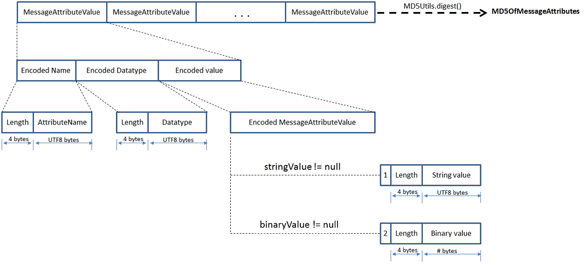

# Message metadata for Amazon SQS

Use message attributes to add custom metadata to Amazon SQS messages for your applications. Use
message system attributes to store metadata for integration with other AWS services, such
as AWS X-Ray.

## Amazon SQS message attributes

Amazon SQS allows you to include structured metadata (such as timestamps, geospatial data, signatures, and identifiers) with messages using _message attributes_. Each message can have up to 10
attributes. Message attributes are optional and separate from the message body (however,
they are sent alongside it). Your consumer can use message attributes to handle a
message in a particular way without having to process the message body first. For
information about sending messages with attributes using the Amazon SQS console, see [Sending a message with attributes
using Amazon SQS](sqs-using-send-message-with-attributes.md "sqs-using-send-message-with-attributes.md").

###### Note

Don't confuse message attributes with _message system
attributes_: Whereas you can use message attributes to attach custom
metadata to Amazon SQS messages for your applications, you can use [message system attributes](#sqs-message-system-attributes "#sqs-message-system-attributes") to
store metadata for other AWS services, such as AWS X-Ray.

###### Topics

- [Message attribute components](#message-attribute-components "#message-attribute-components")
- [Message attribute data types](#message-attribute-data-types "#message-attribute-data-types")
- [Calculating the MD5
  message digest for message attributes](#sqs-attributes-md5-message-digest-calculation "#sqs-attributes-md5-message-digest-calculation")

### Message attribute components

###### Important

All components of a message attribute are included in the 1 MiB message size
restriction.

The `Name`, `Type`, `Value`, and the message
body must not be empty or null.

Each message attribute consists of the following components:

- **Name** – The message attribute name
  can contain the following characters: `A`-`Z`,
  `a`-`z`, `0`-`9`, underscore
  (`_`), hyphen (`-`), and period (`.`).
  The following restrictions apply:
  - Can be up to 256 characters long
  - Can't start with `AWS.` or `Amazon.` (or any
    casing variations)
  - Is case-sensitive
  - Must be unique among all attribute names for the message
  - Must not start or end with a period
  - Must not have periods in a sequence

- **Type** – The message attribute data
  type. Supported types include `String`, `Number`, and
  `Binary`. You can also add custom information for any data
  type. The data type has the same restrictions as the message body (for more
  information, see `SendMessage` in the
  _Amazon Simple Queue Service API Reference_). In addition, the following
  restrictions apply:
  - Can be up to 256 characters long
  - Is case-sensitive

- **Value** – The message attribute
  value. For `String` data types, the attribute values has the same
  restrictions as the message body.

### Message attribute data types

Message attribute data types instruct Amazon SQS how to handle the corresponding
message attribute values. For example, if the type is `Number`, Amazon SQS
validates numerical values.

Amazon SQS supports the logical data types `String`, `Number`,
and `Binary` with optional custom data type labels with the format
`.custom-data-type`

- **String** – `String`
  attributes can store Unicode text using any valid XML characters.
- **Number** – `Number`
  attributes can store positive or negative numerical values. A number can
  have up to 38 digits of precision, and it can be between 10^-128 and
  10^+126.

###### Note

Amazon SQS removes leading and trailing zeroes.

- **Binary** – Binary attributes can
  store any binary data such as compressed data, encrypted data, or
  images.
- **Custom** – To create a custom data
  type, append a custom-type label to any data type. For example:
  - `Number.byte`, `Number.short`,
    `Number.int`, and `Number.float` can help
    distinguish between number types.
  - `Binary.gif` and `Binary.png` can help
    distinguish between file types.

###### Note

Amazon SQS doesn't interpret, validate, or use the appended data.

The custom-type label has the same restrictions as the message
body.

### Calculating the MD5

message digest for message attributes

If you use the AWS SDK for Java, you can skip this section. The
`MessageMD5ChecksumHandler` class of the SDK for Java supports MD5 message
digests for Amazon SQS message attributes.

If you use either the Query API or one of the AWS SDKs that doesn't support MD5
message digests for Amazon SQS message attributes, you must use the following guidelines
to perform the MD5 message digest calculation.

###### Note

Always include custom data type suffixes in the MD5 message-digest calculation.

#### Overview

The following is an overview of the MD5 message digest calculation
algorithm:

1. Sort all message attributes by name in ascending order.
2. Encode the individual parts of each attribute (`Name`,
   `Type`, and `Value`) into a buffer.
3. Compute the message digest of the entire buffer.

The following diagram shows the encoding of the MD5 message digest for a
single message attribute:

#### To encode a single Amazon SQS message attribute

1. Encode the name: the length (4 bytes) and the UTF-8 bytes of the
   name.
2. Encode the data type: the length (4 bytes) and the UTF-8 bytes of the
   data type.
3. Encode the transport type (`String` or `Binary`)
   of the value (1 byte).

###### Note

The logical data types `String` and `Number`
use the `String` transport type.

The logical data type `Binary` uses the
`Binary` transport type.

    1. For the `String` transport type, encode 1.
    2. For the `Binary` transport type, encode 2.

4. Encode the attribute value.
   1. For the `String` transport type, encode the
      attribute value: the length (4 bytes) and the UTF-8 bytes of the
      value.
   2. For the `Binary` transport type, encode the
      attribute value: the length (4 bytes) and the raw bytes of the
      value.

## Amazon SQS message system attributes

Whereas you can use [message attributes](#sqs-message-attributes "#sqs-message-attributes")
to attach custom metadata to Amazon SQS messages for your applications, you can use
_message system attributes_ to store metadata for other AWS
services, such as AWS X-Ray. For more information, see the
`MessageSystemAttribute` request parameter of the `SendMessage` and
`SendMessageBatch` API actions, the `AWSTraceHeader`
attribute of the `ReceiveMessage` API action, and the `MessageSystemAttributeValue` data type in the
_Amazon Simple Queue Service API Reference_.

Message system attributes are structured exactly like message attributes, with the
following exceptions:

- Currently, the only supported message system attribute is
  `AWSTraceHeader`. Its type must be `String` and its
  value must be a correctly formatted AWS X-Ray trace header string.
- The size of a message system attribute doesn't count towards the total size of
  a message.
