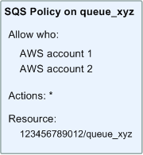
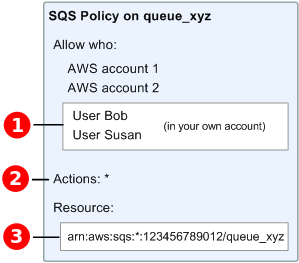

# Overview of managing access in

Amazon SQS

Every AWS resource is owned by an AWS account, and permissions to create or access
a resource are governed by permissions policies. An account administrator can attach
permissions policies to IAM identities (users, groups, and roles), and some services
(such as Amazon SQS) also support attaching permissions policies to resources.

###### Note

An _account administrator_ (or administrator user) is a user
with administrative privileges. For more information, see [IAM Best Practices](../../../IAM/latest/UserGuide/best-practices.md "../../../IAM/latest/UserGuide/best-practices.md") in the
_IAM User Guide_.

When granting permissions, you specify what users get permissions, the resource they
get permissions for, and the specific actions that you want to allow on the
resource.

## Amazon Simple Queue Service resource and

operations

In Amazon SQS, the only resource is the _queue_. In a policy, use an
Amazon Resource Name (ARN) to identify the resource that the policy applies to. The
following resource has a unique ARN associated with it:

| Resource type | ARN format                                       |
| ------------- | ------------------------------------------------ | -------------------------------------------------------------------------------------------------------------------------------------------------------------------------------------------------------------------------------------------------------------------------------------------------------------------------------------------------------------------------------------------------------------------------------------------------------------------------------------------------------------------------------------------------------------------------------------------------------------------------------------------------------------------------------------------------------------------------------------------------------------------------------------------------------------------------------------------------------------------------------------------------------------------------------------------------------------------------------------------------------------------------------------------------------------------------------------------------------------------------------------------------------------------------------------------------------------------------------------------------------------------------------------------------------------------------------------------------------------------------------------------------------------------------------------------------------------------------------------------------------------------------------------------------------------------------------------------------------------------------------------------------------------------------------------------------------------------------------------------------------------------------------------------------------------------------------------------------------------------------------------------------------------------------------------------------------------------------------------------------------------------------------------------------------------------------------------------------------------------------------------------------------------------------------------------------------------------------------------------------------------------------------------------------------------------------------------------------------------------------------------------------------------------------------------------------------------------------------------------------------------------------------------------------------------------------------------------------------------------------------------------------------------------------------------------------------------------------------------------------------------------------------------------------------------------------------------------------------------------------------------------------------------------------------------------------------------------------------------------------------------------------------------------------------------------------------------------------------------------------------------------------------------------------------------------------------------------------------------------------------------------------------------------------------------------------------------------------------------------------------------------------------------------------------------------------------------------------------------------------------------------------------------------------------------------------------------------------------------------------------------------------------------------------------------------------------------------------------------------------------------------------------------------------------------------------------------------------------------------------------------------------------------------------------------------------------------------------------------------------------------------------------------------------------------------------------------------------------------------------------------------------------------------------------------------------------------------------------------------------------------------------------------------------------------------------------------------------------------------------------------------------------------------------------------------------------------------------------------------------------------------------------------------------------------------------------------------------------------------------------------------------------------------------------------------------------------------------------------------------------------------------------------------------------------------------------------------------------------------------------------------------------------------------------------------------------------------------------------------------------------------------------------------------------------------------------------------------------------------------------------------------------------------------------------------------------------------------------------------------------------------------------------------------------------------------------------------------------------------------------------------------------------------------------------------------------------------------------------------------------------------------------------------------------------------------------------------------------------------------------------------------------------------------------------------------------------------------------------------------------------------------------------------------------------------------------------------------------------------------------------------------------------------------------------------------------------------------------------------------------------------------------------------------------------------------------------------------------------------------------------------------------------------------------------------------------------------------------------------------------------------------------------------------------------------------------------------------------------------------------------------------------------------------------------------------------------------------------------------------------------------------------------------------------------------------------------------------------------------------------------------------------------------------------------------------------------------------------------------------------------------------------------------------------------------------------------------------------------------------------------------------------------------------------------------------------------------------------------------------------------------------------------------------------------------------------------------------------------------------------------------------------------------------------------------------------------------------------------------------------------------------------------------------------------------------------------------------------------------------------------------------------------------------------------------------------------------------------------------------------------------------------------------------------------------------------------------------------------------------------------------------------------------------------------------------------------------------------------------------------------------------------------------------------------------------------------------------------------------------------------------------------------------------------------------------------------------------------------------------------------------------------------------------------------------------------------------------------------------------------------------------------------------------------------------------------------------------------------------------------------------------------------------------------------------------------------------------------------------------------------------------------------------------------------------------------------------------------------------------------------------------------------------------------------------------------------------------------------------------------------------------------------------------------------------------------------------------------------------------------------------------------------------------------------------------------------------------------------------------------------------------------------------------------------------------------------------------------------------------------------------------------------------------------------------------------------------------------------------------------------------------------------------------------------------------------------------------------------------------------------------------------------------------------------------------------------------------------------------------------------------------------------------------------------------------------------------------------------------------------------------------------------------------------------------------------------------------------------------------------------------------------------------------------------------------------------------------------------------------------------------------------------------------------------------------------------------------------------------------------------------------------------------------------------------------------------------------------------------------------------------------------------------------------------------------------------------------------------------------------------------------------------------------------------------------------------------------------------------------------------------------------------------------------------------------------------------------------------------------------------------------------------------------------------------------------------------------------------------------------------------------------------------------------------------------------------------------------------------------------------------------------------------------------------------------------------------------------------------------------------------------------------------------------------------------------------------------------------------------------------------------------------------------------------------------------------------------------------------------------------------------------------------------------------------------------------------------------------------------------------------------------------------------------------------------------------------------------------------------------------------------------------------------------------------------------------------------------------------------------------------------------------------------------------------------------------------------------------------------------------------------------------------------------------------------------------------------------------------------------------------------------------------------------------------------------------------------------------------------------------------------------------------------------------------------------------------------------------------------------------------------------------------------------------------------------------------------------------------------------------------------------------------------------------------------------------------------------------------------------------------------------------------------- |
| Queue         | `arn:aws:sqs:`region`:`account_id`:`queue_name`` | The following are examples of the ARN format for queues:  • An ARN for a queue named `my_queue` in the US East (Ohio) region, belonging to AWS Account 123456789012: `arn:aws:sqs:us-east-2:123456789012:my_queue`  • An ARN for a queue named `my_queue` in each of the different regions that Amazon SQS supports: `arn:aws:sqs:*:123456789012:my_queue`  • An ARN that uses `*` or `?` as a wildcard for the queue name. In the following examples, the ARN matches all queues prefixed with `my_prefix_`: `arn:aws:sqs:*:123456789012:my_prefix_*` You can get the ARN value for an existing queue by calling the [`GetQueueAttributes`](../APIReference/API_GetQueueAttributes.md "../APIReference/API_GetQueueAttributes.md") action. The value of the `QueueArn` attribute is the ARN of the queue. For more information about ARNs, see [IAM ARNs](../../../IAM/latest/UserGuide/reference_identifiers.md#identifiers-arns "../../../IAM/latest/UserGuide/reference_identifiers.md#identifiers-arns") in the _IAM User Guide_. Amazon SQS provides a set of actions that work with the queue resource. For more information, see [Amazon SQS API permissions: Actions and resource reference](sqs-api-permissions-reference.md "sqs-api-permissions-reference.md"). ## Understanding resource ownership The AWS account owns the resources that are created in the account, regardless of who created the resources. Specifically, the resource owner is the AWS account of the _principal entity_ (that is, the root account, a user , or an IAM role) that authenticates the resource creation request. The following examples illustrate how this works:  • If you use the root account credentials of your AWS account to create an Amazon SQS queue, your AWS account is the owner of the resource (in Amazon SQS, the resource is the Amazon SQS queue).  • If you create a user in your AWS account and grant permissions to create a queue to the user, the user can create the queue. However, your AWS account (to which the user belongs) owns the queue resource.  • If you create an IAM role in your AWS account with permissions to create an Amazon SQS queue, anyone who can assume the role can create a queue. Your AWS account (to which the role belongs) owns the queue resource. ## Managing access to resources A _permissions policy_ describes the permissions granted to accounts. The following section explains the available options for creating permissions policies. ###### Note This section discusses using IAM in the context of Amazon SQS. It doesn't provide detailed information about the IAM service. For complete IAM documentation, see [What is IAM?](../../../IAM/latest/UserGuide/introduction.md "../../../IAM/latest/UserGuide/introduction.md") in the _IAM User Guide_. For information about IAM policy syntax and descriptions, see [AWS IAM Policy Reference](../../../IAM/latest/UserGuide/reference_policies.md "../../../IAM/latest/UserGuide/reference_policies.md") in the _IAM User Guide_. Policies attached to an IAM identity are referred to as _identity-based_ policies (IAM policies) and policies attached to a resource are referred to as _resource-based_ policies. ### Identity-based policies There are two ways to give your users permissions to your Amazon SQS queues: using the Amazon SQS policy system and using the IAM policy system. You can use either system, or both, to attach policies to users or roles. In most cases, you can achieve the same result using either system. For example, you can do the following:  • **Attach a permission policy to a user or a group in your account** – To grant user permissions to create an Amazon SQS queue, attach a permissions policy to a user or group that the user belongs to.  • **Attach a permission policy to a user in another AWS account** – You can attach a permissions policy to a user in another AWS account to allow them to interact with an Amazon SQS queue. However, cross-account permissions do not apply to the following actions: Cross-account permissions don't apply to the following actions: + `AddPermission` + `CancelMessageMoveTask` + `CreateQueue` + `DeleteQueue` + `ListMessageMoveTask` + `ListQueues` + `ListQueueTags` + `RemovePermission` + `SetQueueAttributes` + `StartMessageMoveTask` + `TagQueue` + `UntagQueue` To grant access for these actions, the user must belong to the same AWS account that owns the Amazon SQS queue.  • **Attach a permission policy to a role (grant cross-account permissions)** – To grant cross-account permissions to an SQS queue, you must combine both IAM and resource-based policies: 1. In **Account A** (which owns the queue): + Attach a **resource-based policy** to the SQS queue. This policy must explicitly grant the necessary permissions (for example, [`SendMessage`](../APIReference/API_SendMessage.md "../APIReference/API_SendMessage.md"), [`ReceiveMessage`](../APIReference/API_ReceiveMessage.md "../APIReference/API_ReceiveMessage.md")) to the principal in **Account B** (such as an IAM role). 2. In **Account A**, create an IAM role: + A **trust policy** that allows **Account B** or an AWS service to assume the role. ###### Note If you want an AWS service (such as Lambda or EventBridge) to assume the role, specify the service principal (for example, lambda.amazonaws.com) in the trust policy. + An **identity-based policy** that grants the assumed role permissions to interact with the queue. 3. In **Account B**, grant permission to assume the role in **Account A**. You must configure the queue’s access policy to allow the cross-account principal. IAM identity-based policies alone aren't sufficient for cross-account access to SQS queues. For more information about using IAM to delegate permissions, see [Access Management](../../../IAM/latest/UserGuide/access.md "../../../IAM/latest/UserGuide/access.md") in the _IAM User Guide_. While Amazon SQS works with IAM policies, it has its own policy infrastructure. You can use an Amazon SQS policy with a queue to specify which AWS Accounts have access to the queue. You can specify the type of access and conditions (for example, a condition that grants permissions to use `SendMessage`, `ReceiveMessage` if the request is made before December 31, 2010). The specific actions you can grant permissions for are a subset of the overall list of Amazon SQS actions. When you write an Amazon SQS policy and specify `*` to "allow all Amazon SQS actions," it means that a user can perform all actions in this subset. The following diagram illustrates the concept of one of these basic Amazon SQS policies that covers the subset of actions. The policy is for `queue_xyz`, and it gives AWS Account 1 and AWS Account 2 permissions to use any of the allowed actions with the specified queue. ###### Note The resource in the policy is specified as `123456789012/queue_xyz`, where `123456789012` is the AWS Account ID of the account that owns the queue.  With the introduction of IAM and the concepts of _Users_ and _Amazon Resource Names (ARNs)_, a few things have changed about SQS policies. The following diagram and table describe the changes.   For information about giving permissions to users in different accounts, see [Tutorial: Delegate Access Across AWS Accounts Using IAM Roles](../../../IAM/latest/UserGuide/tutorial_cross-account-with-roles.md "../../../IAM/latest/UserGuide/tutorial_cross-account-with-roles.md") in the _IAM User Guide_.  The subset of actions included in `*` has expanded. For a list of allowed actions, see [Amazon SQS API permissions: Actions and resource reference](sqs-api-permissions-reference.md "sqs-api-permissions-reference.md").  You can specify the resource using the Amazon Resource Name (ARN), the standard means of specifying resources in IAM policies. For information about the ARN format for Amazon SQS queues, see [Amazon Simple Queue Service resource and operations](#sqs-resource-and-operations "#sqs-resource-and-operations"). For example, according to the Amazon SQS policy in the preceding diagram, anyone who possesses the security credentials for AWS Account 1 or AWS Account 2 can access `queue_xyz`. In addition, Users Bob and Susan in your own AWS Account (with ID `123456789012`) can access the queue. Before the introduction of IAM, Amazon SQS automatically gave the creator of a queue full control over the queue (that is, access to all of the possible Amazon SQS actions on that queue). This is no longer true, unless the creator uses AWS security credentials. Any user who has permissions to create a queue must also have permissions to use other Amazon SQS actions in order to do anything with the created queues. The following is an example policy that allows a user to use all Amazon SQS actions, but only with queues whose names are prefixed with the literal string `bob_queue_`. JSON `` `{ "Version":"2012-10-17", "Statement": [{ "Effect": "Allow", "Action": "sqs:*", "Resource": "arn:aws:sqs:*:123456789012:bob_queue_*" }] }` `` For more information, see [Using policies with Amazon SQS](sqs-using-identity-based-policies.md "sqs-using-identity-based-policies.md"), and [Identities (Users, Groups, and Roles)](../../../IAM/latest/UserGuide/id.md "../../../IAM/latest/UserGuide/id.md") in the _IAM User Guide_. ## Specifying policy elements: Actions, effects, resources, and principals For each [Amazon Simple Queue Service resource](#sqs-resource-and-operations "#sqs-resource-and-operations"), the service defines a set of [actions](../APIReference/API_Operations.md "../APIReference/API_Operations.md"). To grant permissions for these actions, Amazon SQS defines a set of actions that you can specify in a policy. ###### Note Performing an action can require permissions for more than one action. When granting permissions for specific actions, you also identify the resource for which the actions are allowed or denied. The following are the most basic policy elements:  • **Resource** – In a policy, you use an Amazon Resource Name (ARN) to identify the resource to which the policy applies.  • **Action** – You use action keywords to identify resource actions that you want to allow or deny. For example, the `sqs:CreateQueue` permission allows the user to perform the Amazon Simple Queue Service `CreateQueue` action.  • **Effect** – You specify the effect when the user requests the specific action—this can be either allow or deny. If you don't explicitly grant access to a resource, access is implicitly denied. You can also explicitly deny access to a resource, which you might do to make sure that a user can't access it, even if a different policy grants access.  • **Principal** – In identity-based policies (IAM policies), the user that the policy is attached to is the implicit principal. For resource-based policies, you specify the user, account, service, or other entity that you want to receive permissions (applies to resource-based policies only). To learn more about Amazon SQS policy syntax and descriptions, see [AWS IAM Policy Reference](../../../IAM/latest/UserGuide/reference_policies.md "../../../IAM/latest/UserGuide/reference_policies.md") in the _IAM User Guide_. For a table of all Amazon Simple Queue Service actions and the resources that they apply to, see [Amazon SQS API permissions: Actions and resource reference](sqs-api-permissions-reference.md "sqs-api-permissions-reference.md"). |
