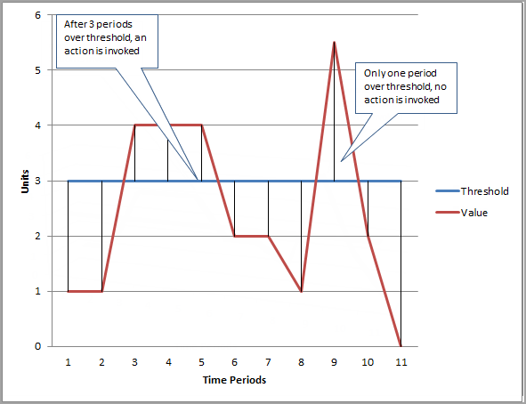

# Using Amazon CloudWatch alarms

You can create alarms that watch metrics and send notifications or automatically make
changes to the resources you are monitoring when a threshold is breached. For example, you can
monitor the CPU usage and disk reads and writes of your Amazon EC2 instances and then use that data
to determine whether you should launch additional instances to handle increased load. You can
also use this data to stop under-used instances to save money.

You can create both _metric_ and _composite_ alarms
in Amazon CloudWatch.

You can create alarms on Metrics Insights queries that use AWS resource tags to filter and
group metrics. To use tags with alarms, on the [https://console.aws.amazon.com/connect/](https://console.aws.amazon.com/connect/ "https://console.aws.amazon.com/connect/"), choose
**Settings**. On the **CloudWatch Settings** page, under
**Enable resource tags on telemetry**, choose **Enable**.
For context-aware monitoring that automatically adapts to your tagging strategy, create alarms
on Metrics Insights queries using AWS resource tags. This allows you to monitor all resources
tagged with specific applications or environments.

- A _metric alarm_ watches a single CloudWatch metric or the result of a math
  expression based on CloudWatch metrics. The alarm performs one or more actions based on the value
  of the metric or expression relative to a threshold over a number of time periods. The
  action can be sending a notification to an Amazon SNS topic, performing an Amazon EC2 action or an
  Amazon EC2 Auto Scaling action, starting an investigation in CloudWatch investigations operational investigations, or
  creating an OpsItem or incident in Systems Manager.
- A _composite alarm_ includes a rule expression that takes into
  account the alarm states of other alarms that you have created. The composite alarm goes
  into ALARM state only if all conditions of the rule are met. The alarms specified in a
  composite alarm's rule expression can include metric alarms and other composite
  alarms.

Using composite alarms can reduce alarm noise. You can create multiple metric alarms,
and also create a composite alarm and set up alerts only for the composite alarm. For
example, a composite might go into ALARM state only when all of the underlying metric alarms
are in ALARM state.

Composite alarms can send Amazon SNS notifications when they change state, and can create
investigations, Systems Manager OpsItems, or incidents when they go into ALARM state, but can't
perform EC2 actions or Amazon EC2 Auto Scaling actions.

###### Note

You can create as many alarms as you want in your AWS account.

You can add alarms to dashboards, so you can monitor and receive alerts about your AWS
resources and applications across multiple regions. After you add an alarm to a dashboard, the
alarm turns gray when it's in the `INSUFFICIENT_DATA` state and red when it's in the
`ALARM` state. The alarm is shown with no color when it's in the `OK`
state.

You also can favorite recently visited alarms from the _Favorites and
recents_ option in the CloudWatch console navigation pane. The _Favorites and
recents_ option has columns for your favorited alarms and recently visited alarms.

An alarm invokes actions only when the alarm changes state. The exception is for alarms with
Auto Scaling actions. For Auto Scaling actions, the alarm continues to invoke the action once
per minute that the alarm remains in the new state.

An alarm can watch a metric in the same account. If you have enabled cross-account
functionality in your CloudWatch console, you can also create alarms that watch metrics in other AWS
accounts. Creating cross-account composite alarms is not supported. Creating cross-account
alarms that use math expressions is supported, except that the
`ANOMALY_DETECTION_BAND`, `INSIGHT_RULE`, and `SERVICE_QUOTA`
functions are not supported for cross-account alarms.

###### Note

CloudWatch doesn't test or validate the actions that you specify, nor does it detect any
Amazon EC2 Auto Scaling or Amazon SNS errors resulting from an attempt to invoke nonexistent actions. Make sure
that your alarm actions exist.

## Metric alarm states

A metric alarm has the following possible states:

- `OK` – The metric or expression is within the defined
  threshold.
- `ALARM` – The metric or expression is outside of the defined
  threshold.
- `INSUFFICIENT_DATA` – The alarm has just started, the metric is not
  available, or not enough data is available for the metric to determine the alarm
  state.

## Evaluating an alarm

When you create an alarm, you specify three settings to enable CloudWatch to evaluate when to
change the alarm state:

- **Period** is the length of time to use to evaluate the metric or
  expression to create each individual data point for an alarm. It is expressed in
  seconds.
- **Evaluation Periods** is the number of the most recent periods, or
  data points, to evaluate when determining alarm state.
- **Datapoints to Alarm** is the number of data points within the
  Evaluation Periods that must be breaching to cause the alarm to go to the
  `ALARM` state. The breaching data points don't have to be consecutive, but
  they must all be within the last number of data points equal to **Evaluation
  Period**.

For any period of one minute or longer, an alarm is evaluated every minute and the
evaluation is based on the window of time defined by the **Period** and
**Evaluation Periods**. For example, if the **Period** is
5 minutes (300 seconds) and **Evaluation Periods** is 1, then at the end of
minute 5 the alarm evaluates based on data from minutes 1 to 5. Then at the end of minute 6,
the alarm is evaluated based on the data from minutes 2 to 6.

If the alarm period is 10 seconds, 20 seconds, or 30 seconds, the alarm is evaluated every
10 seconds.

If the number of evaluation periods multiplied by the length of each evaluation period
exceeds one day, the alarm is evaluated once per hour. For more details about how these
multi-day alarms are evaluated, see the example at the end of this section.

In the following figure, the alarm threshold for a metric alarm is set to three units.
Both **Evaluation Period** and **Datapoints to Alarm** are 3. That is, when all existing data points in the most recent three consecutive periods are
above the threshold, the alarm goes to `ALARM` state. In the figure, this happens
in the third through fifth time periods. At period six, the value dips below the threshold, so
one of the periods being evaluated is not breaching, and the alarm state changes back to
`OK`. During the ninth time period, the threshold is breached again, but for only
one period. Consequently, the alarm state remains `OK`.



When you configure **Evaluation Periods** and **Datapoints to
Alarm** as different values, you're setting an "M out of N" alarm.
**Datapoints to Alarm** is ("M") and **Evaluation
Periods** is ("N"). The evaluation interval is the number of evaluation periods
multiplied by the period length. For example, if you configure 4 out of 5 data points with a
period of 1 minute, the evaluation interval is 5 minutes. If you configure 3 out of 3 data
points with a period of 10 minutes, the evaluation interval is 30 minutes.

###### Note

If data points are missing soon after you create an alarm, and the metric was being
reported to CloudWatch before you created the alarm, CloudWatch retrieves the most recent data points
from before the alarm was created when evaluating the alarm.

### Example of evaluating a multi-day alarm

An alarm is a multi-day alarm if the number of evaluation periods multiplied by the
length of each evaluation period exceeds one day. Multi-day alarms are evaluated once per
hour. When multi-day alarms are evaluated, CloudWatch takes into account only the metrics up to
the current hour at the :00 minute when evaluating.

For example, consider an alarm that monitors a job that runs every 3 days at
10:00.

1. At 10:02, the job fails
2. At 10:03, the alarm evaluates and stays in `OK` state, because the
   evaluation considers data only up to 10:00.
3. At 11:03, the alarm considers data up to 11:00 and goes into `ALARM`
   state.
4. At 11:43, you correct the error and the job now runs successfully.
5. At 12:03, the alarm evaluates again, sees the successful job, and returns to
   `OK` state.

## Alarm actions

You can specify what actions an alarm takes when it changes state between the OK, ALARM,
and INSUFFICIENT_DATA states.

Most actions can be set for the transition into each of the three states. Except for Auto
Scaling actions, the actions happen only on state transitions, and are not performed again if
the condition persists for hours or days. You can use the fact that multiple actions are
allowed for an alarm to send an email when a threshold is breached, and then another when the
breaching condition ends. This helps you verify that your scaling or recovery actions are
triggered when expected and are working as desired.

The following are supported as alarm actions.

- Notify one or more subscribers by **using an Amazon Simple Notification Service topic**.
  Subscribers can be applications as well as persons. For more information about Amazon SNS, see
  [What is
  Amazon SNS?](../../../sns/latest/dg/welcome.md "../../../sns/latest/dg/welcome.md").
- **Invoke a Lambda function.** This is the easiest way for you to
  automate custom actions on alarm state changes.
- Alarms based on EC2 metrics can also **perform EC2 actions**, such as
  stopping, terminating, rebooting, or recovering an EC2 instance. For more information, see
  [Create alarms to stop, terminate, reboot, or recover an EC2
  instance](UsingAlarmActions.md "UsingAlarmActions.md").
- Alarms can perform actions to **scale an Auto Scaling group**. For
  more information, see [Step and simple scaling
  policies for Amazon EC2 Auto Scaling](../../../autoscaling/ec2/userguide/as-scaling-simple-step.md "../../../autoscaling/ec2/userguide/as-scaling-simple-step.md").
- Alarms can **create OpsItems in Systems Manager Ops Center or create incidents in AWS
  Systems Manager Incident Manager**. These actions are performed only when the alarm goes
  into ALARM state. For more information, see [Configuring CloudWatch to create OpsItems from alarms](../../../systems-manager/latest/userguide/OpsCenter-create-OpsItems-from-CloudWatch-Alarms.md "../../../systems-manager/latest/userguide/OpsCenter-create-OpsItems-from-CloudWatch-Alarms.md") and [Incident creation](../../../incident-manager/latest/userguide/incident-creation.md "../../../incident-manager/latest/userguide/incident-creation.md").
- An alarm can start an investigation when it goes into ALARM state. For more
  information about CloudWatch investigations, see [CloudWatch investigations](Investigations.md "Investigations.md").

Alarms also emit events to Amazon EventBridge when they change state, and you can
set up Amazon EventBridge to trigger other actions for these state changes. For more
information, see [What is
Amazon EventBridge?](../../../eventbridge/latest/userguide/eb-what-is.md "../../../eventbridge/latest/userguide/eb-what-is.md").

## Configuring how CloudWatch alarms treat missing

data

Sometimes, not every expected data point for a metric gets reported to CloudWatch. For example,
this can happen when a connection is lost, a server goes down, or when a metric reports data
only intermittently by design.

CloudWatch enables you to specify how to treat missing data points when evaluating an alarm.
This helps you to configure your alarm so that it goes to `ALARM` state only when
appropriate for the type of data being monitored. You can avoid false positives when missing
data doesn't indicate a problem.

Similar to how each alarm is always in one of three states, each specific data point
reported to CloudWatch falls under one of three categories:

- Not breaching (within the threshold)
- Breaching (violating the threshold)
- Missing

For each alarm, you can specify CloudWatch to treat missing data points as any of the
following:

- `notBreaching` – Missing data points are treated as "good" and
  within the threshold
- `breaching` – Missing data points are treated as "bad" and breaching
  the threshold
- `ignore` – The current alarm state is maintained
- `missing` – If all data points in the alarm evaluation range are
  missing, the alarm transitions to INSUFFICIENT_DATA.

The best choice depends on the type of metric and the purpose of the alarm. For example,
if you are creating an application rollback alarm using a metric that continually reports
data, you might want to treat missing data points as breaching, because it might indicate that
something is wrong. But for a metric that generates data points only when an error occurs,
such as `ThrottledRequests` in Amazon DynamoDB, you would want to treat missing data as
`notBreaching`. The default behavior is `missing`.

###### Important

Alarms configured on Amazon EC2 metrics can temporarily enter the INSUFFICIENT_DATA state if
there are missing metric data points. This is rare, but can happen when the metric reporting
is interrupted, even when the Amazon EC2 instance is healthy. For alarms on Amazon EC2 metrics that
are configured to take stop, terminate, reboot, or recover actions, we recommend that you
configure those alarms to treat missing data as `missing`, and to have these
alarms trigger only when in the ALARM state.

Choosing the best option for your alarm prevents unnecessary and misleading alarm
condition changes, and also more accurately indicates the health of your system.

###### Important

Alarms that evaluate metrics in the `AWS/DynamoDB` namespace always ignore
missing data even if you choose a different option for how the alarm should treat missing
data. When an `AWS/DynamoDB` metric has missing data, alarms that evaluate that
metric remain in their current state.

### How alarm state is evaluated when data is

missing

Whenever an alarm evaluates whether to change state, CloudWatch attempts to retrieve a higher
number of data points than the number specified as **Evaluation Periods**.
The exact number of data points it attempts to retrieve depends on the length of the alarm
period and whether it is based on a metric with standard resolution or high resolution. The
time frame of the data points that it attempts to retrieve is the _evaluation
range_.

Once CloudWatch retrieves these data points, the following happens:

- If no data points in the evaluation range are missing, CloudWatch evaluates the alarm
  based on the most recent data points collected. The number of data points evaluated is
  equal to the **Evaluation Periods** for the alarm. The extra data
  points from farther back in the evaluation range are not needed and are ignored.
- If some data points in the evaluation range are missing, but the total number of
  existing data points that were successfully retrieved from the evaluation range is equal
  to or more than the alarm's **Evaluation Periods**, CloudWatch evaluates the
  alarm state based on the most recent real data points that were successfully retrieved,
  including the necessary extra data points from farther back in the evaluation range. In
  this case, the value you set for how to treat missing data is not needed and is
  ignored.
- If some data points in the evaluation range are missing, and the number of actual
  data points that were retrieved is lower than the alarm's number of **Evaluation
  Periods**, CloudWatch fills in the missing data points with the result you
  specified for how to treat missing data, and then evaluates the alarm. However, all real
  data points in the evaluation range are included in the evaluation. CloudWatch uses missing
  data points only as few times as possible.

###### Note

A particular case of this behavior is that CloudWatch alarms might repeatedly re-evaluate
the last set of data points for a period of time after the metric has stopped flowing.
This re-evaluation might cause the alarm to change state and re-execute actions, if it had
changed state immediately prior to the metric stream stopping. To mitigate this behavior,
use shorter periods.

The following tables illustrate examples of the alarm evaluation behavior. In the first
table, **Datapoints to Alarm** and **Evaluation Periods**
are both 3. CloudWatch retrieves the 5 most recent data points when evaluating the alarm, in case
some of the most recent 3 data points are missing. 5 is the evaluation range for the
alarm.

Column 1 shows the 5 most recent data points, because the evaluation range is 5. These
data points are shown with the most recent data point on the right. 0 is a non-breaching
data point, X is a breaching data point, and - is a missing data point.

Column 2 shows how many of the 3 necessary data points are missing. Even though the most
recent 5 data points are evaluated, only 3 (the setting for **Evaluation
Periods**) are necessary to evaluate the alarm state. The number of data points
in Column 2 is the number of data points that must be "filled in", using the setting for how
missing data is being treated.

In columns 3-6, the column headers are the possible values for how to treat missing
data. The rows in these columns show the alarm state that is set for each of these possible
ways to treat missing data.

| Data points     | # of data points that must be filled | MISSING             | IGNORE               | BREACHING | NOT BREACHING |
| --------------- | ------------------------------------ | ------------------- | -------------------- | --------- | ------------- |
| 0<br>• X<br>• X | 0                                    | `OK`                | `OK`                 | `OK`      | `OK`          |
| 0<br>• -        | 2                                    | `OK`                | `OK`                 | `OK`      | `OK`          |
| • - - - -       | 3                                    | `INSUFFICIENT_DATA` | Retain current state | `ALARM`   | `OK`          |
| 0 X X<br>• X    | 0                                    | `ALARM`             | `ALARM`              | `ALARM`   | `ALARM`       |
| • - X - -       | 2                                    | `ALARM`             | Retain current state | `ALARM`   | `OK`          |

In the second row of the preceding table, the alarm stays `OK` even if
missing data is treated as breaching, because the one existing data point is not breaching,
and this is evaluated along with two missing data points which are treated as breaching. The
next time this alarm is evaluated, if the data is still missing it will go to
`ALARM`, as that non-breaching data point will no longer be in the evaluation
range.

The third row, where all five of the most recent data points are missing, illustrates
how the various settings for how to treat missing data affect the alarm state. If missing
data points are considered breaching, the alarm goes into ALARM state, while if they are
considered not breaching, then the alarm goes into OK state. If missing data points are
ignored, the alarm retains the current state it had before the missing data points. And if
missing data points are just considered as missing, then the alarm does not have enough
recent real data to make an evaluation, and goes into INSUFFICIENT_DATA.

In the fourth row, the alarm goes to `ALARM` state in all cases because the
three most recent data points are breaching, and the alarm's **Evaluation
Periods** and **Datapoints to Alarm** are both set to 3. In this
case, the missing data point is ignored and the setting for how to evaluate missing data is
not needed, because there are 3 real data points to evaluate.

Row 5 represents a special case of alarm evaluation called _premature alarm
state_. For more information, see [Avoiding premature
transitions to alarm state](#CloudWatch-alarms-avoiding-premature-transition "#CloudWatch-alarms-avoiding-premature-transition").

In the next table, the **Period** is again set to 5 minutes, and
**Datapoints to Alarm** is only 2 while **Evaluation
Periods** is 3. This is a 2 out of 3, M out of N alarm.

The evaluation range is 5. This is the maximum number of recent data points that are
retrieved and can be used in case some data points are missing.

| Data points     | # of missing data points | MISSING | IGNORE               | BREACHING | NOT BREACHING |
| --------------- | ------------------------ | ------- | -------------------- | --------- | ------------- |
| 0<br>• X<br>• X | 0                        | `ALARM` | `ALARM`              | `ALARM`   | `ALARM`       |
| 0 0 X 0 X       | 0                        | `ALARM` | `ALARM`              | `ALARM`   | `ALARM`       |
| 0<br>• X<br>• - | 1                        | `OK`    | `OK`                 | `ALARM`   | `OK`          |
| • - - - 0       | 2                        | `OK`    | `OK`                 | `ALARM`   | `OK`          |
| • - - X -       | 2                        | `ALARM` | Retain current state | `ALARM`   | `OK`          |

In rows 1 and 2, the alarm always goes to ALARM state because 2 of the 3 most recent
data points are breaching. In row 2, the two oldest data points in the evaluation range are
not needed because none of the 3 most recent data points are missing, so these two older
data points are ignored.

In rows 3 and 4, the alarm goes to ALARM state only if missing data is treated as
breaching, in which case the two most recent missing data points are both treated as
breaching. In row 4, these two missing data points that are treated as breaching provide the
two necessary breaching data points to trigger the ALARM state.

Row 5 represents a special case of alarm evaluation called _premature alarm
state_. For more information, see the following section.

#### Avoiding premature

transitions to alarm state

CloudWatch alarm evaluation includes logic to try to avoid false alarms, where the alarm
goes into ALARM state prematurely when data is intermittent. The example shown in row 5 in
the tables in the previous section illustrate this logic. In those rows, and in the
following examples, the **Evaluation Periods** is 3 and the evaluation
range is 5 data points. **Datapoints to Alarm** is 3, except for the M
out of N example, where **Datapoints to Alarm** is 2.

Suppose an alarm's most recent data is `- - - - X`, with four missing data
points and then a breaching data point as the most recent data point. Because the next
data point may be non-breaching, the alarm does not go immediately into ALARM state when
the data is either `- - - - X` or `- - - X -` and
**Datapoints to Alarm** is 3. This way, false positives are avoided
when the next data point is non-breaching and causes the data to be `- - - X O`
or `- - X - O`.

However, if the last few data points are `- - X - -`, the alarm goes into
ALARM state even if missing data points are treated as missing. This is because alarms are
designed to always go into ALARM state when the oldest available breaching datapoint
during the **Evaluation Periods** number of data points is at least as
old as the value of **Datapoints to Alarm**, and all other more recent
data points are breaching or missing. In this case, the alarm goes into ALARM state even
if the total number of datapoints available is lower than M (**Datapoints to
Alarm**).

This alarm logic applies to M out of N alarms as well. If the oldest breaching data
point during the evaluation range is at least as old as the value of **Datapoints
to Alarm**, and all of the more recent data points are either breaching or
missing, the alarm goes into ALARM state no matter the value of M (**Datapoints to
Alarm**).

### How partial data from a

Metrics Insights query is evaluated

If the Metrics Insights query used for the alarm matches more than 10,000 metrics, the
alarm is evaluated based on the first 10,000 metrics that the query finds. This means that
the alarm is being evaluated on partial data.

You can use the following methods to find whether a Metrics Insights alarm is currently
evaluating its alarm state based on partial data:

- In the console, if you choose an alarm to see the **Details** page,
  the message **Evaluation warning: Not evaluating all data** appears on
  that page.
- You see the value `PARTIAL_DATA` in the `EvaluationState`
  field when you use the [describe-alarms](https://awscli.amazonaws.com/v2/documentation/api/latest/reference/cloudwatch/describe-alarms.html?highlight=describe%20alarms "https://awscli.amazonaws.com/v2/documentation/api/latest/reference/cloudwatch/describe-alarms.html?highlight=describe%20alarms") AWS CLI command or the [DescribeAlarms](../APIReference/API_DescribeAlarms.md "../APIReference/API_DescribeAlarms.md") API.

Alarms also publish events to Amazon EventBridge when it goes into the partial data state, so you
can create an EventBridge rule to watch for these events. In these events, the
`evaluationState` field has the value `PARTIAL_DATA`. The following
is an example.

```
{
    "version": "0",
    "id": "12345678-3bf9-6a09-dc46-12345EXAMPLE",
    "detail-type": "CloudWatch Alarm State Change",
    "source": "aws.cloudwatch",
    "account": "123456789012",
    "time": "2022-11-08T11:26:05Z",
    "region": "us-east-1",
    "resources": [
        "arn:aws:cloudwatch:us-east-1:`123456789012`:alarm:`my-alarm-name`"
    ],
    "detail": {
        "alarmName": "`my-alarm-name`",
        "state": {
            "value": "ALARM",
            "reason": "Threshold Crossed: 3 out of the last 3 datapoints [20000.0 (08/11/22 11:25:00), 20000.0 (08/11/22 11:24:00), 20000.0 (08/11/22 11:23:00)] were greater than the threshold (0.0) (minimum 1 datapoint for OK -> ALARM transition).",
            "reasonData": "{\"version\":\"1.0\",\"queryDate\":\"2022-11-08T11:26:05.399+0000\",\"startDate\":\"2022-11-08T11:23:00.000+0000\",\"period\":60,\"recentDatapoints\":[20000.0,20000.0,20000.0],\"threshold\":0.0,\"evaluatedDatapoints\":[{\"timestamp\":\"2022-11-08T11:25:00.000+0000\",\"value\":20000.0}]}",
            "timestamp": "2022-11-08T11:26:05.401+0000",
            "evaluationState": "PARTIAL_DATA"
        },
        "previousState": {
            "value": "INSUFFICIENT_DATA",
            "reason": "Unchecked: Initial alarm creation",
            "timestamp": "2022-11-08T11:25:51.227+0000"
        },
        "configuration": {
            "metrics": [
                {
                    "id": "m2",
                    "expression": "SELECT SUM(PartialDataTestMetric) FROM partial_data_test",
                    "returnData": true,
                    "period": 60
                }
            ]
        }
    }
}
```

If the query for the alarm includes a GROUP BY statement that initially returns more
than 500 time series, the alarm is evaluated based on the first 500 time series that the
query finds. However, if you use an ORDER BY clause, then all the time series that the query
finds are sorted, and the 500 that have the highest or lowest values according to your ORDER
BY clause are used to evaluate the alarm.

## High-resolution alarms

If you set an alarm on a high-resolution metric, you can specify a high-resolution alarm
with a period of 10 seconds, 20 seconds, or 30 seconds, or you can set a regular alarm with a
period of any multiple of 60 seconds. There is a higher charge for high-resolution alarms. For
more information about high-resolution metrics, see [Publish custom metrics](publishingMetrics.md "publishingMetrics.md").

## Alarms on math expressions

You can set an alarm on the result of a math expression that is based on one or more CloudWatch
metrics. A math expression used for an alarm can include as many as 10 metrics. Each metric
must be using the same period.

For an alarm based on a math expression, you can specify how you want CloudWatch to treat
missing data points. In this case, the data point is considered missing if the math expression
doesn't return a value for that data point.

Alarms based on math expressions can't perform Amazon EC2 actions.

For more information about metric math expressions and syntax, see [Using math expressions with CloudWatch metrics](using-metric-math.md "using-metric-math.md").

## Percentile-based CloudWatch alarms and low data

samples

When you set a percentile as the statistic for an alarm, you can specify what to do when
there is not enough data for a good statistical assessment. You can choose to have the alarm
evaluate the statistic anyway and possibly change the alarm state. Or, you can have the alarm
ignore the metric while the sample size is low, and wait to evaluate it until there is enough
data to be statistically significant.

For percentiles between 0.5 (inclusive) and 1.00 (exclusive), this setting is used when
there are fewer than 10/(1-percentile) data points during the evaluation period. For example,
this setting would be used if there were fewer than 1000 samples for an alarm on a p99
percentile. For percentiles between 0 and 0.5 (exclusive), the setting is used when there are
fewer than 10/percentile data points.

## Common features of CloudWatch alarms

The following features apply to all CloudWatch alarms:

- There is no limit to the number of alarms that you can create. To create or update an
  alarm, you use the CloudWatch console, the [PutMetricAlarm](../APIReference/API_PutMetricAlarm.md "../APIReference/API_PutMetricAlarm.md") API action, or the [put-metric-alarm](../../../cli/latest/reference/cloudwatch/put-metric-alarm.md "../../../cli/latest/reference/cloudwatch/put-metric-alarm.md") command in
  the AWS CLI.
- Alarm names must contain only UTF-8 characters, and can't contain ASCII control
  characters
- You can list any or all of the currently configured alarms, and list any alarms in a
  particular state by using the CloudWatch console, the [DescribeAlarms](../APIReference/API_DescribeAlarms.md "../APIReference/API_DescribeAlarms.md") API action, or the
  [describe-alarms](../../../cli/latest/reference/cloudwatch/describe-alarms.md "../../../cli/latest/reference/cloudwatch/describe-alarms.md")
  command in the AWS CLI.
- You can disable and enable alarm actions by using the [DisableAlarmActions](../APIReference/API_DisableAlarmActions.md "../APIReference/API_DisableAlarmActions.md") and [EnableAlarmActions](../APIReference/API_EnableAlarmActions.md "../APIReference/API_EnableAlarmActions.md") API actions, or
  the [disable-alarm-actions](../../../cli/latest/reference/cloudwatch/disable-alarm-actions.md "../../../cli/latest/reference/cloudwatch/disable-alarm-actions.md") and [enable-alarm-actions](../../../cli/latest/reference/cloudwatch/enable-alarm-actions.md "../../../cli/latest/reference/cloudwatch/enable-alarm-actions.md")
  commands in the AWS CLI.
- You can test an alarm by setting it to any state using the [SetAlarmState](../APIReference/API_SetAlarmState.md "../APIReference/API_SetAlarmState.md") API action or the [set-alarm-state](../../../cli/latest/reference/cloudwatch/set-alarm-state.md "../../../cli/latest/reference/cloudwatch/set-alarm-state.md") command in
  the AWS CLI. This temporary state change lasts only until the next alarm comparison
  occurs.
- You can create an alarm for a custom metric before you've created that custom metric.
  For the alarm to be valid, you must include all of the dimensions for the custom metric in
  addition to the metric namespace and metric name in the alarm definition. To do this, you
  can use the [PutMetricAlarm](../APIReference/API_PutMetricAlarm.md "../APIReference/API_PutMetricAlarm.md") API
  action, or the [put-metric-alarm](../../../cli/latest/reference/cloudwatch/put-metric-alarm.md "../../../cli/latest/reference/cloudwatch/put-metric-alarm.md") command in the AWS CLI.
- You can view an alarm's history using the CloudWatch console, the [DescribeAlarmHistory](../APIReference/API_DescribeAlarmHistory.md "../APIReference/API_DescribeAlarmHistory.md") API action,
  or the [describe-alarm-history](../../../cli/latest/reference/cloudwatch/describe-alarm-history.md "../../../cli/latest/reference/cloudwatch/describe-alarm-history.md") command in the AWS CLI. CloudWatch preserves alarm history for
  30 days. Each state transition is marked with a unique timestamp. In rare cases, your
  history might show more than one notification for a state change. The timestamp enables
  you to confirm unique state changes.
- You can favorite alarms from the _Favorites and recents_ option in
  the CloudWatch console navigation pane by hovering over the alarm that you want to favorite and
  choosing the star symbol next to it.
- Alarms have an evaluation period quota. The evaluation period is calculated by
  multiplying the alarm period by the number of evaluation periods used.
  - The maximum evaluation period is seven days for alarms with a period of at least
    one hour (3600 seconds).
  - The maximum evaluation period is one day for alarms with a shorter period.
  - The maximum evaluation period is one day for alarms that use the custom Lambda data
    source.

###### Note

Some AWS resources don't send metric data to CloudWatch under certain conditions.

For example, Amazon EBS might not send metric data for an available volume that is not
attached to an Amazon EC2 instance, because there is no metric activity to be monitored for that
volume. If you have an alarm set for such a metric, you might notice its state change to
`INSUFFICIENT_DATA`. This might indicate that your resource is inactive, and
might not necessarily mean that there is a problem. You can specify how each alarm treats
missing data. For more information, see [Configuring how CloudWatch alarms treat missing
data](#alarms-and-missing-data "#alarms-and-missing-data").
