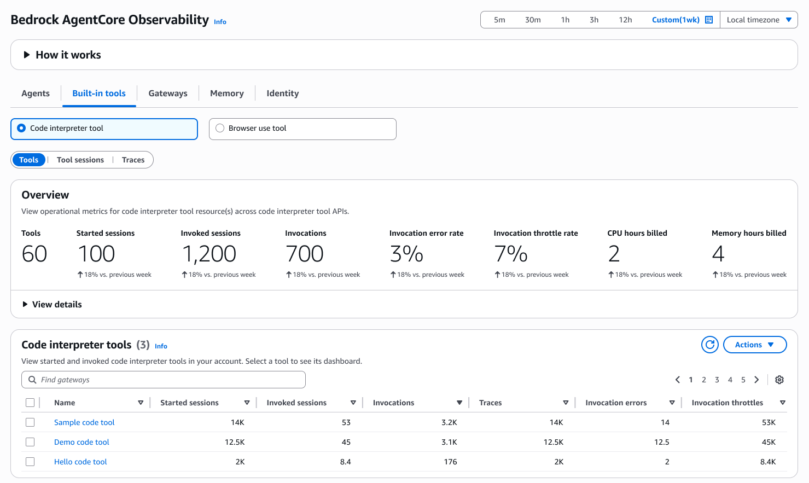
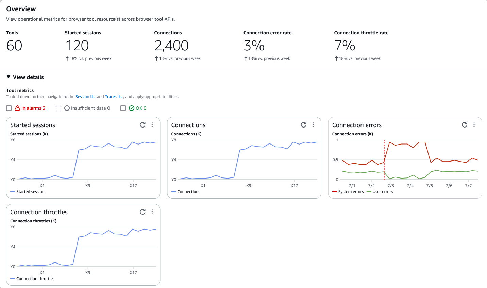
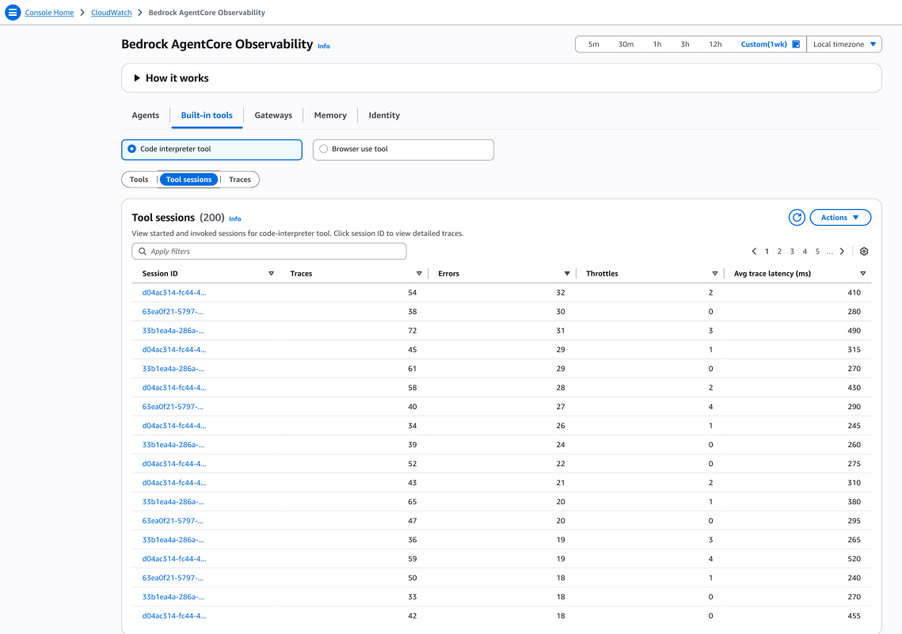
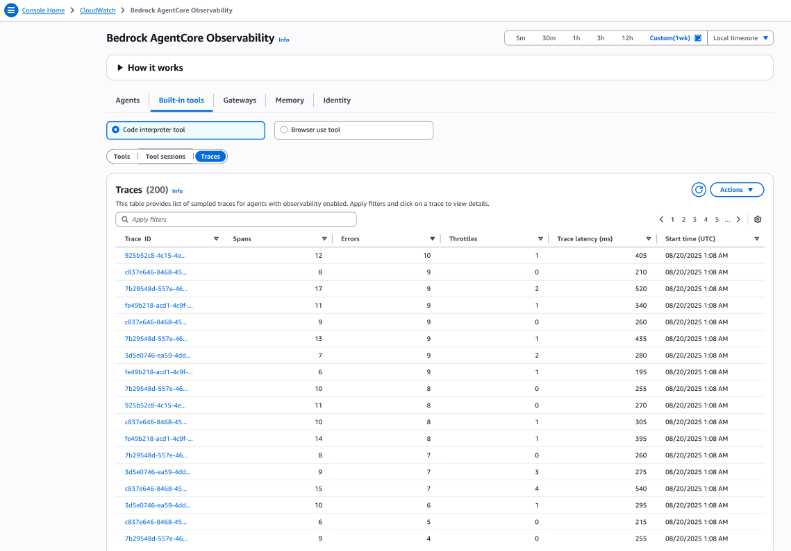
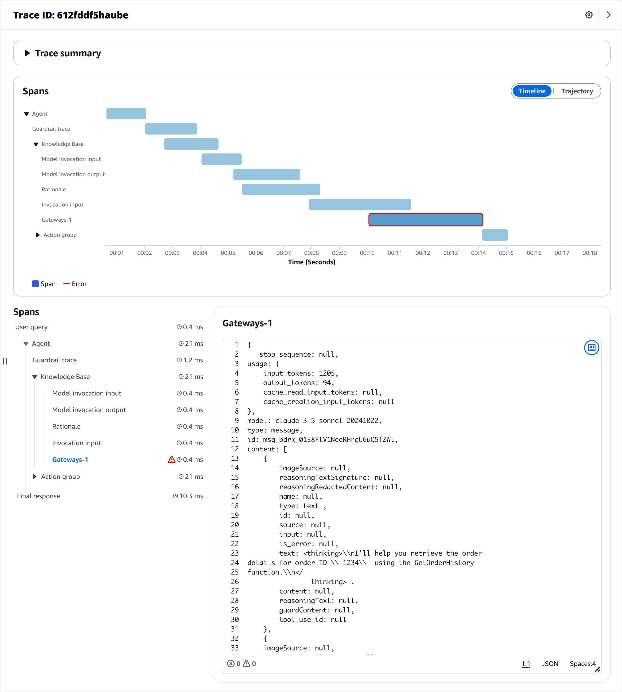

# Built-in tools

Use CloudWatch to gain visibility into how your agents use built-in tools like `Code interpreter tool` and `Browser use tool` to complete tasks. CloudWatch provides monitoring capabilities for each tool.
 For more information on Amazon Bedrock AgentCore built-in tools, see [Use Amazon Bedrock AgentCore built-in tools to interact with your applications](https://docs.aws.amazon.com/bedrock-agentcore/latest/devguide/built-in-tools.html "https://docs.aws.amazon.com/bedrock-agentcore/latest/devguide/built-in-tools.html") .

###### Topics

* [Code interpreter tool](#Code-interpreter-tool "#Code-interpreter-tool")
* [Browser use tool](#Browser-use-tool "#Browser-use-tool")

## Code interpreter tool

You can use the code interpreter tool for the following:

* Track code execution success rates, runtime duration, and resource consumption
* Monitor memory usage and computational resource allocation
* Analyze code execution patterns and optimization opportunities
* Observe error rates and debugging information for failed executions
* Track security sandbox isolation and compliance metrics

* **Tools** – You can monitor fetch operations and API calls made through the browser tool. Choose a tool under **Name** to view the dashboard.

Choose **View details** to view the resource details.

	+ **Started sessions** – Total number of code interpreter sessions initiated by agents. Each session represents a sandboxed environment where agents can execute code, analyze data, and generate outputs. Monitor this metric to track code interpreter usage and capacity planning
	+ **Connections** – Number of active connections to code interpreter runtime environments. This includes both successful connections and connection attempts, helping track resource utilization and concurrent usage patterns
	+ **Connection errors** – Count of failed connections to code interpreter environments due to system issues, resource constraints, or configuration problems. High connection error rates may indicate infrastructure issues requiring investigation
	+ **Connection throttles** – Number of connection requests throttled due to exceeding allowed limits or resource constraints. Monitor this metric to identify when code interpreter usage approaches capacity limits and may require scaling
	+ **CPU hours billed** – Total computational time consumed by code interpreter sessions, measured in CPU hours. This metric helps track resource costs and optimize code execution efficiency across agent workloads
	+ **Memory hours billed** – Total memory consumption by code interpreter sessions over time, measured in memory hours. Use this metric for cost tracking and to identify memory-intensive code execution patterns that may need optimization
* **Tool sessions** – View all the connected sessions where the tool was used.

Choose a **Session ID** under **Total sessions** to view the session dashboard.
* **Traces** – View the sample traces for agents with observability enabled.

Choose a **Trace ID** under **Traces** to view the trace details.

## Browser use tool

You can use the browser use tool for the following:

* Track browser navigation patterns, page load times, and interaction success rates
* Observe browser session duration and resource utilization
* Analyze fetch errors and troubleshoot browser automation issues
* Observe browser session duration and resource utilization
* Track security sandbox performance and isolation effectiveness

###### Note

The **Tools**, **Tool sessions**, and **Traces** tab experience and fields are similar to **Code interpreter tool**. For more information on the fields, see [Code interpreter tool](#Code-interpreter-tool "#Code-interpreter-tool").
