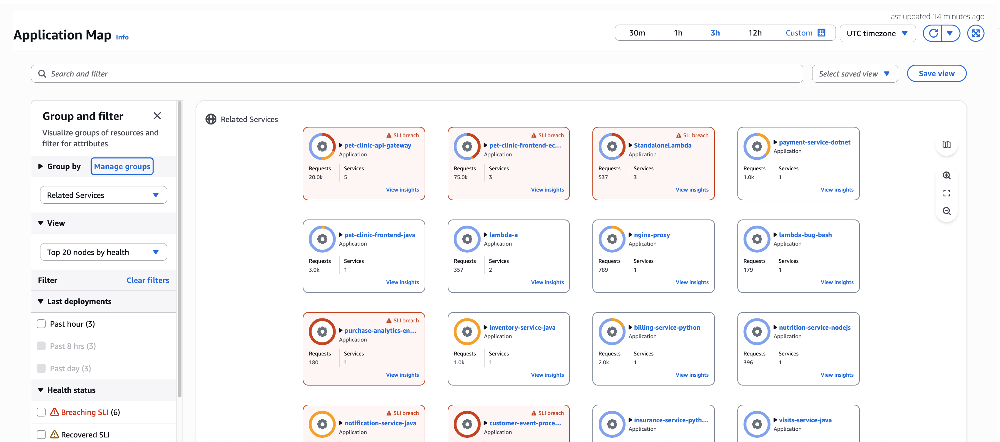
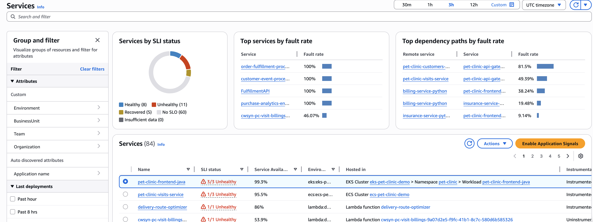
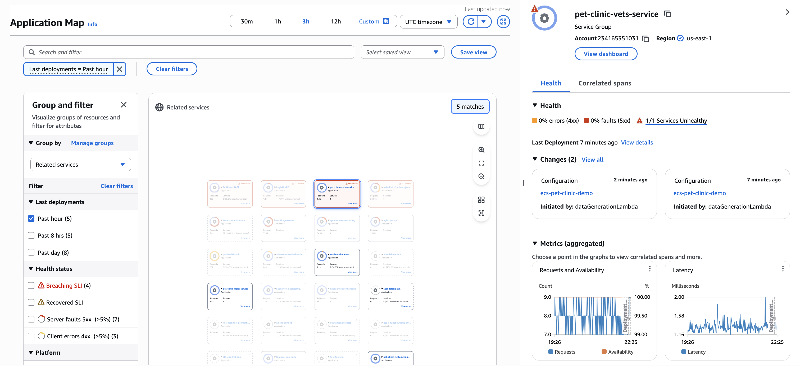
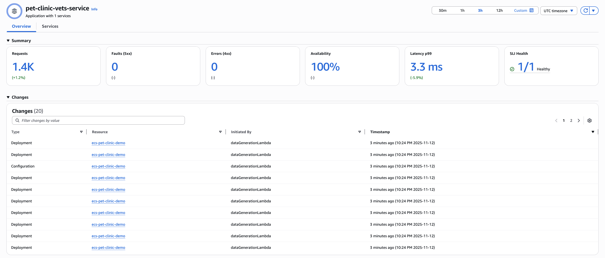
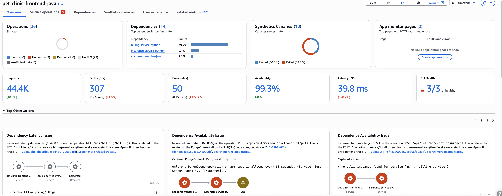

# Application Signals

CloudWatch Application Signals helps you monitor and improve application performance on AWS. It automatically collects data from your applications running on services like Amazon EC2, Amazon ECS, and Lambda. You can use CloudWatch Application Signals for the following:

- Monitor application health in real time
- Track performance against business goals
- View relationships between services and dependencies
- Quickly identify and resolve performance issues

- Enable Application Signals to automatically collect metrics and traces from your applications, and
  display key metrics such as call volume, availability, latency, faults, and errors.
  Quickly see and triage current operational health, and whether your applications are meeting their
  longer-term performance goals, without writing custom code or creating dashboards.
- Create and monitor [service-level objectives (SLOs)](CloudWatch-ServiceLevelObjectives.md "CloudWatch-ServiceLevelObjectives.md")
  with Application Signals. Easily create and track
  status of SLOs related to CloudWatch metrics, including the new standard application metrics that Application
  Signals collects. See and track the [service level indicator (SLI)](CloudWatch-ServiceLevelObjectives.md#CloudWatch-ServiceLevelObjectives-concepts "CloudWatch-ServiceLevelObjectives.md#CloudWatch-ServiceLevelObjectives-concepts")
  status of your application services
  within a services list and topology map. Create alarms to track your SLOs, and track the new standard
  application metrics that Application Signals collects.
- See a map of your application topology that Application Signals automatically discovers, that gives
  you a visual representation of your applications, dependencies, and their connectivity.
- Application Signals works with [CloudWatch RUM](CloudWatch-RUM.md "CloudWatch-RUM.md"), [CloudWatch
  Synthetics canaries](CloudWatch_Synthetics_Canaries.md "CloudWatch_Synthetics_Canaries.md"), [AWS Service Catalog AppRegistry](../../../servicecatalog/latest/arguide/intro-app-registry.md "../../../servicecatalog/latest/arguide/intro-app-registry.md"), and Amazon EC2 Auto Scaling
  to display your client pages, Synthetics canaries, and application names within dashboards
  and maps.
  **Supported languages and architectures**

Application Signals supports Java, Python, Node.js, and .NET applications.

Application Signals is supported and tested on Amazon EKS, Amazon ECS, and Amazon EC2. On Amazon EKS clusters,
it automatically discovers the names of your services and clusters. On other architectures,
you must supply the names of services and environments when you enable those services for
Application Signals.

The instructions for enabling Application Signals on Amazon EC2 should work on any architecture
that supports the CloudWatch agent and AWS Distro for OpenTelemetry. However, the instructions
have not been tested on architectures other than Amazon ECS and Amazon EC2.

**Supported Regions**

Application Signals is supported in every commercial Region except
for Canada West (Calgary).

###### Topics

- [Features](#application-signals-features "#application-signals-features")
- [Permissions required for Application Signals](Application_Signals_Permissions.md "Application_Signals_Permissions.md")
- [Supported systems](CloudWatch-Application-Signals-supportmatrix.md "CloudWatch-Application-Signals-supportmatrix.md")
- [Supported instrumentation setups](Getting-Started-App-Signals.md "Getting-Started-App-Signals.md")
- [Enable Application Signals in your account](CloudWatch-Application-Signals-Enable.md "CloudWatch-Application-Signals-Enable.md")
- [(Optional) Try out Application Signals with a sample app](CloudWatch-Application-Signals-Enable-EKS-sample.md "CloudWatch-Application-Signals-Enable-EKS-sample.md")
- [Enable your applications on Amazon EKS clusters](CloudWatch-Application-Signals-Enable-EKS.md "CloudWatch-Application-Signals-Enable-EKS.md")
- [Enable your applications on Amazon EC2](CloudWatch-Application-Signals-Enable-EC2Main.md "CloudWatch-Application-Signals-Enable-EC2Main.md")
- [Enable your applications on Amazon ECS](CloudWatch-Application-Signals-Enable-ECSMain.md "CloudWatch-Application-Signals-Enable-ECSMain.md")
- [Enable your applications on Kubernetes](CloudWatch-Application-Signals-Enable-KubernetesMain.md "CloudWatch-Application-Signals-Enable-KubernetesMain.md")
- [Enable your applications on Lambda](CloudWatch-Application-Signals-Enable-LambdaMain.md "CloudWatch-Application-Signals-Enable-LambdaMain.md")
- [Troubleshooting your Application Signals installation](CloudWatch-Application-Signals-Enable-Troubleshoot.md "CloudWatch-Application-Signals-Enable-Troubleshoot.md")
- [(Optional) Configuring Application Signals](CloudWatch-Application-Signals-Configure.md "CloudWatch-Application-Signals-Configure.md")
- [Monitor the operational health of your applications with Application Signals](Services.md "Services.md")
- [Metrics collected by Application Signals](AppSignals-MetricsCollected.md "AppSignals-MetricsCollected.md")
- [Custom metrics with Application Signals](AppSignals-CustomMetrics.md "AppSignals-CustomMetrics.md")

## Features

- **Use Application Signals for daily application monitoring** – Use Application Signals within the CloudWatch console, as part of daily application monitoring:

      1. If you have created service level objectives (SLOs) for your services, start
       with the [Service Level
       Objectives (SLO)](CloudWatch-ServiceLevelObjectives.md#CloudWatch-ServiceLevelObjectives-Triage "CloudWatch-ServiceLevelObjectives.md#CloudWatch-ServiceLevelObjectives-Triage") page. This gives you an immediate view of the health of
       your most critical services, operations, and dependencies. Choose the service, operation, or dependency name for
       an SLO to open the [Service detail](ServiceDetail.md "ServiceDetail.md") page and see
       detailed service information as you troubleshoot issues.
      2. Open the [Services](Services-page.md "Services-page.md") page to see a summary
       of all your services, and quickly see services with the highest fault rate or
       latency. If you have created SLOs, look at the Services table to see which services
       have unhealthy service level indicators (SLIs). If a particular service is in an
       unhealthy state, select the service to open the [Service detail](ServiceDetail.md "ServiceDetail.md") page and see service operations, dependencies, Synthetics
       canaries, and client requests. Select a point in a graph to see correlated traces so
       that you can troubleshoot and identify the root cause of operational issues.
      3. If new services have been deployed or dependencies have changed, open the
       [Application Map](ServiceMap.md "ServiceMap.md") to inspect your application
       topology. See a map of your applications that shows the relationship between
       clients, Synthetics canaries, services, and dependencies. Quickly see SLI health,
       view key metrics such as call volume, fault rate, and latency, and drill down to see
       more detailed information in the [Service detail](ServiceDetail.md "ServiceDetail.md")
       page.

  Using Application Signals incurs charges. For information about CloudWatch pricing, see [Amazon CloudWatch Pricing](http://aws.amazon.com/cloudwatch/pricing "http://aws.amazon.com/cloudwatch/pricing").

###### Note

It is not necessary to enable Application Signals to use CloudWatch Synthetics, or CloudWatch RUM.
However, Synthetics and CloudWatch RUM work with Application Signals to provide benefits when you use
these features together.

- **Application Signals cross-account** – With Application Signals cross-account observability, you can monitor and troubleshoot your applications that span multiple AWS accounts within a single Region.

You can use Amazon CloudWatch Observability Access Manager to set up one or more of your AWS accounts as a monitoring account. You’ll provide the monitoring account with the ability to view data
in your source account by creating a sink in your monitoring account. You use the sink to create a link from your source account to your monitoring account. For more information, see
[CloudWatch cross-account observability](CloudWatch-Unified-Cross-Account.md "CloudWatch-Unified-Cross-Account.md").

For proper functionality of Application Signals cross-account observability, ensure that the following telemetry types are shared through the CloudWatch Observability Access Manager.

    + Application Signals services and service level objectives (SLOs)
    + Metrics in Amazon CloudWatch
    + Log groups in Amazon CloudWatch Logs
    + Traces in [AWS X-Ray](../../../xray/latest/devguide/aws-xray.md "../../../xray/latest/devguide/aws-xray.md")

- **Dynamic service grouping and filtering** – Group and filter services with Application Signals' dynamic grouping capabilities. Automatically aggregate metrics and SLIs of services within groups, allowing you to start from a group view and dive deep into specific problematic areas. Application Signals provides two default groupings: "Environment" grouping that organizes by service environment, and "Related services" grouping that groups services based on their dependencies. For example, in Related services grouping, if Service A calls Service B, which calls Service C, they're grouped under Service A. Beyond default groupings, create custom groups by selecting services that align with your organizational needs, such as Business unit or Team.

Create custom groupings using AWS tags or OpenTelemetry attributes that align with your team structure, business domains, or operational requirements. Custom groupings enable you to organize services according to your
specific monitoring and troubleshooting workflows. For more information, see [Configuring custom groups](ServiceMap.md#Application-Map-Configure-Custom-Groups "ServiceMap.md#Application-Map-Configure-Custom-Groups").

- **Change Events** – Track change events across your application with Application Signals' automatic processing of CloudTrail events. Monitor configuration and deployment events for services and their dependencies, providing immediate context for operational analysis and troubleshooting. Change event detection is enabled alongside service discovery enablement through the CloudWatch Console or StartDiscovery API. For Amazon EKS services, deployment detection requires that the Amazon EKS services are instrumented with the Application Signals instrumentation SDK.

Change events are supported for the following resources:

    + Autoscaling Group
    + EKS Cluster
    + EKS Workload (only deployments)
    + ECS Cluster and Service
    + ELB Load balancer and Target Group
    + Lambda Function
    + BedrockAgentCore Runtime and RuntimeEndpoint

- **Automated audit findings** – Discover critical insights through Application Signals' automated audit findings. The service analyzes your applications to report significant observations and potential problems, simplifying root cause analysis. These automated findings consolidate relevant traces, eliminating the need to navigate through multiple clicks. The audit system helps teams quickly identify issues and their underlying causes, enabling faster problem resolution.

Application Signals employs advanced analytics to detect patterns, highlight resource inefficiencies, and suggest optimization opportunities. Findings are prioritized based on severity and potential business impact, enabling teams to focus on the most critical issues first. Get actionable recommendations for improving service reliability and performance without manual analysis.

