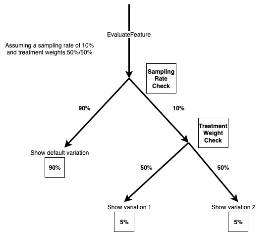

# Modify experiment traffic

###### Important

End of support notice: On October 16, 2025, AWS 
 will discontinue support for CloudWatch Evidently. After October 16, 2025, you will 
 no longer be able to access the Evidently console or Evidently resources. 
 

You can modify the sampling rate for an experiment at any time, including while the experiment is
 ongoing. However, you can't update the treatment weights after an experiment is running. Therefore,
 you can change the total traffic exposed to the experiment after an experiment is
 running, but not the relative allocation to each treatment. If you modify the
 traffic of an ongoing experiment, we recommend that you only increase the traffic
 allocation, so that you don't introduce bias.

The following diagram shows how client traffic is allocated to different variations in an experiment. In 
 this experiment, the sampling rate is 10% and the treatment weights for the two variations are 50% each.

###### To modify the traffic allocation for an experiment

1. Open the CloudWatch console at
 [https://console.aws.amazon.com/cloudwatch/](https://console.aws.amazon.com/cloudwatch/ "https://console.aws.amazon.com/cloudwatch/").
2. In the navigation pane, choose **Application
 monitoring**, **Evidently**.
3. Choose the name of the project that contains the launch.
4. Choose the **Experiments** tab.
5. Choose the name of the launch.
6. Choose **Modify experiment traffic**.
7. Enter a percentage or use the slider to specify how much of the available
 traffic to allocate to this experiment. The available traffic is the total
 audience minus the traffic that is allocated to a current launch, if there
 is one. The traffic that is not allocated to the launch or experiment is
 served the default variation.
8. Choose **Modify**.
