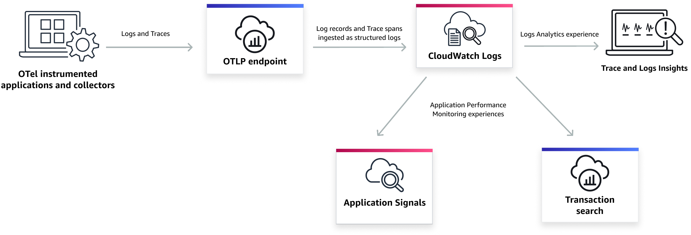

# OpenTelemetry

OpenTelemetry is an open-source observability framework that provides IT teams with standardized protocols and tools for collecting and routing telemetry data.
It delivers a unified format for instrumenting, generating, gathering, and exporting application telemetry data, such as metrics, logs, and traces to monitoring platforms
for analysis and insights. By using OpenTelemetry, you can avoid vendor lock-in, ensuring flexibility in the observability solutions.

You can use OpenTelemetry to directly send logs and traces to an OpenTelemetry Protocol (OTLP) endpoint, and get out-of-the box features like Logs Insights, LiveTail, and application performance monitoring experiences in [CloudWatch Application Signals](CloudWatch-Application-Monitoring-Intro.md "CloudWatch-Application-Monitoring-Intro.md").

Application Signals provides you with a unified, application-centric view of your applications, services, and dependencies, and helps you monitor and triage application health. You can
also explore OTLP spans using the interactive search and analytics experience in CloudWatch to answer any questions related to application performance or end-user impact with
[Transaction Search](WhatIsCloudWatch.md "WhatIsCloudWatch.md"). You can also detect the impact on end users, find transactions in context of those issues using relevant attributes such as customer name or order number,
correlate transactions to business events such as failed payments, and dive into interactions between application components to establish a root cause. Using CloudWatch, you can get complete application transaction coverage with correlated insights, helping you to accelerate mean
time to resolution.

###### Topics

- [OTLP Endpoints](CloudWatch-OTLPEndpoint.md "CloudWatch-OTLPEndpoint.md")
- [Getting started](CloudWatch-OTLPGettingStarted.md "CloudWatch-OTLPGettingStarted.md")
- [Troubleshooting](CloudWatch-OTLPTroubleshooting.md "CloudWatch-OTLPTroubleshooting.md")
