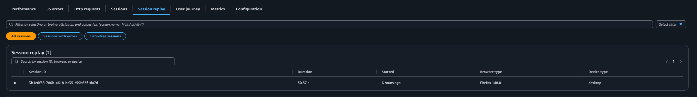
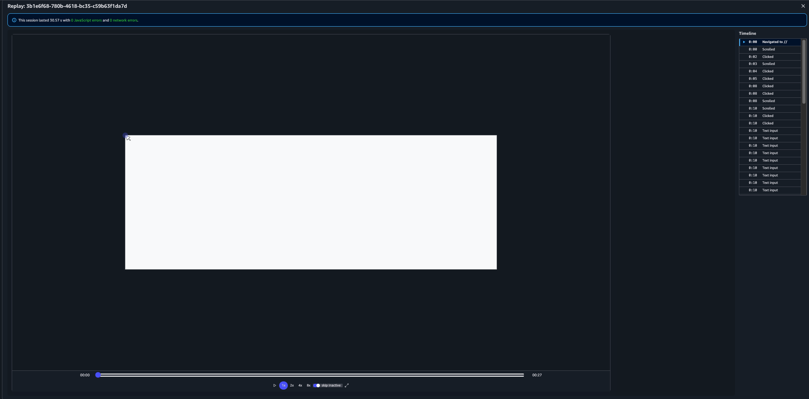

# Session replay

CloudWatch RUM session replay allows you to capture end user sessions for your web
application. You can play back these sessions to visually see what users experienced,
helping you identify issues, understand user behavior, and troubleshoot problems.

To protect user privacy, all text input and text displayed on the page is masked by
default. This means that sensitive information such as names, addresses, and other
personal data is not recorded.

## Enabling session replay

To use session replay, import the `RRWebPlugin` from the
`aws-rum-web` package and add it to the
`eventPluginsToLoad` array in your web client configuration. For more
information about installing the web client as a JavaScript module, see [Configuring the CloudWatch RUM web client](CloudWatch-RUM-configure-client.md "CloudWatch-RUM-configure-client.md").

The following example shows how to enable session replay.

```
import { AwsRum, AwsRumConfig } from 'aws-rum-web';
import { RRWebPlugin } from 'aws-rum-web';

const config: AwsRumConfig = {
    identityPoolId: 'us-west-2:00000000-0000-0000-0000-000000000000',
    sessionSampleRate: 1,
    telemetries: ['errors', 'performance', 'http'],
    eventPluginsToLoad: [new RRWebPlugin()]
};

const awsRum: AwsRum = new AwsRum(
    'APPLICATION_ID',
    '1.0.0',
    'us-west-2',
    config
);
```

The `RRWebPlugin` accepts optional configuration options, such as
sampling rate and recording behavior. For the full list of available configuration
options, see the [CloudWatch RUM web client configuration](https://github.com/aws-observability/aws-rum-web/blob/main/docs/configuration.md "https://github.com/aws-observability/aws-rum-web/blob/main/docs/configuration.md") on GitHub.

## Privacy and data masking

Session replay masks all text input and text content on the page by default. This
includes form fields, labels, paragraphs, and any other text rendered in the DOM.
Masked content appears as placeholder characters during playback, ensuring that
personally identifiable information (PII) is not captured or stored.

## Viewing session replays

After you enable session replay, you can view recorded sessions in the CloudWatch RUM
console. Navigate to your app monitor and choose the **Session
replay** tab. This tab displays a list of recorded sessions with
details including session ID, duration, start time, browser type, and device type.
You can filter sessions to show all sessions, sessions with errors, or error-free
sessions.

You can also find sessions with replays in the **Sessions** tab. Any session that has a replay available
displays a play button next to it. Choose the play button to open the replay
player.



Choose a session to open the replay player. The player shows a visual playback of
the user's session, including a timeline of interactions on the right side. The
timeline displays each user interaction, such as page navigations, scrolls, clicks,
and text inputs, along with the timestamp when each interaction occurred. You can
use the playback controls to adjust the speed (1x, 2x, 4x, or 8x) and skip
inactive periods.


