# Viewing the CloudWatch RUM dashboard

CloudWatch RUM collects and visualizes application performance data from user sessions
through an interactive dashboard. By capturing load times, Apdex scores, device
information, geolocation, and error patterns, teams can quickly identify performance
bottlenecks, prioritize fixes based on real user impact, and make sure optimal experiences
across different browsers, devices, and geographic regions—helping organizations
better understand user behavior leading to reduced end user frustration and improving
application reliability.

**Getting Started with CloudWatch RUM**

1. Open the CloudWatch console at
   [https://console.aws.amazon.com/cloudwatch/](https://console.aws.amazon.com/cloudwatch/ "https://console.aws.amazon.com/cloudwatch/").
2. In the navigation pane, choose **Application Signals (APM)**,
   **RUM**.
   The RUM console displays the **Overview** page, which provides a
   consolidated view of all your app monitors, their health, and key operational metrics.
   From the Overview page, select an app monitor to access detailed views with
   **Performance**, **Errors**,
   **Sessions**, **Metrics**, and
   **Configuration** tabs.

## Overview

The Overview page is the landing page of the CloudWatch RUM console. It provides a
high-level summary of all your application monitors, helping you quickly assess
health, performance trends, and operational coverage across your monitored
applications.

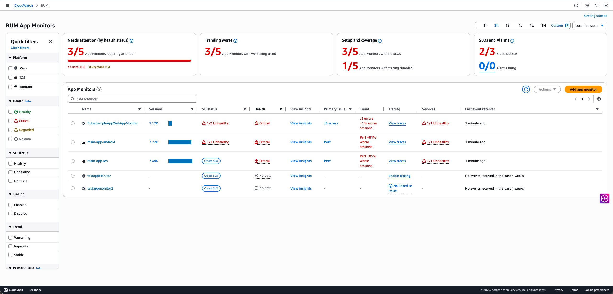

### Summary cards

At the top of the Overview page, four summary cards provide an at-a-glance
operational status across all your app monitors:

- **Needs attention (by health status)** — Shows
  how many app monitors require attention out of the total, broken down by
  **Critical** and **Degraded** counts. A progress bar indicates the proportion
  of monitors needing attention.
- **Trending worse** — Shows how many app
  monitors have a worsening trend out of the total.
- **Setup and coverage** — Shows how many app
  monitors have no SLOs configured and how many have tracing disabled,
  helping you identify gaps in your monitoring setup.
- **SLOs and Alarms** — Shows the number of
  breached SLIs out of total SLIs, and the number of alarms currently
  firing.

### Quick filters

The left panel provides quick filters to narrow the application list
by:

- **Platform** — Web, iOS, or Android.
- **Health** — Healthy, Critical, Degraded, or
  No data.
- **SLI status** — Healthy, Unhealthy, or No
  SLOs.
- **Tracing** — Enabled or Disabled.
- **Trend** — Worsening, Improving, or
  Stable.
- **Primary issue** — Filter by the primary
  issue type affecting the app monitor.

Choose **Clear filters** to reset all filters.

### App Monitors table

The **App Monitors** table lists all your app monitors with
the following columns:

- **Name** — The name of the app monitor, with
  a platform icon (Web, iOS, or Android).
- **Sessions** — The number of sessions
  recorded in the selected time range, displayed with a bar chart
  visualization.
- **SLI status** — The status of service level
  indicators. Displays the count of unhealthy SLIs (for example, "1/2
  Unhealthy") or a **Create SLO** link if no SLOs are
  configured.
- **Health** — The health status of the
  application: **Healthy**, **Critical**, **Degraded**, or **No
  data**.
- **View Insights** — Choose this link to open
  the diagnostic side panel for the app monitor (see [Diagnostic side panel](#CloudWatch-RUM-overview-diagnostic-panel "#CloudWatch-RUM-overview-diagnostic-panel")).
- **Primary issue** — The primary issue type
  affecting the application. For **web** app
  monitors, values include **JS errors**,
  **Perf**, or **HTTP errors/faults**. For **mobile** app monitors, values include **Crashes**, **ANRs/App Hangs**, **Perf**, or **HTTP
  errors/faults**.
- **Trend** — A description of the trend
  direction and magnitude (for example, "JS errors +1% worse sessions" or
  "Perf +81% worse sessions").
- **Tracing** — A **View
  traces** link if tracing is enabled, or an
  **Enable tracing** link if it is not.
- **Services** — The SLI health status for
  linked services (for example, "1/1 Unhealthy"), or a dash if no
  services are linked.
- **Last event received** — The time since the
  last telemetry event was received (for example, "1 minute ago" or "No
  events received in the past 4 weeks").

Use the search bar above the table to find specific app monitors by name. You
can sort the table by clicking column headers, and use the gear icon to
customize which columns are visible. The **Actions** dropdown
and **Add app monitor** button let you manage your app monitors
directly from this page.

### Health status

The **Health** column provides an at-a-glance assessment of
each application's operational state based on the percentage of impacted
sessions—sessions with errors or slow page loads—relative to total
sessions in the selected time range.

Each app monitor displays one of the following statuses:

| Status       | Impacted sessions | Description                                                                                                                                                   |
| ------------ | ----------------- | ------------------------------------------------------------------------------------------------------------------------------------------------------------- |
| **Healthy**  | Less than 1%      | The application is operating within normal parameters.                                                                                                     |
| **Degraded** | Between 1% and 5% | The application is experiencing elevated error rates or degraded performance that may require attention.                                                   |
| **Critical** | More than 5%      | The application is experiencing significant errors or performance issues that require immediate investigation.                                          |
| **No data**  | —                 | Insufficient data is available to determine the application's health status. This can occur when an app monitor has not received recent telemetry data. |

### Diagnostic side panel

When you choose **View Insights** for an app monitor in the
table, a diagnostic side panel opens on the right side of the page. The panel
displays the app monitor name and provides two tabs:

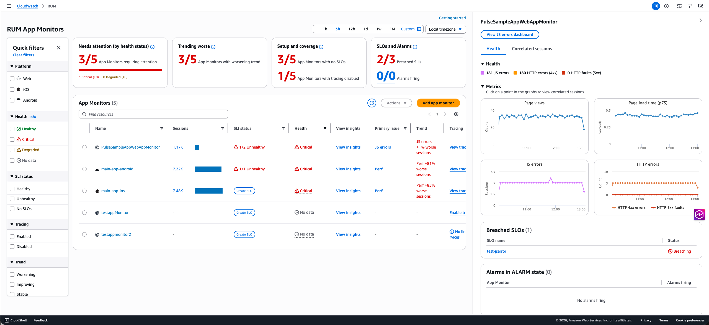

**Health** tab — Shows a breakdown of
errors contributing to the health status (for example, JS errors, HTTP errors
(4xx), and HTTP faults (5xx)) with color-coded indicators. The **Metrics** section displays interactive time-series graphs. Click
on a point in the graphs to view correlated sessions.

For **web** app monitors, the following graphs
are displayed:

- **Page views** — The count of page views over
  time.
- **Page load time (p75)** — The 75th percentile
  page load time in seconds.
- **JS errors** — The count of JavaScript error
  sessions over time.
- **HTTP errors** — The count of HTTP 4xx errors
  and 5xx faults over time.

For **mobile** app monitors (Android and iOS),
the following graphs are displayed:

- **Screen load time** — The screen load time
  over time.
- **Screen loads** — The count of screen loads
  over time.
- **Crashes** — The count of crash sessions over
  time.
- **App Hangs/ANRs** — The count of App Hang
  (iOS) or ANR (Android) sessions over time.
- **HTTP errors** — The count of HTTP 4xx errors
  and 5xx faults over time.

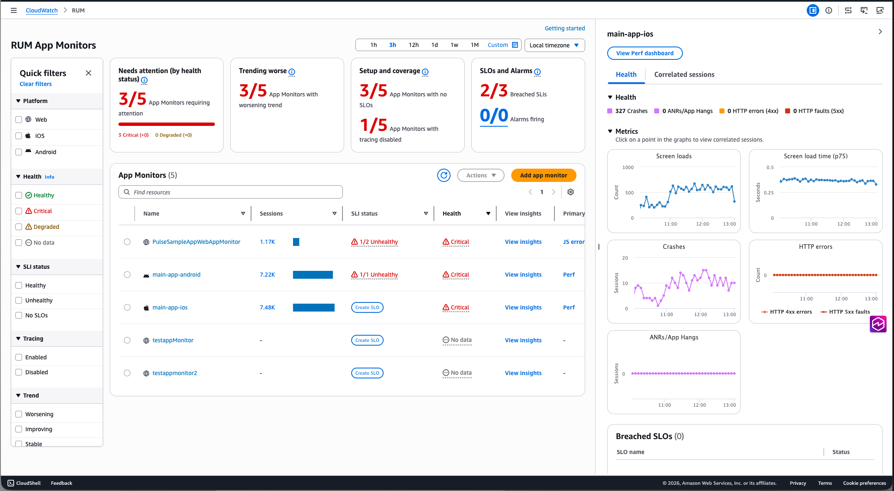

Below the metrics, the panel also shows:

- **Breached SLOs** — A table listing any SLOs
  in a **Breaching** state, with links to the
  SLO details.
- **Alarms in ALARM state** — A table listing
  any alarms currently firing for the app monitor.

**Correlated sessions** tab — Shows
sessions correlated to the selected data point in the metrics graphs.

## Web Application Dashboard

When you select a web application monitor, you'll see the following tabs:

- The **Performance** tab displays page performance
  information including load times, request information, web vitals, and page
  loads over time. On this tab you can also toggle the view between
  **Page loads**, **Resources**, and
  **Locations** to see more details about page
  performance.

The **Page loads** view features interactive web vitals
graphs where you can see the different percentile values of core web vitals
for your pages and choose datapoints on the graph to view correlated
sessions captured by CloudWatch RUM. From there you can navigate to the Sessions
tab using one of the links in the diagnostic table to identify specific
conditions causing performance issues. The tab also features the application
performance index (**Apdex**) score which indicates end
users' level of satisfaction. Scores range from 0 (least satisfied) to 1
(most satisfied). The scores are based on application performance only. For
more information about Apdex scores, see [How CloudWatch RUM sets Apdex scores](#CloudWatch-RUM-apdex "#CloudWatch-RUM-apdex"). The table at the bottom lists
the **Top 100 page load times** based on **Page
Ids**. You can change this attribute in the dropdown next to
the table header.

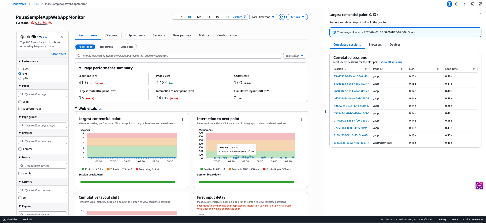

Similarly the **Resources** view shows the resource
request time and count by the resource type. The
**Locations** view has interactive map that lets you
drill down to a more granular view and investigate performance issues in a
specific region.

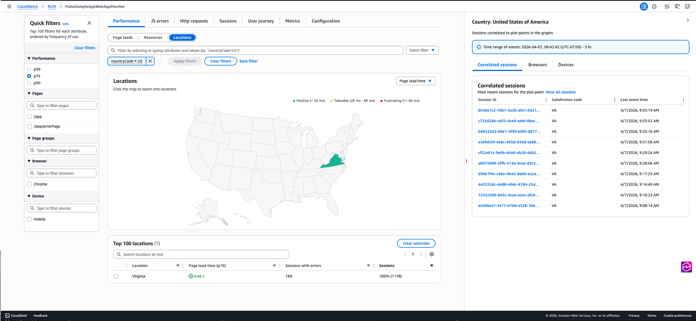

The diagnostic panel on the right also has the
**Browsers** and **Devices** tab which
shows the top 5 browsers/devices contributing to the performance issue. You
can click on the bar chart to navigate to the Sessions tab to further
investigate the issue.

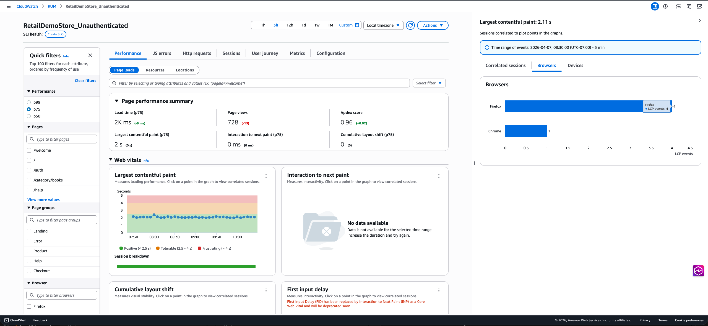

- The **JS errors** tab displays JavaScript error count
  and rate in the summary component along with the Browser and Device with the
  most errors. This tab includes a chart which shows the number of sessions
  with JS errors and the failure rate. You can click on any data point in the
  chart to view the correlated sessions in the diagnostic panel. The table at
  the bottom lists the top 100 JS errors. The error count link in the table
  can be used to navigate to the sessions tab where you can view relevant
  sessions.

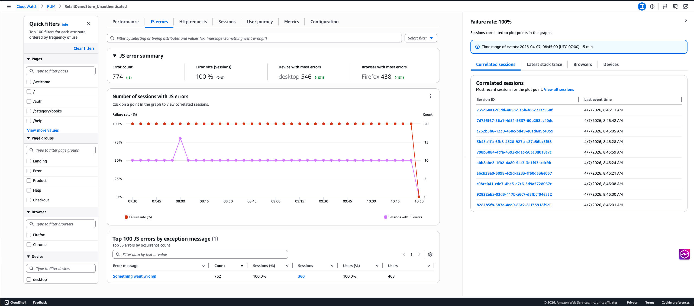

- The **Http requests** tab displays HTTP request volume
  and error information in the HTTP request summary on the top. This tab
  includes a graph with the HTTP errors, HTTP faults and Network failures. You
  can click on any data point in the chart to view the correlated sessions in
  the diagnostic panel. The table at the bottom lists the top 100 network
  routes with issues. If you expand one of the rows you can see the top error
  messages for that url. The error count link in the table can be used to
  navigate to the sessions tab where you can view relevant sessions.

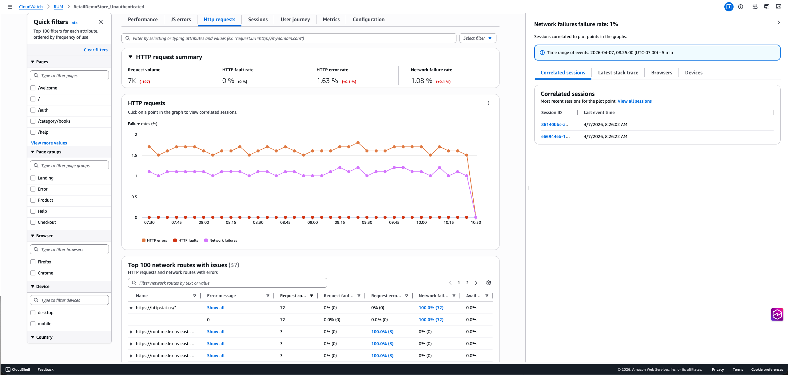

- The **Sessions** tab displays a table that lists all
  sessions in descending chronological order. At the bottom, a waterfall
  visualization shows all telemetry for the selected session, helping you
  track user interactions and identify performance issues. You can click on
  the error link in the **Errors** column to filter the
  waterfall chart for the specific error event. Each row in the waterfall can
  be selected to open the diagnostic panel where you can view the raw
  event.

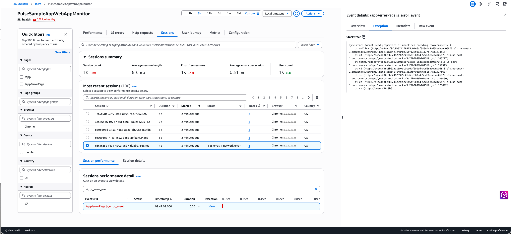

For HTTP requests, you'll see a **traceId** for HTTP and
Xray events that links to the Traces console if you have tracing enabled.
For events like JS error or HTTP error events, diagnostic panel includes an
**Exception** tab with the stack trace. The
**View** button in the waterfall provides quick access
to this information.

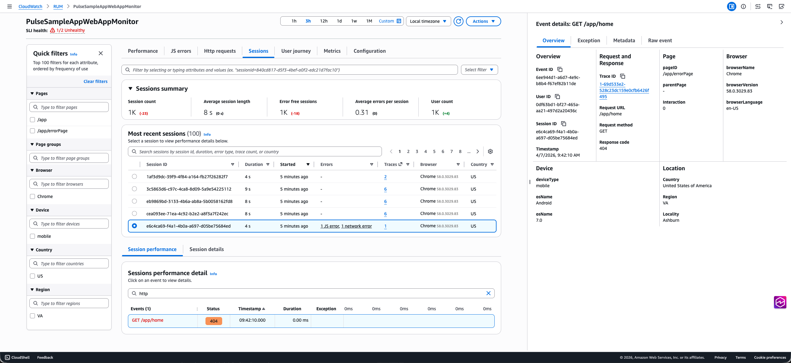

- The **User Journey** tab displays the paths that your
  customers use to navigate your application. You can see where your customers
  enter your application and what page they exit your application from. You
  can also see the paths that they take and the percentage of customers that
  follow those paths. You can pause on a node to get more details about that
  page. You can choose a single path to highlight the connections for easier
  viewing. The page shows user journey till 2nd interaction by default. You
  can click on the **Add path** button to view further
  interactions.

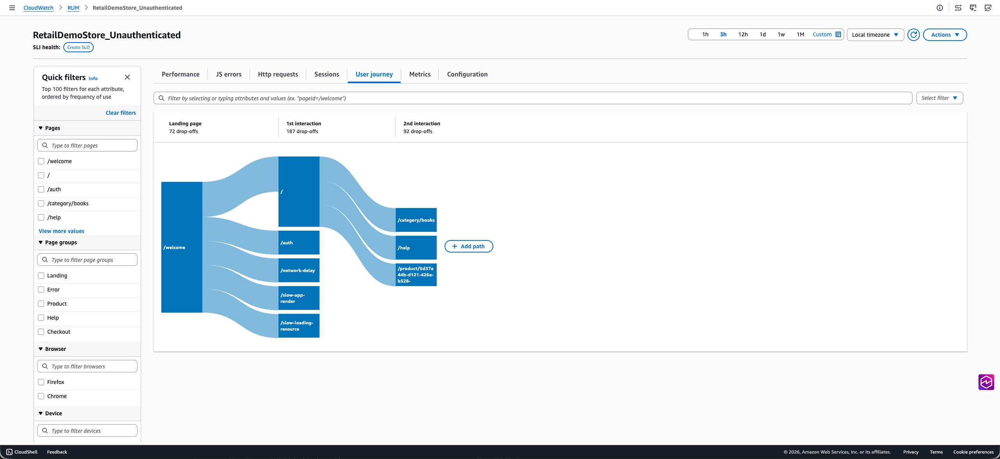

- The **Metrics** tab displays all default CloudWatch
  metrics published by your app monitor, including performance web vitals,
  error metrics (JavaScript errors, HTTP errors/faults), volume, user flow and
  apdex metrics. If you created extended metrics for your application, the tab
  also includes a subset of these metrics in the extended metrics section.
  This subset includes metrics of type PageViewCount,
  PerformanceNavigationDuration, Http4xxCount, Http5xxCount and JsErrorCount.
  The dashboard shows three metric variations per metric type. Since these are
  CloudWatch metrics, you can also export this tab to your own dashboard using
  the **Add to dashboard** option and update it to include
  more metrics.

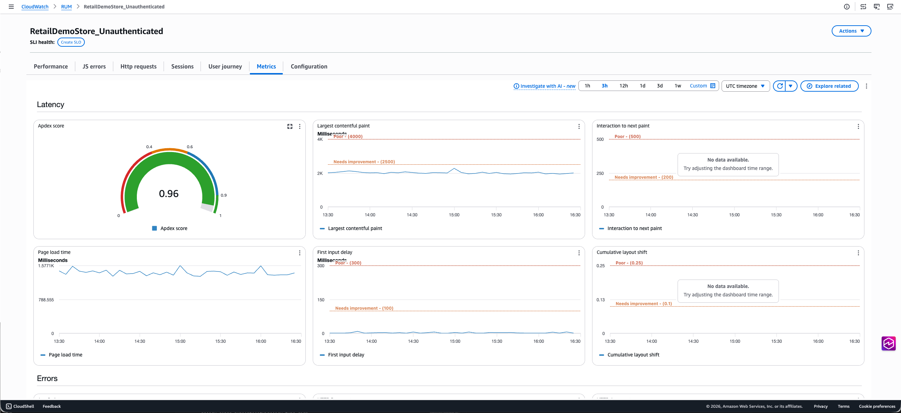

(Optional) On any of the first five tabs, you can filter the data based on user
ID, session ID and other event specific filters using the filter bar on the top. You
can also use the quick filter panel on the left to filter on a subset of attributes
like Page IDs, Page groups, Device, Browser, Location. These filters can be saved
using the **Save filter** option and can be reused using the
**Select filter** dropdown next to the filter bar.

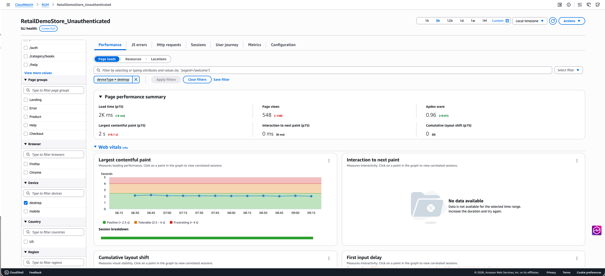

## Mobile Application Dashboard

When you select a mobile application monitor, you'll see the following
tabs:

- The **Performance** tab provides insights into the
  performance of your mobile application including screen load times, app
  launch times (cold and warm), performance metrics, and Apdex scores over
  time. The detailed view breaks down performance by screen names, OS
  versions, app versions, devices, and countries. Clicking a screen load time,
  app launch time, or location datapoint in the chart will open the diagnostic
  panel on the right that provides further insights relevant to the datapoint
  consisting the most recent correlated sessions and links to the
  **Sessions** tab for troubleshooting.

On this tab you can also toggle the view between **Screen
loads**, **App launches**, and
**Location** to see more details about application
performance.

The tab also features the application performance index (Apdex) score
which indicates end users' level of satisfaction. Scores range from 0 (least
satisfied) to 1 (most satisfied). The scores are based on application
performance only. For more information about Apdex scores, see [How CloudWatch RUM sets Apdex scores](#CloudWatch-RUM-apdex "#CloudWatch-RUM-apdex").

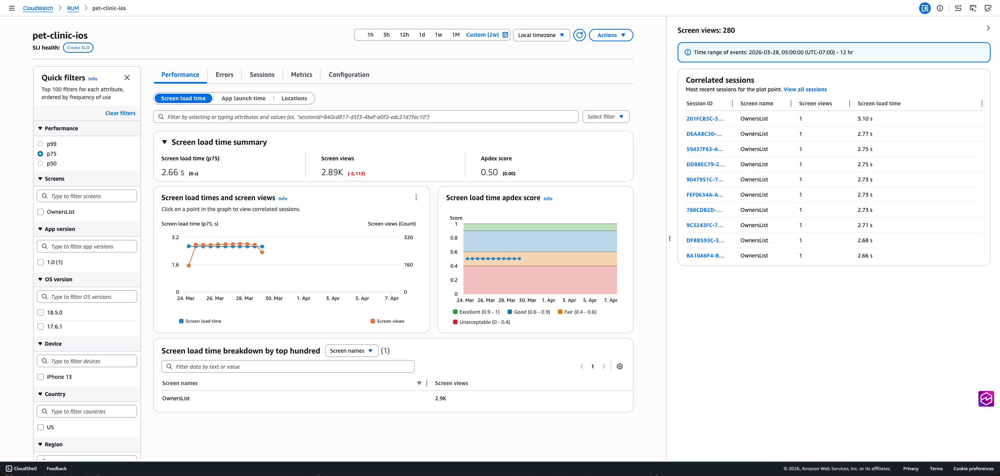

- The **Errors** tab breaks down application issues in
  three categories: Network Errors, Crashes, and ANRs (Android)/App Hangs
  (iOS). The **Network Errors** tab has a line chart showing
  network latency, client errors (4xx status code), and server errors (5xx
  status code). Clicking on a data point for any of these lines in the chart
  will open the diagnostic panel. The bottom table lists the 100 most common
  network routes. Clicking on a radio button will filter the line chart by the
  network route selected.

Similarly, the **Crashes** and **ANRs/App
Hangs** tabs show a line series for the count of each error,
and these are intractable. The bottom table displays the most common top
crash message or ANR/App Hang stack trace. Clicking on a radio button will
filter the chart, and clicking the error message will show the complete
stack trace.

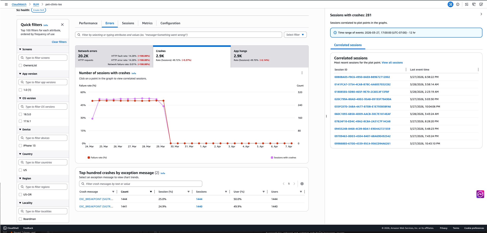

- The **Sessions** tab displays a table that lists all
  sessions in descending chronological order. At the bottom, a waterfall
  visualization shows all telemetry for the selected session, helping you
  track user interactions and identify performance issues. Each row in the
  waterfall can be selected to open the diagnostic panel. For HTTP requests,
  you'll see a **traceId** that links to the Traces
  console.

For HTTP requests with non-2xx status codes, crashes, or ANRs (Android)/
App Hangs (iOS), the diagnostic panel includes an
**Exception** tab with the stack trace. The
**View** button in the waterfall provides quick access
to this information.

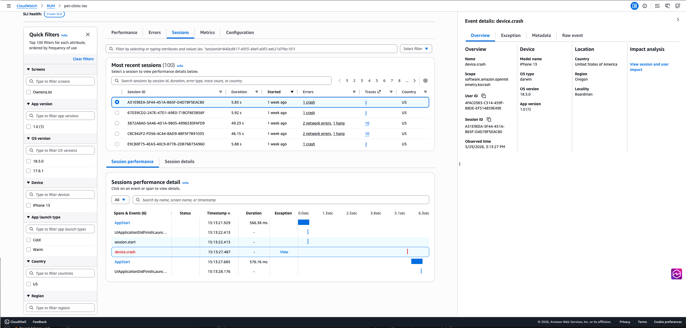

- The **Metrics** tab displays all default CloudWatch
  metrics published by your app monitor, including performance metrics (screen
  load times, cold app launch times), error metrics (crashes, ANRs/App Hangs,
  HTTP errors/faults), volume and apdex metrics. If you created extended
  metrics for your application, the tab also includes a subset of these
  metrics in the extended metrics section. This subset includes metrics of
  type ScreenLoadTime, ScreenLoadCount, CrashCount, Http4xxCount,
  Http5xxCount, ANRCount/AppHangCount, ColdLaunchTime and WarmLaunchTime. The
  dashboard shows three metric variations per metric type. Since these are
  CloudWatch metrics, you can also export this tab to your own dashboard using
  the **Add to dashboard** option and update it to include
  more metrics.
- The **Configuration** tab provides access to your app monitor's general
  settings and configuration details. You can also access the **Code snippets**
  tab which contains instructions for instrumenting your mobile application
  with the ADOT SDK, including both Manual and Zero-Code instrumentation
  options.

### How CloudWatch RUM sets Apdex scores

Apdex (Application Performance Index) is an open standard that defines a
method to report, benchmark, and rate application response time. An Apdex score
helps you understand and identify the impact on application performance over
time.

The Apdex score indicates the end users' level of satisfaction. Scores range
from 0 (least satisfied) to 1 (most satisfied). The scores are based on
application performance only. Users are not asked to rate the
application.

Each individual Apdex score falls into one of three thresholds. Based on the
Apdex threshold and actual application response time, there are three kinds of
performance, as follows:

- **Satisfied**— The actual
  application response time is less than or equal to the Apdex threshold.
  For CloudWatch RUM, this threshold is 2000 ms or less.
- **Tolerable**— The actual
  application response time is greater than the Apdex threshold, but less
  than or equal to four times the Apdex threshold. For CloudWatch RUM, this
  range is 2000—8000 ms.
- **Frustrating**— The actual
  application response time is greater than four times the Apdex
  threshold. For CloudWatch RUM, this range is over 8000 ms.

The total 0-1 Apdex score is calculated using the following formula:

`(positive scores + tolerable scores/2)/total scores * 100`
