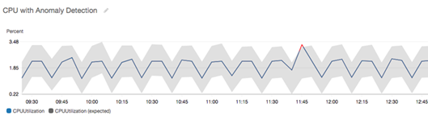
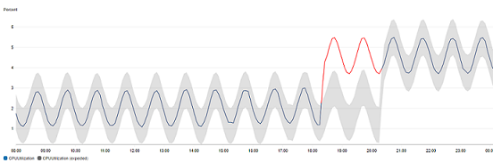
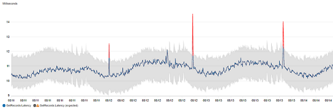
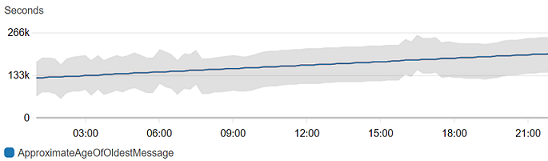
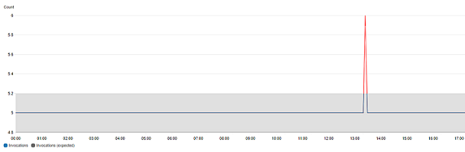

# Using CloudWatch outlier detection

When you enable *outlier detection* for a metric, CloudWatch applies
 statistical and machine learning algorithms. These algorithms continuously analyze metrics of
 systems and applications, determine normal baselines, and surface anomalies with minimal user
 intervention.

The algorithms generate an outlier detection model. The model generates a range of expected values that represent normal metric behavior.

You can enable outlier detection using the AWS Management Console, the AWS CLI, AWS CloudFormation, or the AWS
 SDK. You can enable outlier detection on metrics vended by AWS and also on custom
 metrics. In an account set up as a monitoring account for CloudWatch cross-account observability, you can 
 create anomaly detectors on metrics in source accounts in addition to metrics in the monitoring account.

You can use the model of expected values in two ways:

* Create outlier detection alarms based on a metric's expected value. These types of alarms
 don't have a static threshold for determining alarm state. Instead, they compare the
 metric's value to the expected value based on the outlier detection model. 

You can choose whether the alarm is triggered when the metric value is above the band of
 expected values, below the band, or both.

For more information, see [Create a CloudWatch alarm based on anomaly
 detection](Create_Anomaly_Detection_Alarm.md "Create_Anomaly_Detection_Alarm.md").
* When viewing a graph of metric data, overlay the expected values onto the graph as a band.
 This makes it visually clear which values in the graph are out of the normal range. For more
 information, see [Creating a graph](graph_a_metric.md#create-metric-graph "graph_a_metric.md#create-metric-graph").

You
 can also retrieve the upper and lower values of the model's band by using the
 `GetMetricData` API request with the `ANOMALY_DETECTION_BAND` metric
 math function. For more information, see [GetMetricData](../APIReference/API_GetMetricData.md "../APIReference/API_GetMetricData.md").
In a graph with outlier detection, the expected range of values is shown as a gray band. If the metric's actual 
 value goes beyond this band, it is shown as red during that time.

Outlier detection algorithms account for the seasonality and trend changes of metrics. The
 seasonality changes could be hourly, daily, or weekly, as shown in the following
 examples.

The longer-range trends could be downward or upward.

Outlier detection also works well with metrics with flat patterns.

## How CloudWatch outlier detection works

When you enable outlier detection for a metric, CloudWatch applies machine learning algorithms
 to the metric's past data to create a model of the metric's expected values. The model
 assesses both trends and hourly, daily, and weekly patterns of the metric. The algorithm
 trains on up to two weeks of metric data, but you can enable outlier detection on a metric
 even if the metric does not have a full two weeks of data.

You specify a value for the outlier detection threshold that CloudWatch uses along with the model to determine
 the "normal" range of values for the metric. A higher value for the outlier detection threshold produces a thicker 
 band of "normal" values.

The machine learning model is specific to a metric and a statistic. For example, if you
 enable outlier detection for a metric using the `AVG` statistic, the model is
 specific to the `AVG` statistic.

When CloudWatch creates a model for many common metrics from AWS services, it ensures that the band doesn’t 
 extend outside of logical values. For example, the band for `MemoryUtilization` of an EC2 instance will stay between 0 and 100, and the bands
 tracking CloudFront `Requests`, which can't be negative, will never extend below zero.

After you create a model, CloudWatch outlier detection continually evaluates the model and makes adjustments to it to 
 ensure that it is as accurate as possible. This includes re-training the model to adjust if the metric values evolve over time or have sudden 
 changes, and also includes predictors to improve the models of metrics that are seasonal, spiky, or sparse.

After you enable outlier detection on a metric, you can choose to exclude specified time
 periods of the metric from being used to train the model. This way, you can exclude
 deployments or other unusual events from being used for model training, ensuring the most
 accurate model is created.

Using outlier detection models for alarms incurs charges on your AWS account. For more information, see [Amazon CloudWatch
 Pricing](http://aws.amazon.com/cloudwatch/pricing "http://aws.amazon.com/cloudwatch/pricing").

## Outlier detection on metric math

Outlier detection on metric math is a feature that
 you can use to create outlier detection alarms on the output metric math expressions. You can use these expressions to create graphs that visualize
 outlier detection bands. The feature supports basic arithmetic functions, comparison and
 logical operators, and most other functions. For information
 about functions that are not supported, see [Using metric math](using-metric-math.md#using-anomaly-detection-on-metric-math "using-metric-math.md#using-anomaly-detection-on-metric-math") in the *Amazon CloudWatch User Guide*.

You can create outlier detection models 
 based on metric math expressions similar to how
 you already create outlier detection models. 
 From the CloudWatch console, 
 you can apply outlier detection 
 to metric math expressions 
 and select outlier detection as a threshold type 
 for these expressions.

###### Note

Outlier detection on metric math
 only can be enabled and edited
 in the latest version
 of the metrics user interface.
 When you create anomaly detectors
 based on metric math expressions 
 in the new version of the interface,
 you can view them in the old version, but not edit them.
 

For information about how to create, edit, and delete
 alarms and models for outlier detection and metric math, see the following sections:

* [Create a CloudWatch alarm based on anomaly
 detection](Create_Anomaly_Detection_Alarm.md "Create_Anomaly_Detection_Alarm.md")
* [Editing an outlier detection model](Create_Anomaly_Detection_Alarm.md#Modify_Anomaly_Detection_Model "Create_Anomaly_Detection_Alarm.md#Modify_Anomaly_Detection_Model")
* [Deleting an outlier detection model](Create_Anomaly_Detection_Alarm.md#Delete_Anomaly_Detection_Model "Create_Anomaly_Detection_Alarm.md#Delete_Anomaly_Detection_Model")
* [Creating a CloudWatch alarm based on a metric math expression](Create-alarm-on-metric-math-expression.md "Create-alarm-on-metric-math-expression.md")

You also can create, delete, and discover outlier detection models based on metric math
 expressions
 using
 the CloudWatch API with `PutAnomalyDetector`, `DeleteAnomalyDetector`,
 and `DescribeAnomalyDetectors`. For information about these API actions, see the
 following sections in the *Amazon CloudWatch API Reference*.

* [PutAnomalyDetector](../APIReference/API_PutAnomalyDetector.md "../APIReference/API_PutAnomalyDetector.md")
* [DeleteAnomalyDetector](../APIReference/API_DeleteAnomalyDetector.md "../APIReference/API_DeleteAnomalyDetector.md")
* [DescribeAnomalyDetectors](../APIReference/API_DescribeAnomalyDetectors.md "../APIReference/API_DescribeAnomalyDetectors.md")

For information about how outlier detection alarms are priced, see [Amazon CloudWatch pricing](http://aws.amazon.com/cloudwatch/pricing "http://aws.amazon.com/cloudwatch/pricing").
