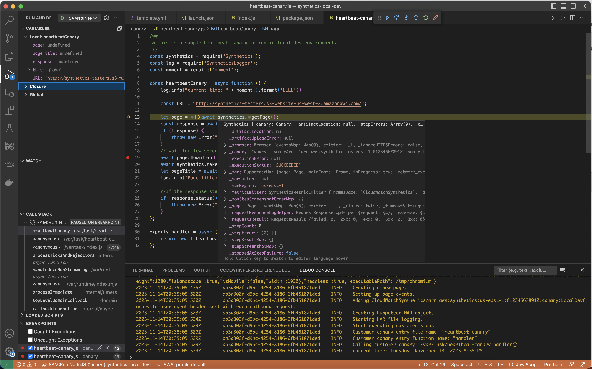
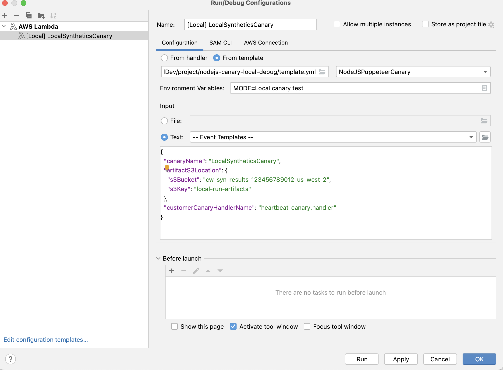

# Test a canary locally

This section explains how to modify, test, and debug CloudWatch Synthetics canaries directly within the Microsoft Visual Studio code editor
or the JetBrains IDE code editor.
The local debugging environment uses a Serverless Application Model (SAM) container to simulate a Lambda function to emulate the behavior of a Synthetics canary.

###### Note

It is impractical to perform locally debug canaries that rely on visual monitoring. Visual monitoring rely on capturing base screenshots during an initial run,
and then comparing these screenshots to the screenshots from subsequent runs. In a local development environment,
runs are not stored or
tracked, and each iteration is an independent, standalone run. The
absence of a canary run history makes it impractical to debug canaries that rely on visual monitoring.

**Prerequisites**

1. Choose or create an Amazon S3 bucket to use to store artifacts from local canary test runs, such as HAR files and screenshots. This requires you to be provisioned
   with IAM. If you skip setting up Amazon S3 buckets you can still test your canary locally, but you will see an error message about the missing bucket and you won't have access to canary artifacts.

If you use an Amazon S3 bucket, we recommend that you set the bucket lifecycle to delete objects after a few days, to save costs. For more information, see
[Managing your storage lifecycle](../../../AmazonS3/latest/userguide/object-lifecycle-mgmt.md "../../../AmazonS3/latest/userguide/object-lifecycle-mgmt.md"). 2. Set up a default AWS profile for your AWS account. For more information,
see [Configuration and credential file settings](../../../cli/latest/userguide/cli-configure-files.md "../../../cli/latest/userguide/cli-configure-files.md"). 3. Set the debug environment's default AWS Region to your preferred Region, such as `us-west-2`. 4. Install the AWS SAM CLI. For more information, see
[Installing the AWS SAM CLI](../../../serverless-application-model/latest/developerguide/install-sam-cli.md "../../../serverless-application-model/latest/developerguide/install-sam-cli.md"). 5. Install Visual Studio Code Editor or JetBrains IDE. For more information, see [Visual Studio Code](https://code.visualstudio.com/ "https://code.visualstudio.com/") or [JetBrains IDE](https://www.jetbrains.com/ides/ "https://www.jetbrains.com/ides/") 6. Install Docker to work with the AWS SAM CLI. Make sure to start the docker daemon. For more information, see
[Installing Docker to use with the AWS SAM CLI](../../../serverless-application-model/latest/developerguide/install-docker.md "../../../serverless-application-model/latest/developerguide/install-docker.md").

Alternatively, You can install other container management software such as Rancher, as long as
it uses the Docker runtime. 7. Install an AWS toolkit extension for your preferred editor. For more information, see
[Installing the AWS Toolkit for Visual Studio Code](../../../toolkit-for-vscode/latest/userguide/setup-toolkit.md "../../../toolkit-for-vscode/latest/userguide/setup-toolkit.md") or [Installing the AWS Toolkit for JetBrains](../../../toolkit-for-jetbrains/latest/userguide/setup-toolkit.md "../../../toolkit-for-jetbrains/latest/userguide/setup-toolkit.md").

###### Topics

- [Set up the testing and debugging environment](#CloudWatch_Synthetics_Debug_Environment "#CloudWatch_Synthetics_Debug_Environment")
- [Use Visual Studio Code IDE](#CloudWatch_Synthetics_Debug_VS "#CloudWatch_Synthetics_Debug_VS")
- [Use JetBrains IDE](#CloudWatch_Synthetics_Debug_JetBrains "#CloudWatch_Synthetics_Debug_JetBrains")
- [Run a canary locally with the SAM CLI](#CloudWatch_Synthetics_Run_Locally "#CloudWatch_Synthetics_Run_Locally")
- [Integrate your local testing environment into an existing canary package](#CloudWatch_Synthetics_Debug_Integrate "#CloudWatch_Synthetics_Debug_Integrate")
- [Change the CloudWatch Synthetics runtime](#CloudWatch_Synthetics_Debug_DifferentRuntime "#CloudWatch_Synthetics_Debug_DifferentRuntime")
- [Common errors](#CloudWatch_Synthetics_Debug_Errors "#CloudWatch_Synthetics_Debug_Errors")

## Set up the testing and debugging environment

First, clone the Github repository that AWS provides by entering the following command. The repository contains code samples for both Node.js canaries and Python canaries.

```
git clone https://github.com/aws-samples/synthetics-canary-local-debugging-sample.git
```

Then do one of the following, depending on the language of your canaries.

###### For Node.js canaries

1. Go to the Node.js canary source directory by entering the following command.

```
cd synthetics-canary-local-debugging-sample/nodejs-canary/src
```

2. Enter the following command to install canary dependencies.

```
npm install
```

###### For Python canaries

1. Go to the Python canary source directory by entering the following command.

```
cd synthetics-canary-local-debugging-sample/python-canary/src
```

2. Enter the following command to install canary dependencies.

```
pip3 install -r requirements.txt -t .
```

## Use Visual Studio Code IDE

The Visual Studio launch configuration file is located at `.vscode/launch.json`. It contains configurations to allow the template file to be discovered by Visual
Studio code. It defines a Lambda payload with required parameters to invoke the canary successfully. Here’s the launch configuration for a Node.js canary:

```
{
            ...
            ...
            "lambda": {
                "payload": {
                    "json": {
                        // Canary name. Provide any name you like.
                        "canaryName": "LocalSyntheticsCanary",
                        // Canary artifact location
                        "artifactS3Location": {
                            "s3Bucket": "cw-syn-results-123456789012-us-west-2",
                            "s3Key": "local-run-artifacts",
                        },
                        // Your canary handler name
                        "customerCanaryHandlerName": "heartbeat-canary.handler"
                    }
                },
                // Environment variables to pass to the canary code
                "environmentVariables": {}
            }
        }
    ]
}
```

You can also optionally provide the following fields in the payload JSON:

- `s3EncryptionMode` Valid values: `SSE_S3` | `SSE_KMS`
- `s3KmsKeyArn` Valid value: `KMS Key ARN`
- `activeTracing` Valid values: `true` | `false`
- `canaryRunId` Valid value: `UUID` This parameter is required if active tracing is enabled.

To debug the canary in Visual Studio, add breakpoints in the canary code where you want to pause execution. To add a breakpoint, choose the editor margin and go to
**Run and Debug** mode in the editor. Run the canary by clicking on the play button. When the canary runs, the logs will be tailed in the debug console,
providing you with real-time insights into the canary's behavior. If you added breakpoints, the canary execution will pause at each breakpoint, allowing you to
step through code and inspect variable values, instance methods, object attributes, and the function call stack.

There is no cost incurred for running and debugging canaries locally, except for the artifacts stored in the Amazon S3 bucket and the CloudWatch metrics generated by each local run.



## Use JetBrains IDE

After you have the AWS Toolkit for JetBrains extension installed, be sure that the Node.js plugin and JavaScript debugger are enabled to run, if you are debugging
a Node.js canary. Then follow these steps.

###### Debug a canary using JetBrains IDE

1. In the left navigation pane of JetBrains IDE, choose **Lambda**, then choose the local configuration template.
2. Enter a name for the run configuration, such as `LocalSyntheticsCanary`
3. Choose **From template**, choose the file browser in the template field, then select the **template.yml** file from the project, either
   from the **nodejs** directory or the **python** directory.
4. In the **Input** section, enter the payload for the canary as shown in the following screen.

```
{
 "canaryName": "LocalSyntheticsCanary",
 "artifactS3Location": {
     "s3Bucket": "cw-syn-results-123456789012-us-west-2",
     "s3Key": "local-run-artifacts"
 },
 "customerCanaryHandlerName": "heartbeat-canary.handler"
}
```

You can also set other environment variables in the payload JSON, as listed in
[Use Visual Studio Code IDE](#CloudWatch_Synthetics_Debug_VS "#CloudWatch_Synthetics_Debug_VS").



## Run a canary locally with the SAM CLI

Use the one of the following procedures to run your canary locally using the Serverless Application Model (SAM) CLI.
Be sure to specify your own Amazon S3 bucket name for `s3Bucket` in `event.json`

###### To use the SAM CLI to run a Node.js canary

1. Go to the source directory by entering the following command.

```
cd synthetics-canary-local-debugging-sample/nodejs-canary
```

2. Enter the following commands.

```
sam build
sam local invoke -e ../event.json
```

###### To use the SAM CLI to run a Python canary

1. Go to the source directory by entering the following command.

```
cd synthetics-canary-local-debugging-sample/python-canary
```

2. Enter the following commands.

```
sam build
sam local invoke -e ../event.json
```

## Integrate your local testing environment into an existing canary package

You can integrate local canary debugging into your existing canary package by copying three files:

- Copy the `template.yml` file into your canary package root. Be sure to modify the path for `CodeUri` to point to the directory where your canary code exists.
- If you're working with a Node.js canary, copy the `cw-synthetics.js` file to your canary source directory. If you're working with a Python canary, copy the `cw-synthetics.py` to your canary source directory.
- Copy the launch configuration file .`vscode/launch.json` into the package root. Make sure to put it inside the `.vscode` directory; create it
  if it doesn't exist already.

## Change the CloudWatch Synthetics runtime

As part of your debugging, you might want to try running a canary with a different CloudWatch Synthetics runtime, instead of the latest runtime. To do so, find
the runtime that you want to use from one of the following tables. Be sure to select the runtime for the correct Region. Then paste the ARN for that runtime
into the appropriate place in your `template.yml` file, and then run the canary.

### Node.js and Puppeteer runtimes

The following table lists the ARNs to use for version `syn-nodejs-puppeteer-10.0` of the
CloudWatch Synthetics runtime
in each AWS Region where it is available.

| Region                    | ARN                                                                                          |
| ------------------------- | -------------------------------------------------------------------------------------------- | ---------------------------------------------------------------------------------------------------------------------------------------------------------------------------------------------------------------------------------------------------------------------------------------------------------------------------------------------------------------------------------------------------------------------------------------------------------------------------------------------------------------------------------------------------------------------------------------------------------------------------------------------------------------------------------------------- |
| US East (N. Virginia)     | `arn:aws:lambda:us-east-1:378653112637:layer:Synthetics:58`                                  |
| US East (Ohio)            | `arn:aws:lambda:us-east-2:772927465453:layer:Synthetics:61`                                  |
| US West (N. California)   | `arn:aws:lambda:us-west-1:332033056316:layer:Synthetics:59`                                  |
| US West (Oregon)          | `arn:aws:lambda:us-west-2:760325925879:layer:Synthetics:61`                                  |
| Africa (Cape Town)        | `arn:aws:lambda:af-south-1:461844272066:layer:Synthetics:59`                                 |
| Asia Pacific (Hong Kong)  | `arn:aws:lambda:ap-east-1:129828061636:layer:Synthetics:59`                                  |
| Asia Pacific (Hyderabad)  | `arn:aws:lambda:ap-south-2:280298676434:layer:Synthetics:34`                                 |
| Asia Pacific (Jakarta)    | `arn:aws:lambda:ap-southeast-3:246953257743:layer:Synthetics:41`                             |
| Asia Pacific (Malaysia)   | `arn:aws:lambda:ap-southeast-5:035872523913:layer:Synthetics:15`                             |
| Asia Pacific (Melbourne)  | `arn:aws:lambda:ap-southeast-4:200724813040:layer:Synthetics:32`                             |
| Asia Pacific (Mumbai)     | `arn:aws:lambda:ap-south-1:724929286329:layer:Synthetics:59`                                 |
| Asia Pacific (Osaka)      | `arn:aws:lambda:ap-northeast-3:608016332111:layer:Synthetics:45`                             |
| Asia Pacific (Seoul)      | `arn:aws:lambda:ap-northeast-2:989515803484:layer:Synthetics:62`                             |
| Asia Pacific (Singapore)  | `arn:aws:lambda:ap-southeast-1:068035103298:layer:Synthetics:63`                             |
| Asia Pacific (Sydney)     | `arn:aws:lambda:ap-southeast-2:584677157514:layer:Synthetics:58`                             |
| Asia Pacific (Thailand)   | `arn:aws:lambda:ap-southeast-7:851725245975:layer:Synthetics:6`                              |
| Asia Pacific (Tokyo)      | `arn:aws:lambda:ap-northeast-1:172291836251:layer:Synthetics:59`                             |
| Canada (Central)          | `arn:aws:lambda:ca-central-1:236629016841:layer:Synthetics:59`                               |
| Canada West (Calgary)     | `arn:aws:lambda:ca-west-1:944448206667:layer:Synthetics:90`                                  |
| China (Beijing)           | `arn:aws-cn:lambda:cn-north-1:422629156088:layer:Synthetics:58`                              |
| China (Ningxia);          | `arn:aws-cn:lambda:cn-northwest-1:474974519687:layer:Synthetics:59`                          |
| Europe (Frankfurt)        | `arn:aws:lambda:eu-central-1:122305336817:layer:Synthetics:59`                               |
| Europe (Ireland)          | `arn:aws:lambda:eu-west-1:563204233543:layer:Synthetics:60`                                  |
| Europe (London)           | `arn:aws:lambda:eu-west-2:565831452869:layer:Synthetics:58`                                  |
| Europe (Milan)            | `arn:aws:lambda:eu-south-1:525618516618:layer:Synthetics:60`                                 |
| Europe (Paris)            | `arn:aws:lambda:eu-west-3:469466506258:layer:Synthetics:59`                                  |
| Europe (Spain)            | `arn:aws:lambda:eu-south-2:029793053121:layer:Synthetics:34`                                 |
| Europe (Stockholm)        | `arn:aws:lambda:eu-north-1:162938142733:layer:Synthetics:59`                                 |
| Europe (Zurich)           | `arn:aws:lambda:eu-central-2:224218992030:layer:Synthetics:33`                               |
| Israel (Tel Aviv)         | `arn:aws:lambda:il-central-1:313249807427:layer:Synthetics:31`                               |
| Mexico (Central)          | `arn:aws:lambda:mx-central-1:654654265476:layer:Synthetics:7`                                |
| Middle East (Bahrain)     | `arn:aws:lambda:me-south-1:823195537320:layer:Synthetics:58`                                 |
| Middle East (UAE)         | `arn:aws:lambda:me-central-1:239544149032:layer:Synthetics:34`                               |
| South America (São Paulo) | `arn:aws:lambda:sa-east-1:783765544751:layer:Synthetics:60`                                  |
| AWS GovCloud (US-East)    | `arn:aws-us-gov:lambda:us-gov-east-1:946759330430:layer:Synthetics:54`                       |
| AWS GovCloud (US-West)    | `arn:aws-us-gov:lambda:us-gov-west-1:946807836238:layer:Synthetics:55`                       | The following table lists the ARNs to use for version `syn-nodejs-puppeteer-9.1` of the CloudWatch Synthetics runtime in each AWS Region where it is available.                                                                                                                                                                                                                                                                                                                                                                                                                                                                                                                                |
| Region                    | ARN                                                                                          |
| ---                       | ---                                                                                          |
| US East (N. Virginia)     | `arn:aws:lambda:us-east-1:378653112637:layer:Synthetics:53`                                  |
| US East (Ohio)            | `arn:aws:lambda:us-east-2:772927465453:layer:Synthetics:56`                                  |
| US West (N. California)   | `arn:aws:lambda:us-west-1:332033056316:layer:Synthetics:54`                                  |
| US West (Oregon)          | `arn:aws:lambda:us-west-2:760325925879:layer:Synthetics:56`                                  |
| Africa (Cape Town)        | `arn:aws:lambda:af-south-1:461844272066:layer:Synthetics:54`                                 |
| Asia Pacific (Hong Kong)  | `arn:aws:lambda:ap-east-1:129828061636:layer:Synthetics:54`                                  |
| Asia Pacific (Hyderabad)  | `arn:aws:lambda:ap-south-2:280298676434:layer:Synthetics:29`                                 |
| Asia Pacific (Jakarta)    | `arn:aws:lambda:ap-southeast-3:246953257743:layer:Synthetics:36`                             |
| Asia Pacific (Malaysia)   | `arn:aws:lambda:ap-southeast-5:035872523913:layer:Synthetics:10`                             |
| Asia Pacific (Melbourne)  | `arn:aws:lambda:ap-southeast-4:200724813040:layer:Synthetics:27`                             |
| Asia Pacific (Mumbai)     | `arn:aws:lambda:ap-south-1:724929286329:layer:Synthetics:54`                                 |
| Asia Pacific (Osaka)      | `arn:aws:lambda:ap-northeast-3:608016332111:layer:Synthetics:40`                             |
| Asia Pacific (Seoul)      | `arn:aws:lambda:ap-northeast-2:989515803484:layer:Synthetics:57`                             |
| Asia Pacific (Singapore)  | `arn:aws:lambda:ap-southeast-1:068035103298:layer:Synthetics:58`                             |
| Asia Pacific (Sydney)     | `arn:aws:lambda:ap-southeast-2:584677157514:layer:Synthetics:53`                             |
| Asia Pacific (Thailand)   | `arn:aws:lambda:ap-southeast-7:851725245975:layer:Synthetics:1`                              |
| Asia Pacific (Tokyo)      | `arn:aws:lambda:ap-northeast-1:172291836251:layer:Synthetics:54`                             |
| Canada (Central)          | `arn:aws:lambda:ca-central-1:236629016841:layer:Synthetics:54`                               |
| Canada West (Calgary)     | `arn:aws:lambda:ca-west-1:944448206667:layer:Synthetics:85`                                  |
| China (Beijing)           | `arn:aws-cn:lambda:cn-north-1:422629156088:layer:Synthetics:54`                              |
| China (Ningxia);          | `arn:aws-cn:lambda:cn-northwest-1:474974519687:layer:Synthetics:55`                          |
| Europe (Frankfurt)        | `arn:aws:lambda:eu-central-1:122305336817:layer:Synthetics:54`                               |
| Europe (Ireland)          | `arn:aws:lambda:eu-west-1:563204233543:layer:Synthetics:55`                                  |
| Europe (London)           | `arn:aws:lambda:eu-west-2:565831452869:layer:Synthetics:53`                                  |
| Europe (Milan)            | `arn:aws:lambda:eu-south-1:525618516618:layer:Synthetics:55`                                 |
| Europe (Paris)            | `arn:aws:lambda:eu-west-3:469466506258:layer:Synthetics:54`                                  |
| Europe (Spain)            | `arn:aws:lambda:eu-south-2:029793053121:layer:Synthetics:29`                                 |
| Europe (Stockholm)        | `arn:aws:lambda:eu-north-1:162938142733:layer:Synthetics:54`                                 |
| Europe (Zurich)           | `arn:aws:lambda:eu-central-2:224218992030:layer:Synthetics:28`                               |
| Israel (Tel Aviv)         | `arn:aws:lambda:il-central-1:313249807427:layer:Synthetics:26`                               |
| Mexico (Central)          | `arn:aws:lambda:mx-central-1:654654265476:layer:Synthetics:3`                                |
| Middle East (Bahrain)     | `arn:aws:lambda:me-south-1:823195537320:layer:Synthetics:53`                                 |
| Middle East (UAE)         | `arn:aws:lambda:me-central-1:239544149032:layer:Synthetics:29`                               |
| South America (São Paulo) | `arn:aws:lambda:sa-east-1:783765544751:layer:Synthetics:55`                                  |
| AWS GovCloud (US-East)    | `arn:aws-us-gov:lambda:us-gov-east-1:946759330430:layer:Synthetics:50`                       |
| AWS GovCloud (US-West)    | `arn:aws-us-gov:lambda:us-gov-west-1:946807836238:layer:Synthetics:51`                       | The following table lists the ARNs to use for version `syn-nodejs-puppeteer-9.0` of the CloudWatch Synthetics runtime in each AWS Region where it is available.                                                                                                                                                                                                                                                                                                                                                                                                                                                                                                                                |
| Region                    | ARN                                                                                          |
| ---                       | ---                                                                                          |
| US East (N. Virginia)     | `arn:aws:lambda:us-east-1:378653112637:layer:Synthetics:51`                                  |
| US East (Ohio)            | `arn:aws:lambda:us-east-2:772927465453:layer:Synthetics:54`                                  |
| US West (N. California)   | `arn:aws:lambda:us-west-1:332033056316:layer:Synthetics:52`                                  |
| US West (Oregon)          | `arn:aws:lambda:us-west-2:760325925879:layer:Synthetics:54`                                  |
| Africa (Cape Town)        | `arn:aws:lambda:af-south-1:461844272066:layer:Synthetics:52`                                 |
| Asia Pacific (Hong Kong)  | `arn:aws:lambda:ap-east-1:129828061636:layer:Synthetics:52`                                  |
| Asia Pacific (Hyderabad)  | `arn:aws:lambda:ap-south-2:280298676434:layer:Synthetics:27`                                 |
| Asia Pacific (Jakarta)    | `arn:aws:lambda:ap-southeast-3:246953257743:layer:Synthetics:34`                             |
| Asia Pacific (Malaysia)   | `arn:aws:lambda:ap-southeast-5:035872523913:layer:Synthetics:8`                              |
| Asia Pacific (Melbourne)  | `arn:aws:lambda:ap-southeast-4:200724813040:layer:Synthetics:25`                             |
| Asia Pacific (Mumbai)     | `arn:aws:lambda:ap-south-1:724929286329:layer:Synthetics:52`                                 |
| Asia Pacific (Osaka)      | `arn:aws:lambda:ap-northeast-3:608016332111:layer:Synthetics:38`                             |
| Asia Pacific (Seoul)      | `arn:aws:lambda:ap-northeast-2:989515803484:layer:Synthetics:55`                             |
| Asia Pacific (Singapore)  | `arn:aws:lambda:ap-southeast-1:068035103298:layer:Synthetics:56`                             |
| Asia Pacific (Sydney)     | `arn:aws:lambda:ap-southeast-2:584677157514:layer:Synthetics:51`                             |
| Asia Pacific (Tokyo)      | `arn:aws:lambda:ap-northeast-1:172291836251:layer:Synthetics:52`                             |
| Canada (Central)          | `arn:aws:lambda:ca-central-1:236629016841:layer:Synthetics:52`                               |
| Canada West (Calgary)     | `arn:aws:lambda:ca-west-1:944448206667:layer:Synthetics:83`                                  |
| China (Beijing)           | `arn:aws-cn:lambda:cn-north-1:422629156088:layer:Synthetics:52`                              |
| China (Ningxia);          | `arn:aws-cn:lambda:cn-northwest-1:474974519687:layer:Synthetics:53`                          |
| Europe (Frankfurt)        | `arn:aws:lambda:eu-central-1:122305336817:layer:Synthetics:52`                               |
| Europe (Ireland)          | `arn:aws:lambda:eu-west-1:563204233543:layer:Synthetics:53`                                  |
| Europe (London)           | `arn:aws:lambda:eu-west-2:565831452869:layer:Synthetics:51`                                  |
| Europe (Milan)            | `arn:aws:lambda:eu-south-1:525618516618:layer:Synthetics:53`                                 |
| Europe (Paris)            | `arn:aws:lambda:eu-west-3:469466506258:layer:Synthetics:52`                                  |
| Europe (Spain)            | `arn:aws:lambda:eu-south-2:029793053121:layer:Synthetics:27`                                 |
| Europe (Stockholm)        | `arn:aws:lambda:eu-north-1:162938142733:layer:Synthetics:52`                                 |
| Europe (Zurich)           | `arn:aws:lambda:eu-central-2:224218992030:layer:Synthetics:26`                               |
| Israel (Tel Aviv)         | `arn:aws:lambda:il-central-1:313249807427:layer:Synthetics:24`                               |
| Middle East (Bahrain)     | `arn:aws:lambda:me-south-1:823195537320:layer:Synthetics:51`                                 |
| Middle East (UAE)         | `arn:aws:lambda:me-central-1:239544149032:layer:Synthetics:27`                               |
| South America (São Paulo) | `arn:aws:lambda:sa-east-1:783765544751:layer:Synthetics:53`                                  |
| AWS GovCloud (US-East)    | `arn:aws-us-gov:lambda:us-gov-east-1:946759330430:layer:Synthetics:48`                       |
| AWS GovCloud (US-West)    | `arn:aws-us-gov:lambda:us-gov-west-1:946807836238:layer:Synthetics:49`                       | The following table lists the ARNs to use for version `syn-nodejs-puppeteer-8.0` of the CloudWatch Synthetics runtime in each AWS Region where it is available.                                                                                                                                                                                                                                                                                                                                                                                                                                                                                                                                |
| Region                    | ARN                                                                                          |
| ---                       | ---                                                                                          |
| US East (N. Virginia)     | `arn:aws:lambda:us-east-1:378653112637:layer:Synthetics:48`                                  |
| US East (Ohio)            | `arn:aws:lambda:us-east-2:772927465453:layer:Synthetics:50`                                  |
| US West (N. California)   | `arn:aws:lambda:us-west-1:332033056316:layer:Synthetics:48`                                  |
| US West (Oregon)          | `arn:aws:lambda:us-west-2:760325925879:layer:Synthetics:51`                                  |
| Africa (Cape Town)        | `arn:aws:lambda:af-south-1:461844272066:layer:Synthetics:48`                                 |
| Asia Pacific (Hong Kong)  | `arn:aws:lambda:ap-east-1:129828061636:layer:Synthetics:49`                                  |
| Asia Pacific (Hyderabad)  | `arn:aws:lambda:ap-south-2:280298676434:layer:Synthetics:24`                                 |
| Asia Pacific (Jakarta)    | `arn:aws:lambda:ap-southeast-3:246953257743:layer:Synthetics:30`                             |
| Asia Pacific (Melbourne)  | `arn:aws:lambda:ap-southeast-4:200724813040:layer:Synthetics:22`                             |
| Asia Pacific (Mumbai)     | `arn:aws:lambda:ap-south-1:724929286329:layer:Synthetics:48`                                 |
| Asia Pacific (Osaka)      | `arn:aws:lambda:ap-northeast-3:608016332111:layer:Synthetics:34`                             |
| Asia Pacific (Seoul)      | `arn:aws:lambda:ap-northeast-2:989515803484:layer:Synthetics:51`                             |
| Asia Pacific (Singapore)  | `arn:aws:lambda:ap-southeast-1:068035103298:layer:Synthetics:53`                             |
| Asia Pacific (Sydney)     | `arn:aws:lambda:ap-southeast-2:584677157514:layer:Synthetics:48`                             |
| Asia Pacific (Tokyo)      | `arn:aws:lambda:ap-northeast-1:172291836251:layer:Synthetics:48`                             |
| Canada (Central)          | `arn:aws:lambda:ca-central-1:236629016841:layer:Synthetics:48`                               |
| Canada West (Calgary)     | `arn:aws:lambda:ca-west-1:944448206667:layer:Synthetics:80`                                  |
| China (Beijing)           | `arn:aws-cn:lambda:cn-north-1:422629156088:layer:Synthetics:49`                              |
| China (Ningxia);          | `arn:aws-cn:lambda:cn-northwest-1:474974519687:layer:Synthetics:50`                          |
| Europe (Frankfurt)        | `arn:aws:lambda:eu-central-1:122305336817:layer:Synthetics:48`                               |
| Europe (Ireland)          | `arn:aws:lambda:eu-west-1:563204233543:layer:Synthetics:50`                                  |
| Europe (London)           | `arn:aws:lambda:eu-west-2:565831452869:layer:Synthetics:48`                                  |
| Europe (Milan)            | `arn:aws:lambda:eu-south-1:525618516618:layer:Synthetics:49`                                 |
| Europe (Paris)            | `arn:aws:lambda:eu-west-3:469466506258:layer:Synthetics:48`                                  |
| Europe (Spain)            | `arn:aws:lambda:eu-south-2:029793053121:layer:Synthetics:24`                                 |
| Europe (Stockholm)        | `arn:aws:lambda:eu-north-1:162938142733:layer:Synthetics:48`                                 |
| Europe (Zurich)           | `arn:aws:lambda:eu-central-2:224218992030:layer:Synthetics:23`                               |
| Israel (Tel Aviv)         | `arn:aws:lambda:il-central-1:313249807427:layer:Synthetics:21`                               |
| Middle East (Bahrain)     | `arn:aws:lambda:me-south-1:823195537320:layer:Synthetics:48`                                 |
| Middle East (UAE)         | `arn:aws:lambda:me-central-1:239544149032:layer:Synthetics:23`                               |
| South America (São Paulo) | `arn:aws:lambda:sa-east-1:783765544751:layer:Synthetics:49`                                  |
| AWS GovCloud (US-East)    | `arn:aws-us-gov:lambda:us-gov-east-1:946759330430:layer:Synthetics:45`                       |
| AWS GovCloud (US-West)    | `arn:aws-us-gov:lambda:us-gov-west-1:946807836238:layer:Synthetics:46`                       | The following table lists the ARNs to use for version `syn-nodejs-puppeteer-7.0` of the CloudWatch Synthetics runtime in each AWS Region where it is available.                                                                                                                                                                                                                                                                                                                                                                                                                                                                                                                                |
| Region                    | ARN                                                                                          |
| ---                       | ---                                                                                          |
| US East (N. Virginia)     | `arn:aws:lambda:us-east-1:378653112637:layer:Synthetics:44`                                  |
| US East (Ohio)            | `arn:aws:lambda:us-east-2:772927465453:layer:Synthetics:46`                                  |
| US West (N. California)   | `arn:aws:lambda:us-west-1:332033056316:layer:Synthetics:44`                                  |
| US West (Oregon)          | `arn:aws:lambda:us-west-2:760325925879:layer:Synthetics:47`                                  |
| Africa (Cape Town)        | `arn:aws:lambda:af-south-1:461844272066:layer:Synthetics:44`                                 |
| Asia Pacific (Hong Kong)  | `arn:aws:lambda:ap-east-1:129828061636:layer:Synthetics:45`                                  |
| Asia Pacific (Hyderabad)  | `arn:aws:lambda:ap-south-2:280298676434:layer:Synthetics:20`                                 |
| Asia Pacific (Jakarta)    | `arn:aws:lambda:ap-southeast-3:246953257743:layer:Synthetics:26`                             |
| Asia Pacific (Malaysia)   | `arn:aws:lambda:ap-southeast-5:035872523913:layer:Synthetics:7`                              |
| Asia Pacific (Melbourne)  | `arn:aws:lambda:ap-southeast-4:200724813040:layer:Synthetics:18`                             |
| Asia Pacific (Mumbai)     | `arn:aws:lambda:ap-south-1:724929286329:layer:Synthetics:44`                                 |
| Asia Pacific (Osaka)      | `arn:aws:lambda:ap-northeast-3:608016332111:layer:Synthetics:30`                             |
| Asia Pacific (Seoul)      | `arn:aws:lambda:ap-northeast-2:989515803484:layer:Synthetics:46`                             |
| Asia Pacific (Singapore)  | `arn:aws:lambda:ap-southeast-1:068035103298:layer:Synthetics:49`                             |
| Asia Pacific (Sydney)     | `arn:aws:lambda:ap-southeast-2:584677157514:layer:Synthetics:44`                             |
| Asia Pacific (Thailand)   | `arn:aws:lambda:ap-southeast-7:851725245975:layer:Synthetics:3`                              |
| Asia Pacific (Tokyo)      | `arn:aws:lambda:ap-northeast-1:172291836251:layer:Synthetics:44`                             |
| Canada (Central)          | `arn:aws:lambda:ca-central-1:236629016841:layer:Synthetics:44`                               |
| Canada West (Calgary)     | `arn:aws:lambda:ca-west-1:944448206667:layer:Synthetics:76`                                  |
| China (Beijing)           | `arn:aws-cn:lambda:cn-north-1:422629156088:layer:Synthetics:45`                              |
| China (Ningxia);          | `arn:aws-cn:lambda:cn-northwest-1:474974519687:layer:Synthetics:46`                          |
| Europe (Frankfurt)        | `arn:aws:lambda:eu-central-1:122305336817:layer:Synthetics:44`                               |
| Europe (Ireland)          | `arn:aws:lambda:eu-west-1:563204233543:layer:Synthetics:46`                                  |
| Europe (London)           | `arn:aws:lambda:eu-west-2:565831452869:layer:Synthetics:44`                                  |
| Europe (Milan)            | `arn:aws:lambda:eu-south-1:525618516618:layer:Synthetics:45`                                 |
| Europe (Paris)            | `arn:aws:lambda:eu-west-3:469466506258:layer:Synthetics:44`                                  |
| Europe (Spain)            | `arn:aws:lambda:eu-south-2:029793053121:layer:Synthetics:20`                                 |
| Europe (Stockholm)        | `arn:aws:lambda:eu-north-1:162938142733:layer:Synthetics:44`                                 |
| Europe (Zurich)           | `arn:aws:lambda:eu-central-2:224218992030:layer:Synthetics:19`                               |
| Israel (Tel Aviv)         | `arn:aws:lambda:il-central-1:313249807427:layer:Synthetics:17`                               |
| Mexico (Central)          | `arn:aws:lambda:mx-central-1:654654265476:layer:Synthetics:4`                                |
| Middle East (Bahrain)     | `arn:aws:lambda:me-south-1:823195537320:layer:Synthetics:44`                                 |
| Middle East (UAE)         | `arn:aws:lambda:me-central-1:239544149032:layer:Synthetics:19`                               |
| South America (São Paulo) | `arn:aws:lambda:sa-east-1:783765544751:layer:Synthetics:45`                                  |
| AWS GovCloud (US-East)    | `arn:aws-us-gov:lambda:us-gov-east-1:946759330430:layer:Synthetics:41`                       |
| AWS GovCloud (US-West)    | `arn:aws-us-gov:lambda:us-gov-west-1:946807836238:layer:Synthetics:42`                       | The following table lists the ARNs to use for version `syn-nodejs-puppeteer-6.2` of the CloudWatch Synthetics runtime in each AWS Region where it is available.                                                                                                                                                                                                                                                                                                                                                                                                                                                                                                                                |
| Region                    | ARN                                                                                          |
| ---                       | ---                                                                                          |
| US East (N. Virginia)     | `arn:aws:lambda:us-east-1:378653112637:layer:Synthetics:41`                                  |
| US East (Ohio)            | `arn:aws:lambda:us-east-2:772927465453:layer:Synthetics:43`                                  |
| US West (N. California)   | `arn:aws:lambda:us-west-1:332033056316:layer:Synthetics:41`                                  |
| US West (Oregon)          | `arn:aws:lambda:us-west-2:760325925879:layer:Synthetics:44`                                  |
| Africa (Cape Town)        | `arn:aws:lambda:af-south-1:461844272066:layer:Synthetics:41`                                 |
| Asia Pacific (Hong Kong)  | `arn:aws:lambda:ap-east-1:129828061636:layer:Synthetics:42`                                  |
| Asia Pacific (Hyderabad)  | `arn:aws:lambda:ap-south-2:280298676434:layer:Synthetics:17`                                 |
| Asia Pacific (Jakarta)    | `arn:aws:lambda:ap-southeast-3:246953257743:layer:Synthetics:23`                             |
| Asia Pacific (Melbourne)  | `arn:aws:lambda:ap-southeast-4:200724813040:layer:Synthetics:15`                             |
| Asia Pacific (Mumbai)     | `arn:aws:lambda:ap-south-1:724929286329:layer:Synthetics:41`                                 |
| Asia Pacific (Osaka)      | `arn:aws:lambda:ap-northeast-3:608016332111:layer:Synthetics:27`                             |
| Asia Pacific (Seoul)      | `arn:aws:lambda:ap-northeast-2:989515803484:layer:Synthetics:42`                             |
| Asia Pacific (Singapore)  | `arn:aws:lambda:ap-southeast-1:068035103298:layer:Synthetics:46`                             |
| Asia Pacific (Sydney)     | `arn:aws:lambda:ap-southeast-2:584677157514:layer:Synthetics:41`                             |
| Asia Pacific (Tokyo)      | `arn:aws:lambda:ap-northeast-1:172291836251:layer:Synthetics:41`                             |
| Canada (Central)          | `arn:aws:lambda:ca-central-1:236629016841:layer:Synthetics:41`                               |
| Canada West (Calgary)     | `arn:aws:lambda:ca-west-1:944448206667:layer:Synthetics:73`                                  |
| China (Beijing)           | `arn:aws-cn:lambda:cn-north-1:422629156088:layer:Synthetics:42`                              |
| China (Ningxia);          | `arn:aws-cn:lambda:cn-northwest-1:474974519687:layer:Synthetics:43`                          |
| Europe (Frankfurt)        | `arn:aws:lambda:eu-central-1:122305336817:layer:Synthetics:41`                               |
| Europe (Ireland)          | `arn:aws:lambda:eu-west-1:563204233543:layer:Synthetics:43`                                  |
| Europe (London)           | `arn:aws:lambda:eu-west-2:565831452869:layer:Synthetics:41`                                  |
| Europe (Milan)            | `arn:aws:lambda:eu-south-1:525618516618:layer:Synthetics:42`                                 |
| Europe (Paris)            | `arn:aws:lambda:eu-west-3:469466506258:layer:Synthetics:41`                                  |
| Europe (Spain)            | `arn:aws:lambda:eu-south-2:029793053121:layer:Synthetics:17`                                 |
| Europe (Stockholm)        | `arn:aws:lambda:eu-north-1:162938142733:layer:Synthetics:41`                                 |
| Europe (Zurich)           | `arn:aws:lambda:eu-central-2:224218992030:layer:Synthetics:16`                               |
| Israel (Tel Aviv)         | `arn:aws:lambda:il-central-1:313249807427:layer:Synthetics:14`                               |
| Middle East (Bahrain)     | `arn:aws:lambda:me-south-1:823195537320:layer:Synthetics:41`                                 |
| Middle East (UAE)         | `arn:aws:lambda:me-central-1:239544149032:layer:Synthetics:16`                               |
| South America (São Paulo) | `arn:aws:lambda:sa-east-1:783765544751:layer:Synthetics:42`                                  |
| AWS GovCloud (US-East)    | `arn:aws-us-gov:lambda:us-gov-east-1:946759330430:layer:Synthetics:39`                       |
| AWS GovCloud (US-West)    | `arn:aws-us-gov:lambda:us-gov-west-1:946807836238:layer:Synthetics:39`                       | The following table lists the ARNs to use for version `syn-nodejs-puppeteer-5.2` of the CloudWatch Synthetics runtime in each AWS Region where it is available.                                                                                                                                                                                                                                                                                                                                                                                                                                                                                                                                |
| Region                    | ARN                                                                                          |
| ---                       | ---                                                                                          |
| US East (N. Virginia)     | `arn:aws:lambda:us-east-1:378653112637:layer:Synthetics:42`                                  |
| US East (Ohio)            | `arn:aws:lambda:us-east-2:772927465453:layer:Synthetics:44`                                  |
| US West (N. California)   | `arn:aws:lambda:us-west-1:332033056316:layer:Synthetics:42`                                  |
| US West (Oregon)          | `arn:aws:lambda:us-west-2:760325925879:layer:Synthetics:45`                                  |
| Africa (Cape Town)        | `arn:aws:lambda:af-south-1:461844272066:layer:Synthetics:42`                                 |
| Asia Pacific (Hong Kong)  | `arn:aws:lambda:ap-east-1:129828061636:layer:Synthetics:43`                                  |
| Asia Pacific (Hyderabad)  | `arn:aws:lambda:ap-south-2:280298676434:layer:Synthetics:18`                                 |
| Asia Pacific (Jakarta)    | `arn:aws:lambda:ap-southeast-3:246953257743:layer:Synthetics:24`                             |
| Asia Pacific (Melbourne)  | `arn:aws:lambda:ap-southeast-4:200724813040:layer:Synthetics:16`                             |
| Asia Pacific (Mumbai)     | `arn:aws:lambda:ap-south-1:724929286329:layer:Synthetics:42`                                 |
| Asia Pacific (Osaka)      | `arn:aws:lambda:ap-northeast-3:608016332111:layer:Synthetics:28`                             |
| Asia Pacific (Seoul)      | `arn:aws:lambda:ap-northeast-2:989515803484:layer:Synthetics:44`                             |
| Asia Pacific (Singapore)  | `arn:aws:lambda:ap-southeast-1:068035103298:layer:Synthetics:47`                             |
| Asia Pacific (Sydney)     | `arn:aws:lambda:ap-southeast-2:584677157514:layer:Synthetics:42`                             |
| Asia Pacific (Tokyo)      | `arn:aws:lambda:ap-northeast-1:172291836251:layer:Synthetics:42`                             |
| Canada (Central)          | `arn:aws:lambda:ca-central-1:236629016841:layer:Synthetics:42`                               |
| Canada West (Calgary)     | `arn:aws:lambda:ca-west-1:944448206667:layer:Synthetics:74`                                  |
| China (Beijing)           | `arn:aws-cn:lambda:cn-north-1:422629156088:layer:Synthetics:43`                              |
| China (Ningxia);          | `arn:aws-cn:lambda:cn-northwest-1:474974519687:layer:Synthetics:44`                          |
| Europe (Frankfurt)        | `arn:aws:lambda:eu-central-1:122305336817:layer:Synthetics:42`                               |
| Europe (Ireland)          | `arn:aws:lambda:eu-west-1:563204233543:layer:Synthetics:44`                                  |
| Europe (London)           | `arn:aws:lambda:eu-west-2:565831452869:layer:Synthetics:42`                                  |
| Europe (Milan)            | `arn:aws:lambda:eu-south-1:525618516618:layer:Synthetics:43`                                 |
| Europe (Paris)            | `arn:aws:lambda:eu-west-3:469466506258:layer:Synthetics:42`                                  |
| Europe (Spain)            | `arn:aws:lambda:eu-south-2:029793053121:layer:Synthetics:18`                                 |
| Europe (Stockholm)        | `arn:aws:lambda:eu-north-1:162938142733:layer:Synthetics:42`                                 |
| Europe (Zurich)           | `arn:aws:lambda:eu-central-2:224218992030:layer:Synthetics:17`                               |
| Israel (Tel Aviv)         | `arn:aws:lambda:il-central-1:313249807427:layer:Synthetics:15`                               |
| Middle East (Bahrain)     | `arn:aws:lambda:me-south-1:823195537320:layer:Synthetics:42`                                 |
| Middle East (UAE)         | `arn:aws:lambda:me-central-1:239544149032:layer:Synthetics:17`                               |
| South America (São Paulo) | `arn:aws:lambda:sa-east-1:783765544751:layer:Synthetics:43`                                  |
| AWS GovCloud (US-East)    | `arn:aws-us-gov:lambda:us-gov-east-1:946759330430:layer:Synthetics:40`                       |
| AWS GovCloud (US-West)    | `arn:aws-us-gov:lambda:us-gov-west-1:946807836238:layer:Synthetics:40`                       | ### Node.js and Playwright runtimes The following table lists the ARNs to use for version `syn-nodejs-playwright-2.0` of the CloudWatch Synthetics runtime in each AWS Region where it is available.                                                                                                                                                                                                                                                                                                                                                                                                                                                                                           |
| Region                    | ARN                                                                                          |
| ---                       | ---                                                                                          |
| US East (N. Virginia)     | `arn:aws:lambda:us-east-1:378653112637:layer:AWS-CW-SyntheticsNodeJsPlaywright:4`            |
| US East (Ohio)            | `arn:aws:lambda:us-east-2:772927465453:layer:AWS-CW-SyntheticsNodeJsPlaywright:4`            |
| US West (N. California)   | `arn:aws:lambda:us-west-1:332033056316:layer:AWS-CW-SyntheticsNodeJsPlaywright:4`            |
| US West (Oregon)          | `arn:aws:lambda:us-west-2:760325925879:layer:AWS-CW-SyntheticsNodeJsPlaywright:4`            |
| Africa (Cape Town)        | `arn:aws:lambda:af-south-1:461844272066:layer:AWS-CW-SyntheticsNodeJsPlaywright:4`           |
| Asia Pacific (Hong Kong)  | `arn:aws:lambda:ap-east-1:129828061636:layer:AWS-CW-SyntheticsNodeJsPlaywright:4`            |
| Asia Pacific (Hyderabad)  | `arn:aws:lambda:ap-south-2:280298676434:layer:AWS-CW-SyntheticsNodeJsPlaywright:4`           |
| Asia Pacific (Jakarta)    | `arn:aws:lambda:ap-southeast-3:246953257743:layer:AWS-CW-SyntheticsNodeJsPlaywright:4`       |
| Asia Pacific (Malaysia)   | `arn:aws:lambda:ap-southeast-5:035872523913:layer:AWS-CW-SyntheticsNodeJsPlaywright:4`       |
| Asia Pacific (Melbourne)  | `arn:aws:lambda:ap-southeast-4:200724813040:layer:AWS-CW-SyntheticsNodeJsPlaywright:4`       |
| Asia Pacific (Mumbai)     | `arn:aws:lambda:ap-south-1:724929286329:layer:AWS-CW-SyntheticsNodeJsPlaywright:4`           |
| Asia Pacific (Osaka)      | `arn:aws:lambda:ap-northeast-3:608016332111:layer:AWS-CW-SyntheticsNodeJsPlaywright:4`       |
| Asia Pacific (Seoul)      | `arn:aws:lambda:ap-northeast-2:989515803484:layer:AWS-CW-SyntheticsNodeJsPlaywright:4`       |
| Asia Pacific (Singapore)  | `arn:aws:lambda:ap-southeast-1:068035103298:layer:AWS-CW-SyntheticsNodeJsPlaywright:4`       |
| Asia Pacific (Sydney)     | `arn:aws:lambda:ap-southeast-2:584677157514:layer:AWS-CW-SyntheticsNodeJsPlaywright:4`       |
| Asia Pacific (Thailand)   | `arn:aws:lambda:ap-southeast-7:851725245975:layer:AWS-CW-SyntheticsNodeJsPlaywright:3`       |
| Asia Pacific (Tokyo)      | `arn:aws:lambda:ap-northeast-1:172291836251:layer:AWS-CW-SyntheticsNodeJsPlaywright:4`       |
| Canada (Central)          | `arn:aws:lambda:ca-central-1:236629016841:layer:AWS-CW-SyntheticsNodeJsPlaywright:4`         |
| Canada West (Calgary)     | `arn:aws:lambda:ca-west-1:944448206667:layer:AWS-CW-SyntheticsNodeJsPlaywright:4`            |
| China (Beijing)           | `arn:aws-cn:lambda:cn-north-1:422629156088:layer:AWS-CW-SyntheticsNodeJsPlaywright:3`        |
| China (Ningxia);          | `arn:aws-cn:lambda:cn-northwest-1:474974519687:layer:AWS-CW-SyntheticsNodeJsPlaywright:3`    |
| Europe (Frankfurt)        | `arn:aws:lambda:eu-central-1:122305336817:layer:AWS-CW-SyntheticsNodeJsPlaywright:4`         |
| Europe (Ireland)          | `arn:aws:lambda:eu-west-1:563204233543:layer:AWS-CW-SyntheticsNodeJsPlaywright:4`            |
| Europe (London)           | `arn:aws:lambda:eu-west-2:565831452869:layer:AWS-CW-SyntheticsNodeJsPlaywright:4`            |
| Europe (Milan)            | `arn:aws:lambda:eu-south-1:525618516618:layer:AWS-CW-SyntheticsNodeJsPlaywright:4`           |
| Europe (Paris)            | `arn:aws:lambda:eu-west-3:469466506258:layer:AWS-CW-SyntheticsNodeJsPlaywright:4`            |
| Europe (Spain)            | `arn:aws:lambda:eu-south-2:029793053121:layer:AWS-CW-SyntheticsNodeJsPlaywright:4`           |
| Europe (Stockholm)        | `arn:aws:lambda:eu-north-1:162938142733:layer:AWS-CW-SyntheticsNodeJsPlaywright:4`           |
| Europe (Zurich)           | `arn:aws:lambda:eu-central-2:224218992030:layer:AWS-CW-SyntheticsNodeJsPlaywright:4`         |
| Israel (Tel Aviv)         | `arn:aws:lambda:il-central-1:313249807427:layer:AWS-CW-SyntheticsNodeJsPlaywright:4`         |
| Mexico (Central)          | `arn:aws:lambda:mx-central-1:654654265476:layer:AWS-CW-SyntheticsNodeJsPlaywright:5`         |
| Middle East (Bahrain)     | `arn:aws:lambda:me-south-1:823195537320:layer:AWS-CW-SyntheticsNodeJsPlaywright:4`           |
| Middle East (UAE)         | `arn:aws:lambda:me-central-1:239544149032:layer:AWS-CW-SyntheticsNodeJsPlaywright:4`         |
| South America (São Paulo) | `arn:aws:lambda:sa-east-1:783765544751:layer:AWS-CW-SyntheticsNodeJsPlaywright:4`            |
| AWS GovCloud (US-East)    | `arn:aws-us-gov:lambda:us-gov-east-1:946759330430:layer:AWS-CW-SyntheticsNodeJsPlaywright:3` |
| AWS GovCloud (US-West)    | `arn:aws-us-gov:lambda:us-gov-west-1:946807836238:layer:AWS-CW-SyntheticsNodeJsPlaywright:3` | The following table lists the ARNs to use for version `syn-nodejs-playwright-1.0` of the CloudWatch Synthetics runtime in each AWS Region where it is available.                                                                                                                                                                                                                                                                                                                                                                                                                                                                                                                               |
| Region                    | ARN                                                                                          |
| ---                       | ---                                                                                          |
| US East (N. Virginia)     | `arn:aws:lambda:us-east-1:378653112637:layer:AWS-CW-SyntheticsNodeJsPlaywright:1`            |
| US East (Ohio)            | `arn:aws:lambda:us-east-2:772927465453:layer:AWS-CW-SyntheticsNodeJsPlaywright:1`            |
| US West (N. California)   | `arn:aws:lambda:us-west-1:332033056316:layer:AWS-CW-SyntheticsNodeJsPlaywright:1`            |
| US West (Oregon)          | `arn:aws:lambda:us-west-2:760325925879:layer:AWS-CW-SyntheticsNodeJsPlaywright:1`            |
| Africa (Cape Town)        | `arn:aws:lambda:af-south-1:461844272066:layer:AWS-CW-SyntheticsNodeJsPlaywright:1`           |
| Asia Pacific (Hong Kong)  | `arn:aws:lambda:ap-east-1:129828061636:layer:AWS-CW-SyntheticsNodeJsPlaywright:1`            |
| Asia Pacific (Hyderabad)  | `arn:aws:lambda:ap-south-2:280298676434:layer:AWS-CW-SyntheticsNodeJsPlaywright:1`           |
| Asia Pacific (Jakarta)    | `arn:aws:lambda:ap-southeast-3:246953257743:layer:AWS-CW-SyntheticsNodeJsPlaywright:1`       |
| Asia Pacific (Malaysia)   | `arn:aws:lambda:ap-southeast-5:035872523913:layer:AWS-CW-SyntheticsNodeJsPlaywright:1`       |
| Asia Pacific (Melbourne)  | `arn:aws:lambda:ap-southeast-4:200724813040:layer:AWS-CW-SyntheticsNodeJsPlaywright:1`       |
| Asia Pacific (Mumbai)     | `arn:aws:lambda:ap-south-1:724929286329:layer:AWS-CW-SyntheticsNodeJsPlaywright:1`           |
| Asia Pacific (Osaka)      | `arn:aws:lambda:ap-northeast-3:608016332111:layer:AWS-CW-SyntheticsNodeJsPlaywright:1`       |
| Asia Pacific (Seoul)      | `arn:aws:lambda:ap-northeast-2:989515803484:layer:AWS-CW-SyntheticsNodeJsPlaywright:1`       |
| Asia Pacific (Singapore)  | `arn:aws:lambda:ap-southeast-1:068035103298:layer:AWS-CW-SyntheticsNodeJsPlaywright:1`       |
| Asia Pacific (Sydney)     | `arn:aws:lambda:ap-southeast-2:584677157514:layer:AWS-CW-SyntheticsNodeJsPlaywright:1`       |
| Asia Pacific (Thailand)   | `arn:aws:lambda:ap-southeast-7:851725245975:layer:AWS-CW-SyntheticsNodeJsPlaywright:1`       |
| Asia Pacific (Tokyo)      | `arn:aws:lambda:ap-northeast-1:172291836251:layer:AWS-CW-SyntheticsNodeJsPlaywright:1`       |
| Canada (Central)          | `arn:aws:lambda:ca-central-1:236629016841:layer:AWS-CW-SyntheticsNodeJsPlaywright:1`         |
| Canada West (Calgary)     | `arn:aws:lambda:ca-west-1:944448206667:layer:AWS-CW-SyntheticsNodeJsPlaywright:1`            |
| China (Beijing)           | `arn:aws-cn:lambda:cn-north-1:422629156088:layer:AWS-CW-SyntheticsNodeJsPlaywright:1`        |
| China (Ningxia);          | `arn:aws-cn:lambda:cn-northwest-1:474974519687:layer:AWS-CW-SyntheticsNodeJsPlaywright:1`    |
| Europe (Frankfurt)        | `arn:aws:lambda:eu-central-1:122305336817:layer:AWS-CW-SyntheticsNodeJsPlaywright:1`         |
| Europe (Ireland)          | `arn:aws:lambda:eu-west-1:563204233543:layer:AWS-CW-SyntheticsNodeJsPlaywright:1`            |
| Europe (London)           | `arn:aws:lambda:eu-west-2:565831452869:layer:AWS-CW-SyntheticsNodeJsPlaywright:1`            |
| Europe (Milan)            | `arn:aws:lambda:eu-south-1:525618516618:layer:AWS-CW-SyntheticsNodeJsPlaywright:1`           |
| Europe (Paris)            | `arn:aws:lambda:eu-west-3:469466506258:layer:AWS-CW-SyntheticsNodeJsPlaywright:1`            |
| Europe (Spain)            | `arn:aws:lambda:eu-south-2:029793053121:layer:AWS-CW-SyntheticsNodeJsPlaywright:1`           |
| Europe (Stockholm)        | `arn:aws:lambda:eu-north-1:162938142733:layer:AWS-CW-SyntheticsNodeJsPlaywright:1`           |
| Europe (Zurich)           | `arn:aws:lambda:eu-central-2:224218992030:layer:AWS-CW-SyntheticsNodeJsPlaywright:1`         |
| Israel (Tel Aviv)         | `arn:aws:lambda:il-central-1:313249807427:layer:AWS-CW-SyntheticsNodeJsPlaywright:1`         |
| Mexico (Central)          | `arn:aws:lambda:mx-central-1:654654265476:layer:AWS-CW-SyntheticsNodeJsPlaywright:3`         |
| Middle East (Bahrain)     | `arn:aws:lambda:me-south-1:823195537320:layer:AWS-CW-SyntheticsNodeJsPlaywright:1`           |
| Middle East (UAE)         | `arn:aws:lambda:me-central-1:239544149032:layer:AWS-CW-SyntheticsNodeJsPlaywright:1`         |
| South America (São Paulo) | `arn:aws:lambda:sa-east-1:783765544751:layer:AWS-CW-SyntheticsNodeJsPlaywright:1`            |
| AWS GovCloud (US-East)    | `arn:aws-us-gov:lambda:us-gov-east-1:946759330430:layer:AWS-CW-SyntheticsNodeJsPlaywright:1` |
| AWS GovCloud (US-West)    | `arn:aws-us-gov:lambda:us-gov-west-1:946807836238:layer:AWS-CW-SyntheticsNodeJsPlaywright:1` | ### Python and Selenium runtimes The following table lists the ARNs to use for version `syn-python-selenium-5.1` of the CloudWatch Synthetics runtime in each AWS Region where it is available.                                                                                                                                                                                                                                                                                                                                                                                                                                                                                                |
| Region                    | ARN                                                                                          |
| ---                       | ---                                                                                          |
| US East (N. Virginia)     | `arn:aws:lambda:us-east-1:378653112637:layer:Synthetics_Selenium:45`                         |
| US East (Ohio)            | `arn:aws:lambda:us-east-2:772927465453:layer:Synthetics_Selenium:48`                         |
| US West (N. California)   | `arn:aws:lambda:us-west-1:332033056316:layer:Synthetics_Selenium:46`                         |
| US West (Oregon)          | `arn:aws:lambda:us-west-2:760325925879:layer:Synthetics_Selenium:47`                         |
| Africa (Cape Town)        | `arn:aws:lambda:af-south-1:461844272066:layer:Synthetics_Selenium:46`                        |
| Asia Pacific (Hong Kong)  | `arn:aws:lambda:ap-east-1:129828061636:layer:Synthetics_Selenium:45`                         |
| Asia Pacific (Hyderabad)  | `arn:aws:lambda:ap-south-2:280298676434:layer:Synthetics_Selenium:33`                        |
| Asia Pacific (Jakarta)    | `arn:aws:lambda:ap-southeast-3:246953257743:layer:Synthetics_Selenium:40`                    |
| Asia Pacific (Malaysia)   | `arn:aws:lambda:ap-southeast-5:035872523913:layer:Synthetics_Selenium:15`                    |
| Asia Pacific (Melbourne)  | `arn:aws:lambda:ap-southeast-4:200724813040:layer:Synthetics_Selenium:31`                    |
| Asia Pacific (Mumbai)     | `arn:aws:lambda:ap-south-1:724929286329:layer:Synthetics_Selenium:46`                        |
| Asia Pacific (Osaka)      | `arn:aws:lambda:ap-northeast-3:608016332111:layer:Synthetics_Selenium:44`                    |
| Asia Pacific (Seoul)      | `arn:aws:lambda:ap-northeast-2:989515803484:layer:Synthetics_Selenium:49`                    |
| Asia Pacific (Singapore)  | `arn:aws:lambda:ap-southeast-1:068035103298:layer:Synthetics_Selenium:50`                    |
| Asia Pacific (Sydney)     | `arn:aws:lambda:ap-southeast-2:584677157514:layer:Synthetics_Selenium:45`                    |
| Asia Pacific (Thailand)   | `arn:aws:lambda:ap-southeast-7:851725245975:layer:Synthetics_Selenium:6`                     |
| Asia Pacific (Tokyo)      | `arn:aws:lambda:ap-northeast-1:172291836251:layer:Synthetics_Selenium:46`                    |
| Canada (Central)          | `arn:aws:lambda:ca-central-1:236629016841:layer:Synthetics_Selenium:44`                      |
| Canada West (Calgary)     | `arn:aws:lambda:ca-west-1:944448206667:layer:Synthetics_Selenium:89`                         |
| China (Beijing)           | `arn:aws-cn:lambda:cn-north-1:422629156088:layer:Synthetics_Selenium:44`                     |
| China (Ningxia);          | `arn:aws-cn:lambda:cn-northwest-1:474974519687:layer:Synthetics_Selenium:44`                 |
| Europe (Frankfurt)        | `arn:aws:lambda:eu-central-1:122305336817:layer:Synthetics_Selenium:46`                      |
| Europe (Ireland)          | `arn:aws:lambda:eu-west-1:563204233543:layer:Synthetics_Selenium:47`                         |
| Europe (London)           | `arn:aws:lambda:eu-west-2:565831452869:layer:Synthetics_Selenium:45`                         |
| Europe (Milan)            | `arn:aws:lambda:eu-south-1:525618516618:layer:Synthetics_Selenium:47`                        |
| Europe (Paris)            | `arn:aws:lambda:eu-west-3:469466506258:layer:Synthetics_Selenium:46`                         |
| Europe (Spain)            | `arn:aws:lambda:eu-south-2:029793053121:layer:Synthetics_Selenium:33`                        |
| Europe (Stockholm)        | `arn:aws:lambda:eu-north-1:162938142733:layer:Synthetics_Selenium:46`                        |
| Europe (Zurich)           | `arn:aws:lambda:eu-central-2:224218992030:layer:Synthetics_Selenium:32`                      |
| Israel (Tel Aviv)         | `arn:aws:lambda:il-central-1:313249807427:layer:Synthetics_Selenium:30`                      |
| Mexico (Central)          | `arn:aws:lambda:mx-central-1:654654265476:layer:Synthetics_Selenium:7`                       |
| Middle East (Bahrain)     | `arn:aws:lambda:me-south-1:823195537320:layer:Synthetics_Selenium:45`                        |
| Middle East (UAE)         | `arn:aws:lambda:me-central-1:239544149032:layer:Synthetics_Selenium:33`                      |
| South America (São Paulo) | `arn:aws:lambda:sa-east-1:783765544751:layer:Synthetics_Selenium:47`                         |
| AWS GovCloud (US-East)    | `arn:aws-us-gov:lambda:us-gov-east-1:946759330430:layer:Synthetics_Selenium:42`              |
| AWS GovCloud (US-West)    | `arn:aws-us-gov:lambda:us-gov-west-1:946807836238:layer:Synthetics_Selenium:43`              | The following table lists the ARNs to use for version `syn-python-selenium-5.0` of the CloudWatch Synthetics runtime in each AWS Region where it is available.                                                                                                                                                                                                                                                                                                                                                                                                                                                                                                                                 |
| Region                    | ARN                                                                                          |
| ---                       | ---                                                                                          |
| US East (N. Virginia)     | `arn:aws:lambda:us-east-1:378653112637:layer:Synthetics_Selenium:43`                         |
| US East (Ohio)            | `arn:aws:lambda:us-east-2:772927465453:layer:Synthetics_Selenium:46`                         |
| US West (N. California)   | `arn:aws:lambda:us-west-1:332033056316:layer:Synthetics_Selenium:44`                         |
| US West (Oregon)          | `arn:aws:lambda:us-west-2:760325925879:layer:Synthetics_Selenium:45`                         |
| Africa (Cape Town)        | `arn:aws:lambda:af-south-1:461844272066:layer:Synthetics_Selenium:44`                        |
| Asia Pacific (Hong Kong)  | `arn:aws:lambda:ap-east-1:129828061636:layer:Synthetics_Selenium:43`                         |
| Asia Pacific (Hyderabad)  | `arn:aws:lambda:ap-south-2:280298676434:layer:Synthetics_Selenium:31`                        |
| Asia Pacific (Jakarta)    | `arn:aws:lambda:ap-southeast-3:246953257743:layer:Synthetics_Selenium:38`                    |
| Asia Pacific (Malaysia)   | `arn:aws:lambda:ap-southeast-5:035872523913:layer:Synthetics_Selenium:13`                    |
| Asia Pacific (Melbourne)  | `arn:aws:lambda:ap-southeast-4:200724813040:layer:Synthetics_Selenium:29`                    |
| Asia Pacific (Mumbai)     | `arn:aws:lambda:ap-south-1:724929286329:layer:Synthetics_Selenium:44`                        |
| Asia Pacific (Osaka)      | `arn:aws:lambda:ap-northeast-3:608016332111:layer:Synthetics_Selenium:42`                    |
| Asia Pacific (Seoul)      | `arn:aws:lambda:ap-northeast-2:989515803484:layer:Synthetics_Selenium:47`                    |
| Asia Pacific (Singapore)  | `arn:aws:lambda:ap-southeast-1:068035103298:layer:Synthetics_Selenium:48`                    |
| Asia Pacific (Sydney)     | `arn:aws:lambda:ap-southeast-2:584677157514:layer:Synthetics_Selenium:43`                    |
| Asia Pacific (Thailand)   | `arn:aws:lambda:ap-southeast-7:851725245975:layer:Synthetics_Selenium:4`                     |
| Asia Pacific (Tokyo)      | `arn:aws:lambda:ap-northeast-1:172291836251:layer:Synthetics_Selenium:44`                    |
| Canada (Central)          | `arn:aws:lambda:ca-central-1:236629016841:layer:Synthetics_Selenium:44`                      |
| Canada West (Calgary)     | `arn:aws:lambda:ca-west-1:944448206667:layer:Synthetics_Selenium:87`                         |
| China (Beijing)           | `arn:aws-cn:lambda:cn-north-1:422629156088:layer:Synthetics_Selenium:43`                     |
| China (Ningxia);          | `arn:aws-cn:lambda:cn-northwest-1:474974519687:layer:Synthetics_Selenium:43`                 |
| Europe (Frankfurt)        | `arn:aws:lambda:eu-central-1:122305336817:layer:Synthetics_Selenium:44`                      |
| Europe (Ireland)          | `arn:aws:lambda:eu-west-1:563204233543:layer:Synthetics_Selenium:45`                         |
| Europe (London)           | `arn:aws:lambda:eu-west-2:565831452869:layer:Synthetics_Selenium:43`                         |
| Europe (Milan)            | `arn:aws:lambda:eu-south-1:525618516618:layer:Synthetics_Selenium:45`                        |
| Europe (Paris)            | `arn:aws:lambda:eu-west-3:469466506258:layer:Synthetics_Selenium:44`                         |
| Europe (Spain)            | `arn:aws:lambda:eu-south-2:029793053121:layer:Synthetics_Selenium:31`                        |
| Europe (Stockholm)        | `arn:aws:lambda:eu-north-1:162938142733:layer:Synthetics_Selenium:44`                        |
| Europe (Zurich)           | `arn:aws:lambda:eu-central-2:224218992030:layer:Synthetics_Selenium:30`                      |
| Israel (Tel Aviv)         | `arn:aws:lambda:il-central-1:313249807427:layer:Synthetics_Selenium:28`                      |
| Mexico (Central)          | `arn:aws:lambda:mx-central-1:654654265476:layer:Synthetics_Selenium:5`                       |
| Middle East (Bahrain)     | `arn:aws:lambda:me-south-1:823195537320:layer:Synthetics_Selenium:43`                        |
| Middle East (UAE)         | `arn:aws:lambda:me-central-1:239544149032:layer:Synthetics_Selenium:31`                      |
| South America (São Paulo) | `arn:aws:lambda:sa-east-1:783765544751:layer:Synthetics_Selenium:45`                         |
| AWS GovCloud (US-East)    | `arn:aws-us-gov:lambda:us-gov-east-1:946759330430:layer:Synthetics_Selenium:41`              |
| AWS GovCloud (US-West)    | `arn:aws-us-gov:lambda:us-gov-west-1:946807836238:layer:Synthetics_Selenium:42`              | The following table lists the ARNs to use for version `syn-python-selenium-4.1` of the CloudWatch Synthetics runtime in each AWS Region where it is available.                                                                                                                                                                                                                                                                                                                                                                                                                                                                                                                                 |
| Region                    | ARN                                                                                          |
| ---                       | ---                                                                                          |
| US East (N. Virginia)     | `arn:aws:lambda:us-east-1:378653112637:layer:Synthetics_Selenium:40`                         |
| US East (Ohio)            | `arn:aws:lambda:us-east-2:772927465453:layer:Synthetics_Selenium:43`                         |
| US West (N. California)   | `arn:aws:lambda:us-west-1:332033056316:layer:Synthetics_Selenium:41`                         |
| US West (Oregon)          | `arn:aws:lambda:us-west-2:760325925879:layer:Synthetics_Selenium:42`                         |
| Africa (Cape Town)        | `arn:aws:lambda:af-south-1:461844272066:layer:Synthetics_Selenium:41`                        |
| Asia Pacific (Hong Kong)  | `arn:aws:lambda:ap-east-1:129828061636:layer:Synthetics_Selenium:40`                         |
| Asia Pacific (Hyderabad)  | `arn:aws:lambda:ap-south-2:280298676434:layer:Synthetics_Selenium:28`                        |
| Asia Pacific (Jakarta)    | `arn:aws:lambda:ap-southeast-3:246953257743:layer:Synthetics_Selenium:35`                    |
| Asia Pacific (Malaysia)   | `arn:aws:lambda:ap-southeast-5:035872523913:layer:Synthetics_Selenium:10`                    |
| Asia Pacific (Melbourne)  | `arn:aws:lambda:ap-southeast-4:200724813040:layer:Synthetics_Selenium:26`                    |
| Asia Pacific (Mumbai)     | `arn:aws:lambda:ap-south-1:724929286329:layer:Synthetics_Selenium:41`                        |
| Asia Pacific (Osaka)      | `arn:aws:lambda:ap-northeast-3:608016332111:layer:Synthetics_Selenium:39`                    |
| Asia Pacific (Seoul)      | `arn:aws:lambda:ap-northeast-2:989515803484:layer:Synthetics_Selenium:44`                    |
| Asia Pacific (Singapore)  | `arn:aws:lambda:ap-southeast-1:068035103298:layer:Synthetics_Selenium:45`                    |
| Asia Pacific (Sydney)     | `arn:aws:lambda:ap-southeast-2:584677157514:layer:Synthetics_Selenium:40`                    |
| Asia Pacific (Thailand)   | `arn:aws:lambda:ap-southeast-7:851725245975:layer:Synthetics_Selenium:1`                     |
| Asia Pacific (Tokyo)      | `arn:aws:lambda:ap-northeast-1:172291836251:layer:Synthetics_Selenium:41`                    |
| Canada (Central)          | `arn:aws:lambda:ca-central-1:236629016841:layer:Synthetics_Selenium:41`                      |
| Canada West (Calgary)     | `arn:aws:lambda:ca-west-1:944448206667:layer:Synthetics_Selenium:84`                         |
| China (Beijing)           | `arn:aws-cn:lambda:cn-north-1:422629156088:layer:Synthetics_Selenium:40`                     |
| China (Ningxia);          | `arn:aws-cn:lambda:cn-northwest-1:474974519687:layer:Synthetics_Selenium:40`                 |
| Europe (Frankfurt)        | `arn:aws:lambda:eu-central-1:122305336817:layer:Synthetics_Selenium:41`                      |
| Europe (Ireland)          | `arn:aws:lambda:eu-west-1:563204233543:layer:Synthetics_Selenium:42`                         |
| Europe (London)           | `arn:aws:lambda:eu-west-2:565831452869:layer:Synthetics_Selenium:40`                         |
| Europe (Milan)            | `arn:aws:lambda:eu-south-1:525618516618:layer:Synthetics_Selenium:42`                        |
| Europe (Paris)            | `arn:aws:lambda:eu-west-3:469466506258:layer:Synthetics_Selenium:41`                         |
| Europe (Spain)            | `arn:aws:lambda:eu-south-2:029793053121:layer:Synthetics_Selenium:28`                        |
| Europe (Stockholm)        | `arn:aws:lambda:eu-north-1:162938142733:layer:Synthetics_Selenium:41`                        |
| Europe (Zurich)           | `arn:aws:lambda:eu-central-2:224218992030:layer:Synthetics_Selenium:27`                      |
| Israel (Tel Aviv)         | `arn:aws:lambda:il-central-1:313249807427:layer:Synthetics_Selenium:25`                      |
| Mexico (Central)          | `arn:aws:lambda:mx-central-1:654654265476:layer:Synthetics_Selenium:3`                       |
| Middle East (Bahrain)     | `arn:aws:lambda:me-south-1:823195537320:layer:Synthetics_Selenium:40`                        |
| Middle East (UAE)         | `arn:aws:lambda:me-central-1:239544149032:layer:Synthetics_Selenium:28`                      |
| South America (São Paulo) | `arn:aws:lambda:sa-east-1:783765544751:layer:Synthetics_Selenium:42`                         |
| AWS GovCloud (US-East)    | `arn:aws-us-gov:lambda:us-gov-east-1:946759330430:layer:Synthetics_Selenium:38`              |
| AWS GovCloud (US-West)    | `arn:aws-us-gov:lambda:us-gov-west-1:946807836238:layer:Synthetics_Selenium:39`              | The following table lists the ARNs to use for version `syn-python-selenium-4.0` of the CloudWatch Synthetics runtime in each AWS Region where it is available.                                                                                                                                                                                                                                                                                                                                                                                                                                                                                                                                 |
| Region                    | ARN                                                                                          |
| ---                       | ---                                                                                          |
| US East (N. Virginia)     | `arn:aws:lambda:us-east-1:378653112637:layer:Synthetics_Selenium:38`                         |
| US East (Ohio)            | `arn:aws:lambda:us-east-2:772927465453:layer:Synthetics_Selenium:41`                         |
| US West (N. California)   | `arn:aws:lambda:us-west-1:332033056316:layer:Synthetics_Selenium:39`                         |
| US West (Oregon)          | `arn:aws:lambda:us-west-2:760325925879:layer:Synthetics_Selenium:40`                         |
| Africa (Cape Town)        | `arn:aws:lambda:af-south-1:461844272066:layer:Synthetics_Selenium:39`                        |
| Asia Pacific (Hong Kong)  | `arn:aws:lambda:ap-east-1:129828061636:layer:Synthetics_Selenium:38`                         |
| Asia Pacific (Hyderabad)  | `arn:aws:lambda:ap-south-2:280298676434:layer:Synthetics_Selenium:26`                        |
| Asia Pacific (Jakarta)    | `arn:aws:lambda:ap-southeast-3:246953257743:layer:Synthetics_Selenium:33`                    |
| Asia Pacific (Malaysia)   | `arn:aws:lambda:ap-southeast-5:035872523913:layer:Synthetics_Selenium:8`                     |
| Asia Pacific (Melbourne)  | `arn:aws:lambda:ap-southeast-4:200724813040:layer:Synthetics_Selenium:24`                    |
| Asia Pacific (Mumbai)     | `arn:aws:lambda:ap-south-1:724929286329:layer:Synthetics_Selenium:39`                        |
| Asia Pacific (Osaka)      | `arn:aws:lambda:ap-northeast-3:608016332111:layer:Synthetics_Selenium:37`                    |
| Asia Pacific (Seoul)      | `arn:aws:lambda:ap-northeast-2:989515803484:layer:Synthetics_Selenium:42`                    |
| Asia Pacific (Singapore)  | `arn:aws:lambda:ap-southeast-1:068035103298:layer:Synthetics_Selenium:43`                    |
| Asia Pacific (Sydney)     | `arn:aws:lambda:ap-southeast-2:584677157514:layer:Synthetics_Selenium:38`                    |
| Asia Pacific (Tokyo)      | `arn:aws:lambda:ap-northeast-1:172291836251:layer:Synthetics_Selenium:39`                    |
| Canada (Central)          | `arn:aws:lambda:ca-central-1:236629016841:layer:Synthetics_Selenium:39`                      |
| Canada West (Calgary)     | `arn:aws:lambda:ca-west-1:944448206667:layer:Synthetics_Selenium:82`                         |
| China (Beijing)           | `arn:aws-cn:lambda:cn-north-1:422629156088:layer:Synthetics_Selenium:38`                     |
| China (Ningxia);          | `arn:aws-cn:lambda:cn-northwest-1:474974519687:layer:Synthetics_Selenium:38`                 |
| Europe (Frankfurt)        | `arn:aws:lambda:eu-central-1:122305336817:layer:Synthetics_Selenium:39`                      |
| Europe (Ireland)          | `arn:aws:lambda:eu-west-1:563204233543:layer:Synthetics_Selenium:40`                         |
| Europe (London)           | `arn:aws:lambda:eu-west-2:565831452869:layer:Synthetics_Selenium:38`                         |
| Europe (Milan)            | `arn:aws:lambda:eu-south-1:525618516618:layer:Synthetics_Selenium:40`                        |
| Europe (Paris)            | `arn:aws:lambda:eu-west-3:469466506258:layer:Synthetics_Selenium:39`                         |
| Europe (Spain)            | `arn:aws:lambda:eu-south-2:029793053121:layer:Synthetics_Selenium:26`                        |
| Europe (Stockholm)        | `arn:aws:lambda:eu-north-1:162938142733:layer:Synthetics_Selenium:39`                        |
| Europe (Zurich)           | `arn:aws:lambda:eu-central-2:224218992030:layer:Synthetics_Selenium:25`                      |
| Israel (Tel Aviv)         | `arn:aws:lambda:il-central-1:313249807427:layer:Synthetics_Selenium:23`                      |
| Middle East (Bahrain)     | `arn:aws:lambda:me-south-1:823195537320:layer:Synthetics_Selenium:38`                        |
| Middle East (UAE)         | `arn:aws:lambda:me-central-1:239544149032:layer:Synthetics_Selenium:26`                      |
| South America (São Paulo) | `arn:aws:lambda:sa-east-1:783765544751:layer:Synthetics_Selenium:40`                         |
| AWS GovCloud (US-East)    | `arn:aws-us-gov:lambda:us-gov-east-1:946759330430:layer:Synthetics_Selenium:36`              |
| AWS GovCloud (US-West)    | `arn:aws-us-gov:lambda:us-gov-west-1:946807836238:layer:Synthetics_Selenium:37`              | The following table lists the ARNs to use for version `syn-python-selenium-3.0` of the CloudWatch Synthetics runtime in each AWS Region where it is available.                                                                                                                                                                                                                                                                                                                                                                                                                                                                                                                                 |
| Region                    | ARN                                                                                          |
| ---                       | ---                                                                                          |
| US East (N. Virginia)     | `arn:aws:lambda:us-east-1:378653112637:layer:Synthetics_Selenium:32`                         |
| US East (Ohio)            | `arn:aws:lambda:us-east-2:772927465453:layer:Synthetics_Selenium:34`                         |
| US West (N. California)   | `arn:aws:lambda:us-west-1:332033056316:layer:Synthetics_Selenium:32`                         |
| US West (Oregon)          | `arn:aws:lambda:us-west-2:760325925879:layer:Synthetics_Selenium:34`                         |
| Africa (Cape Town)        | `arn:aws:lambda:af-south-1:461844272066:layer:Synthetics_Selenium:32`                        |
| Asia Pacific (Hong Kong)  | `arn:aws:lambda:ap-east-1:129828061636:layer:Synthetics_Selenium:32`                         |
| Asia Pacific (Hyderabad)  | `arn:aws:lambda:ap-south-2:280298676434:layer:Synthetics_Selenium:20`                        |
| Asia Pacific (Jakarta)    | `arn:aws:lambda:ap-southeast-3:246953257743:layer:Synthetics_Selenium:26`                    |
| Asia Pacific (Malaysia)   | `arn:aws:lambda:ap-southeast-5:035872523913:layer:Synthetics_Selenium:7`                     |
| Asia Pacific (Melbourne)  | `arn:aws:lambda:ap-southeast-4:200724813040:layer:Synthetics_Selenium:18`                    |
| Asia Pacific (Mumbai)     | `arn:aws:lambda:ap-south-1:724929286329:layer:Synthetics_Selenium:32`                        |
| Asia Pacific (Osaka)      | `arn:aws:lambda:ap-northeast-3:608016332111:layer:Synthetics_Selenium:30`                    |
| Asia Pacific (Seoul)      | `arn:aws:lambda:ap-northeast-2:989515803484:layer:Synthetics_Selenium:34`                    |
| Asia Pacific (Singapore)  | `arn:aws:lambda:ap-southeast-1:068035103298:layer:Synthetics_Selenium:37`                    |
| Asia Pacific (Sydney)     | `arn:aws:lambda:ap-southeast-2:584677157514:layer:Synthetics_Selenium:32`                    |
| Asia Pacific (Thailand)   | `arn:aws:lambda:ap-southeast-7:851725245975:layer:Synthetics_Selenium:3`                     |
| Asia Pacific (Tokyo)      | `arn:aws:lambda:ap-northeast-1:172291836251:layer:Synthetics_Selenium:32`                    |
| Canada (Central)          | `arn:aws:lambda:ca-central-1:236629016841:layer:Synthetics_Selenium:32`                      |
| Canada West (Calgary)     | `arn:aws:lambda:ca-west-1:944448206667:layer:Synthetics_Selenium:76`                         |
| China (Beijing)           | `arn:aws-cn:lambda:cn-north-1:422629156088:layer:Synthetics_Selenium:32`                     |
| China (Ningxia);          | `arn:aws-cn:lambda:cn-northwest-1:474974519687:layer:Synthetics_Selenium:32`                 |
| Europe (Frankfurt)        | `arn:aws:lambda:eu-central-1:122305336817:layer:Synthetics_Selenium:32`                      |
| Europe (Ireland)          | `arn:aws:lambda:eu-west-1:563204233543:layer:Synthetics_Selenium:34`                         |
| Europe (London)           | `arn:aws:lambda:eu-west-2:565831452869:layer:Synthetics_Selenium:32`                         |
| Europe (Milan)            | `arn:aws:lambda:eu-south-1:525618516618:layer:Synthetics_Selenium:33`                        |
| Europe (Paris)            | `arn:aws:lambda:eu-west-3:469466506258:layer:Synthetics_Selenium:32`                         |
| Europe (Spain)            | `arn:aws:lambda:eu-south-2:029793053121:layer:Synthetics_Selenium:20`                        |
| Europe (Stockholm)        | `arn:aws:lambda:eu-north-1:162938142733:layer:Synthetics_Selenium:32`                        |
| Europe (Zurich)           | `arn:aws:lambda:eu-central-2:224218992030:layer:Synthetics_Selenium:19`                      |
| Israel (Tel Aviv)         | `arn:aws:lambda:il-central-1:313249807427:layer:Synthetics_Selenium:17`                      |
| Mexico (Central)          | `arn:aws:lambda:mx-central-1:654654265476:layer:Synthetics_Selenium:4`                       |
| Middle East (Bahrain)     | `arn:aws:lambda:me-south-1:823195537320:layer:Synthetics_Selenium:32`                        |
| Middle East (UAE)         | `arn:aws:lambda:me-central-1:239544149032:layer:Synthetics_Selenium:19`                      |
| South America (São Paulo) | `arn:aws:lambda:sa-east-1:783765544751:layer:Synthetics_Selenium:33`                         |
| AWS GovCloud (US-East)    | `arn:aws-us-gov:lambda:us-gov-east-1:946759330430:layer:Synthetics_Selenium:30`              |
| AWS GovCloud (US-West)    | `arn:aws-us-gov:lambda:us-gov-west-1:946807836238:layer:Synthetics_Selenium:31`              | The following table lists the ARNs to use for version `syn-python-selenium-2.1` of the CloudWatch Synthetics runtime in each AWS Region where it is available.                                                                                                                                                                                                                                                                                                                                                                                                                                                                                                                                 |
| Region                    | ARN                                                                                          |
| ---                       | ---                                                                                          |
| US East (N. Virginia)     | `arn:aws:lambda:us-east-1:378653112637:layer:Synthetics:29`                                  |
| US East (Ohio)            | `arn:aws:lambda:us-east-2:772927465453:layer:Synthetics:31`                                  |
| US West (N. California)   | `arn:aws:lambda:us-west-1:332033056316:layer:Synthetics:29`                                  |
| US West (Oregon)          | `arn:aws:lambda:us-west-2:760325925879:layer:Synthetics:31`                                  |
| Africa (Cape Town)        | `arn:aws:lambda:af-south-1:461844272066:layer:Synthetics:29`                                 |
| Asia Pacific (Hong Kong)  | `arn:aws:lambda:ap-east-1:129828061636:layer:Synthetics:29`                                  |
| Asia Pacific (Hyderabad)  | `arn:aws:lambda:ap-south-2:280298676434:layer:Synthetics:17`                                 |
| Asia Pacific (Jakarta)    | `arn:aws:lambda:ap-southeast-3:246953257743:layer:Synthetics:23`                             |
| Asia Pacific (Melbourne)  | `arn:aws:lambda:ap-southeast-4:200724813040:layer:Synthetics:15`                             |
| Asia Pacific (Mumbai)     | `arn:aws:lambda:ap-south-1:724929286329:layer:Synthetics:29`                                 |
| Asia Pacific (Osaka)      | `arn:aws:lambda:ap-northeast-3:608016332111:layer:Synthetics:27`                             |
| Asia Pacific (Seoul)      | `arn:aws:lambda:ap-northeast-2:989515803484:layer:Synthetics:30`                             |
| Asia Pacific (Singapore)  | `arn:aws:lambda:ap-southeast-1:068035103298:layer:Synthetics:34`                             |
| Asia Pacific (Sydney)     | `arn:aws:lambda:ap-southeast-2:584677157514:layer:Synthetics:29`                             |
| Asia Pacific (Tokyo)      | `arn:aws:lambda:ap-northeast-1:172291836251:layer:Synthetics:29`                             |
| Canada (Central)          | `arn:aws:lambda:ca-central-1:236629016841:layer:Synthetics:29`                               |
| Canada West (Calgary)     | `arn:aws:lambda:ca-west-1:944448206667:layer:Synthetics:73`                                  |
| China (Beijing)           | `arn:aws-cn:lambda:cn-north-1:422629156088:layer:Synthetics:29`                              |
| China (Ningxia);          | `arn:aws-cn:lambda:cn-northwest-1:474974519687:layer:Synthetics:29`                          |
| Europe (Frankfurt)        | `arn:aws:lambda:eu-central-1:122305336817:layer:Synthetics:29`                               |
| Europe (Ireland)          | `arn:aws:lambda:eu-west-1:563204233543:layer:Synthetics:31`                                  |
| Europe (London)           | `arn:aws:lambda:eu-west-2:565831452869:layer:Synthetics:29`                                  |
| Europe (Milan)            | `arn:aws:lambda:eu-south-1:525618516618:layer:Synthetics:30`                                 |
| Europe (Paris)            | `arn:aws:lambda:eu-west-3:469466506258:layer:Synthetics:29`                                  |
| Europe (Spain)            | `arn:aws:lambda:eu-south-2:029793053121:layer:Synthetics:17`                                 |
| Europe (Stockholm)        | `arn:aws:lambda:eu-north-1:162938142733:layer:Synthetics:29`                                 |
| Europe (Zurich)           | `arn:aws:lambda:eu-central-2:224218992030:layer:Synthetics:16`                               |
| Israel (Tel Aviv)         | `arn:aws:lambda:il-central-1:313249807427:layer:Synthetics:14`                               |
| Middle East (Bahrain)     | `arn:aws:lambda:me-south-1:823195537320:layer:Synthetics:29`                                 |
| Middle East (UAE)         | `arn:aws:lambda:me-central-1:239544149032:layer:Synthetics:16`                               |
| South America (São Paulo) | `arn:aws:lambda:sa-east-1:783765544751:layer:Synthetics:30`                                  |
| AWS GovCloud (US-East)    | `arn:aws-us-gov:lambda:us-gov-east-1:946759330430:layer:Synthetics:29`                       |
| AWS GovCloud (US-West)    | `arn:aws-us-gov:lambda:us-gov-west-1:946807836238:layer:Synthetics:29`                       | ## Common errors **Error: Running AWS SAM projects locally requires Docker. Have you got it installed and running?** Make sure to start Docker on your computer. **SAM local invoke failed: An error occurred (ExpiredTokenException) when calling the GetLayerVersion operation: The security token included in the request is expired** Make sure that the AWS default profile is set up. **More common errors** For more information about common errors with the SAM, see [AWS SAM CLI troubleshooting](../../../serverless-application-model/latest/developerguide/sam-cli-troubleshooting.md "../../../serverless-application-model/latest/developerguide/sam-cli-troubleshooting.md") . |
