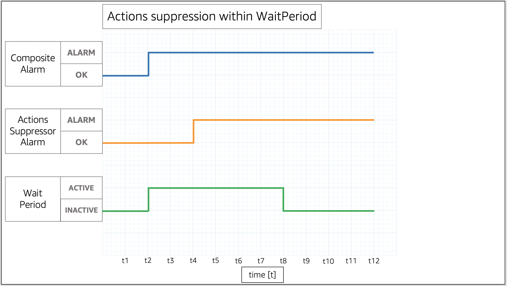
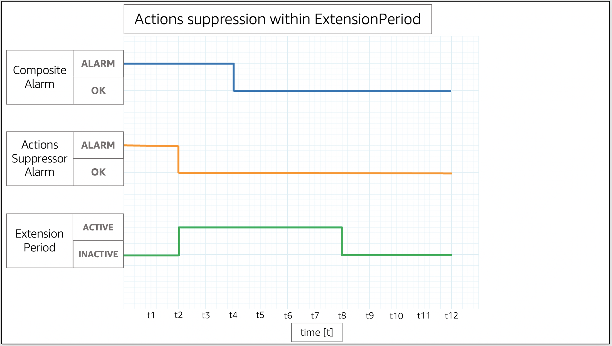
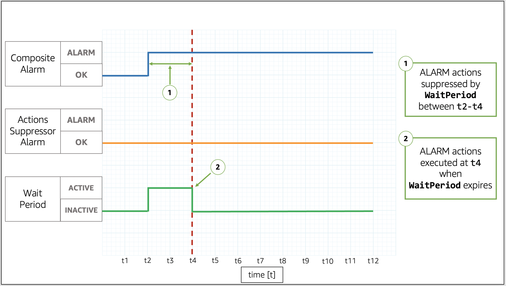
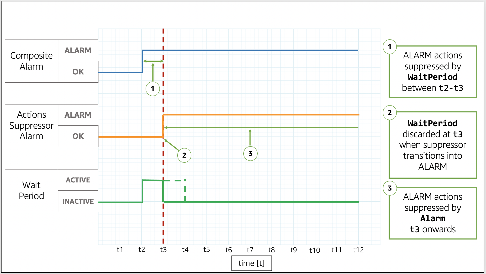
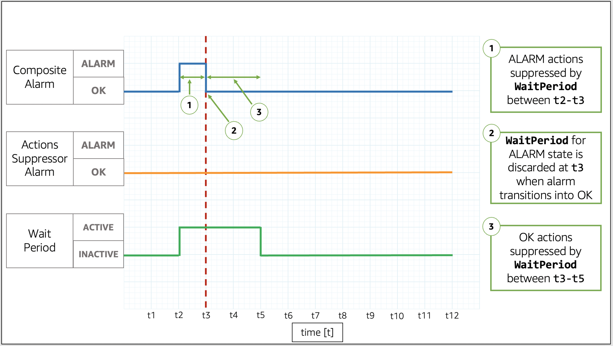
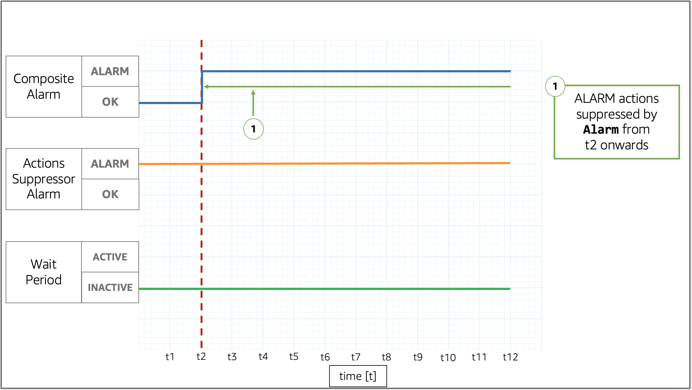
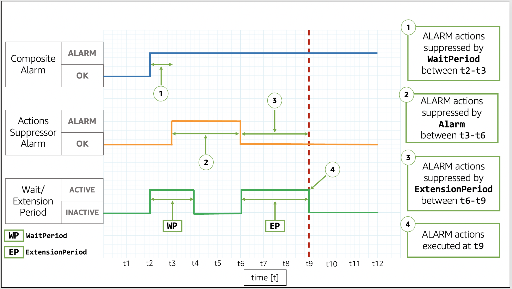
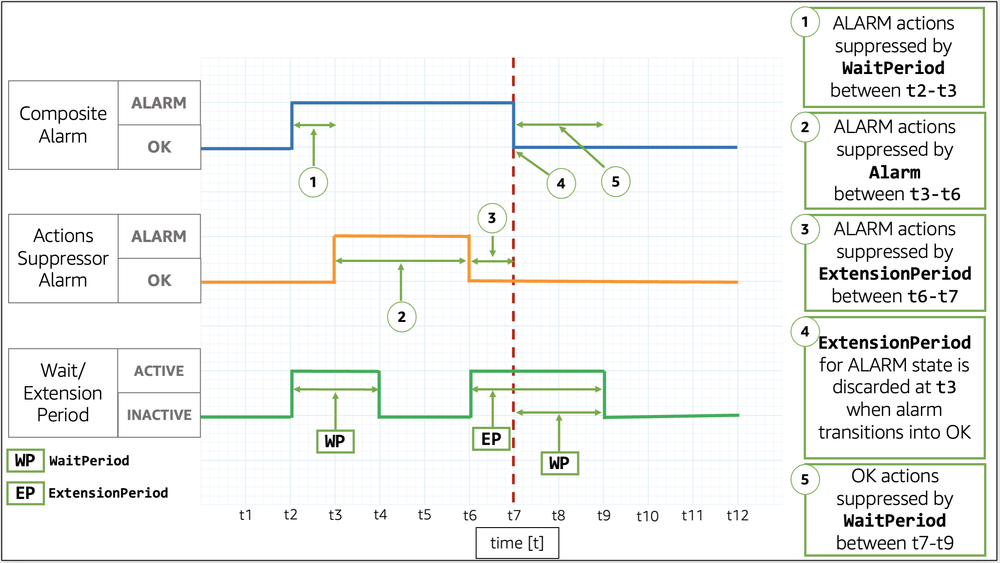

# Suppressing composite alarm actions

Because composite alarms allow you to get an aggregated view of your health across
multiple alarms, there are common situations where it is expected for those alarms to
trigger. For example, during a maintenance window of your application or when you
investigate an ongoing incident. In such situations, you may want to suppress the actions of
your composite alarms, to prevent unwanted notifications or the creation of new incident
tickets

With composite alarm action suppression, you define alarms as suppressor alarms.
Suppressor alarms prevent composite alarms from taking actions. For example, you can specify
a suppressor alarm that represents the status of a supporting resource. If the supporting
resource is down, the suppressor alarm prevents the composite alarm from sending
notifications. Composite alarm action suppression helps you reduce alarm noise, so you spend
less time managing your alarms and more time focusing on your operations.

You specify suppressor alarms when you configure composite alarms. Any alarm can
function as a suppressor alarm. When a suppressor alarm changes states from `OK`
to `ALARM`, its composite alarm stops taking actions. When a suppressor alarm
changes states from `ALARM` to `OK`, its composite alarm resumes
taking actions.

## `WaitPeriod` and `ExtensionPeriod`

When you specify a suppressor alarm, you set the parameters `WaitPeriod`
and `ExtensionPeriod`. These parameters prevent composite alarms from taking
actions unexpectedly while suppressor alarms change states. Use `WaitPeriod` to
compensate for any delays that can occur when a suppressor alarm changes from
`OK` to `ALARM`. For example, if a suppressor alarm changes from
`OK` to `ALARM` within 60 seconds, set `WaitPeriod` to
60 seconds.

In the image, the composite alarm changes from `OK` to `ALARM`
at t2. A `WaitPeriod` starts at t2 and ends at t8. This gives the suppressor
alarm time to change states from `OK` to `ALARM` at t4 before it
suppresses the composite alarm's actions when the `WaitPeriod` expires at t8.

Use `ExtensionPeriod` to compensate for any delays that can occur when a
composite alarm changes to `OK` following a suppressor alarm changing to
`OK`. For example, if a composite alarm changes to `OK` within 60
seconds of a suppressor alarm changing to `OK`, set
`ExtensionPeriod` to 60 seconds.

In the image, the suppressor alarm changes from `ALARM` to `OK`
at t2. An `ExtensionPeriod` starts at t2 and ends at t8. This gives the
composite alarm time to change from `ALARM` to `OK` before the
`ExtensionPeriod` expires at t8.

Composite alarms don't take actions when `WaitPeriod` and
`ExtensionPeriod` become active. Composite alarms take actions that are based
on their currents states when `ExtensionPeriod` and `WaitPeriod`
become inactive. We recommend that you set the value for each parameter to 60
seconds, as CloudWatch evaluates metric alarms every minute. You can set the parameters to any
integer in seconds.

The following examples describe in more detail how `WaitPeriod` and
`ExtensionPeriod` prevent composite alarms from taking actions unexpectedly.

###### Note

In the following examples, `WaitPeriod` is configured as 2 time units,
and `ExtensionPeriod` is configured as 3 time units.

### Examples

**Example 1: Actions are not suppressed after `WaitPeriod`**

In the image, the composite alarm changes states from `OK` to
`ALARM` at t2. A `WaitPeriod` starts at t2 and ends at t4, so it
can prevent the composite alarm from taking actions. After the `WaitPeriod`
expires at t4, the composite alarm takes its actions because the suppressor alarm is
still in `OK`.

**Example 2: Actions are suppressed by alarm before `WaitPeriod`
expires**

In the image, the composite alarm changes states from `OK` to
`ALARM` at t2. A `WaitPeriod` starts at t2 and ends at t4. This
gives the suppressor alarm time to change states from `OK` to
`ALARM` at t3. Because the suppressor alarm changes states from
`OK` to `ALARM` at t3, the `WaitPeriod` that started
at t2 is discarded, and the suppressor alarm now stops the composite alarm from taking
actions.

**Example 3: State transition when actions are suppressed by
`WaitPeriod`**

In the image, the composite alarm changes states from `OK` to
`ALARM` at t2. A `WaitPeriod` starts at t2 and ends at t4. This
gives the suppressor alarm time to change states. The composite alarm changes back to
`OK` at t3, so the `WaitPeriod` that started at t2 is discarded.
A new `WaitPeriod` starts at t3 and ends at t5. After the new
`WaitPeriod` expires at t5, the composite alarm takes its actions.

**Example 4: State transition when actions are suppressed by alarm**

In the image, the composite alarm changes states from `OK` to
`ALARM` at t2. The suppressor alarm is already in `ALARM`. The
suppressor alarm stops the composite alarm from taking actions.

**Example 5: Actions are not suppressed after `ExtensionPeriod`**

In the image, the composite alarm changes states from `OK` to
`ALARM` at t2. A `WaitPeriod` starts at t2 and ends at t4. This
gives the suppressor alarm time to change states from `OK` to
`ALARM` at t3 before it suppresses the composite alarm's actions until t6.
Because the suppressor alarm changes states from `OK` to `ALARM`
at t3, the `WaitPeriod` that started at t2 is discarded. At t6, the
suppressor alarm changes to `OK`. An `ExtensionPeriod` starts at
t6 and ends at t9. After the `ExtensionPeriod` expires, the composite alarm
takes its actions.

**Example 6: State transition when actions are suppressed by
`ExtensionPeriod`**

In the image, the composite alarm changes states from `OK` to
`ALARM` at t2. A `WaitPeriod` starts at t2 and ends at t4. This
gives the suppressor alarm time to change states from `OK` to
`ALARM` at t3 before it suppresses the composite alarm's actions until t6.
Because the suppressor alarm changes states from `OK` to `ALARM`
at t3, the `WaitPeriod` that started at t2 is discarded. At t6, the
suppressor alarm changes back to `OK`. An `ExtensionPeriod` starts
at t6 and ends at t9. When the composite alarm changes back to `OK` at t7,
the `ExtensionPeriod` is discarded, and a new `WaitPeriod` starts
at t7 and ends at t9.

###### Tip

If you replace the action suppressor alarm, any active `WaitPeriod` or
`ExtensionPeriod` is discarded.
