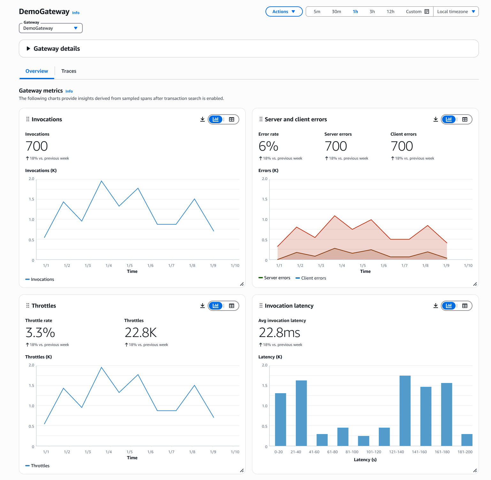

# Gateways

Monitor how your agents discover and interact with external tools and services through AgentCore Gateway. For more information on Amazon Bedrock AgentCore Gateway,
see [Amazon Bedrock AgentCore Gateway](../../../bedrock-agentcore/latest/devguide/gateway.md "../../../bedrock-agentcore/latest/devguide/gateway.md"). Gateway observability includes
comprehensive monitoring across multiple areas:

- Track API transformation success rates and response times for external service calls
- Monitor tool discovery patterns and usage frequency across different agents
- Analyze authentication and authorization flows for third-party service access
- Observe data transformation accuracy when converting between different API formats
- Track error rates and retry patterns for external service integrations

Choose **View details** to view the gateway metrics in graphs.

Under **Gateways**, choose a gateway **Name** to view the dashboard.

- **Overview** – Displays the sampled spans after transaction search is enabled.
- **Traces** – Displays the traces for agents. Under **Traces**,
  choose **Trace ID** to view the traces for a specific gateway and use the dashboard to deep dive into the agent and gateway responses.

###### Note

The **Traces** tab experience and fields are similar across **Built-in tools**, **Gateways**,
**Memory**, and **Identity** observability. For more information on the fields, see [Code interpreter tool](Built-in-tools.md#Code-interpreter-tool "Built-in-tools.md#Code-interpreter-tool").
