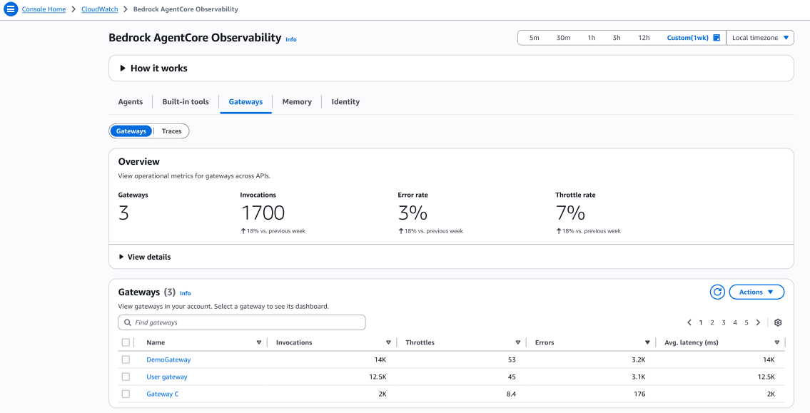
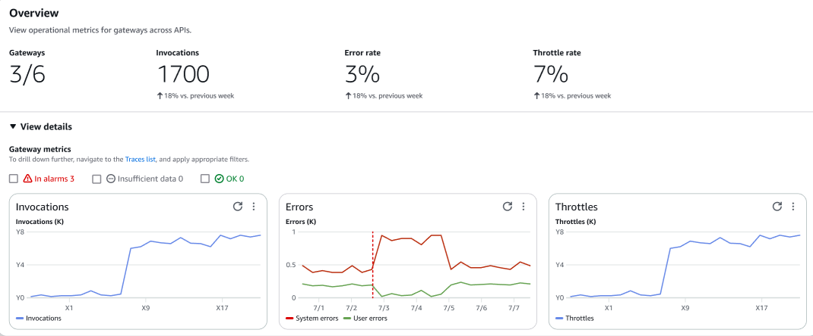

# Gateways

Monitor how your agents discover and interact with external tools and services through AgentCore Gateway. For more information on Amazon Bedrock AgentCore Gateway,
see [Amazon Bedrock AgentCore Gateway](../../../bedrock-agentcore/latest/devguide/gateway.md "../../../bedrock-agentcore/latest/devguide/gateway.md"). Gateway observability includes
comprehensive monitoring across multiple areas:

- Track API transformation success rates and response times for external service calls
- Monitor tool discovery patterns and usage frequency across different agents
- Analyze authentication and authorization flows for third-party service access
- Observe data transformation accuracy when converting between different API formats
- Track error rates and retry patterns for external service integrations

Expand the **View details** section to view the gateway metrics in graphs.

Under **Gateways**, choose a gateway **Name** to view the dashboard.
You can also sort the list of gateways by click the column headers in the table.

