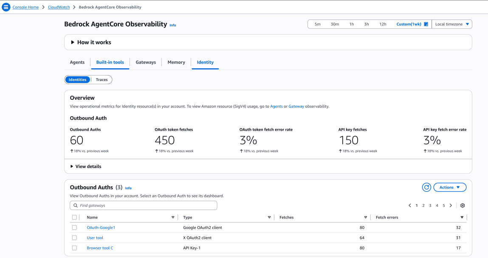
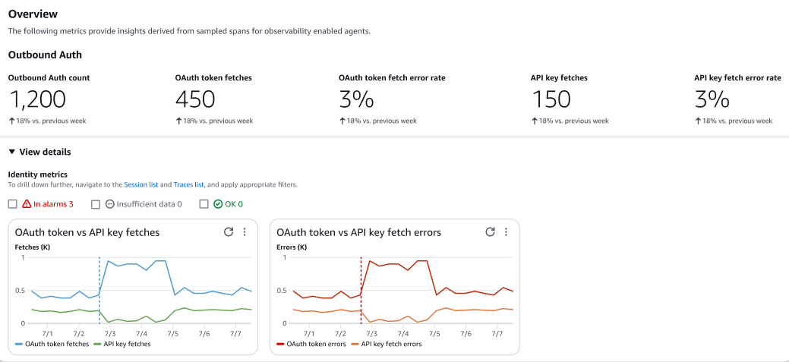
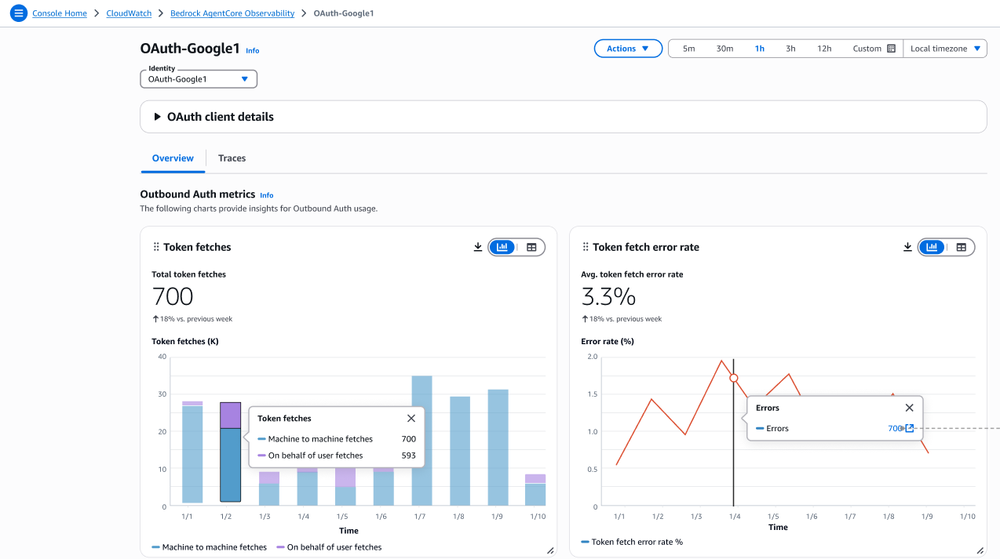
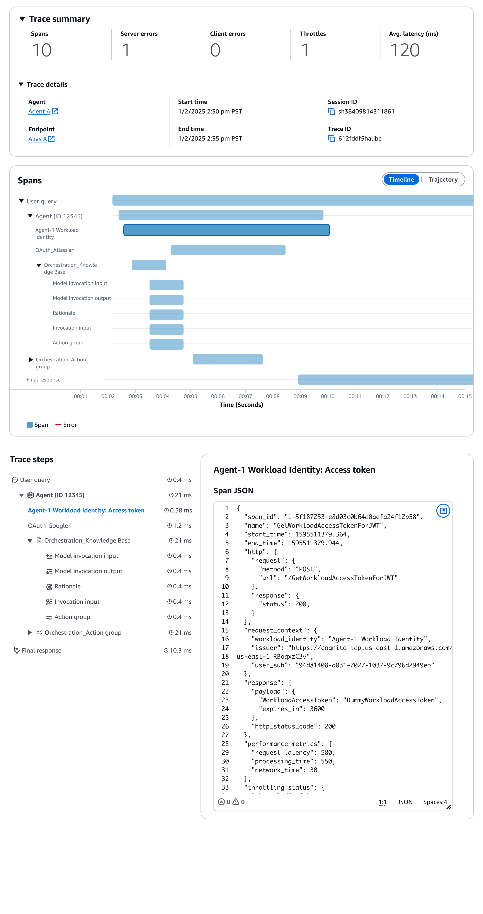

# Identity

Track identity and access management operations to ensure secure and compliant agent behavior. For more information on Amazon Bedrock Identity, 
 see [Create agent and tool identities with AgentCore Identity](https://docs.aws.amazon.com/bedrock-agentcore/latest/devguide/identity.html "https://docs.aws.amazon.com/bedrock-agentcore/latest/devguide/identity.html") . Identity observability includes monitoring for different 
 authentication methods:

* **Identities** – Access detailed trace information for identity operations
* **Traces** – Apply advanced filters to analyze specific trace patterns
Under **Identities**, you will see the following:

* **Outbound Auth** – Total number of outbound authentication requests initiated by Amazon Bedrock
 AgentCore to external identity providers
* **OAuth token fetches** – Number of OAuth access tokens successfully retrieved from configured OAuth 
 providers for agent authentication
* **OAuth token fetch error rate** – Percentage of OAuth token retrieval attempts that failed due to network issues, 
 invalid credentials, or provider errors
* **API key fetches** – Number of API keys retrieved from configured key management systems for authenticating agent requests
* **API key fetch error rate** – Percentage of API key retrieval attempts that failed due to access issues, invalid keys, or system errors
Choose **View details** to see the Identity metrics in
 graphs.

Under **Outbound Auths**, choose a outbound auth **Name** to view the dashboard.

On the **OAuth client details** page, you will see the following tabs:

* **Overview** – Displays comprehensive outbound authentication usage metrics and patterns for OAuth clients

	+ **Token fetches** – Total number of authentication token requests made by agents, including both machine-to-machine and on-behalf-of-user authentication flows. This metric tracks overall authentication activity and helps with capacity planning for identity services
	+ **Token fetch error rate** – Percentage of failed token requests out of total authentication attempts. Monitor this metric to identify authentication issues, expired credentials, or permission problems. Trends over time help detect degrading authentication performance
* **Traces** – Displays detailed trace information for identity and authentication operations, including OAuth flows, workload identity token requests, and third-party service integrations. Use traces to troubleshoot authentication failures, analyze token fetch latency, and monitor security compliance across agent interactions

