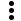

# Create an investigation

You can start an investigation from several AWS consoles, including (but not limited
to) CloudWatch alarm pages, CloudWatch metric pages, and Lambda monitoring pages.

###### To start an investigation from an AWS console page

1. In **Account-level** select the graph of the metric or alarm
   that you want to investigate.
2. If the top of the page has an **Investigate** button, choose
   it and then choose **Start new investigation**.

Otherwise, choose the vertical ellipsis menu icon

for the metric, and choose
**Investigate**, **Start a new
investigation**. 3. In the **Investigation** pane, enter a name for the
investigation in **New investigation title**, and optionally
enter notes about the selected metric or alarm. 4. Under **Approximate impact start time** CloudWatch investigations recommends a
timestamp to investigate based on the selected telemetry. To change the
timestamp of the investigation, update the date and time. 5. Then choose **Start investigation**.

The investigation starts. CloudWatch investigations scans your telemetry data to find data that
might be associated with this situation. 6. To move the investigation data to the larger pane, choose **Open in
full page**. 7. For detailed instructions about steps that you can take while continuing the
investigation, see [View and continue an open investigation](Investigations-Continue.md "Investigations-Continue.md").

## Create an investigation from Amazon Q chat

You can ask questions about issues in your deployment in CloudWatch investigations chat. The question
could be something like "Why is my Lambda function slow today?"

When you do so, CloudWatch investigations might ask follow up questions and run a health check
regarding the issue. After the health check, the chat will prompt you about whether
you want to start an investigation.

For more information and more sample questions, see [Chatting with Amazon Q about AWS](../../../amazonq/latest/qdeveloper-ug/chat-with-q.md#example-questions-investigations "../../../amazonq/latest/qdeveloper-ug/chat-with-q.md#example-questions-investigations").

For detailed instructions about steps that you can take while continuing the
investigation after it has been started, see [View and continue an open investigation](Investigations-Continue.md "Investigations-Continue.md").

## Create an investigation from a CloudWatch alarm action

When you create a CloudWatch alarm, you can specify for it to automatically start an
investigation when it goes into ALARM state. You can do this for both metric alarms
and composite alarms. For more information, see [Start a CloudWatch investigations from an alarm](Start-Investigation-Alarm.md "Start-Investigation-Alarm.md"),
[Create a CloudWatch alarm based on a static threshold](ConsoleAlarms.md "ConsoleAlarms.md") and [Create a composite alarm](Create_Composite_Alarm.md "Create_Composite_Alarm.md").
