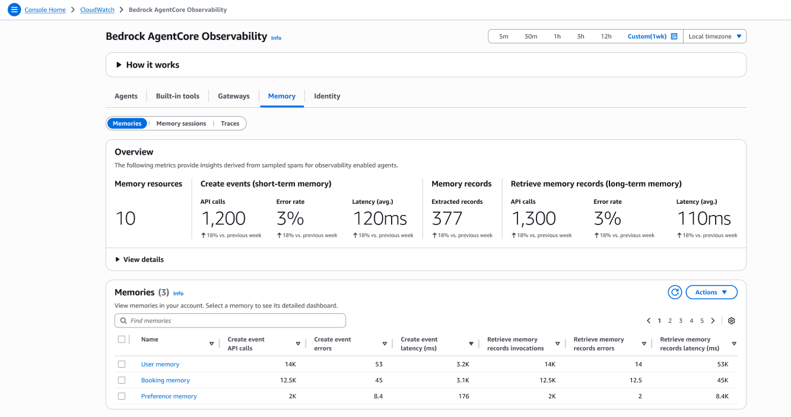
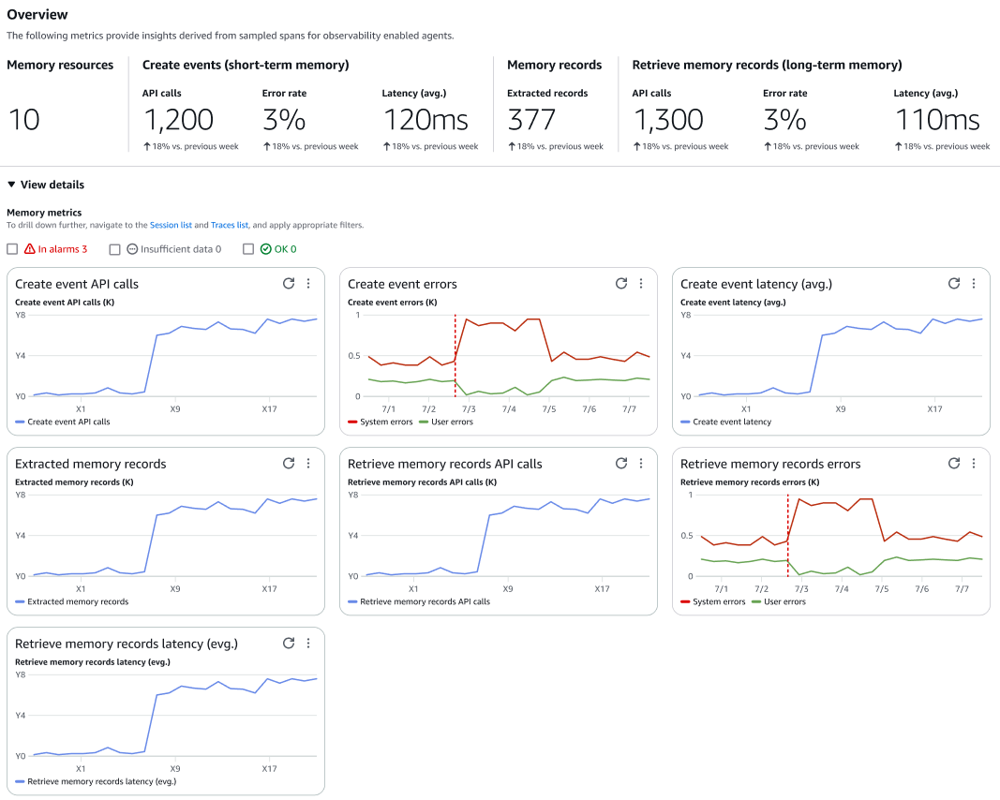
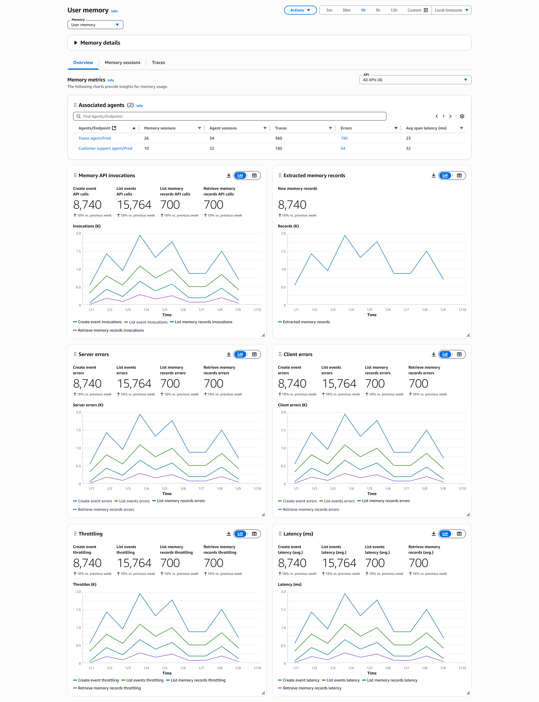

# Memory

Understand how your agents store, retrieve, and use contextual information to provide personalized experiences. For more information on Amazon Bedrock AgentCore Memory, see [Add memory to your AI agent](https://docs.aws.amazon.com/bedrock-agentcore/latest/devguide/memory.html "https://docs.aws.amazon.com/bedrock-agentcore/latest/devguide/memory.html"). Memory observability includes three key monitoring areas:

* **Memories** – Monitor memory storage and retrieval patterns
* **Memory sessions** – Monitor memory usage within individual sessions
* **Traces view** – Access detailed trace information for memory operations

To understand short-term or long-memory, see [Add memory to your AI agent](https://docs.aws.amazon.com/bedrock-agentcore/latest/devguide/memory.html "https://docs.aws.amazon.com/bedrock-agentcore/latest/devguide/memory.html") .

Choose **View details** to view the memory metrics in graphs.

Under **Memories**, you can view all the memories associated with your account. Choose a memory **Name** to view the memory details.

On the **Memory details** page, you will see the following tabs:

* **Overview** – Displays comprehensive memory performance metrics and usage patterns for the selected memory resource

	+ **Associated agents** – You can view the agents using the memory. Choose an **Agent/Endpoint**
	 to view the agent overview page.
	+ **Memory API invocations** – Total number of API calls made to memory operations including storage, retrieval, and update requests. This metric helps track memory system usage and capacity planning
	+ **Extracted memory records** – Count of memory records successfully extracted and processed from agent interactions. This includes contextual information, user preferences, and conversation history that agents store for personalization
	+ **Server errors** – Count of system errors during memory operations. High levels indicate potential infrastructure issues with memory storage or retrieval systems that require investigation
	+ **Client errors** – Errors resulting from invalid memory requests, malformed data, or permission issues. High client error rates may indicate problems with agent memory integration or data formatting
	+ **Throttling** – Number of memory requests throttled due to exceeding allowed transaction limits. Monitor this metric to determine if memory access patterns need optimization or if service quotas require adjustment
	+ **Latency** – Response time for memory operations including storage and retrieval requests. Track P50, P90, and P99 latencies to identify performance bottlenecks and optimize memory access patterns
* **Memory sessions** – You can view the session that contain short-term memory from agent interactions. Under 
 **Memory sessions**, choose **Session ID** to view the session dashboard.
* **Traces** – Displays the traces for agents. Under **Traces**, 
 choose **Trace ID** to view the traces that invoke a specific memory. You can use the traces dashboard to deep dive into the agent memory usage, and final responses.
###### Note

The **Memory sessions** and **Traces** tab experience and fields are similar across **Built-in tools**, **Gateways**,
 **Memory**, and **Identity** observability. For more information on the fields, see [Code interpreter tool](Built-in-tools.md#Code-interpreter-tool "Built-in-tools.md#Code-interpreter-tool").
