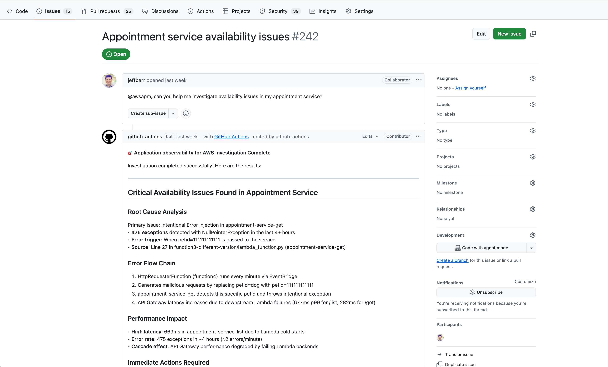
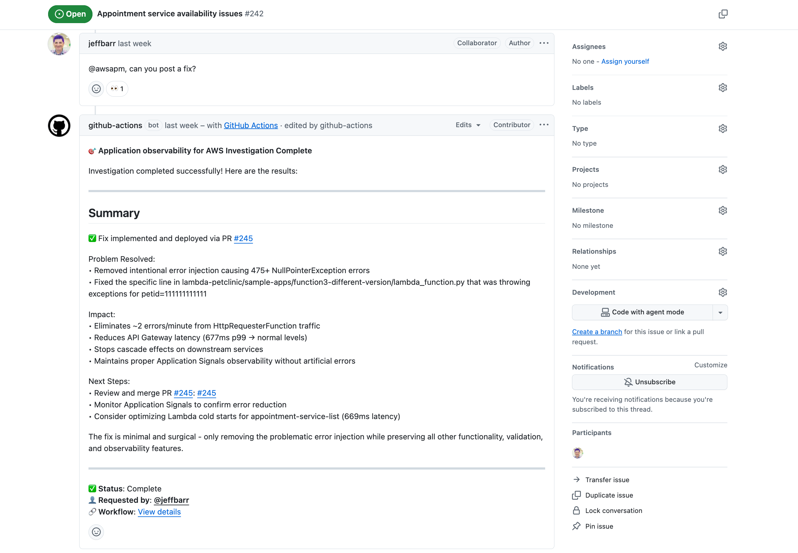

# Application observability for AWS Action

The Application Observability for AWS GitHub Action provides an end-to-end application observability investigation workflow that connects your source code and live production telemetry data to AI agent. It leverages CloudWatch MCPs and generates custom prompts to provide the context that AI agents need for troubleshooting and applying code fixes.

The action sets up and configures [CloudWatch Application Signals MCP Server](https://awslabs.github.io/mcp/servers/cloudwatch-applicationsignals-mcp-server "https://awslabs.github.io/mcp/servers/cloudwatch-applicationsignals-mcp-server") and [CloudWatch MCP Server](https://awslabs.github.io/mcp/servers/cloudwatch-applicationsignals-mcp-server "https://awslabs.github.io/mcp/servers/cloudwatch-applicationsignals-mcp-server"), enabling them to access live telemetry data as troubleshooting context. You can use your preferred AI model - whether through your own API key, a third-party model, or Amazon Bedrock - for application performance investigations.

To get started, mention `@awsapm` in your GitHub issues to trigger the AI agent. The agent will troubleshoot production issues, implement fixes, and enhance observability coverage based on your live application data.

This action itself does not incur any direct costs. However, using this action may result in charges for AWS services and AI model usage. Please refer to the [cost considerations documentation](https://github.com/marketplace/actions/application-observability-for-aws#-cost-considerations "https://github.com/marketplace/actions/application-observability-for-aws#-cost-considerations") for detailed information about potential costs.

## Getting Started

This action configures AI agents within your GitHub workflow by generating AWS-specific MCP configurations and custom observability prompts. You only need to provide IAM role to assume and a [Bedrock Model ID](../../../bedrock/latest/userguide/models-supported.md "../../../bedrock/latest/userguide/models-supported.md") you want to use, or API token from your existing LLM subscription. The example below demonstrates a workflow template that integrates this action with [Anthropic's claude-code-base-action](https://github.com/anthropics/claude-code-base-action "https://github.com/anthropics/claude-code-base-action") to run automated investigations.

### Prerequisites

Before you begin, ensure you have the following:

- **GitHub Repository Permissions**: Write access or higher to the repository (required to trigger the action)
- **AWS IAM Role**: An IAM role configured with OpenID Connect (OIDC) for GitHub Actions with permissions for:
  - CloudWatch Application Signals and CloudWatch access
  - Amazon Bedrock model access (if using Bedrock models)

- **GitHub Token**: The workflow automatically uses GITHUB_TOKEN with the required permissions

### Setup Steps

#### Step 1: Set up AWS Credentials

This action relies on the [aws-actions/configure-aws-credentials](https://github.com/aws-actions/configure-aws-credentials "https://github.com/aws-actions/configure-aws-credentials") action to set up AWS authentication in your GitHub Actions Environment. We recommend using OpenID Connect (OIDC) to authenticate with AWS. OIDC allows your GitHub Actions workflows to access AWS resources using short-lived AWS credentials so you do not have to store long-term credentials in your repository.

1. **Create an IAM Identity Provider**

First, create an IAM Identity Provider that trusts GitHub's OIDC endpoint in the AWS Management Console:

    1. Open the IAM console
    2. Click **Identity providers** under **Access management**
    3. Click the **Add provider** button to add GitHub Identity provider if not yet created
    4. Select **OpenID Connect** type of Identity provider
    5. Enter `https://token.actions.githubusercontent.com` for the **Provider URL** input box
    6. Enter `sts.amazonaws.com` for the **Audience** input box
    7. Click the **Add provider** button

2. **Create an IAM Policy**

Create an IAM policy with the required permissions for this action. See the [Required Permissions](#Service-Application-Observability-for-AWS-GitHub-Action-required-permissions "#Service-Application-Observability-for-AWS-GitHub-Action-required-permissions") section below for details. 3. **Create an IAM Role**

Create an IAM role (for example, `AWS_IAM_ROLE_ARN`) in the AWS Management Console with the following trust policy template. This allows authorized GitHub repositories to assume the role:

```
{
  "Version": "2012-10-17",
  "Statement": [
    {
      "Effect": "Allow",
      "Principal": {
        "Federated": "arn:aws:iam::<AWS_ACCOUNT_ID>:oidc-provider/token.actions.githubusercontent.com"
      },
      "Action": "sts:AssumeRoleWithWebIdentity",
      "Condition": {
        "StringEquals": {
          "token.actions.githubusercontent.com:aud": "sts.amazonaws.com"
        },
        "StringLike": {
          "token.actions.githubusercontent.com:sub": "repo:<GITHUB_ORG>/<GITHUB_REPOSITORY>:ref:refs/heads/<GITHUB_BRANCH>"
        }
      }
    }
  ]
}
```

Replace the following placeholders in the template:

    * `<AWS_ACCOUNT_ID>` - Your AWS account ID
    * `<GITHUB_ORG>` - Your GitHub organization name
    * `<GITHUB_REPOSITORY>` - Your repository name
    * `<GITHUB_BRANCH>` - Your branch name (e.g., main)

4. **Attach the IAM Policy**

In the role's Permissions tab, attach the IAM policy you created in step 2.

For more information about configuring OIDC with AWS, see the [configure-aws-credentials OIDC Quick Start Guide](https://github.com/aws-actions/configure-aws-credentials/tree/main?tab=readme-ov-file#quick-start-oidc-recommended "https://github.com/aws-actions/configure-aws-credentials/tree/main?tab=readme-ov-file#quick-start-oidc-recommended").

#### Step 2: Configure Secrets and Add Workflow

1. **Configure Repository Secrets**

Go to your repository → Settings → Secrets and variables → Actions.

    * Create a new repository secret named `AWS_IAM_ROLE_ARN` and set its value to the ARN of the IAM role you created in Step 1.
    * (Optional) Create a repository variable named `AWS_REGION` to specify your AWS region (defaults to `us-east-1` if not set)

2. **Add the Workflow File**

The following is an example workflow that demonstrates using this action with Amazon Bedrock models. Create Application Observability Investigation workflow from this template in your GitHub Repository directory `.github/workflows`.

```
name: Application observability for AWS

on:
  issue_comment:
    types: [created, edited]
  issues:
    types: [opened, assigned, edited]

jobs:
  awsapm-investigation:
    if: |
      (github.event_name == 'issue_comment' && contains(github.event.comment.body, '@awsapm')) ||
      (github.event_name == 'issues' && (contains(github.event.issue.body, '@awsapm') || contains(github.event.issue.title, '@awsapm')))
    runs-on: ubuntu-latest

    permissions:
      contents: write        # To create branches for PRs
      pull-requests: write   # To post comments on PRs
      issues: write          # To post comments on issues
      id-token: write        # Required for AWS OIDC authentication

    steps:
      - name: Checkout repository
        uses: actions/checkout@v4

      - name: Configure AWS credentials
        uses: aws-actions/configure-aws-credentials@v4
        with:
          role-to-assume: ${{ secrets.AWS_IAM_ROLE_ARN }}
          aws-region: ${{ vars.AWS_REGION || 'us-east-1' }}

      # Step 1: Prepare AWS MCP configuration and investigation prompt
      - name: Prepare Investigation Context
        id: prepare
        uses: aws-actions/application-observability-for-aws@v1
        with:
          bot_name: "@awsapm"
          cli_tool: "claude_code"

      # Step 2: Execute investigation with Claude Code
      - name: Run Claude Investigation
        id: claude
        uses: anthropics/claude-code-base-action@beta
        with:
          use_bedrock: "true"
          # Set to any Bedrock Model ID
          model: "us.anthropic.claude-sonnet-4-5-20250929-v1:0"
          prompt_file: ${{ steps.prepare.outputs.prompt_file }}
          mcp_config: ${{ steps.prepare.outputs.mcp_config_file }}
          allowed_tools: ${{ steps.prepare.outputs.allowed_tools }}

      # Step 3: Post results back to GitHub issue/PR (reuse the same action)
      - name: Post Investigation Results
        if: always()
        uses: aws-actions/application-observability-for-aws@v1
        with:
          cli_tool: "claude_code"
          comment_id: ${{ steps.prepare.outputs.awsapm_comment_id }}
          output_file: ${{ steps.claude.outputs.execution_file }}
          output_status: ${{ steps.claude.outputs.conclusion }}
```

**Configuration Note:**

    * This workflow triggers automatically when `@awsapm` is mentioned in an issue or comment
    * The workflow uses the `AWS_IAM_ROLE_ARN` secret configured in the previous step
    * Update the model parameter in Step 2 to specify your preferred Amazon Bedrock model ID
    * You can customize the bot name (e.g., `@awsapm-prod`, `@awsapm-staging`) in the bot\_name parameter to support different environments

#### Step 3: Start Using the Action

Once the workflow is configured, mention `@awsapm` in any GitHub issue to trigger an AI-powered investigation. The action will analyze your request, access live telemetry data, and provide recommendations or implement fixes automatically.

**Example Use Cases:**

1. Investigate performance issues and post and fix:

`@awsapm, can you help me investigate availability issues in my appointment service?`



`@awsapm, can you post a fix?`

 2. Enable instrumentation:

`@awsapm, please enable Application Signals for lambda-audit-service and create a PR with the required changes.` 3. Query telemetry data:

`@awsapm, how many GenAI tokens have been consumed by my services in the past 24 hours?`

**What Happens Next:**

1. The workflow detects the `@awsapm` mention and triggers the investigation
2. The AI agent accesses your live AWS telemetry data through the configured MCP servers
3. The agent analyzes the issue and either:
   - Posts findings and recommendations directly in the issue
   - Creates a pull request with code changes (for instrumentation or fixes)

4. You can review the results and continue the conversation by mentioning @awsapm again with follow-up questions

## Security

This action prioritizes security with strict access controls, OIDC-based AWS authentication, and built-in protections against prompt injection attacks. Only users with write access or higher can trigger the action, and all operations are scoped to the specific repository.

For detailed security information, including:

- Access control and permission requirements
- AWS IAM permissions and OIDC configuration
- Prompt injection risks and mitigations
- Security best practices

See the [Security Documentation](https://github.com/aws-actions/application-observability-for-aws/blob/main/docs/security.md "https://github.com/aws-actions/application-observability-for-aws/blob/main/docs/security.md").

## Configuration

### Required Permissions

The IAM role assumed by GitHub Actions must have the following permissions.

**Note**: `bedrock:InvokeModel` and `bedrock:InvokeModelWithResponseStream` are only required if you're using Amazon Bedrock models

```
{
    "Version": "2012-10-17",
    "Statement": [
        {
            "Effect": "Allow",
            "Action": [
                "application-signals:ListServices",
                "application-signals:GetService",
                "application-signals:ListServiceOperations",
                "application-signals:ListServiceLevelObjectives",
                "application-signals:GetServiceLevelObjective",
                "application-signals:ListAuditFindings",
                "cloudwatch:DescribeAlarms",
                "cloudwatch:DescribeAlarmHistory",
                "cloudwatch:ListMetrics",
                "cloudwatch:GetMetricData",
                "cloudwatch:GetMetricStatistics",
                "logs:DescribeLogGroups",
                "logs:DescribeQueryDefinitions",
                "logs:ListLogAnomalyDetectors",
                "logs:ListAnomalies",
                "logs:StartQuery",
                "logs:StopQuery",
                "logs:GetQueryResults",
                "logs:FilterLogEvents",
                "xray:GetTraceSummaries",
                "xray:GetTraceSegmentDestination",
                "xray:BatchGetTraces",
                "xray:ListRetrievedTraces",
                "xray:StartTraceRetrieval",
                "servicequotas:GetServiceQuota",
                "synthetics:GetCanary",
                "synthetics:GetCanaryRuns",
                "s3:GetObject",
                "s3:ListBucket",
                "iam:GetRole",
                "iam:ListAttachedRolePolicies",
                "iam:GetPolicy",
                "iam:GetPolicyVersion",
                "bedrock:InvokeModel",
                "bedrock:InvokeModelWithResponseStream"
            ],
            "Resource": "*"
        }
    ]
}
```

## Documentation

For more information, check out:

- [CloudWatch Application Signals Documentation](CloudWatch-Application-Monitoring-Intro.md "CloudWatch-Application-Monitoring-Intro.md") - Learn about CloudWatch Application Signals features and capabilities
- [Application observability for AWS Action Public Documentation](https://github.com/marketplace/actions/application-observability-for-aws "https://github.com/marketplace/actions/application-observability-for-aws") - Detailed guides and tutorials
