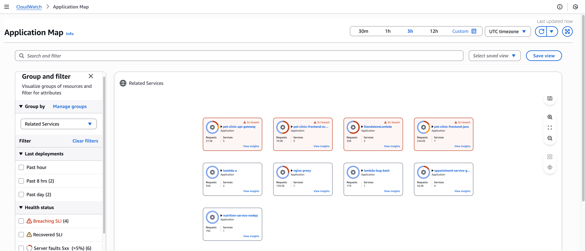
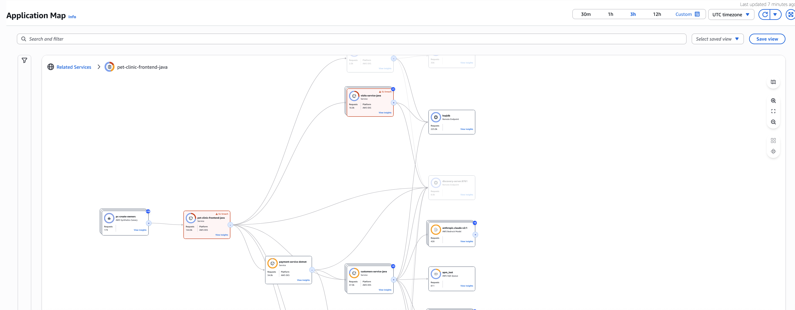
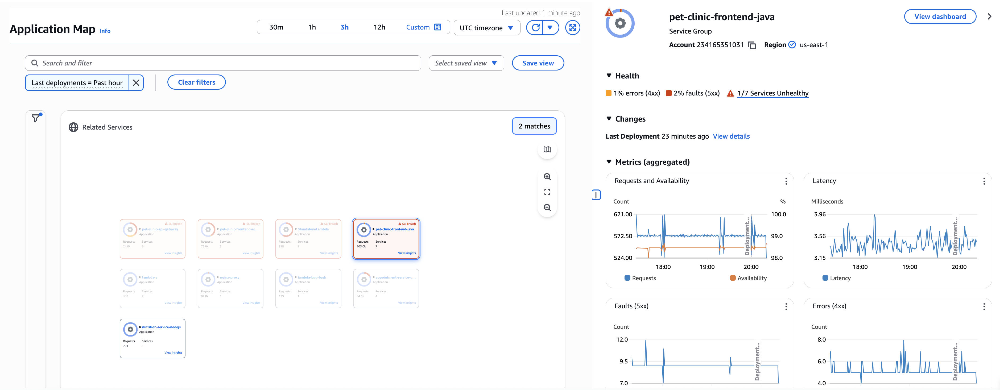
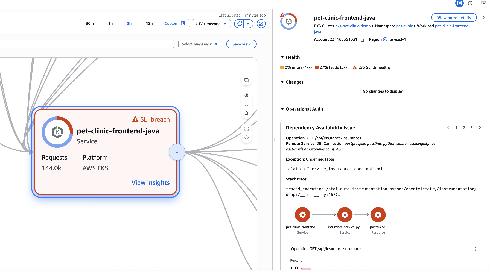
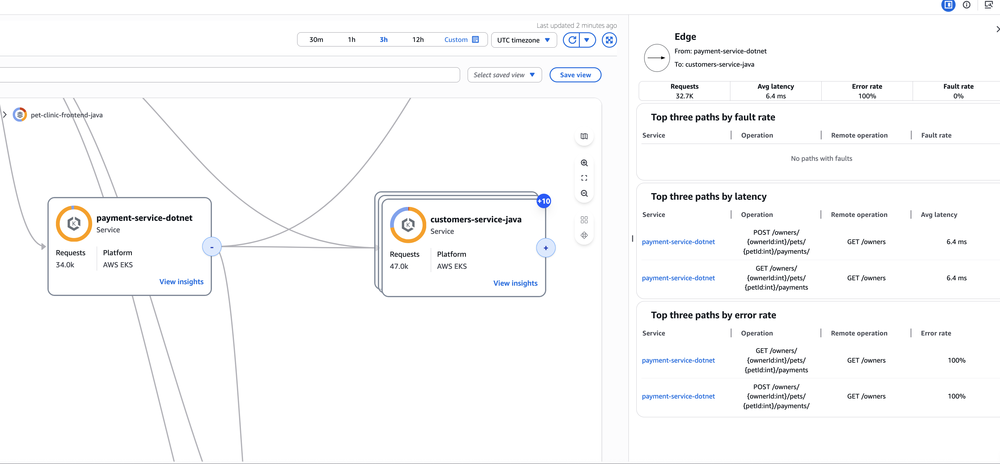
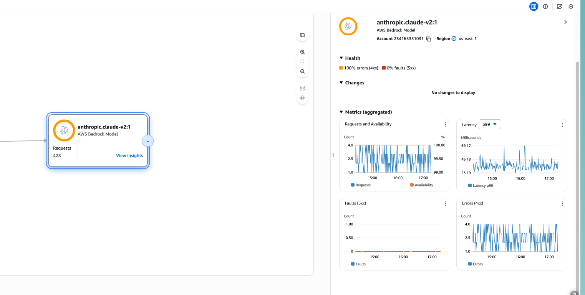
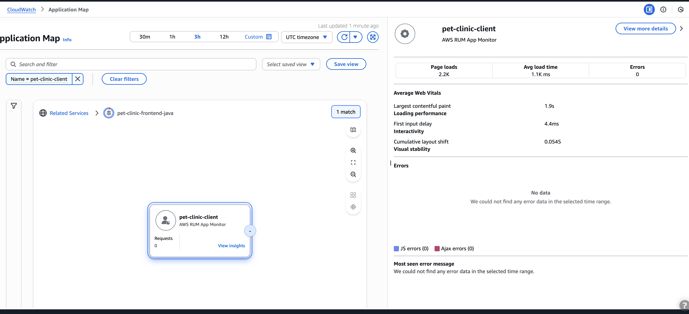
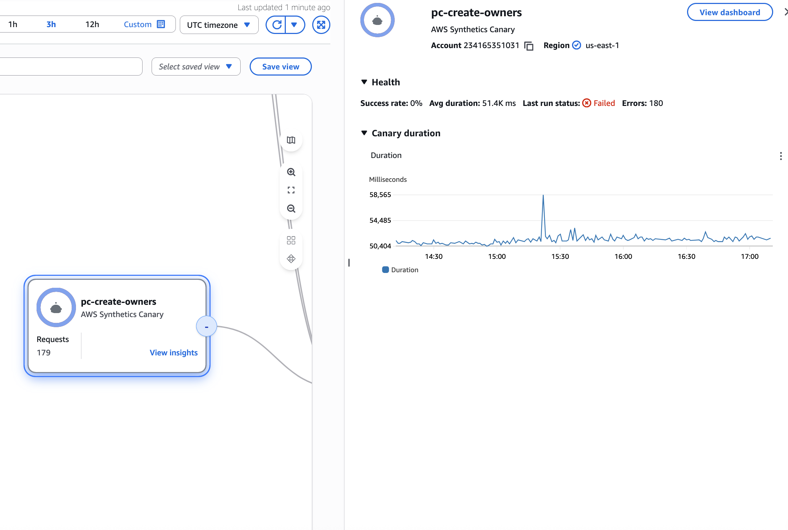

# View your application topology and monitor operational health with
 the CloudWatch application map

###### Note

The CloudWatch application map replaces the Service Map. To see a map of your application based
 on AWS X-Ray traces, open the [X-Ray Trace Map](https://docs.aws.amazon.com/xray/latest/devguide/xray-console-servicemap.html "https://docs.aws.amazon.com/xray/latest/devguide/xray-console-servicemap.html"). Choose
 **Trace Map** under the **X-Ray** section in the left
 navigation pane of the CloudWatch console. 

After enabling your application for Application Signals, the application map displays nodes representing your groups. You then drill down in these groups to view your services and their dependencies.
 Use the application map to view the topology of your application clients, synthetics canaries,
 services and dependencies, and monitor operational health. To view the application map, open the
 [CloudWatch console](https://console.aws.amazon.com/cloudwatch/ "https://console.aws.amazon.com/cloudwatch/") and choose **Application
 Map** under the **Application Signals** section in the left
 navigation pane.

After you [enable your application for
 Application Signals](CloudWatch-Application-Signals-Enable.md "CloudWatch-Application-Signals-Enable.md"), use the application map to make it easier to monitor your
 application's operational health:


* View connections between client, canary, service, and dependency nodes to help you
 understand your application topology and execution flow. This is especially helpful if your
 service operators are not your development team.
* See which services are meeting or not meeting your [service level objectives (SLOs)](CloudWatch-ServiceLevelObjectives.md "CloudWatch-ServiceLevelObjectives.md"). When a
 service is not meeting your SLOs, you can quickly identify whether a downstream service or
 dependency might be contributing to the issue or impacting multiple upstream services.
* Select an individual client, synthetics canary, service, or dependency node to see
 related metrics. The [Service details](ServiceDetail.md "ServiceDetail.md") page shows more
 detailed information about operations, dependencies, synthetics canaries, and client pages.
* Filter and zoom the application map to make it easier to focus on a part of your application
 topology, or see the entire map. Create a filter by choosing one or more properties from the
 filter text box. As you choose each property, you are guided through filter criteria. You
 will see the complete filter below the filter text box. Choose **Clear
 filters** at any time to remove the filter.
* Group and filter services to create customized views that match your workflows. This organization helps you quickly find and access the services you use most frequently
* Save your filtered and grouped views to quickly return to frequently used configurations

## Explore the application map


When you visit the application map, by default it shows services grouped by **Related services**. Related services group services based on their dependencies. For example, if Service A calls Service B, which calls Service C, they're grouped under Service A. You can view SLI health, metrics and service count for all services in each group.




### Dynamic grouping and filtering


You can click the **Group by** dropdown to use different grouping options. By default, Application Map provides 2 groupings:


* **Related services** - Groups services based on their dependencies
* **Environment** - Groups services by their environment

If you want to define your own custom grouping, click **Manage groups** to define custom groups and then tag your services or add OTEL Resource Attributes with the group key.


Default grouping in Application Signals automatically organizes services based on their downstream dependencies. The system analyzes the service dependency graph and creates groups where the root node (a service with no upstream dependencies) becomes the group name. All services that depend on this root service, either directly or indirectly, are automatically included in the group. For example, if Service A calls Service B, which in turn calls Service C, all three services will be grouped together with Service A as the group name since it's the root of the dependency chain. This automatic grouping mechanism provides a natural way to visualize and manage related services based on their actual runtime interactions and dependencies.


### Group actions and insights


For each group, you can perform the following actions:


* Click **View insight** to view metrics charts and last deployment time for the group
* Click **View dashboard** to view metrics dashboard and service list for the group

You can also use **Group and filter** on the left bar to filter groups which have services with deployment time, SLI health status or compute platform type.


Use the **Search and filter** bar to search groups by name or search groups which contain specific service environment or dependency.


### Configuring custom groups


Custom grouping allows you to organize your services logically based on your business requirements and operational priorities. This feature enables you to view and save defined views prioritized by your specific needs,
 create groups based on team ownership, and assemble groups of services needed for critical business transactions.


Create the custom group names (the group names you will see in the UI) and the corresponding group key names. Complete this step either from the Application Signals UI or
 using the [PutGroupingConfiguration](https://docs.aws.amazon.com/applicationsignals/latest/APIReference/API_PutGroupingConfiguration.html "https://docs.aws.amazon.com/applicationsignals/latest/APIReference/API_PutGroupingConfiguration.html") API.


Group key names can be either, AWS tag key or OTEL resource attribute for your service. When deciding between tags and OTEL resource attributes, consider your compute platform:


* For single-service platforms (for example, Lambda or Auto Scaling Group) – Use AWS tags
* For multi-service platforms (for example, Amazon EKS cluster) – Use OTEL resource attributes for more granular grouping

**Adding AWS tags**


Add an AWS tag with the custom group key as a key and a value to an Amazon EKS cluster. When there are multiple services running in one Amazon EKS cluster all of them are 
 tagged with the same custom group key. For example, when Amazon EKS Cluster A has Service 1, Service 2 and Service 3 running, adding an AWS tag with key *Team X* 
 to the cluster will add all three services to *Team X*. To add only specific services to *Team X*, add OTEL resource attributes for the services as shown below.


**Adding OTEL resource attributes**


To add an OTEL resource attribute, see the configuration below:


**General configuration**


Configure the `OTEL_RESOURCE_ATTRIBUTES` environment variable in your application using the custom group key-value pairs. The keys are listed under 
 `aws.application_signals.metric_resource_keys` separated by `&`.


For example, to create custom groups using `Application=PetClinic` and `Owner=Test`, use the following:


```
OTEL_RESOURCE_ATTRIBUTES=Application=PetClinic,Owner=Test,aws.application_signals.metric_resource_keys=Application&Owner
```

**Platform-specific configuration**


The following are the deployment specifications.


**Amazon EKS and native kubernetes**


```
apiVersion: apps/v1
kind: Deployment
metadata:
  ...
spec:
  replicas: 1
  ...
  template:
    spec:
      containers:
      - name: your-app
        image: your-app-image
        env:
          ...
          - name: OTEL_RESOURCE_ATTRIBUTES
            value: Application=PetClinic,Owner=Test,aws.application_signals.metric_resource_keys=Application&Owner
```

**Amazon EC2**


Add `OTEL_RESOURCE_ATTRIBUTES` to your application start script. For the complete example, see [Adding `OTEL_RESOURCE_ATTRIBUTES`](CloudWatch-Application-Signals-Enable-EC2Main.md#CloudWatch-Application-Signals-Monitor-EC2 "CloudWatch-Application-Signals-Enable-EC2Main.md#CloudWatch-Application-Signals-Monitor-EC2").


```
...
OTEL_RESOURCE_ATTRIBUTES="service.name=$YOUR_SVC_NAME,Application=PetClinic,Owner=Test,aws.application_signals.metric_resource_keys=Application&Owner" \
java -jar $MY_JAVA_APP.jar
```

**Amazon ECS**


Add `OTEL_RESOURCE_ATTRIBUTES` to the TaskDefinition. For the complete example, see [Enable on Amazon ECS](CloudWatch-Application-Signals-Enable-ECSMain.md "CloudWatch-Application-Signals-Enable-ECSMain.md").


```
{
  "name": "my-app",
   ...
  "environment": [
    {
      "name": "OTEL_RESOURCE_ATTRIBUTES",
      "value": "service.name=$YOUR_SVC_NAME,Application=PetClinic,Owner=Test,aws.application_signals.metric_resource_keys=Applicationmanagement portalOwner"
    }, 
    ...
  ]
}
```

**Lambda**


Add `OTEL_RESOURCE_ATTRIBUTES` to the Lambda environment variable.


```
OTEL_RESOURCE_ATTRIBUTES="Application=PetClinic,Owner=Test,aws.application_signals.metric_resource_keys=Application&Owner"
```

### Viewing services within groups


To view services and their dependencies in a group, click on the Group name. It will show a map of services inside the group. Each service node will show SLI health, metrics and platform details. Services with SLI breach are highlighted to be easily recognizable.




All Canaries, RUM Clients and AWS Service nodes will be collapsed by default. If services in this group call services which are not part of this group, they will also be collapsed by default.


If your map is still too large to investigate effectively, you can apply nested grouping to narrow down your investigation. For example, after grouping services by **Business Unit**, if you still have too many services in a group, use the Group by dropdown to select **Team**, creating a nested grouping structure.


### Service insights and details


While on this page you can also click **Save view** next to search bar to save your view so next time you don't have to apply the same grouping and filtering again.


Click on **View insights** in service node to view Service Audit, Change events, SLI health and Metrics graphs.




If you want to view service operation and other service detail, click on **view more details** to go to service overview page.


Alternatively you can click on Edge to view metrics of a specific dependency call of a service.


### Last deployment tracking


Track deployment activities with Application Signals' automatic processing of CloudTrail events. Monitor deployment times for services and their dependencies, providing immediate context for operational analysis and troubleshooting. Application Signals automatically correlates deployment times with performance changes, helping you quickly identify if recent deployments contributed to service issues. View deployment history and impact across your services without additional configuration or setup requirements.


### Audit findings


Discover critical insights through Application Signals' audit findings. Application Signals analyzes your applications to report significant observations. These automated findings help you easily identify root cause of service health issues. Application Signals employs advanced analytics to detect patterns, highlight resource inefficiencies, and suggest optimization opportunities. Findings are prioritized based on severity and potential business impact, enabling teams to focus on the most critical issues first. Get actionable recommendations for improving service reliability and performance without manual analysis.


Choose a tab for information about exploring each kind of node and the edges (connections)
 between them.


View your application services
You can view your application services and the status of their SLOs and service
 level indicators (SLIs) in the **Application Map**. If you didn't create
 SLOs for a service, choose the **Create SLO** button below the service
 node.


 The **Application Map** displays all of your services. It also shows
 the customers and canaries that consume the service and the dependencies that your
 services calls, as shown in the following image:




When you select a service node, a pane opens displaying detailed service
 information: 


* Total error and fault rate.
* The number of SLIs and SLOs that are `healthy` or
 `unhealthy`.
* The option to view more information about an SLO.
* The `Cluster`, `Namespace`, and `Workload` for services hosted in Amazon EKS, or Environment for services hosted in Amazon ECS or Amazon EC2. For Amazon EKS-hosted services, choose any link to open CloudWatch Container Insights.
* AccountId and region.
* The **Change** section showing recent deployment history and timing.
* The **Operational Audit** tab providing automated audit findings and recommendations.
* Service Metrics chart of Availability, latency, fault and errors.

Select an edge or connection between a service node and a downstream service or
 dependency node. This opens a pane containing top paths by fault rate, latency, and
 error rate, as shown in the following example image. Choose any link in the pane to open
 the [Service details](ServiceDetail.md "ServiceDetail.md") page and see detailed
 information for the chosen service or dependency.




When you select a edge node, a pane opens displaying detailed service information: 


* Total request count, latency, error rate and fault rate
* Top path by fault rate
* Top path by latency
* Top path by error rate


View dependencies
Your application dependencies are displayed on the application map, connected to the
 services that call them.


Choose a dependency node to open a pane containing error rate and fault rate, metrics chart for request, availability, latency, fault rate, and error rate.





View clients
After you [turn on
 X-Ray tracing](CloudWatch-RUM-get-started-create-app-monitor.md "CloudWatch-RUM-get-started-create-app-monitor.md") for your CloudWatch RUM web clients, they display on the application map connected to services they call.


Choose a client node to open a pane displaying detailed client information:


* Metrics for page loads, average load time, errors, and average web vitals
* A graph displaying a breakdown of errors
* A link to display the client details in CloudWatch RUM




Choose **View dashboard** to open the canary details.


View synthetics canaries
To view canaries on your application map, turn on [turn on
 X-Ray tracing](CloudWatch-RUM-get-started-create-app-monitor.md "CloudWatch-RUM-get-started-create-app-monitor.md") for your CloudWatch Synthetics canaries. Once enabled, canaries will appear connected to their called services on the application map.


The system groups canaries together by default into a single expandable icon. The detailed canary information pane displays metrics, traces, and status information.


Choose a canary node to open a pane displaying detailed canary information, as shown
 in the following image:




Choose **View dashboard** to open the canary details.
