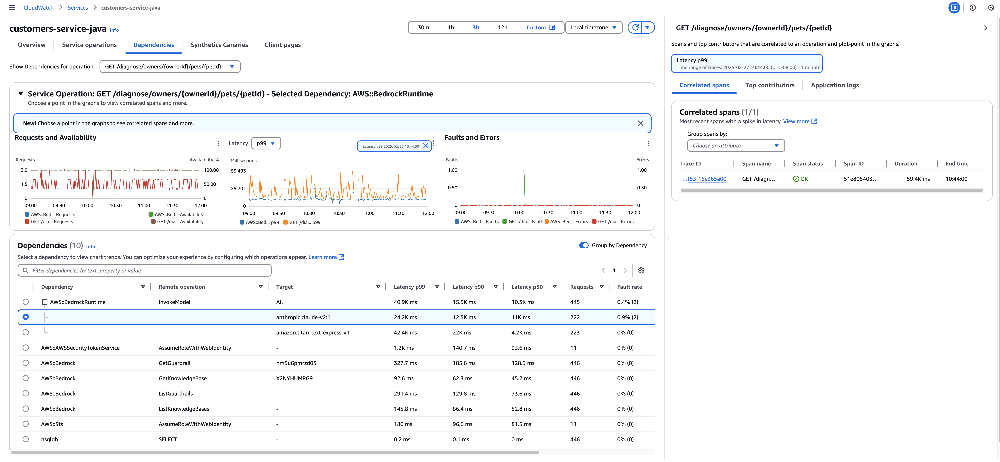
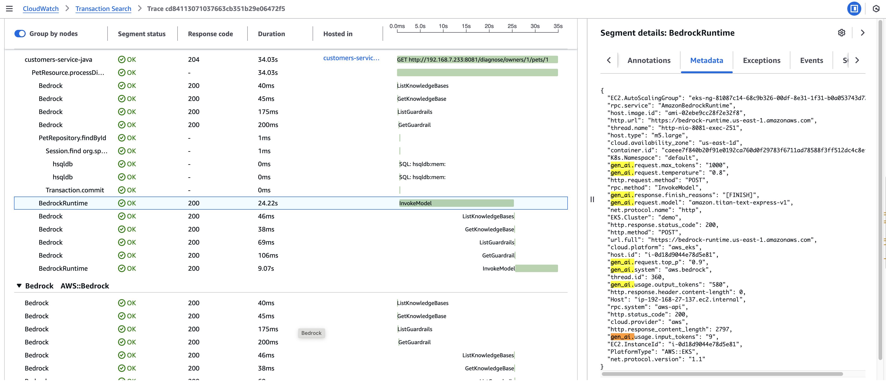
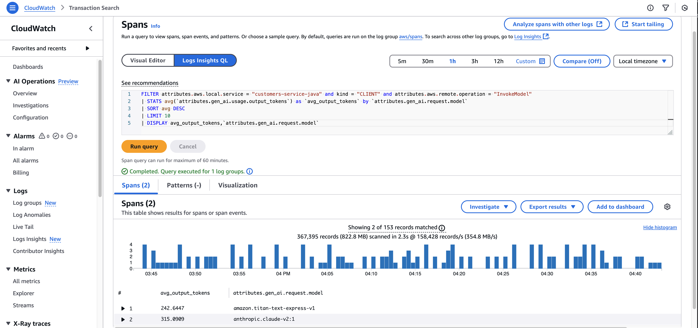

# Example: Use Application Signals to troubleshoot generative AI applications interacting with Amazon Bedrock models

You can use Application Signals to troubleshoot your generative AI applications that
interact with Amazon Bedrock models.
Application Signals streamlines this process by providing out-of-the-box telemetry data, offering deeper insights into your application's interactions with LLM models. It helps address key use cases such as:

- Model configuration issues
- Model usage costs
- Model latency
- Model response generation stopped reasons
  [Enabling Application Signals](CloudWatch-Application-Signals-Enable.md "CloudWatch-Application-Signals-Enable.md") with LLM/GenAI Observability provides real-time visibility into your application's interactions with Amazon Bedrock services.
  Application Signals automatically generates and correlates performance metrics and traces for Amazon Bedrock API calls.

Application Signals currently support the following LLM Models from Amazon Bedrock.

- AI21 Jamba
- Amazon Titan
- Anthropic Claude
- Cohere Command
- Meta Llama
- Mistral AI
- Nova

## Fine-grained metrics and traces

For each Amazon Bedrock API call, Application Signals generates detailed performance metrics at the resource level, including:

- Model ID
- Guardrails ID
- Knowledge Base ID
- Bedrock Agent ID

Additionally, correlated trace spans at the same level help provide a comprehensive view of request execution and dependencies.

## OpenTelemetry GenAI attributes support

Application Signals generates the following GenAI attributes for Amazon Bedrock API calls with OpenTelemetry semantic convention.
These attributes help analyze model usage, cost, and response quality, and can be leveraged through [Transaction Search](CloudWatch-Transaction-Search.md "CloudWatch-Transaction-Search.md") for deeper insights.

- gen_ai.system
- gen_ai.request.model
- gen_ai.request.max_tokens
- gen_ai.request.temperature
- gen_ai.request.top_p
- gen_ai.usage.input_tokens
- gen_ai.usage.output_tokens
- gen_ai.response.finish_reasons

For example, your can leverage the analytic capability from Transaction Search to compare the token usage and cost across different LLM models for the same prompt, enabling cost-efficient model selection.

For more information, see [Improve Amazon Bedrock Observability with CloudWatch Application Signals](https://aws.amazon.com/blogs/mt/improve-amazon-bedrock-observability-with-amazon-cloudwatch-appsignals/ "https://aws.amazon.com/blogs/mt/improve-amazon-bedrock-observability-with-amazon-cloudwatch-appsignals/").
