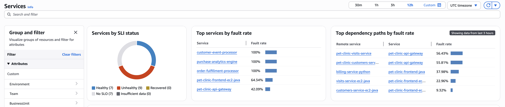
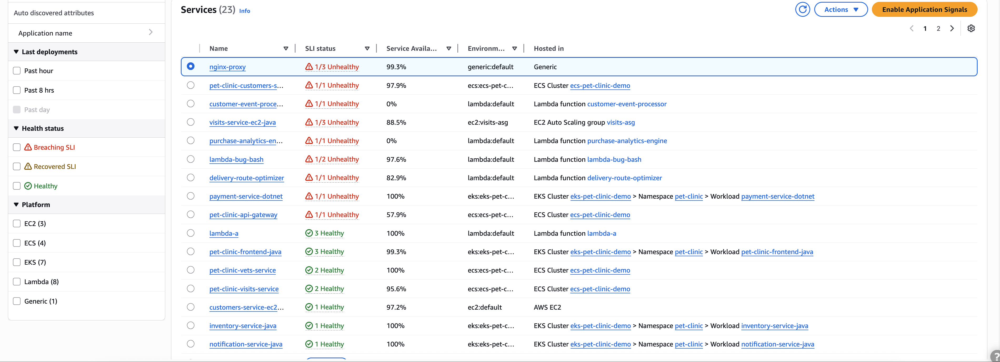
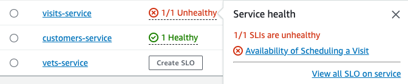
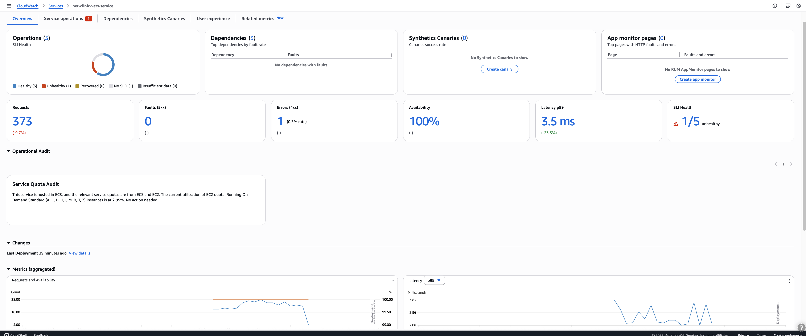

# View overall service activity and operational health with the Services page

Use the Services page to see a list of your services that are [enabled for Application Signals](CloudWatch-Application-Signals-Enable.md "CloudWatch-Application-Signals-Enable.md"). You can also view
 operational metrics and quickly see which services have unhealthy service level indicators (SLIs). Drill down to
 look for performance anomalies as you identify the root cause of operational issues. To view this page, open the
 [CloudWatch console](https://console.aws.amazon.com/cloudwatch/ "https://console.aws.amazon.com/cloudwatch/") and choose **Services** under
 the **Application Signals** section in the left navigation pane.

## Explore operational health metrics for your services

The top of the Services page includes an overall service operational health graph and several tables
 displaying top services and service dependencies by fault rate and list of services. The Services graph on the left displays a
 breakdown of the number of services that have healthy or unhealthy service level indicators (SLIs) during the
 current page-level time filter. SLIs can monitor latency, availability, and other operational metrics. View the top services by fault rate in the two tables next to the graph. Select a service name in either table to open 
 its [service detail page](ServiceDetail.md "ServiceDetail.md") page, which displays detailed service operation information. Select a dependency path to view service dependency details on its detail page.

Both tables display information for up to the past three hours, even if a longer time period filter is chosen at the top right of the
 page.

When using dynamic service grouping, the operational health metrics automatically aggregates data across all services within each group. This provides:

* Consolidated fault rates for service groups
* Group-level SLI health status
* Aggregated performance metrics that help identify problematic service clusters
* Quick identification of which groups require immediate attention during incidents

## Monitor operational health with the Services table

The Services table displays a list of your services that have been enabled for Application Signals. Choose
 **Enable Application Signals** to open a setup page and start configuring your services. For
 more information, see [Enable Application Signals](CloudWatch-Application-Signals-Enable.md "CloudWatch-Application-Signals-Enable.md"). 

Filter the Services table to make it easier to find what you're looking for, by choosing one or more
 properties from the filter text box. As you choose each property, you are guided through filter criteria. You will
 see the complete filter below the filter text box. Choose **Clear filters** at any time to remove
 the table filter. 

The advanced filtering options allows you to:

* Filter by service groups (both default and custom groupings)
* Filter by recent deployment activity
* Filter by environment
* Filter by service health status

Choose the name of any service in the table to view a [service detail page](ServiceDetail.md "ServiceDetail.md")
 containing service-level metrics, operations, and additional details. If you have associated the service's
 underlying compute resource with an application in AppRegistry or the Applications card on the AWS Management Console home page,
 choose the application name to display the application details in the [myApplications](https://docs.aws.amazon.com/awsconsolehelpdocs/latest/gsg/aws-myApplications.html "https://docs.aws.amazon.com/awsconsolehelpdocs/latest/gsg/aws-myApplications.html") console page. For services
 hosted in Amazon EKS, choose any link within the **Hosted in** column to view Cluster, Namespace, or
 Workload within CloudWatch Container Insights. For services running on Amazon ECS or Amazon EC2, the Environment value is shown. 

[Service level indicator (SLI)](CloudWatch-ServiceLevelObjectives.md#CloudWatch-ServiceLevelObjectives-concepts "CloudWatch-ServiceLevelObjectives.md#CloudWatch-ServiceLevelObjectives-concepts") status is
 displayed for each service in the table. Choose the SLI status for a service to display a pop-up containing a link
 to any unhealthy SLIs, and a link to see all SLOs for the service. 

If no SLOs have been created for a service, choose the **Create SLO** button within the
 **SLI Status** column. To create additional SLOs for any service, select the option button next
 to the service name, and then choose **Create SLO** at the top-right of the table. When you
 create SLOs, you can see at a glance which of your services and operations are performing well and which are
 unhealthy. See [service level objectives (SLOs)](CloudWatch-ServiceLevelObjectives.md "CloudWatch-ServiceLevelObjectives.md") for more
 information. 

## Service overview

After you select a service from the Services table, the Service overview page opens. This page provides a comprehensive view of your service's operational health and performance metrics. The overview displays these summary metrics:

* Total operations
* Service dependencies
* Canary monitoring status
* RUM client data

These metrics give you immediate insight into your service's current state.

You can visualize key operational performance indicators over time using a series of charts. To analyze trends and identify potential issues affecting your service health, adjust the time filter. All charts automatically
 update to reflect data for the selected time period.

The Audit findings section automatically detects and shows critical problems in your service's behavior, so you don't need to investigate manually. You can use the **Change events** section 
 to identify how recent deployments affect your service behavior.

