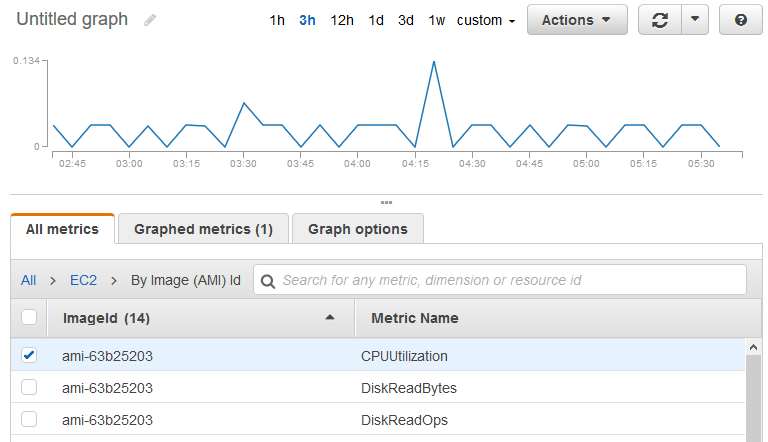

# Aggregate statistics by Amazon Machine Image

(AMI)

You can aggregate statistics for the EC2 instances that have detailed monitoring
enabled. Instances that use basic monitoring aren't included. For more information, see
[Enable or Disable Detailed Monitoring
for Your Instances](../../../AWSEC2/latest/UserGuide/using-cloudwatch-new.md "../../../AWSEC2/latest/UserGuide/using-cloudwatch-new.md") in the _Amazon EC2 User Guide_.

This example shows you how to determine average CPU utilization for all instances that
use the specified AMI. The average is over 60-second time intervals for a one-day
period.

###### To display the average CPU utilization by AMI using the console

1. Open the CloudWatch console at
   [https://console.aws.amazon.com/cloudwatch/](https://console.aws.amazon.com/cloudwatch/ "https://console.aws.amazon.com/cloudwatch/").
2. In the navigation pane, choose **Metrics**, **All
   metrics**.
3. Choose the **EC2** namespace and then choose **By Image
   (AMI) Id**.
4. Select the row for the `CPUUtilization` metric and the specific AMI,
   which displays a graph for the metric for the specified AMI. To change the name of the
   graph, choose the pencil icon. To change the time range, select one of the predefined
   values or choose **custom**.

 5. To change the statistic, choose the **Graphed metrics** tab. Choose
the column heading or an individual value and then choose one of the statistics or
predefined percentiles, or specify a custom percentile (for example,
`p95.45`). 6. To change the period, choose the **Graphed metrics** tab. Choose
the column heading or an individual value and then choose a different value.

###### To get the average CPU utilization by AMI using the AWS CLI

Use the [get-metric-statistics](../../../cli/latest/reference/cloudwatch/get-metric-statistics.md "../../../cli/latest/reference/cloudwatch/get-metric-statistics.md") command as follows.

```
`aws cloudwatch get-metric-statistics --namespace AWS/EC2 --metric-name CPUUtilization \
--dimensions Name=ImageId,Value=`ami-3c47a355` --statistics Average \
--start-time `2016-10-10T00:00:00` --end-time `2016-10-11T00:00:00` --period 3600`
```

The operation returns statistics that are one-hour values for the one-day interval. Each
value represents an average CPU utilization percentage for EC2 instances running the
specified AMI. The following is example output.

```
{
    "Datapoints": [
        {
            "Timestamp": "2016-10-10T07:00:00Z",
            "Average": 0.041000000000000009,
            "Unit": "Percent"
        },
        {
            "Timestamp": "2016-10-10T14:00:00Z",
            "Average": 0.079579831932773085,
            "Unit": "Percent"
        },
        {
            "Timestamp": "2016-10-10T06:00:00Z",
            "Average": 0.036000000000000011,
            "Unit": "Percent"
        },
        ...
    ],
    "Label": "CPUUtilization"
}
```
