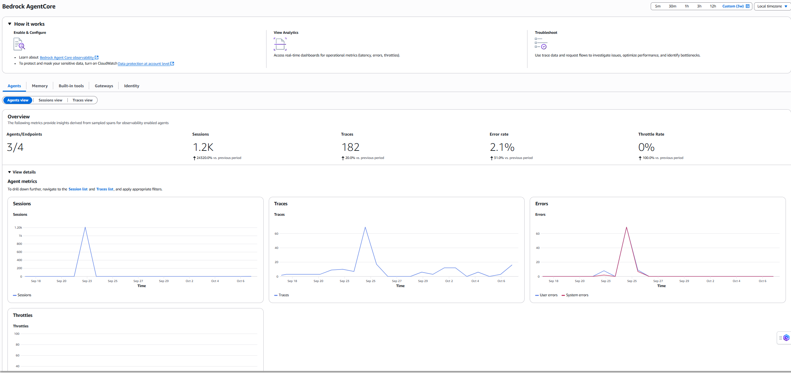
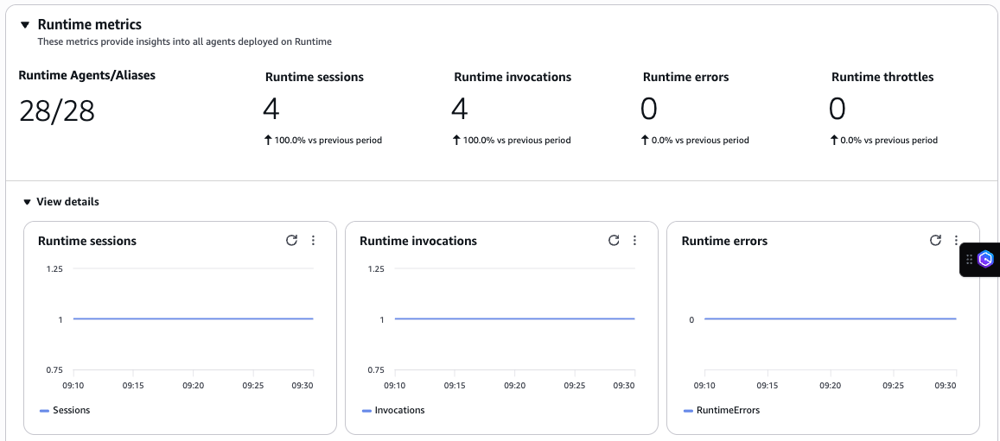
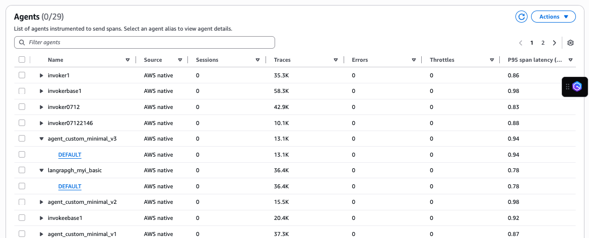
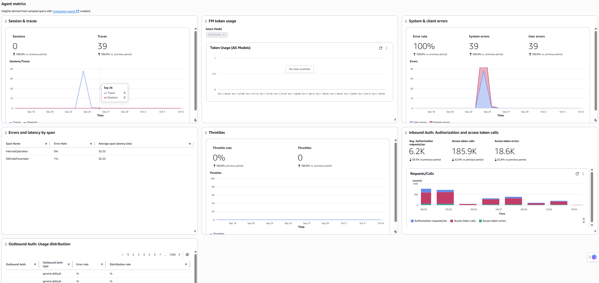

# Agent view

The *Agent view* provides a curated dashboard for your
 account's agents. You can view data from agents hosted on AWS native services like
 AgentCore Runtime, Lambda, or Amazon EC2. The view also displays agents that emit
 telemetry to CloudWatch.

**Overview**

The metrics and dashboards show data from sampled agent spans. For information
 about agent spans, see [Spans](https://docs.aws.amazon.com/bedrock-agentcore/latest/devguide/observability-telemetry.html#agent_spans "https://docs.aws.amazon.com/bedrock-agentcore/latest/devguide/observability-telemetry.html#agent_spans").

The following Agent metrics are supported:

* Agents/Endpoints – Number of agents and aliases instrumented and
 emitting spans
* Sessions – Number of sessions created by instrumented agents
 emitting spans. A session is similar to a conversation and contains the
 broad context
* Traces – Number of traces created by instrumented agents emitting
 spans. A trace is a individual request-response cycle within a
 session
* Error rate – Percentage of errors in agent interactions
* Throttle rate – Percentage of throttled agent interactions
Choose **View details** to see the Agent metrics in
 graphs.

**Runtime metrics**

The Runtime metrics and dashboards display data from the Runtime primitive. Using
 this primitive, you can host your agents on the Amazon Bedrock AgentCore runtime. For more
 information, see [Creating an
 AgentCore Runtime](https://docs.aws.amazon.com/bedrock-agentcore/latest/devguide/agents-runtime-create.html "https://docs.aws.amazon.com/bedrock-agentcore/latest/devguide/agents-runtime-create.html") .

AgentCore Runtime supports these metrics

* Runtime Agents/Aliases – Tracks number of agents and aliases hosted
 on AgentCore Runtime
* Runtime sessions – Tracks number of sessions created by agents
 running in AgentCore Runtime. A session is similar to a conversation and
 contains the broad context of the entire interaction flow. Useful for
 monitoring overall platform usage, capacity planning, and understanding user
 engagement patterns
* Runtime invocations – Total number of requests made to the Data
 Plane API. Each API call counts as one invocation, regardless of the request
 payload size or response status
* Runtime errors – The number of system and user errors. For system
 and user error definitions, see [AgentCore provided runtime metrics](https://docs.aws.amazon.com/bedrock-agentcore/latest/devguide/observability-runtime-metrics.html "https://docs.aws.amazon.com/bedrock-agentcore/latest/devguide/observability-runtime-metrics.html")
* Runtime throttles – The number of requests throttled by the service
 due to exceeding allowed TPS (Transactions Per Second). These requests
 return ThrottlingException with HTTP status code 429. Monitor this metric to
 determine if you need to review your service quotas or optimize request
 patterns
View metric changes over time in the default dashboard. Expand **View
 details** to display metric graphs.

**Agents**

Agents are components that collect and send monitoring data from your
 applications. The Agents table displays all agents configured in your account. These
 agents can be hosted on AWS native services like AgentCore Runtime, Lambda, or
 Amazon EC2. The table also displays other agents that are instrumented to emit telemetry
 to CloudWatch.

You can use **Filter agents** to find a specific agent that you
 want to deep dive or you can also use the column names to sort the agents to find
 the required agent. Select the gear icon to show or hide additional columns.

You can view the details of the Agent by expanding the agent name.

**Agent details- Overview**

The Overview tab displays automatic dashboards for your agent metrics. These
 metrics come from sampled spans and Runtime metrics (when the agent uses AgentCore
 Runtime).

The *Agent metrics* dashboard include metrics which are derived
 from sampled spans:

* Sessions and Traces – Count of sessions and traces for this
 agent
* FM token usage – Total count of Foundational Model token
 consumption. You can filter the chart into a particular Foundational
 Model
* System and client errors – Count of system errors during request
 processing. High levels of server-side errors can indicate potential
 infrastructure or service issues that require investigation. Client errors
 are errors resulting from invalid requests. High levels of client-side
 errors can indicate issues with request formatting or permissions
* Errors and latency by span – The error rates and latency by a
 particular span. Note that a span can appear in many agents
* Throttles – Number of requests throttled by the service due to
 exceeding allowed TPS (Transactions Per Second)
* Inbound Auth:Authorization and access token calls – Number of incoming authentication requests processed by the agent, including authorization checks and access token validations from external clients or services
* Outbound Auth:Usage distribution – Distribution pattern of outbound authentication methods used by the agent, showing the frequency and types of authentication mechanisms employed when accessing external services
The *Runtime metrics* dashboard includes metrics that AgentCore
 Runtime automatically generates:

* Runtime sessions and invocations – Count of sessions and
 invocations that this particular agent has generated while being hosted on
 Runtime
* Runtime latency – Latency of requests by agents hosted on
 Runtime
* Runtime throttles – Number of requests throttle by the service due
 to exceeding allowed TPS (Transactions Per Second)
