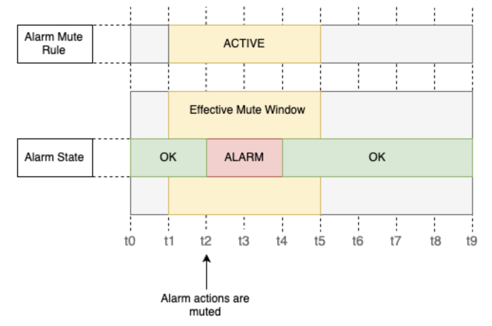
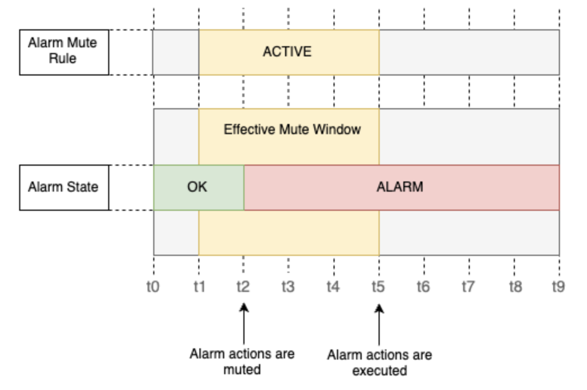
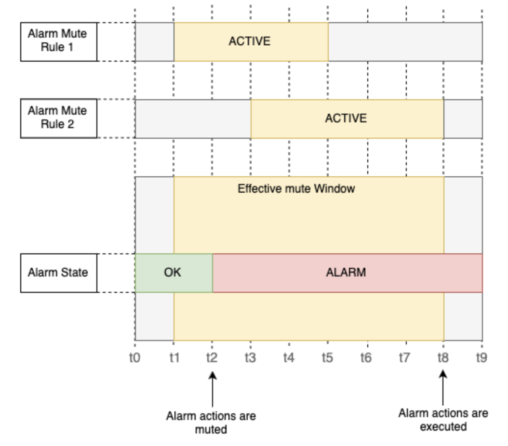
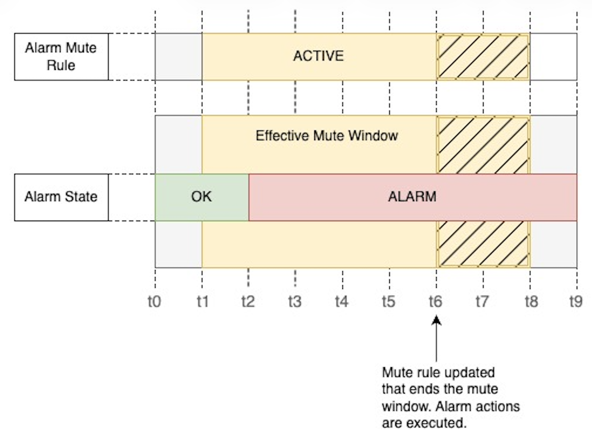
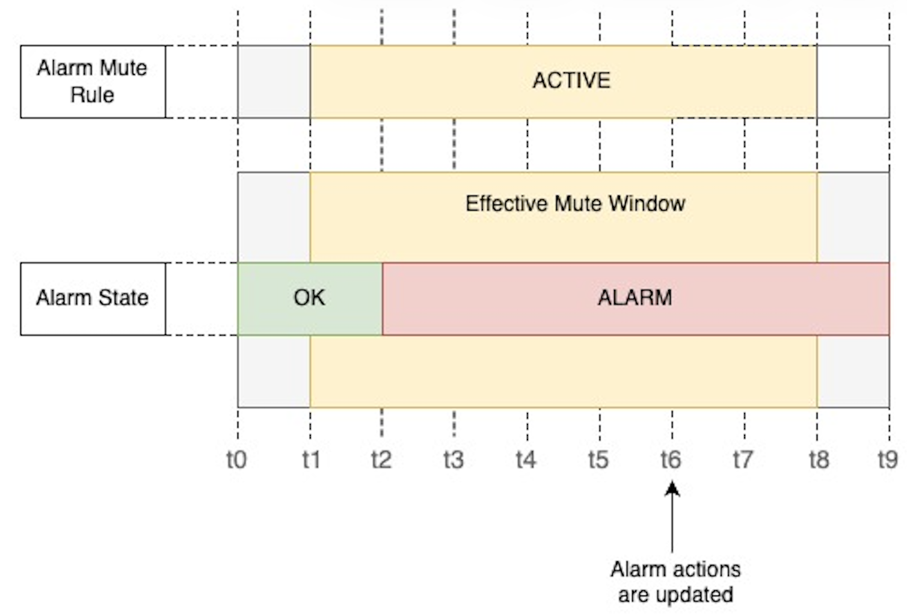

# How alarm mute rules work

The following scenarios illustrate how alarm mute rules affect the targeted alarms and how the alarm actions are muted or executed.

###### Note

- Muting an alarm will mute actions associated with all alarm states, including OK, ALARM, and INSUFFICIENT_DATA. The behaviours illustrated below apply to actions associated with all alarm states.
- When you mute a Metrics Insights alarm, all contributor metric series for that alarm are automatically muted as well.

## Scenario: Alarm actions are muted when a mute rule is active

Consider that,

- An Alarm has actions configured for its ALARM state
- An alarm mute rule is scheduled to be active from t1 to t5 that targets the Alarm

- At **t0** - Alarm is in OK state, mute rule status is SCHEDULED
- At **t1** - Mute rule status becomes ACTIVE
- At **t2** - Alarm transitions to ALARM state, action is muted as the alarm is effectively muted by the mute rule.
- At **t4** - Alarm returns to OK state while mute rule is still active
- At **t5** - Mute rule becomes inactive, but no ALARM action is executed because alarm is now in OK state

## Scenario: Alarm action muted when mute rule is active and re-triggered after mute window

Consider that,

- An Alarm has actions configured for its ALARM state
- An alarm mute rule is scheduled to be active from t1 to t5 that targets the Alarm

- At **t0** - Alarm is in OK state, mute rule status is SCHEDULED
- At **t1** - Mute rule status becomes ACTIVE
- At **t2** - Alarm transitions to ALARM state, action is muted as the alarm is effectively muted by the mute rule.
- At **t4** - Mute window becomes inactive, alarm is still in ALARM state
- At **t5** - Alarm action is executed because the mute window has ended and the alarm remains in the same state (ALARM) in which it was originally muted

## Scenario: Multiple overlapping alarm mute rules

Consider that,

- An Alarm has actions configured for its ALARM state

Consider that there are two mute rules,

- Alarm Mute Rule 1 - mutes Alarm from t1 to t5
- Alarm Mute Rule 2 - mutes Alarm from t3 to t9

- At **t0** - Alarm is in OK state, both mute rules are SCHEDULED
- At **t1** - First mute rule becomes ACTIVE
- At **t2** - Alarm transitions to ALARM state, action is muted
- At **t3** - Second mute rule becomes ACTIVE
- At **t5** - First mute rule becomes inactive, but alarm action remains muted because second mute rule is still active
- At **t8** - Alarm action is executed because the second mute window has ended and the alarm remains in the same state (ALARM) in which it was originally muted

## Scenario: Muted alarm actions are executed when mute rule update ends the mute window

Consider that,

- An Alarm has actions configured for its ALARM state
- An alarm mute rule is scheduled to be active from t1 to t8 that targets the Alarm

- At **t0** - Alarm is in OK state, mute rule is SCHEDULED
- At **t1** - Mute rule becomes ACTIVE
- At **t2** - Alarm transitions to ALARM state, actions are muted
- At **t6** - The mute rule configuration is updated such that the time window ends at t6. Alarm actions are immediately executed at t6 because the mute rule is no longer active.

###### Note

The same behaviour applies,

- If the mute rule is deleted at t6. Deleting the mute rule immediately unmutes the alarm.
- If the alarm is removed from the mute rule targets (at t6) then the alarm will be unmuted immediately.

## Scenario: New actions are executed if alarm actions are updated during mute window

Consider that,

- An Alarm has actions configured for its ALARM state
- An alarm mute rule is scheduled to be active from t1 to t8 that targets the Alarm

- At **t0** - Alarm is in OK state, mute rule is SCHEDULED. An SNS action is configured with the alarm state ALARM.
- At **t1** - Mute rule becomes ACTIVE
- At **t2** - Alarm transitions to ALARM state, the configured SNS action is muted
- At **t6** - Alarm configuration is updated to remove SNS action and add Lambda action
- At **t8** - The lambda action configured to the Alarm is executed because the mute window has ended and the alarm remains in the same state (ALARM) in which it was originally muted

###### Note

If all the alarm actions are removed during the mute window (at t6 in above example) then no actions will be executed at the end of mute window (at t8 above)
