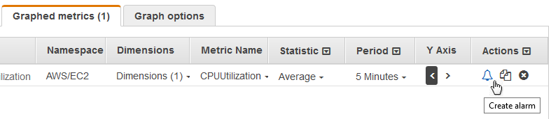

# Create an alarm from a metric on a graph

You can graph a metric and then create an alarm from the metric on the graph, which has
the benefit of populating many of the alarm fields for you.

###### To create an alarm from a metric on a graph

1. Open the CloudWatch console at
   [https://console.aws.amazon.com/cloudwatch/](https://console.aws.amazon.com/cloudwatch/ "https://console.aws.amazon.com/cloudwatch/").
2. In the navigation pane, choose **Metrics**, **All
   metrics**.
3. Select a metric namespace (for example, **EC2**) and then a metric
   dimension (for example, **Per-Instance Metrics**).
4. The **All metrics** tab displays all metrics for that dimension in
   that namespace. To graph a metric, select the check box next to the metric.
5. To create an alarm for the metric, choose the **Graphed metrics**
   tab. For **Actions**, choose the alarm icon.

 6. Under **Conditions**, choose **Static** or
**Outlier detection** to specify whether to use a static threshold or
outlier detection model for the alarm.

Depending on your choice, enter the rest of the data for the alarm
conditions. 7. Choose **Additional configuration**. For **Datapoints to
alarm**, specify how many evaluation periods (data points) must be in the
`ALARM` state to trigger the alarm. If the two values here match, you
create an alarm that goes to `ALARM` state if that many consecutive periods
are breaching.

To create an M out of N alarm, specify a lower number for the first value than you
specify for the second value. For more information, see [Alarm evaluation](alarm-evaluation.md "alarm-evaluation.md"). 8. For **Missing data treatment**, choose how to have the alarm behave
when some data points are missing. For more information, see [Configuring how CloudWatch alarms treat missing
data](alarms-and-missing-data.md "alarms-and-missing-data.md"). 9. Choose **Next**. 10. Under **Notification**, select an SNS topic to notify when the
alarm is in `ALARM` state, `OK` state, or
`INSUFFICIENT_DATA` state.

To have the alarm send multiple notifications for the same alarm state or for
different alarm states, choose **Add notification**.

To have the alarm not send notifications, choose **Remove**. 11. To have the alarm perform Auto Scaling or EC2 actions, choose the appropriate button
and choose the alarm state and action to perform. 12. When finished, choose **Next**. 13. Enter a name and description for the alarm. The name must contain only ASCII
characters. Then choose **Next**. 14. Under **Preview and create**, confirm that the information and
conditions are what you want, then choose **Create alarm**.
