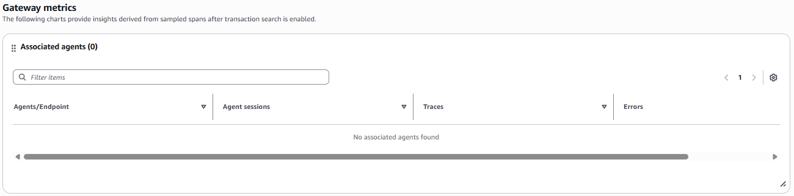
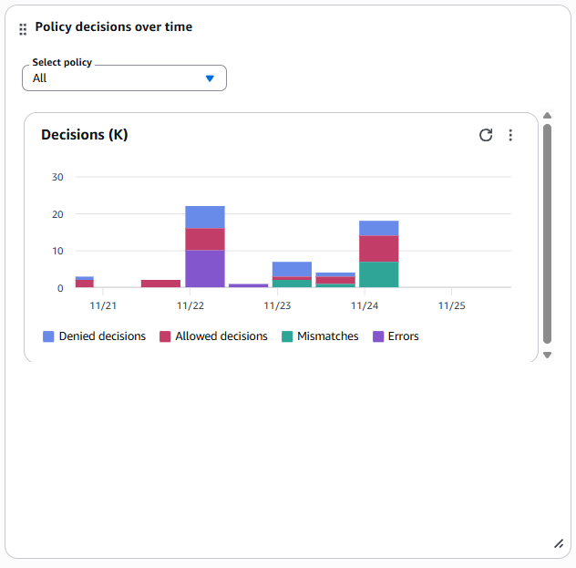
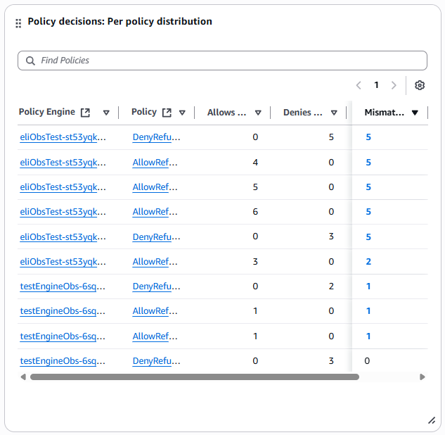

# Gateway details - Overview

The **Overview** tab provides insights derived from sampled spans after transaction
search is enabled.

The **Gateway metrics** section lists all of the agents associated with the
selected gateway, and it provides information about the number of sessions, traces and errors
for each associated agent.

Additionally, the **Overview** tab includes the following interactive charts.

Invocations
The **Invocations** chart shows the total number of API requests
made. Each API call counts as one invocation, regardless of the response status.

System and client errors
The **System and client errors** chart provides information about
the number of API requests that failed with system erros (`5xx` error codes) and user
errors (`4xx` status codes, excluding `429`), and the overall error rate
as a percentage.

Throttles
The **Throttles** chart provides information about the number API requests
that were throttled (`429` status code) by the service, and the overall throttle rate
as a percentage.

Invocation latency
The **Invocation and latency** chart provides information about the average
latency for list and call tools. It also provides information about average latency between
when the service received the request and when it begins sending the first response token.

Policy decisions over time
The **Policy decisions over time** chart provides information about the
number of decisions that resulted in `allow` and `deny` authorization
actions. To view decisions for a specific policy, select the policy in the drop-down.

Policy decisions: Per policy distribution
The **Policy decisions: Per policy distribution** chart lists all of the
policy engines associated with the selected gateway, and shows the policy, number of allows
and denies, and enforcement mode for each policy engine. You can choose a policy engine or
policy in the list to view more details about it in the Amazon Bedrock AgentCore console.

