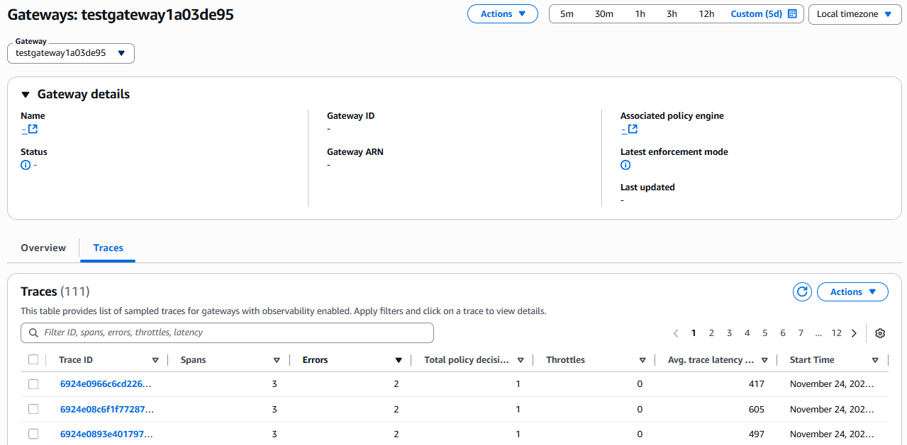

# Gateway details - Traces

The **Traces** tab displays all of the sampled traces for the selected gateway.
In the **Traces** section, choose a **Trace ID** to view
to view metrics for the trace and all of the spans within it.

