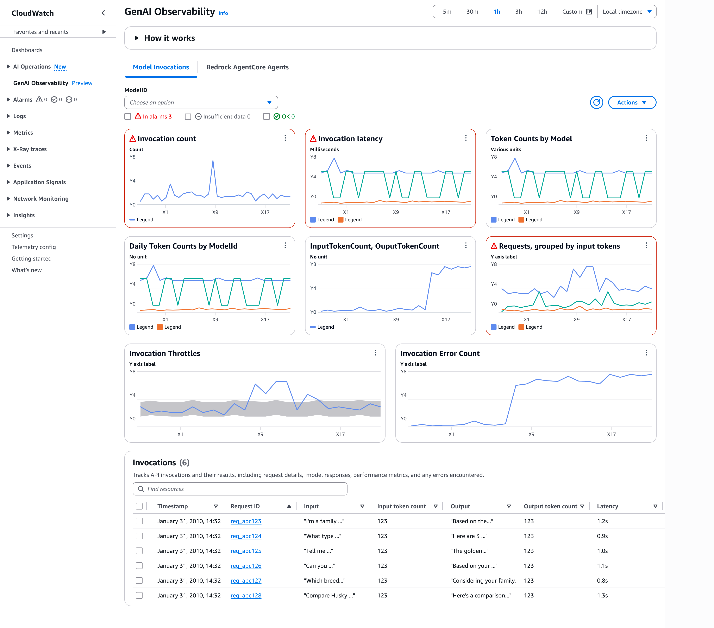
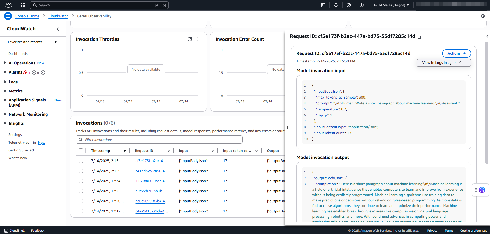

# Model Invocations

CloudWatch generative AI observability allows you to monitor Model Invocations performance.
You can track metrics such as invocation count, token usage, and errors using out-of-box
views. For detailed visibility into invocation content, such as inputs and outputs,
enable **Bedrock Invocation logging** and send the logs to
CloudWatch. For more information, see [Set up a CloudWatch Logs destination](../../../bedrock/latest/userguide/model-invocation-logging.md#setup-cloudwatch-logs-destination "../../../bedrock/latest/userguide/model-invocation-logging.md#setup-cloudwatch-logs-destination") and [Help protect
sensitive log data with masking](../logs/mask-sensitive-log-data.md "../logs/mask-sensitive-log-data.md") .

## Enabling model invocation in Amazon Bedrock

###### Note

You must enable Model invocation logging in Amazon Bedrock to view the
invocations.

To enable model invocation logging in Amazon Bedrock, follow these steps.

1. Open the Amazon Bedrock console at [https://console.aws.amazon.com/bedrock/](https://console.aws.amazon.com/bedrock/ "https://console.aws.amazon.com/bedrock/").
2. Choose **Settings**.
3. Under **Model invocation logging**, select
   **Model invocation logging**.
4. Choose the required data types to include in the logs. Choose to send the
   logs to CloudWatch Logs only or both Amazon S3 and CloudWatch Logs if you are already publishing to Amazon S3.
5. Under the CloudWatch Logs configurations, create log group name and select the
   appropriate service roles.
6. Choose the required data types to include in the logs.
7. Choose **Save settings**

You can view the pre-configured dashboards automatically when you start
using Amazon Bedrock invocations. After enabling `Model Invocation
 logging`, you can view the default dashboards and access the
invocation table below them.

- **Invocation count** – Number of
  successful requests to the [Converse](../../../bedrock/latest/APIReference/API_runtime_Converse.md "../../../bedrock/latest/APIReference/API_runtime_Converse.md"), [ConverseStream](../../../bedrock/latest/APIReference/API_runtime_ConverseStream.md "../../../bedrock/latest/APIReference/API_runtime_ConverseStream.md"), [InvokeModel](../../../bedrock/latest/APIReference/API_runtime_InvokeModel.md "../../../bedrock/latest/APIReference/API_runtime_InvokeModel.md"), and [InvokeModelWithResponseStream](../../../bedrock/latest/APIReference/API_runtime_InvokeModelWithResponseStream.md "../../../bedrock/latest/APIReference/API_runtime_InvokeModelWithResponseStream.md") API operations
- **Invocation latency** – Latency of the
  invocations
- **Token Counts by Model** – Token counts
  by model delineated by input token counts and output token counts
- **Daily Token Counts by ModelID** – Daily
  total token counts by model ID
- **InputTokenCount, OutputTokenCount** –
  Total number of tokens in the input and output in this account across selected
  models
- **Requests, grouped by input tokens** –
  Number of requests grouped by input tokens into 6 ranges. Each line represent
  the number of requests that fall into a particular range
- **Invocation Throttles** – Number of
  invocations the system throttled. The number of throttles you see will depend on
  your retry settings in the SDK. For more information, see [Retry](../../../sdkref/latest/guide/feature-retry-behavior.md "../../../sdkref/latest/guide/feature-retry-behavior.md") behavior in the AWS SDKs and Tools Reference Guide
- **Invocation Error Count** – Count of
  invocations that result in server-side and client-side errors
  To use the model invocation dashboard, follow these steps.

1. Hover over any metric graph to view invocation details. You can choose the
   **Alarm** icon to setup `Alarms` to monitor
   application quality and performance.
2. Under the **ModelID** drop-down, you can select a model ID to
   view the corresponding metrics.
3. Select **View in CloudWatch metrics** to view the dashboard metrics
   under CloudWatch.
4. Select **Period override** to adjust the metrics timeframe
   (for example, 1 minute, 1 hour, or 6 hours).
5. Under **Invocations**, choose **Request ID**
   to view the details of the request. You can view the model invocation input and
   output details on the right-pane.

On the **Request ID** page, under **Actions**
drop-down, choose **View in Logs Insights** to view the logs in CloudWatch.
For more information, see [Analyzing log data with
CloudWatch Logs Insights](../logs/AnalyzingLogData.md "../logs/AnalyzingLogData.md").
