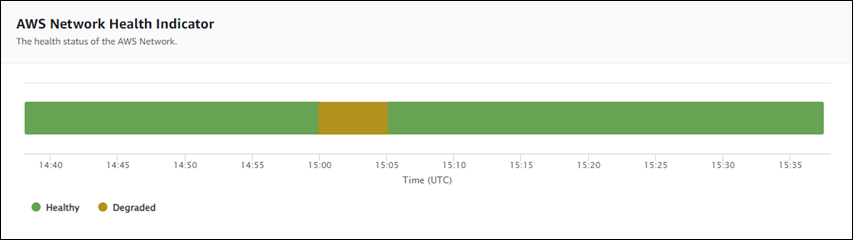
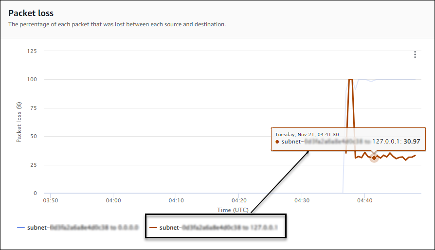
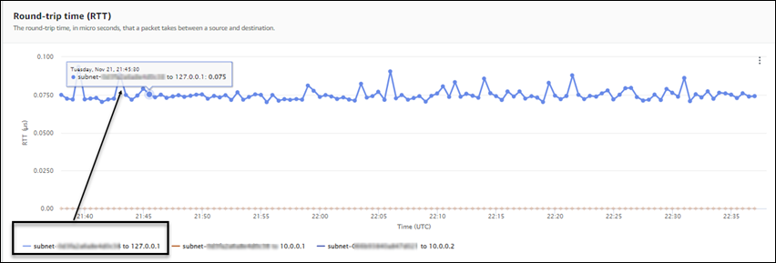

# Monitor dashboards

You can use the monitor dashboard in Network Synthetic Monitor to view the network health indicator (NHI),
as well as probe round-trip time and packet loss at a monitor level. That is, a monitor dashboard
shows this information for all the probes created for the monitor.

Network Synthetic Monitor also has dashboards for probes, to view the information at a probe level. For more
information, see [Probe dashboards](nw-probe-db.md "nw-probe-db.md").

###### To access a monitor dashboard

1. Open the CloudWatch console at [https://console.aws.amazon.com/cloudwatch/](https://console.aws.amazon.com/cloudwatch/ "https://console.aws.amazon.com/cloudwatch/"), and then under **Network
   Monitoring**, choose **Synthetic monitors**.
2. In the **Monitors** section, choose the
   **Name** link to open the monitor dashboard.

## Overview page

The **Overview** page displays the following information for a monitor:

- **Network health** — Network health displays the network health indicator (NHI)
  value, which pertains to health of only the AWS network. The NHI status is displayed as **Healthy** or
  **Degraded**. A **Healthy** status indicates that Network Synthetic Monitor
  did not observe issues with the AWS network. A **Degraded** status
  indicates that Network Synthetic Monitor observed an issue with the AWS network. The status bar in this
  section shows the status of the network health indicator over a default time of one hour. Hover over any point
  in the status bar to view additional details.
- **Probe traffic summary** — Displays the current state of the traffic
  between the source AWS subnets specified for the probes in the monitor and the probes' destination IP addresses.
  This summary displays the following:
  - **Probes in alarm** — This number indicates how many of your probes
    in this monitor are in a degraded state. An alarm is triggered when a metric that you've set up as an alarm
    is triggered. For information on creating alarms for metrics in Network Synthetic Monitor, see [Probe alarms](cw-nwm-create-alarm.md "cw-nwm-create-alarm.md").
  - **Packet loss** — The number of packets that were lost from the source
    subnet to the destination IP address. This is represented as a percentage of the total
    packets sent.
  - **Round-trip time** — The time it takes, displayed in milliseconds, for a
    packet from the source subnet to reach the destination IP address, and then come back
    again. Round-trip time is the average RTT observed during the aggregation period.

The data is represented on an interactive graph, so you can explore to learn details.

By default, data is displayed for a two-hour time frame, calculated from the current date
and time. However, you can change the range to fit your needs. For more information, see
[Specify metrics time frame](nw-monitor-time-frame.md "nw-monitor-time-frame.md").

### Tracking metrics

The **Overview** dashboard in Network Synthetic Monitor displays a graphical representation of a
monitor and probes. The following graphs are shown:

- **Network health indicator** — This represents the
  the NHI values over a specified period. NHI indicates whether a network issue is due to problems
  with the AWS network. NHI is displayed as **Healthy** (no issue with the AWS network)
  or **Degraded** (there is an issue with the AWS network).

In the following example, you can see that from 15:00 UTC until 15:05 UTC, there was a network
issue that was due to an AWS network issue (**Degraded**). After 15:05, the network issue with
the AWS network ended, so the value returned to **Healthy**. You can hover over any section of the
graph to see additional details.

###### Note

The NHI indicates that an issue is due to the AWS network. It does not
describe the overall health of the AWS network nor the health of Network Synthetic Monitor probes.

- **Packet loss** — This graph displays a line that shows
  the percentage of packet loss for each probe in a monitor. The legend at the bottom of the
  page displays each of the probes in the monitor, color-coded for uniqueness. You can hover
  over a probe in the chart to see the source subnet, the destination IP address,
  and the percentage of packet loss.

In the following example, a packet loss alarm was created for a probe from a
subnet to IP address 127.0.0.1. The alarm was triggered when the packet loss threshold was
exceeded for the probe. If you hover over the graph, you can see the probe source and destination, and
that there was a 30.97% packet loss for this probe on November 21 at 02:41:30.

- **Round-trip time** — This graph displays a line
  that shows the round-trip time for each probe. The legend at the bottom of the page
  displays each of the probes in the monitor, color-coded for uniqueness. You can hover
  over a probe in the chart to see the source subnet, the destination IP address, and the
  round-trip time.

The following example shows that on Tuesday, Nov 21, at 21:45:30, the
round-trip time for a probe from a subnet to IP address 127.0.0.1 was 0.075 seconds.

## Monitor details

The **Monitor details** page displays details about your monitor, including
a list of the probes for the monitor. You can update or add tags, or add a probe. The page includes
the following sections:

- **Monitor details** — This page provides details about your monitor.
  You can't edit information in this section. However, you can view details of the Network Synthetic Monitor service-linked
  role: choose the **Role name** link to see details.
- **Probes** — This section displays a list of all probes
  associated with the monitor. Choose a **VPC** or **Subnet
  ID** link to open the VPC or subnet details in the Amazon VPC Console. You can modify a
  probe, to activate or deactivate it. For more information, see [Working with monitors and probes in Network Synthetic Monitor](nw-monitor-working-with.md "nw-monitor-working-with.md").

The **Probes** section displays information about each probe set up for
that monitor, including the probe **ID**, the **VPC ID**,
the **Subnet ID**, **IP address**,
**Protocol**, and whether the probe is
**Active** or **Inactive**.

If you've created an alarm for a probe, the current **Status** of the alarm
is shown. A status of **OK** indicates that there are no metrics events have triggered any
alarms. A status of **In alarm** indicates that a metric that you created in CloudWatch triggered an
alarm. If no status is displayed for a probe, then there isn't a CloudWatch alarm for it. For information
on the types of Network Synthetic Monitor probe alarms that you can create, see [Probe alarms](cw-nwm-create-alarm.md "cw-nwm-create-alarm.md").

- **Tags** — View the current tags for a monitor. You can add or remove
  tags by choosing **Manage tags**. This opens the **Edit
  probe** page. For more information on editing tags, see [Edit a monitor](nw-monitor-edit.md "nw-monitor-edit.md").
