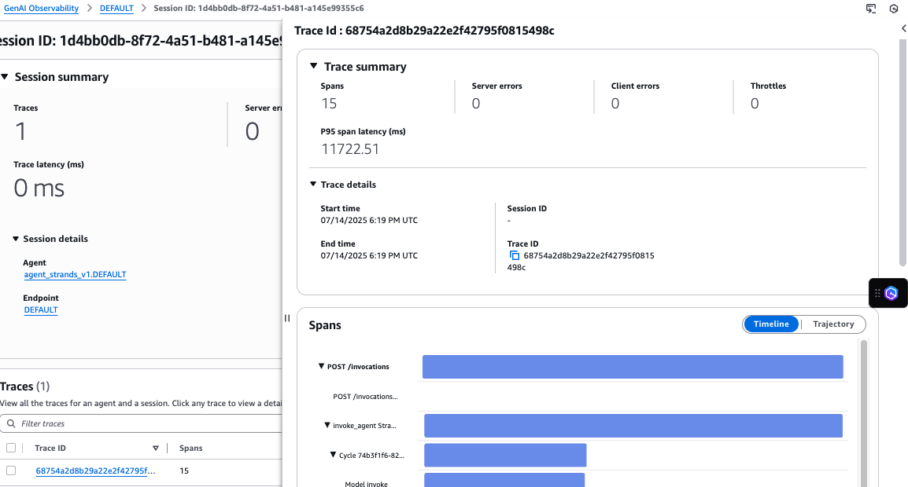
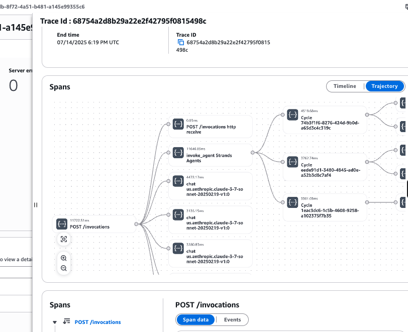

# Agent details - Sessions

An Agent can have several Sessions. View session in the
 *Sessions* tab. Use the **Filter sessions**
 or sort the columns to find the required session.

Choose the **Session ID** to view the session summary metrics and
 the list of traces belonging to that session. Session metrics include:

* Traces – Number of traces belonging to the sessions
* Server errors – Count of system errors during request processing.
 High levels of server-side errors can indicate potential infrastructure or
 service issues that require investigation
* Client errors – Client errors are errors resulting from invalid
 requests. High levels of client-side errors can indicate issues with request
 formatting or permissions
* Throttles – Number of requests throttled relevant to this session
 due to exceeding allowed TPS (Transactions Per Second)
* Sessions details – Meta data about the session such as start time,
 end time, and session ID
To analyze a list of Traces in a session, choose **Filter
 traces** to narrow down or sort the table columns to bubble up the
 particular Trace you want to investigate.

After you select a Trace, the right-pane displays the details of the Trace. For
 each Trace, you can see the Trace summary, Spans, and Trace content details.

Under **Trace summary**, you can view the following
 metrics:

###### Note

Summary page fields are consistent across **Agent view**,
 **Sessions view**, and **Traces
 view**.

* Spans – Number of spans within a Trace
* Server errors – Count of system errors during request processing.
 High levels of server-side errors can indicate potential infrastructure or
 service issues that require investigation
* Client errors – Client errors are errors resulting from invalid
 requests. High levels of client-side errors can indicate issues with request
 formatting or permissions
* Throttles – Number of requests throttle relevant to this session
 due to exceeding allowed TPS (Transactions Per Second)
* P95 span latency – The 95-percentile latency of across all
 invocation of this particular span. Note that a span can be used across many
 agents
* Trace details – Meta data about the trace such as start time, end
 time, and Trace ID

Choose **Timeline** to view the duration of each span and to
 understand the span that took the longest and contributed to a slow response.

To analyze span relationships and subsequent calls choose
 **Trajectory** to understand the interconnected relationship of
 the spans and subsequent calls from these spans.

Under **Spans**, select an individual span event to review the
 span data in its original form. Review the span data in its original form. For
 granular troubleshooting, select the **Events** tab to examine
 model inputs and outputs.
